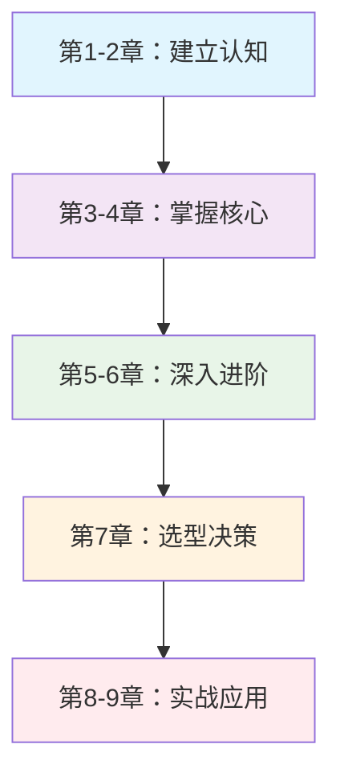

# 消息队列实战指南

> 九章通MQ之道，从入门到精通的完整修炼之路 ⚡️

## 🎯 关于本书

本书是一本全面系统的消息队列技术指南，从零开始带你深入掌握MQ的核心技术，包含**9章42节**完整内容，总计**14,393行**，适合开发工程师、架构师和技术管理者学习参考。

## ✨ 主要特色

- 🎯 **实战导向** - 结合真实业务场景，避免纸上谈兵
- 📊 **图文并茂** - 56个精美mermaid图表，可视化效果优秀  
- 🔧 **代码规范** - 统一使用伪代码示例，聚焦核心逻辑
- 📚 **循序渐进** - 从概念到原理再到实现，层层递进
- 🛠️ **技术全面** - 涵盖可靠性、性能、高可用、选型等方方面面
- 😄 **通俗易懂** - 幽默生动的表达，让技术学习不再枯燥

## 📖 章节内容

### 📚 第一篇：入门篇（第1-2章）
- **[第一章 初识MQ](第一章-初识MQ.md)** - 解耦、异步、削峰三大利器
- **[第二章 核心概念](第二章-核心概念.md)** - 掌握MQ的基本功

### 🔧 第二篇：核心篇（第3-6章）  
- **[第三章 可靠性保障](第三章-可靠性保障.md)** - 确保消息万无一失
- **[第四章 性能优化](第四章-性能优化.md)** - 让MQ飞起来
- **[第五章 高可用设计](第五章-高可用设计.md)** - 构建永不宕机的系统
- **[第六章 进阶特性](第六章-进阶特性.md)** - 解决复杂业务场景

### 🚀 第三篇：实战篇（第7-9章）
- **[第七章 产品选型](第七章-产品选型.md)** - 选择最适合的MQ利器
- **[第八章 实战应用](第八章-实战应用.md)** - 典型场景深度剖析  
- **[第九章 生产实践](第九章-生产实践.md)** - 从开发到上线的完整指南

## 🎓 适用人群

- **初学者**：从零开始系统学习MQ技术
- **开发工程师**：提升异步编程和系统设计能力
- **架构师**：深入理解MQ架构设计和选型决策
- **技术管理者**：了解MQ技术全貌，做出合理的技术规划

## 🚀 快速开始

1. **在线阅读**：点击左侧导航栏开始学习
2. **建议顺序**：按章节顺序阅读，每章都有前后关联
3. **实践验证**：结合实际项目验证书中的理论和方法
4. **持续学习**：技术在发展，保持学习新的MQ技术趋势

## 📊 学习路径建议

## 🤝 参与贡献

如果你发现内容错误或有改进建议，欢迎：
- 提交Issue反馈问题
- 提交Pull Request改进内容
- 分享学习心得和实践经验

## 📜 版权说明

本书遵循开源精神，供学习和参考使用。转载请注明出处。

---

**九章通MQ之道，从此异步通信无难事！** 🌟

*开始你的MQ修炼之旅吧！* 👉 [点击这里查看完整目录](00.目录.md)
