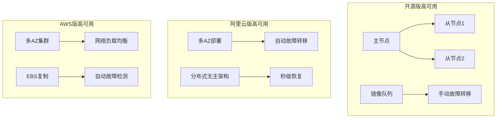

# RabbitMQ 版本对比：开源版 vs 阿里云版 vs AWS版

## 概述

随着云原生技术的发展，消息队列服务已从传统的自建开源方案演进为多样化的云托管服务。本文将对比 RabbitMQ 开源版、阿里云消息队列 RabbitMQ 版，以及 AWS Amazon MQ for RabbitMQ，帮助技术团队根据实际需求选择最适合的方案。

本文档内容从三个角度 1.MQ 原理，2.MQ 实操演示 3.MQ 实践建议，由浅入浅帮助你开始 MQ 之旅。

## 功能对比表

| 功能维度 | RabbitMQ 开源版 | 阿里云 RabbitMQ 版 | AWS Amazon MQ |
|---------|----------------|-------------------|---------------|
| **协议支持** | **AMQP 0-9-1**、AMQP 1.0、STOMP、MQTT、HTTP(S)、WebSocket | AMQP 0-9-1 | AMQP 0-9-1 |
| **Exchange类型** | direct、fanout、headers、topic、x-delayed-message、x-consistent-hash | (同左) | (同左) |
| **集群支持** | 原生集群，镜像队列 | Aliyun分布式无主架构 | 多AZ集群，网络负载均衡NLB |
| **持久化** | 本地磁盘持久化 | 分布式存储 | Amazon EBS 支持 |
| **延时队列** | 需插件支持 | 原生支持 | 支持 |
| **消息查询** | 基础管理界面 | AliyunA控制台查询 | AWS控制台查询 |
| **多租户** | Vhost 支持 | Vhost 支持 | Vhost 支持 |
| **客户端兼容** | 全语言支持 | 全语言支持 | 全语言支持 |

  协议选择决策矩阵

  | 场景类型     | 推荐协议       | 原因        |
  |----------|------------|-----------|
  | 企业级消息中间件 | **AMQP 0-9-1** | 功能完整，性能优异 |
  | 物联网设备    | MQTT       | 轻量级，低功耗   |
  | Web实时应用  | WebSockets | 低延迟，浏览器支持 |
  | 简单消息推送   | STOMP      | 易于实现和调试   |
  | 微服务API   | HTTP(S)    | 标准化，防火墙友好 |
  | 多厂商集成    | AMQP 1.0   | 标准化程度高    |

Exchange类型
[第二章-核心概念](第二章-核心概念.md#🔀-交换机（Exchange）：智能调度中心)

## 性能对比

### RabbitMQ 开源版
- **吞吐量**: 单节点约 10K-50K msg/s（依赖硬件配置）
- **延迟**: 毫秒级延迟
- **消息堆积**: 受限于本地存储和内存，大量堆积可能导致性能下降
- **扩展性**: 水平扩展复杂，需要手动配置集群

### 阿里云 RabbitMQ 版
- **吞吐量**: 单队列无上限，弹性扩容
- **延迟**: 低延迟，分布式架构优化
- **消息堆积**: 海量消息堆积能力，解决内存问题
- **扩展性**: 自动弹性伸缩，业务无感知扩容

### AWS Amazon MQ
- **吞吐量**: M7g实例相比M5提升85%吞吐量
- **延迟**: 毫秒级延迟
- **消息堆积**: EBS存储支持，容量可调整
- **扩展性**: 通过实例规格调整实现垂直扩展

## 可用性对比

### 高可用性对比

| 特性 | 开源版 | 阿里云版 | AWS版 |
|------|-------|---------|-------|
| **SLA保障** | 无官方SLA | 99.95% | 99.9% |
| **故障恢复** | 手动处理 | 秒级自动恢复 | 分钟级自动恢复 |
| **脑裂处理** | 存在脑裂风险 | 无主架构根除脑裂 | 通过仲裁机制防止 |
| **跨AZ支持** | 需手动配置 | 原生多AZ | 原生多AZ |

### 监控告警

| 维度 | 开源版 | 阿里云版 | AWS版 |
|------|-------|---------|-------|
| **监控粒度** | 基础指标 | 实例/Vhost/Queue多维度 | CloudWatch集成 |
| **告警机制** | 需自建 | 内置告警规则 | CloudWatch告警 |
| **日志分析** | 需ELK等工具 | 一站式日志服务 | CloudWatch Logs |
| **性能分析** | 手动分析 | AI智能诊断 | AWS X-Ray追踪 |

## 选型决策矩阵

### 适用场景分析

| 场景 | 推荐方案 | 理由 |
|------|---------|------|
| **初创公司/MVP** | 阿里云版 | 快速上线，按量付费，零运维 |
| **大型企业/合规要求** | AWS版 | 企业级SLA，完善的安全合规 |
| **技术团队强/定制需求** | 开源版 | 完全控制，定制插件开发 |
| **成本敏感/流量波动大** | 阿里云版 | 弹性计费，自动扩缩容 |
| **多云战略** | AWS版 | 全球化部署，多区域支持 |

### 技术决策建议

**选择开源版的条件**：
- 拥有专业的运维团队
- 对消息队列有深度定制需求
- 数据安全要求极高，需本地部署
- 成本预算充足，注重长期TCO

**选择阿里云版的条件**：
- 快速上线业务，缩短TTM
- 团队运维能力有限
- 流量存在明显波峰波谷
- 成本控制是重要考量因素

**选择AWS版的条件**：
- 已在使用AWS生态系统
- 需要全球化部署能力
- 对企业级支持有要求
- 重视数据合规和安全认证

## 总结

RabbitMQ三种部署方式各有优势，选择的关键在于匹配业务需求、团队能力和成本预算。云托管服务在运维简化、弹性扩展和成本控制方面具有明显优势，建议大多数企业优先考虑。开源版本适合有特殊定制需求和强运维能力的团队。

在实际决策中，建议通过POC验证性能表现，并结合长期TCO进行综合评估，确保选择最适合企业发展阶段的技术方案。