# 后续2：AMQP 0-9-1 协议详解

> "深入理解协议规范，掌握消息队列的底层运作机制" 🔍

## 本文学习目标 🎯

- 了解 AMQP 0-9-1 协议的核心架构和设计理念
- 掌握连接、通道、交换机、队列等核心概念
- 理解消息生命周期在协议层面的流程

---

## 1. AMQP 0-9-1 协议概述

### 1.1 协议背景

AMQP (Advanced Message Queuing Protocol) 0-9-1 是一个开放标准的应用层协议，专为面向消息的中间件设计。

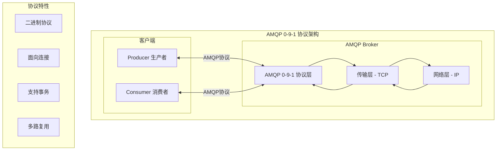

**协议核心特性**：
- **二进制协议**：高效的数据传输和解析
- **面向连接**：基于 TCP 的可靠传输
- **多路复用**：一个连接支持多个逻辑通道
- **事务支持**：保证消息传输的原子性
- **流量控制**：防止快速生产者压垮慢速消费者

### 1.2 协议版本对比

| 版本 | 发布时间 | 主要特性 | 应用情况 |
|------|----------|----------|----------|
| **AMQP 0-9-1** | 2008年11月13日 | 成熟稳定、功能完整 | **RabbitMQ主要版本** |
| AMQP 0-10 | 2008年2月 | 更复杂的功能集 | Apache Qpid |
| AMQP 1.0 | 2012年 | 完全重新设计 | Azure Service Bus |

---

## 2. 核心架构模型

### 2.1 AMQP 实体模型

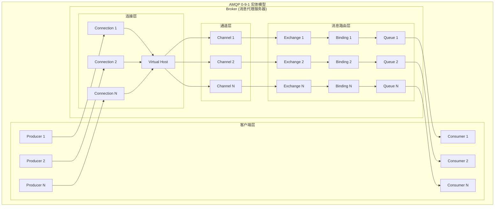

### 2.2 多对多消息路由关系

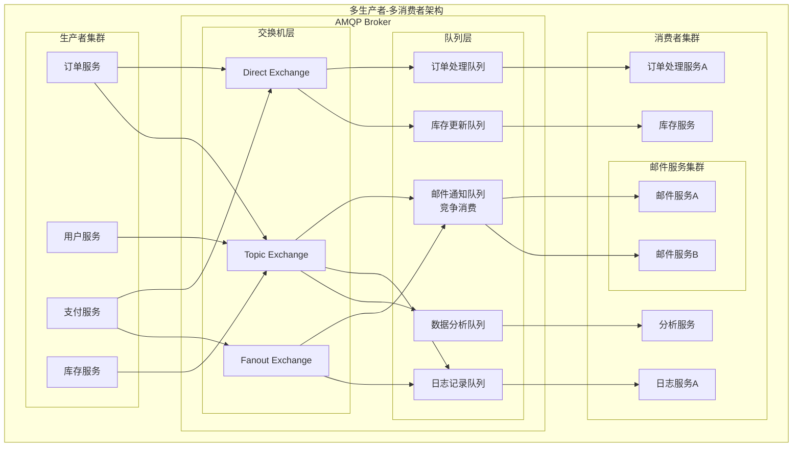

### 2.3 实体关系详解

#### AMQP Broker（消息代理服务器）
- **作用**：AMQP服务器的核心实体，负责接收、存储、路由和投递消息
- **职责**：管理连接、虚拟主机、交换机、队列等所有AMQP实体
- **特点**：单个Broker可以承载多个Virtual Host，实现多租户隔离
- **扩展性**：支持多生产者并发发送、多消费者并发处理、多队列负载分担

#### 多对多关系特性

**1. 竞争消费模式 (Competing Consumers)**
- **邮件通知队列**：2个邮件服务(A、B)负载均衡处理邮件发送
- **优势**：自动负载均衡、故障容错、水平扩展

**2. 独立消费模式 (Independent Consumers)**
- **订单处理队列**：订单独立处理
- **数据分析队列**：专用分析服务处理
- **库存更新队列**：库存服务独立处理
- **日志服务队列**：日志服务独立处理
- **优势**：业务隔离、专业化处理

**3. 路由灵活性**
- **多生产者支持**：不同服务可以同时向同一个或不同的Exchange发送消息
- **多交换机类型**：Direct、Topic、Fanout等满足不同路由需求
- **多队列并行**：通过多个队列实现业务隔离和负载分担

---

## 3. 消息模型详解

### 3.1 消息结构

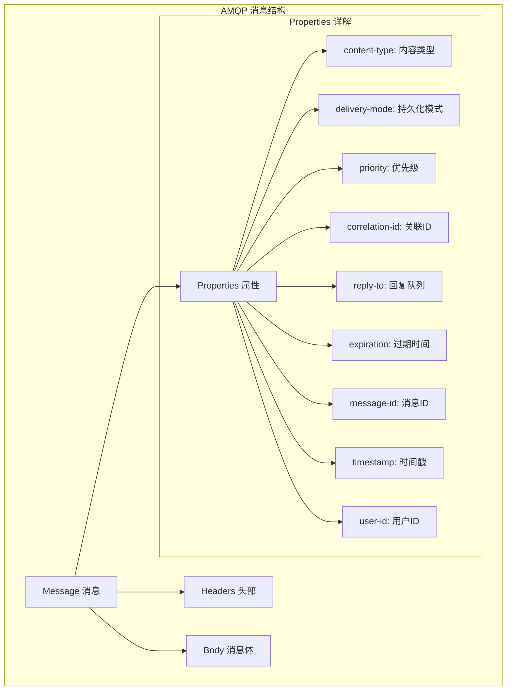

### 3.2 消息属性详解

| 属性 | 类型 | 说明 | 示例 |
|------|------|------|------|
| **content-type** | String | MIME类型 | `application/json` |
| **delivery-mode** | Integer | 1=非持久化, 2=持久化 | `2` |
| **priority** | Integer | 消息优先级 (0-255) | `100` |
| **correlation-id** | String | 请求关联ID | `req-123456` |
| **reply-to** | String | 回复队列名 | `callback_queue` |
| **expiration** | String | 消息TTL(毫秒) | `60000` |
| **message-id** | String | 消息唯一标识 | `msg-789012` |
| **timestamp** | Timestamp | 消息时间戳 | `1627891200` |
| **user-id** | String | 发送者用户ID | `user123` |
| **app-id** | String | 应用程序标识 | `order-service` |

---

## 4. 交换机类型深度解析

### 4.1 Direct Exchange 工作机制

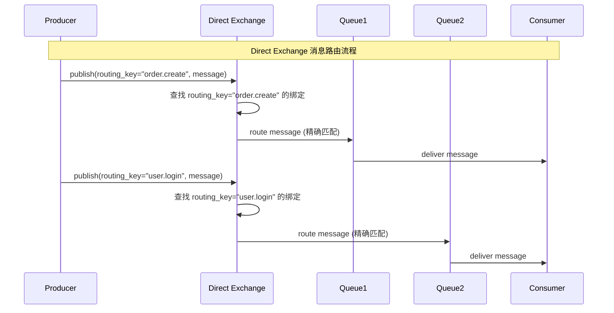

**Direct Exchange 特点**：
- 基于完全匹配的路由键进行路由
- 一对一的精确路由关系
- 性能最高，路由算法简单
- 适用于明确的点对点通信

### 4.2 Topic Exchange 模式匹配

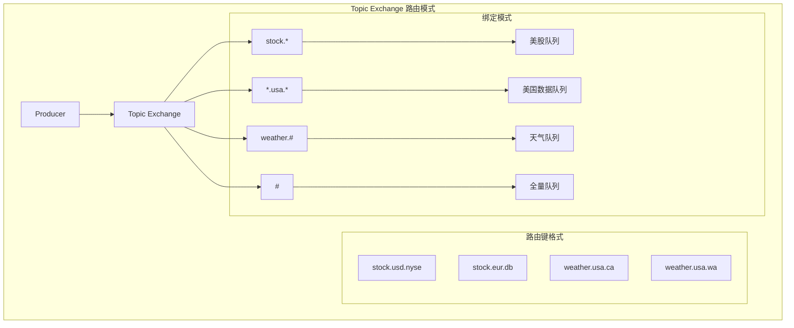

**Topic Exchange 匹配规则**：
- `*` (星号): 匹配恰好一个单词
- `#` (井号): 匹配零个或多个单词
- 单词边界: 点号 (.) 分隔

**匹配示例**：

| 路由键 | 绑定模式 | 匹配结果 |
|--------|----------|----------|
| `stock.usd.nyse` | `stock.*` | ❌ (3个单词 vs 2个单词) |
| `stock.usd.nyse` | `stock.#` | ✅ (匹配stock开头的所有) |
| `stock.usd.nyse` | `*.usd.*` | ✅ (中间是usd) |
| `weather.usa.ca.sf` | `weather.usa.#` | ✅ (weather.usa开头) |

### 4.3 Fanout Exchange 广播机制

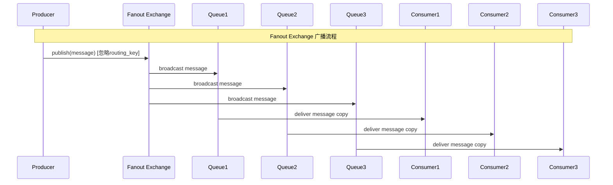

---

## 5. 消息确认机制

### 5.1 Publisher Confirms（发布确认）

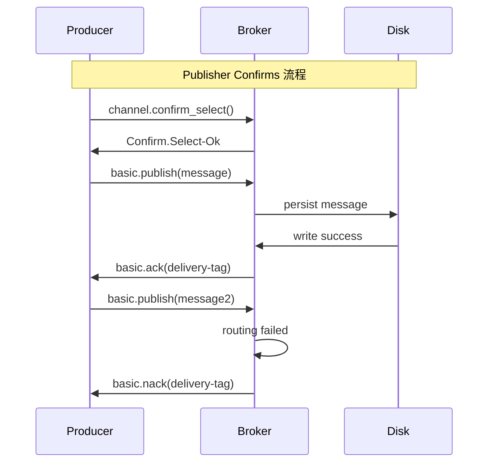

**Publisher Confirms 实现流程**：

1. **启用确认模式**：通道调用confirm_select()开启发布确认
2. **设置确认处理器**：
   - 成功处理器：接收到确认时记录成功状态
   - 失败处理器：接收到拒绝时执行重试逻辑
3. **发布消息**：向指定Exchange发送消息
4. **等待确认**：阻塞等待Broker确认，可设置超时时间

### 5.2 Consumer Acknowledgments（消费确认）

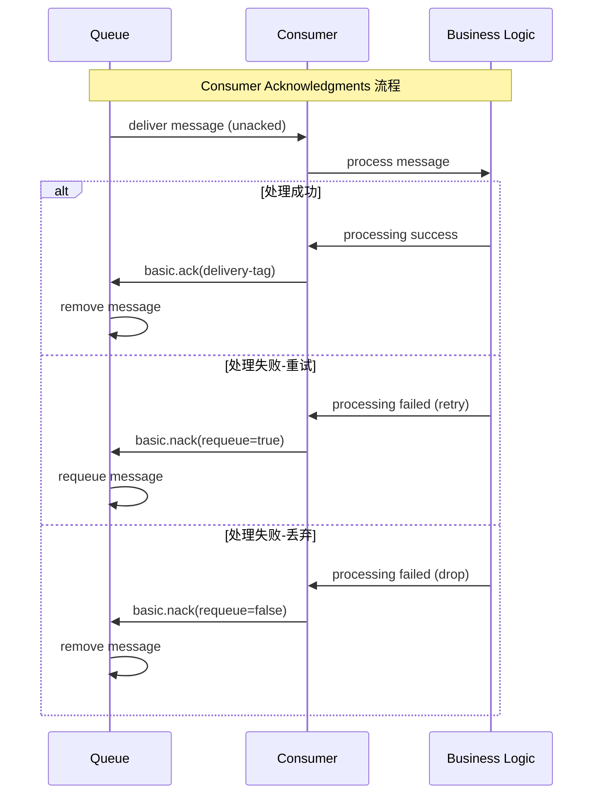

**Consumer Acknowledgments 处理流程**：

1. **消息接收**：消费者从队列接收消息，消息状态为"未确认"
2. **业务处理**：解析消息内容并执行具体的业务逻辑
3. **结果处理**：根据处理结果选择不同的确认策略
   - **处理成功**：调用ack()确认消息，Broker从队列中删除消息
   - **可重试错误**：调用nack(requeue=true)拒绝消息并重新排队
   - **不可重试错误**：调用nack(requeue=false)拒绝消息并丢弃
4. **消费监听**：通过basic_consume建立持续的消费监听

---

## 6. 事务机制

### 6.1 AMQP 事务模型

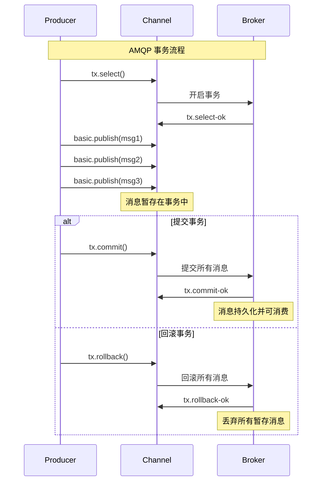

**AMQP事务使用流程**：

1. **开启事务**：通道调用tx_select()启动事务模式
2. **批量操作**：在事务内执行多个相关的消息发送操作
   - 订单创建消息发送到订单交换机
   - 库存预留消息发送到库存交换机  
   - 邮件通知消息发送到通知交换机
3. **事务提交**：所有操作成功后调用tx_commit()提交事务
4. **异常处理**：发生错误时调用tx_rollback()回滚所有操作

### 6.2 事务 vs Publisher Confirms

| 特性 | 事务 (Transactions) | 发布确认 (Publisher Confirms) |
|------|---------------------|-------------------------------|
| **性能** | 较低 (同步阻塞) | 较高 (异步非阻塞) |
| **吞吐量** | ~350 msg/s | ~4000 msg/s |
| **原子性** | 多消息原子操作 | 单消息确认 |
| **使用场景** | 强一致性要求 | 高性能场景 |
| **错误处理** | 回滚整个事务 | 单独处理每个消息 |

---

## 7. 流量控制机制

### 7.1 Connection-Level Flow Control

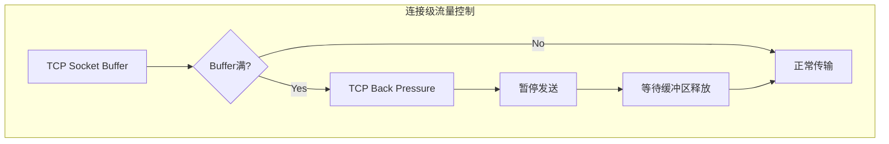

### 7.2 Channel-Level Flow Control

**通道级QoS流量控制机制**：

1. **预取限制设置**：通过basic_qos配置通道的服务质量参数
   - **prefetch_size**：单条消息大小限制（通常设为0表示无限制）
   - **prefetch_count**：预取消息数量限制（如设为10表示最多预取10条）
   - **global**：是否全局生效（false表示仅当前通道生效）

2. **流控原理**：
   - Broker向消费者推送消息时会检查预取限制
   - 当未确认消息数量达到限制时，Broker暂停向该消费者发送新消息
   - 消费者确认消息后，Broker继续发送新消息

3. **应用场景**：防止快速的Broker压垮慢速的消费者，实现背压控制

### 7.3 Memory and Disk Flow Control

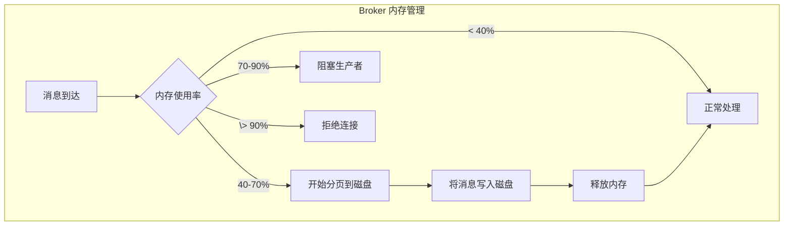

**Broker内存和磁盘流量控制机制**：

1. **内存阈值管理**：Broker监控内存使用率，根据不同阈值采取相应措施
   - **低水位（<40%）**：正常处理所有消息，保持最佳性能
   - **中水位（40-70%）**：启动分页机制，将部分消息写入磁盘释放内存
   - **高水位（70-90%）**：开始阻塞生产者，暂停接收新消息
   - **临界水位（>90%）**：拒绝新连接，保护系统稳定性

2. **分页机制原理**：
   - **消息分页**：将内存中的消息批量写入磁盘存储
   - **内存释放**：分页完成后释放相应的内存空间
   - **透明恢复**：需要时从磁盘重新加载消息到内存

3. **背压控制策略**：
   - **生产者阻塞**：高内存使用时暂停接收发布消息
   - **连接限制**：极端情况下拒绝新的客户端连接
   - **自动恢复**：内存使用率下降后自动恢复正常处理

---

## 8. 错误处理和恢复

### 8.1 连接异常处理

**健壮连接管理策略**：

1. **重试机制**：设置最大重试次数（如5次）和初始延迟时间（如1秒）
2. **连接参数配置**：
   - **连接超时**：设置合理的连接超时时间（如3秒）
   - **读写超时**：配置读写操作的超时时间（如3秒）
   - **心跳机制**：启用心跳检测（如60秒间隔）保持连接活跃
3. **指数退避策略**：每次重试后将延迟时间翻倍，避免频繁重连
4. **异常处理**：记录连接失败原因，达到最大重试次数后抛出异常

### 8.2 通道异常恢复

**通道管理和异常恢复机制**：

1. **通道池管理**：维护通道集合，避免频繁创建和销毁通道
2. **健康检查**：使用is_open()检查通道状态，确保通道可用
3. **自动重建**：检测到通道关闭时自动创建新通道替换
4. **错误监听**：设置消息返回监听器处理路由失败的消息
5. **递归恢复**：通道异常时递归调用获取方法实现自动恢复

---

*🌟 "理解协议规范是掌握技术本质的关键，AMQP 0-9-1 为我们提供了构建可靠消息系统的坚实基础！"*