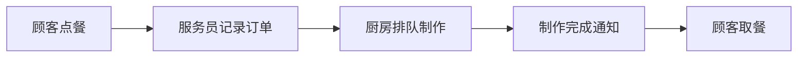
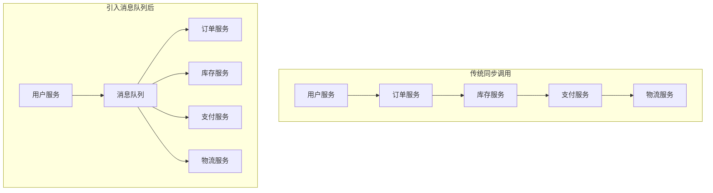
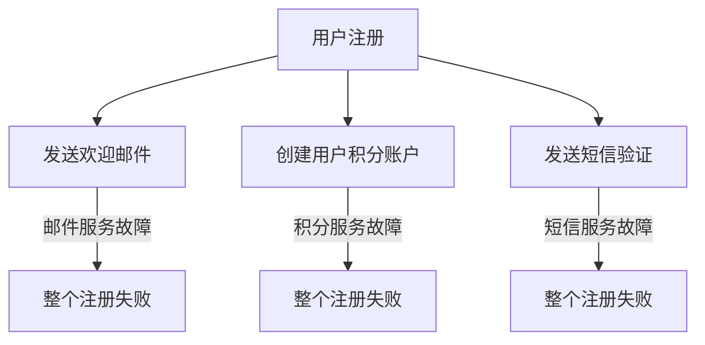
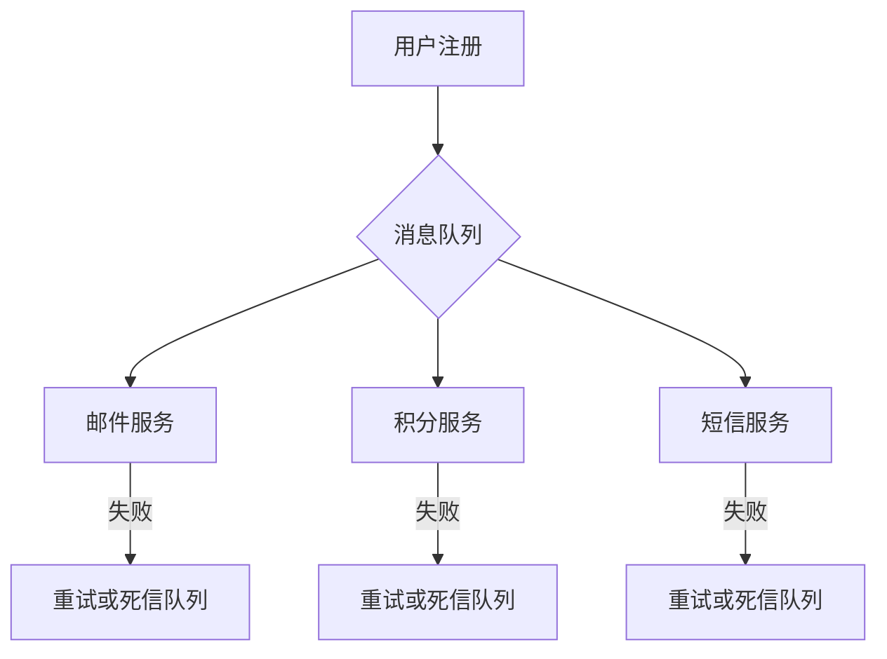
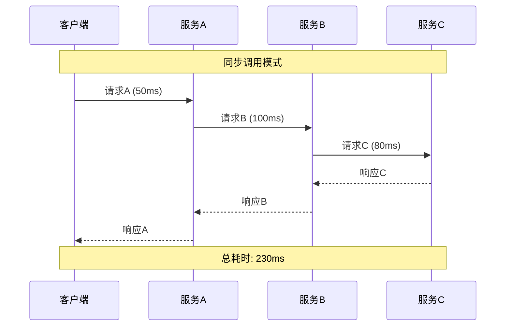
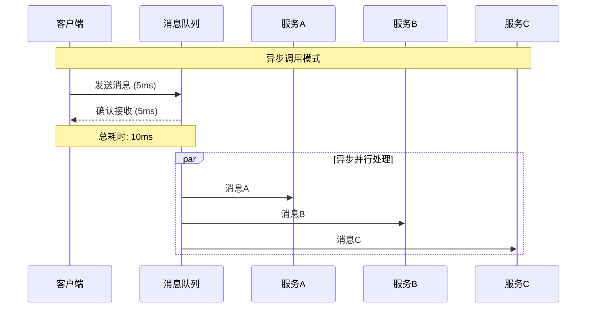
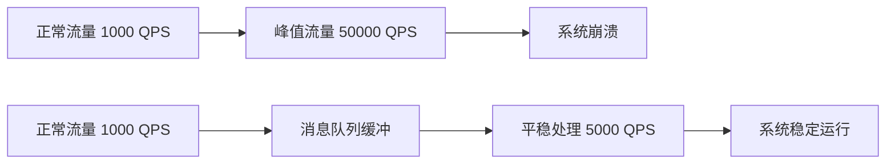
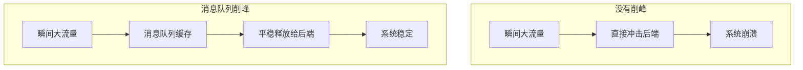
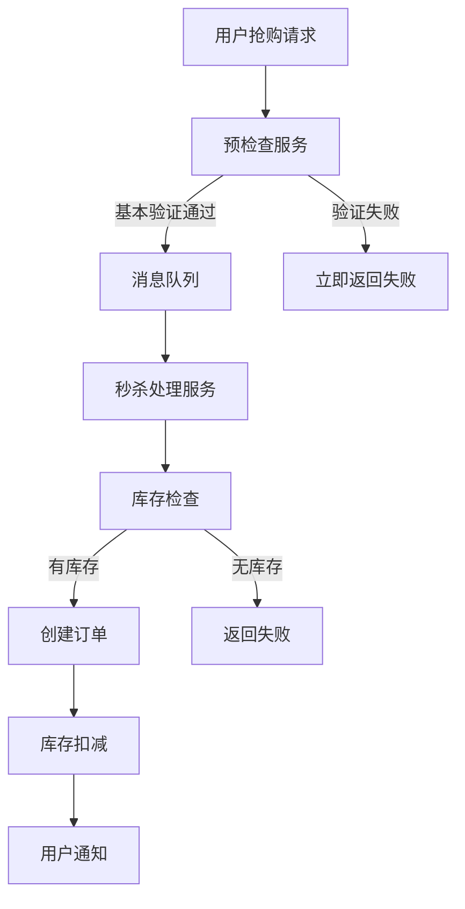

# 第一章 初识MQ：解耦、异步、削峰三大利器

> "天下武功，唯快不破" —— 而消息队列，就是让系统变快的秘密武器！ ⚡️

## 本章学习目标 🎯

- 深入理解消息队列的核心价值和应用场景
- 掌握解耦、异步、削峰三大核心问题的解决思路
- 动手搭建第一个MQ系统，体验异步通信的魅力
- 为后续深入学习打下坚实的理论基础

---

## 1.1 什么是消息队列？认识异步通信的魅力

### 从生活中的例子说起

想象一下你在餐厅点餐的场景：



在这个过程中，服务员就像是一个"消息队列"：
- **顾客（生产者）**：下单后不需要在厨房门口等待，可以去做其他事情
- **服务员（消息队列）**：负责记录订单，按顺序传递给厨房
- **厨房（消费者）**：按照订单顺序制作，处理完毕后通知顾客

这就是**异步通信**的精髓！顾客和厨房互不直接接触，通过服务员这个中介来协调工作。

### 技术世界中的消息队列

在软件系统中，消息队列（Message Queue，简称MQ）扮演着类似服务员的角色：



**消息队列的核心特征：**

| 特征 | 说明 | 类比 |
|------|------|------|
| **异步处理** | 发送方不需要等待接收方处理完成 | 寄快递：寄出即可，不用等对方签收 |
| **解耦合** | 发送方和接收方互不了解对方的存在 | 电子邮件：发件人不需要知道收件人何时查看 |
| **可靠传输** | 保证消息不会丢失 | 挂号信：有回执保证送达 |
| **削峰填谷** | 缓冲突发流量 | 水库：调节水流量 |

### 消息队列的基本工作原理

```pseudocode
// 生产者发送消息
producer = createProducer()
message = createMessage("用户下单", {orderId: 12345, userId: 789})
producer.send(message)

// 消息队列存储消息
queue.store(message)

// 消费者接收消息
consumer = createConsumer()
while (true) {
    message = consumer.receive()
    if (message != null) {
        processOrder(message.data)
        consumer.acknowledge(message)  // 确认处理完成
    }
}
```

### 为什么需要消息队列？

#### 问题1：系统耦合度高
**传统做法：**
```pseudocode
function createOrder(orderData) {
    // 1. 创建订单
    order = saveOrder(orderData)
    
    // 2. 扣减库存 - 如果库存服务故障，整个流程中断
    updateInventory(order.productId, order.quantity)
    
    // 3. 发送邮件 - 如果邮件服务慢，用户等待时间长
    sendEmail(order.userEmail, "订单确认邮件")
    
    // 4. 记录日志
    writeLog(order)
    
    return order
}
```

**引入MQ后：**
```pseudocode
function createOrder(orderData) {
    // 1. 创建订单
    order = saveOrder(orderData)
    
    // 2. 发送消息到队列，立即返回
    messageQueue.send("order.created", order)
    
    return order  // 用户立即得到响应
}

// 其他服务异步处理
inventoryService.subscribe("order.created", updateInventory)
emailService.subscribe("order.created", sendEmail)
logService.subscribe("order.created", writeLog)
```

#### 问题2：系统性能瓶颈
在高并发场景下，同步调用会导致：
- **级联延迟**：一个服务慢，整个链路都慢
- **资源浪费**：线程阻塞等待，CPU利用率低
- **用户体验差**：响应时间长

#### 问题3：流量冲击
电商大促时的流量特点：
- 瞬间涌入大量请求
- 峰值是平时的10-100倍
- 持续时间短但冲击力强

没有缓冲机制，系统容易被瞬间压垮。

---

## 1.2 三大核心问题：解耦、异步、削峰详解

### 🔗 解耦：让系统模块各司其职

#### 什么是耦合？
耦合就像是多米诺骨牌，一个倒了，全部都要倒：



#### MQ如何实现解耦？



**解耦前后对比：**

| 维度 | 解耦前 | 解耦后 |
|------|--------|--------|
| **故障影响** | 一个服务故障，整个流程中断 | 各服务独立，故障隔离 |
| **开发效率** | 需要了解所有依赖服务的接口 | 只需要关心消息格式 |
| **系统扩展** | 新增功能需要修改主流程 | 新增消费者即可 |
| **运维复杂度** | 服务间调用链复杂 | 通过队列观察消息流转 |

#### 实战案例：电商订单系统解耦

**解耦前的代码：**
```pseudocode
class OrderService {
    function createOrder(orderData) {
        try {
            // 创建订单
            order = this.saveOrder(orderData)
            
            // 直接调用多个服务 - 紧耦合
            inventoryService.reduceStock(order.items)
            paymentService.createPayment(order.amount)
            emailService.sendOrderConfirmation(order.userEmail)
            logService.recordOrderEvent(order.id, "CREATED")
            
            return success(order)
        } catch (exception) {
            // 任何一个服务失败，整个订单创建失败
            return error("订单创建失败: " + exception.message)
        }
    }
}
```

**解耦后的代码：**
```pseudocode
class OrderService {
    function createOrder(orderData) {
        // 1. 只关心核心业务逻辑
        order = this.saveOrder(orderData)
        
        // 2. 发布事件，不关心谁会处理
        eventBus.publish("order.created", {
            orderId: order.id,
            userId: order.userId,
            items: order.items,
            amount: order.amount,
            userEmail: order.userEmail
        })
        
        return success(order)  // 立即返回，用户体验好
    }
}

// 各个服务独立订阅事件
class InventoryService {
    function handleOrderCreated(event) {
        this.reduceStock(event.items)
    }
}

class PaymentService {
    function handleOrderCreated(event) {
        this.createPayment(event.amount)
    }
}
```

### ⚡ 异步：让系统响应如闪电

#### 同步 vs 异步的本质区别

**同步调用：** 就像打电话，必须等对方接听并回复
**异步调用：** 就像发短信，发出即可，对方随时回复





#### 异步带来的性能提升

**量化对比：**

| 场景 | 同步模式 | 异步模式 | 性能提升 |
|------|----------|----------|----------|
| **响应时间** | 230ms | 10ms | **23倍** |
| **并发处理能力** | 100 QPS | 1000 QPS | **10倍** |
| **系统资源利用率** | 30% | 80% | **2.7倍** |

#### 实战案例：用户注册流程优化

**优化前：**
```pseudocode
function registerUser(userInfo) {
    startTime = getCurrentTime()
    
    // 1. 保存用户信息 (50ms)
    user = saveUser(userInfo)
    
    // 2. 发送邮箱验证邮件 (200ms) - 慢！
    sendVerificationEmail(user.email)
    
    // 3. 发送欢迎短信 (150ms) - 慢！
    sendWelcomeSMS(user.phone)
    
    // 4. 创建用户积分账户 (100ms) - 慢！
    createPointsAccount(user.id)
    
    endTime = getCurrentTime()
    // 总耗时：500ms - 用户等得不耐烦了！
    
    return success(user)
}
```

**优化后：**
```pseudocode
function registerUser(userInfo) {
    startTime = getCurrentTime()
    
    // 1. 保存用户信息 (50ms)
    user = saveUser(userInfo)
    
    // 2. 异步发布用户注册事件 (5ms)
    messageQueue.publish("user.registered", {
        userId: user.id,
        email: user.email,
        phone: user.phone
    })
    
    endTime = getCurrentTime()
    // 总耗时：55ms - 用户秒收到响应！
    
    return success(user)  // 用户立即看到注册成功
}

// 后台异步处理各种任务
emailService.subscribe("user.registered", sendVerificationEmail)
smsService.subscribe("user.registered", sendWelcomeSMS)  
pointsService.subscribe("user.registered", createPointsAccount)
```

### 🏔️ 削峰：化解流量洪峰的利器

#### 什么是流量峰值？

想象一下双11的场景：
- 平时访问量：1000 QPS
- 0点瞬间访问量：50000 QPS
- 持续时间：几分钟到几小时



#### 削峰的核心原理

消息队列就像水库，调节水流：



#### 削峰策略详解

**1. 队列缓冲策略**
```pseudocode
// 配置队列容量和处理速度
queueConfig = {
    maxSize: 100000,        // 队列最大容量
    processRate: 5000,      // 每秒处理5000条消息
    overflowStrategy: "reject"  // 超出容量时拒绝新消息
}

// 生产者快速写入队列
producer.send(message)  // 2ms 内完成

// 消费者按照固定速率处理
consumer.processWithRateLimit(5000)  // 每秒最多处理5000条
```

**2. 分级处理策略**
```pseudocode
// 根据消息重要性分队列
enum MessagePriority {
    CRITICAL,   // 核心业务，立即处理
    HIGH,       // 重要业务，优先处理  
    NORMAL,     // 普通业务，正常处理
    LOW         // 次要业务，延后处理
}

// 不同队列不同处理速度
criticalQueue.processRate = 10000   // 最高优先级
highQueue.processRate = 5000
normalQueue.processRate = 2000  
lowQueue.processRate = 500
```

#### 实战案例：秒杀系统削峰设计

**秒杀场景特点：**
- 瞬间涌入百万级请求
- 实际商品库存只有几千件
- 99%的请求注定失败

**传统设计问题：**
```pseudocode
function seckillProduct(productId, userId) {
    // 所有请求直接查询数据库 - 数据库瞬间被压垮！
    stock = database.getStock(productId)
    
    if (stock > 0) {
        // 并发修改库存，出现超卖
        database.updateStock(productId, stock - 1)
        return success("抢购成功")
    } else {
        return error("商品已售完")
    }
}
```

**基于MQ的削峰设计：**



**实现代码：**
```pseudocode
// 1. 前端预检查，快速过滤无效请求
function seckillRequest(productId, userId) {
    // 快速检查：用户是否重复提交、活动是否开始等
    if (!preCheck(productId, userId)) {
        return error("请求无效")
    }
    
    // 将有效请求放入队列
    seckillQueue.send({
        productId: productId,
        userId: userId,
        timestamp: getCurrentTime()
    })
    
    return success("请求已提交，请稍候查看结果")
}

// 2. 后端串行处理，避免并发问题
function processSeckillQueue() {
    while (true) {
        message = seckillQueue.receive()
        
        // 使用Redis原子操作检查和扣减库存
        remainingStock = redis.decrement("stock:" + message.productId)
        
        if (remainingStock >= 0) {
            // 库存足够，创建订单
            createOrder(message.productId, message.userId)
            notifyUser(message.userId, "抢购成功")
        } else {
            // 库存不足，回滚操作
            redis.increment("stock:" + message.productId)
            notifyUser(message.userId, "商品已售完")
        }
    }
}
```

**削峰效果对比：**

| 指标 | 传统设计 | MQ削峰设计 |
|------|----------|------------|
| **系统稳定性** | 高峰期宕机 | 始终稳定运行 |
| **处理准确性** | 出现超卖 | 库存精确控制 |
| **用户体验** | 页面卡死 | 快速响应状态 |
| **资源利用** | 瞬间耗尽 | 平稳可控 |

---

## 1.3 5分钟搭建你的第一个MQ系统

理论说得再多，不如动手实践！让我们用最简单的方式搭建一个消息队列系统，感受异步通信的魅力。

### 环境准备

我们选择Redis作为消息队列（简单易用，适合初学者）：

```bash
# 1. 安装Redis (以Ubuntu为例)
sudo apt-get install redis-server

# 2. 启动Redis
redis-server

# 3. 验证安装
redis-cli ping  # 应该返回 PONG
```

### 第一个消息队列程序

#### 创建生产者（Producer）

```pseudocode
// producer.py - 消息生产者
import redis
import json
import time

class MessageProducer {
    function __init__() {
        this.redis_client = redis.Redis(host='localhost', port=6379, db=0)
        this.queue_name = "my_first_queue"
    }
    
    function sendMessage(message) {
        // 将消息序列化并放入队列
        message_data = {
            "content": message,
            "timestamp": getCurrentTime(),
            "message_id": generateUniqueId()
        }
        
        // 使用Redis的LIST数据结构作为队列
        this.redis_client.lpush(this.queue_name, json.dumps(message_data))
        
        print("✅ 消息已发送: " + message)
    }
}

// 使用示例
producer = new MessageProducer()

// 模拟发送不同类型的消息
messages = [
    "用户123下单成功",
    "商品456库存不足",
    "支付订单789完成"
]

for message in messages {
    producer.sendMessage(message)
    time.sleep(1)  // 间隔1秒发送
}
```

#### 创建消费者（Consumer）

```pseudocode
// consumer.py - 消息消费者
import redis
import json
import time

class MessageConsumer {
    function __init__() {
        this.redis_client = redis.Redis(host='localhost', port=6379, db=0)
        this.queue_name = "my_first_queue"
    }
    
    function processMessage(message_data) {
        // 模拟消息处理逻辑
        print("🔄 正在处理消息: " + message_data["content"])
        
        // 模拟处理时间
        time.sleep(2)
        
        print("✅ 消息处理完成: " + message_data["message_id"])
    }
    
    function startConsuming() {
        print("📡 消费者启动，等待消息...")
        
        while (true) {
            // 阻塞式从队列右端取消息
            result = this.redis_client.brpop(this.queue_name, timeout=5)
            
            if (result) {
                queue_name, message_json = result
                message_data = json.loads(message_json)
                
                try {
                    this.processMessage(message_data)
                } catch (exception) {
                    print("❌ 消息处理失败: " + exception.message)
                    // 可以选择重新放入队列或放入死信队列
                }
            } else {
                print("⏰ 暂无消息，等待中...")
            }
        }
    }
}

// 启动消费者
consumer = new MessageConsumer()
consumer.startConsuming()
```

### 运行你的第一个MQ系统

**1. 启动消费者（Terminal 1）：**
```bash
python consumer.py
```
输出：
```
📡 消费者启动，等待消息...
⏰ 暂无消息，等待中...
```

**2. 启动生产者（Terminal 2）：**
```bash
python producer.py
```
输出：
```
✅ 消息已发送: 用户123下单成功
✅ 消息已发送: 商品456库存不足  
✅ 消息已发送: 支付订单789完成
```

**3. 观察消费者处理过程：**
```
🔄 正在处理消息: 用户123下单成功
✅ 消息处理完成: msg_001
🔄 正在处理消息: 商品456库存不足
✅ 消息处理完成: msg_002
🔄 正在处理消息: 支付订单789完成
✅ 消息处理完成: msg_003
⏰ 暂无消息，等待中...
```

🎉 **恭喜！你的第一个消息队列系统成功运行了！**

### 体验异步魅力

让我们对比一下同步和异步的差别：

#### 同步版本（体验卡顿）
```pseudocode
function processOrderSync(orderInfo) {
    startTime = getCurrentTime()
    
    print("开始处理订单...")
    
    // 串行处理，每个步骤都要等待
    updateInventory(orderInfo)      // 等待2秒
    sendEmail(orderInfo)            // 等待3秒  
    recordLog(orderInfo)            // 等待1秒
    
    endTime = getCurrentTime()
    print("订单处理完成，耗时: " + (endTime - startTime) + "秒")
    
    return "订单处理成功"
}

result = processOrderSync(orderInfo)  // 用户等待6秒！
print("用户看到结果: " + result)
```

#### 异步版本（体验秒响应）
```pseudocode
function processOrderAsync(orderInfo) {
    startTime = getCurrentTime()
    
    print("开始处理订单...")
    
    // 异步发送消息，立即返回
    messageQueue.send("inventory.update", orderInfo)   // 5ms
    messageQueue.send("email.send", orderInfo)         // 5ms
    messageQueue.send("log.record", orderInfo)         // 5ms
    
    endTime = getCurrentTime()
    print("订单提交完成，耗时: " + (endTime - startTime) + "秒")
    
    return "订单提交成功，正在异步处理中"
}

result = processOrderAsync(orderInfo)  // 用户等待0.015秒！
print("用户看到结果: " + result)
```

### 进一步实验

现在你可以尝试：

**1. 多消费者并行处理：**
```bash
# 同时启动3个消费者实例
python consumer.py &   # 后台运行
python consumer.py &   
python consumer.py &   

# 发送大量消息测试
python producer_batch.py  # 发送100条消息
```

**2. 观察负载均衡效果：**
每个消费者会处理不同的消息，实现天然的负载均衡。

**3. 模拟消费者故障：**
```bash
# Ctrl+C 杀死一个消费者
# 观察其他消费者继续处理消息
```

### 这个简单例子展示了什么？

通过这个5分钟的实验，你亲身体验了：

✅ **解耦**：生产者和消费者独立运行，互不影响  
✅ **异步**：生产者发送消息后立即返回，不等待处理完成  
✅ **削峰**：消息先存储在队列中，消费者按自己的节奏处理  
✅ **可靠性**：Redis持久化保证消息不丢失  
✅ **扩展性**：可以随时增加消费者实例

---

## 本章总结

### 🎯 核心要点回顾

1. **消息队列的本质**：一个异步通信的中介，让系统组件解耦协作

2. **三大核心价值**：
   - **解耦**：降低系统组件间的依赖关系
   - **异步**：提升系统响应速度和吞吐量
   - **削峰**：平滑处理突发流量，保护系统稳定

3. **适用场景**：
   - 高并发系统
   - 微服务架构
   - 需要解耦的业务流程
   - 有突发流量的场景

4. **基本工作模式**：
   - 生产者发送消息到队列
   - 消费者从队列获取消息处理
   - 队列保证消息的可靠传递

### 💡 关键洞察

- **异步思维**：不是所有事情都需要立即完成，允许延后处理能极大提升用户体验
- **解耦价值**：系统组件间的松耦合是构建大型分布式系统的基础
- **流量管理**：通过队列缓冲，可以用较少的资源处理更大的流量峰值

### 🔗 与下一章的关联

初识MQ让你了解了"为什么要用"，接下来第二章将深入"怎么用"：

- **生产者、消费者、队列**：MQ的三要素详解
- **点对点 vs 发布订阅**：两种基本通信模式  
- **消息的生命周期**：从发送到消费的完整过程
- **交换机与路由**：消息如何智能投递

掌握了核心概念，你就能在各种复杂场景中游刃有余地使用消息队列了！

---

*🌟 "工欲善其事，必先利其器。" MQ就是分布式系统中最重要的利器之一，让我们继续深入探索它的奥秘！*