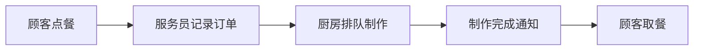
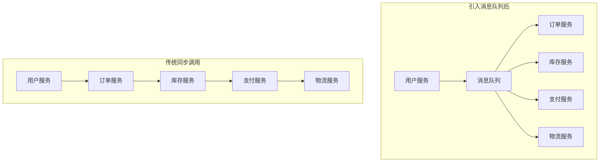
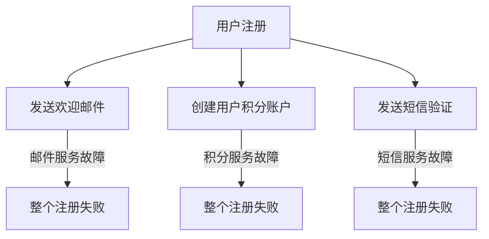
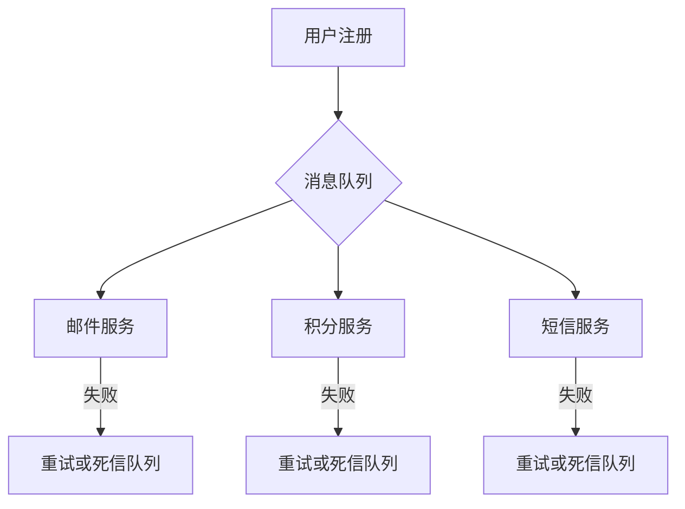
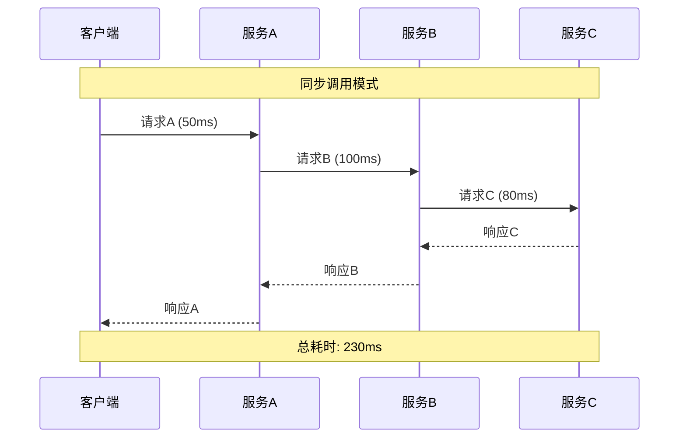
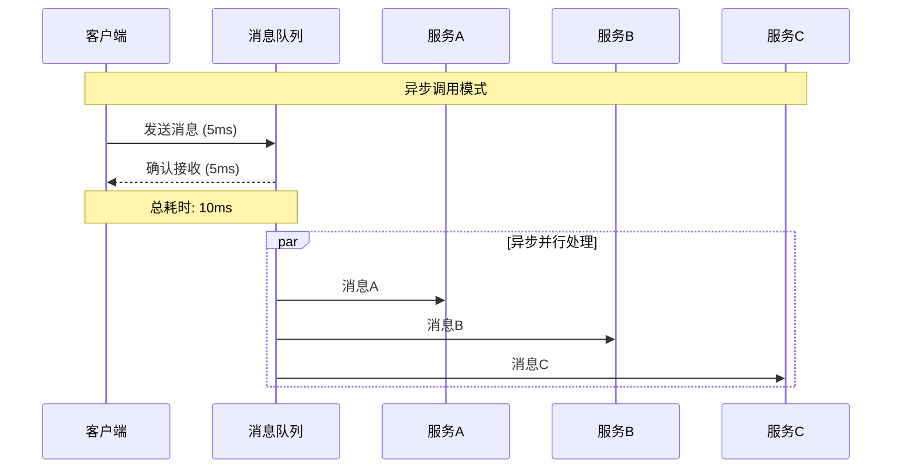
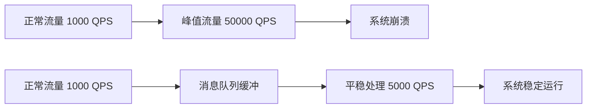
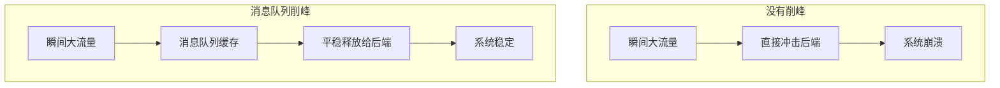
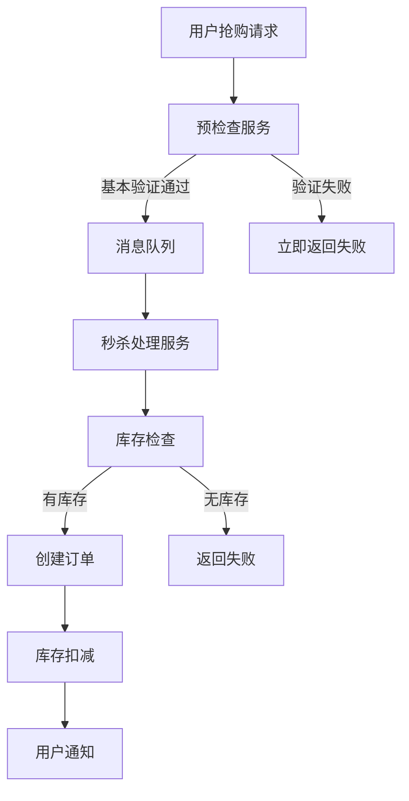

# 第一章 初识MQ：解耦、异步、削峰三大利器

> "天下武功，唯快不破" —— 而消息队列，就是让系统变快的秘密武器！ ⚡️

## 本章学习目标 🎯

- 深入理解消息队列的核心价值和应用场景
- 掌握解耦、异步、削峰三大核心问题的解决思路
- 动手搭建第一个MQ系统，体验异步通信的魅力
- 为后续深入学习打下坚实的理论基础

---

## 1.1 什么是消息队列？认识异步通信的魅力

### 从生活中的例子说起

想象一下你在餐厅点餐的场景：



在这个过程中，服务员就像是一个"消息队列"：
- **顾客（生产者）**：下单后不需要在厨房门口等待，可以去做其他事情
- **服务员（消息队列）**：负责记录订单，按顺序传递给厨房
- **厨房（消费者）**：按照订单顺序制作，处理完毕后通知顾客

这就是**异步通信**的精髓！顾客和厨房互不直接接触，通过服务员这个中介来协调工作。

### 技术世界中的消息队列

在软件系统中，消息队列（Message Queue，简称MQ）扮演着类似服务员的角色：


> 思考：引入消息队列前后，系统发生了哪些变化？

**消息队列的核心特征：**

| 特征 | 说明 | 类比 |
|------|------|------|
| **异步处理** | 发送方不需要等待接收方处理完成 | 寄快递：寄出即可，不用等对方签收，可以先去忙别的事 |
| **解耦合** | 发送方和接收方互不了解对方的存在 | 发通知：主干业务不需要关注通知发送的细节，即使发送任务失败，也不影响业务流程 |
| **可靠传输** | 保证消息不会丢失 | 挂号信：有回执保证送达 |
| **削峰填谷** | 缓冲突发流量 | 水库：调节水流量 |

### 消息队列的基本工作流程

```java
// 生产者：发送订单消息
producer.send("order.created", {orderId: 12345, userId: 789});

// 消费者：处理订单消息  
message = consumer.receive();
processOrder(message.data);
consumer.ack(message);  // 确认处理完成
```


### 为什么需要消息队列？

#### 问题1：系统耦合度高


**传统做法：**
```java
function createOrder(orderData) {
    order = saveOrder(orderData); // 用户直接下单
    updateIntent(order.accountId, order.assistantId);  // 更新用户意图，如果故障，会影响主干业务
    sendEmail(order.userEmail, "订单确认邮件");      // 邮件慢，用户等待
    writeLog(order); // 记录日志，如果故障，会影响主干业务
    return order;
}
```

> 我不想等，也别让别人的错误影响我

**引入MQ后：**
```java
function createOrder(orderData) {
    order = saveOrder(orderData);
    messageQueue.send("order.created", order);  // 异步处理
    return order;  // 用户立即响应
}

// 各服务独立订阅
intentService.subscribe("order.created", this::updateIntent);
emailService.subscribe("order.created", this::sendEmail);
logService.subscribe("order.created", this::writeLog);
```

#### 问题2：系统性能瓶颈
在高并发场景下，同步调用会导致：
- **级联延迟**：一个服务慢，整个链路都慢
- **资源浪费**：线程阻塞等待，CPU利用率低
- **用户体验差**：响应时间长

#### 问题3：流量冲击
电商大促时的流量特点：
- 瞬间涌入大量请求
- 峰值是平时的10-100倍
- 持续时间短但冲击力强
- 没有缓冲机制，系统容易被瞬间压垮。

---

## 1.2 三大核心问题：解耦、异步、削峰详解

### 🔗 解耦：让系统模块各司其职

#### 什么是耦合？
耦合就像是多米诺骨牌，一个倒了，全部都要倒：



#### MQ如何实现解耦？



**解耦前后对比：**

| 维度 | 解耦前 | 解耦后 |
|------|--------|--------|
| **故障影响** | 一个服务故障，整个流程中断 | 各服务独立，故障隔离 |
| **开发效率** | 需要了解所有依赖服务的接口 | 只需要关心消息格式 |
| **系统扩展** | 新增功能需要修改主流程 | 新增消费者即可 |
| **运维复杂度** | 服务间调用链复杂 | 通过队列观察消息流转 |

#### 实战案例：电商订单系统解耦

**解耦前：紧耦合设计**
```java
class OrderService {
    public Order createOrder(OrderData data) {
        order = saveOrder(data);
        
        // 直接调用多个服务 - 任何一个失败都影响整体
        inventoryService.reduceStock(order.items);
        paymentService.createPayment(order.amount);
        emailService.sendConfirmation(order.userEmail);
        
        return order;
    }
}
```

**解耦后：事件驱动设计**
```java
class OrderService {
    public Order createOrder(OrderData data) {
        order = saveOrder(data);  // 核心业务逻辑
        
        // 发布事件，各服务独立处理
        eventBus.publish("order.created", order);
        
        return order;  // 立即返回
    }
}

// 各服务独立订阅
@EventListener("order.created")
class InventoryService {
    public void handleOrderCreated(Order order) {
        reduceStock(order.items);
    }
}
@EventListener("order.created")
class PaymentService {
    public void handleOrderCreated(Order order) {
        createPayment(order.amount);
    }
}
@EventListener("order.created")
class EmailService {
    public void handleOrderCreated(Order order) {
        sendConfirmation(order.userEmail);
    }
}
```

### ⚡ 异步：让系统响应如闪电

#### 同步 vs 异步

- **同步调用：** 就像打电话，必须等对方接听并回复
- **异步调用：** 就像发短信，发出即可，对方随时回复





#### 实战案例：用户注册流程优化

**优化前：同步处理（总耗时500ms）**
```java
function registerUser(userInfo) {
    user = saveUser(userInfo);              // 50ms
    sendVerificationEmail(user.email);      // 200ms - 慢！
    sendWelcomeSMS(user.phone);            // 150ms - 慢！
    createPointsAccount(user.id);          // 100ms - 慢！
    return user;
}
```

**优化后：异步处理（总耗时55ms）**
```java
function registerUser(userInfo) {
    user = saveUser(userInfo);             // 50ms
    
    // 异步发布事件 (5ms)
    messageQueue.publish("user.registered", {
        userId: user.id,
        email: user.email,
        phone: user.phone
    });
    
    return user;  // 用户立即看到结果
}

// 后台异步处理
emailService.subscribe("user.registered", this::sendEmail);
smsService.subscribe("user.registered", this::sendSMS);
```

### 🏔️ 削峰：化解流量洪峰的利器

#### 什么是流量峰值？

想象一下双11的场景：
- 平时访问量：1000 QPS
- 0点瞬间访问量：50000 QPS
- 持续时间：几分钟到几小时



#### 削峰的核心原理

消息队列就像水库，调节水流：



#### 削峰策略详解

**队列缓冲策略**
```java
// 配置队列参数
QueueConfig config = new QueueConfig()
    .maxSize(100000)           // 最大容量
    .processRate(5000)         // 每秒处理5000条
    .overflowStrategy(REJECT); // 超量拒绝

// 生产者快速写入
producer.send(message);  // 2ms内完成

// 消费者限速处理
consumer.processWithRateLimit(5000);
```

**分级处理策略**
```java
// 按优先级分队列
enum Priority { CRITICAL, HIGH, NORMAL, LOW }

// 不同处理速度
criticalQueue.processRate(10000);  // 最高优先级
highQueue.processRate(5000);
normalQueue.processRate(2000);
lowQueue.processRate(500);
```

#### 实战案例：秒杀系统削峰设计

**秒杀场景特点：**
- 瞬间涌入百万级请求
- 实际商品库存只有几千件
- 99%的请求注定失败

**传统设计问题：**
```java
function seckillProduct(productId, userId) {
    stock = database.getStock(productId);  // 数据库瞬间被压垮
    
    if (stock > 0) {
        database.updateStock(productId, stock - 1);  // 并发超卖
        return "抢购成功";
    }
    return "商品已售完";
}
```

**基于MQ的削峰设计：**



**基于MQ的削峰设计：**
```java
// 1. 前端预检查，快速过滤
function seckillRequest(productId, userId) {
    if (!preCheck(productId, userId)) {
        return "请求无效";
    }
    
    // 放入队列异步处理
    seckillQueue.send(new SeckillMessage(productId, userId));
    return "请求已提交，请稍候查看结果";
}

// 2. 后端串行处理，避免并发
function processSeckillQueue() {
    message = seckillQueue.receive();
    
    // Redis原子操作扣减库存
    remainingStock = redis.decrement("stock:" + message.productId);
    
    if (remainingStock >= 0) {
        createOrder(message.productId, message.userId);
        notifyUser(message.userId, "抢购成功");
    } else {
        notifyUser(message.userId, "商品已售完");
    }
}
```

**削峰效果对比：**

| 指标 | 传统设计 | MQ削峰设计 |
|------|----------|------------|
| **系统稳定性** | 高峰期宕机 | 始终稳定运行 |
| **处理准确性** | 出现超卖 | 库存精确控制 |
| **用户体验** | 页面卡死 | 快速响应状态 |
| **资源利用** | 瞬间耗尽 | 平稳可控 |

---

## 本章总结

### 🎯 核心要点回顾

1. **消息队列的本质**：一个异步通信的中介，让系统组件解耦协作

2. **三大核心价值**：
   - **解耦**：降低系统组件间的依赖关系
   - **异步**：提升系统响应速度和吞吐量
   - **削峰**：平滑处理突发流量，保护系统稳定

3. **适用场景**：
   - 高并发系统
   - 微服务架构
   - 需要解耦的业务流程
   - 有突发流量的场景

4. **基本工作模式**：
   - 生产者发送消息到队列
   - 消费者从队列获取消息处理
   - 队列保证消息的可靠传递

### 💡 关键洞察

- **异步思维**：不是所有事情都需要立即完成，允许延后处理能极大提升用户体验
- **解耦价值**：系统组件间的松耦合是构建大型分布式系统的基础
- **流量管理**：通过队列缓冲，可以用较少的资源处理更大的流量峰值

### 🔗 与下一章的关联

初识MQ让你了解了"为什么要用"，接下来第二章将深入"怎么用"：

- **生产者、消费者、队列**：MQ的三要素详解
- **点对点 vs 发布订阅**：两种基本通信模式  
- **消息的生命周期**：从发送到消费的完整过程
- **交换机与路由**：消息如何智能投递

掌握了核心概念，你就能在各种复杂场景中游刃有余地使用消息队列了！

---

*🌟 "工欲善其事，必先利其器。" MQ就是分布式系统中最重要的利器之一，让我们继续深入探索它的奥秘！*