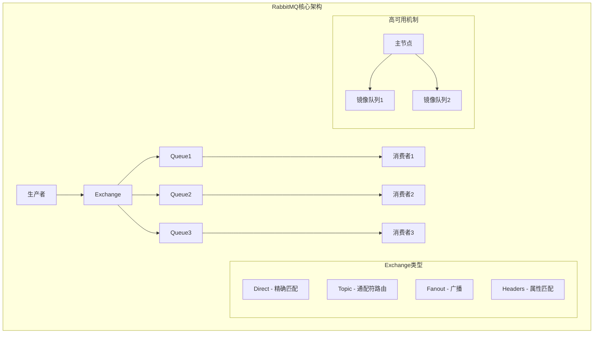
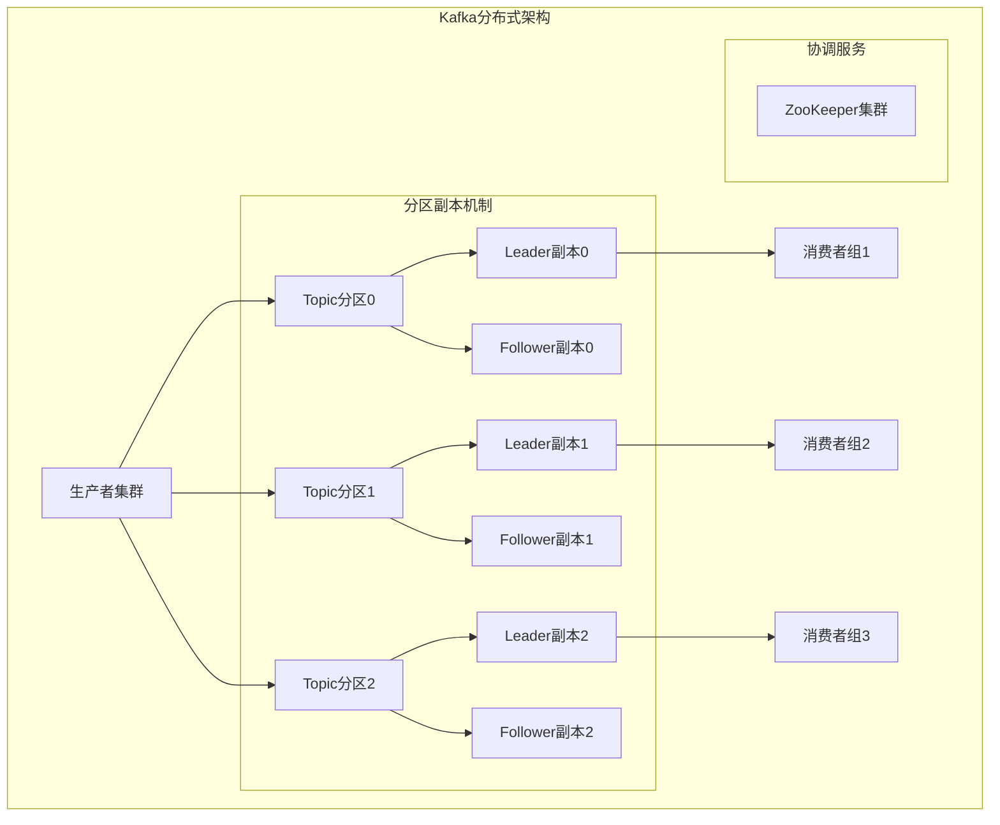
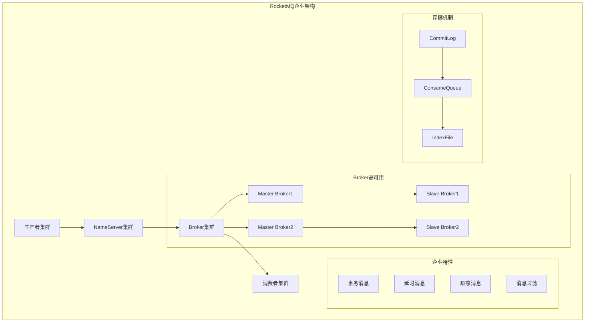
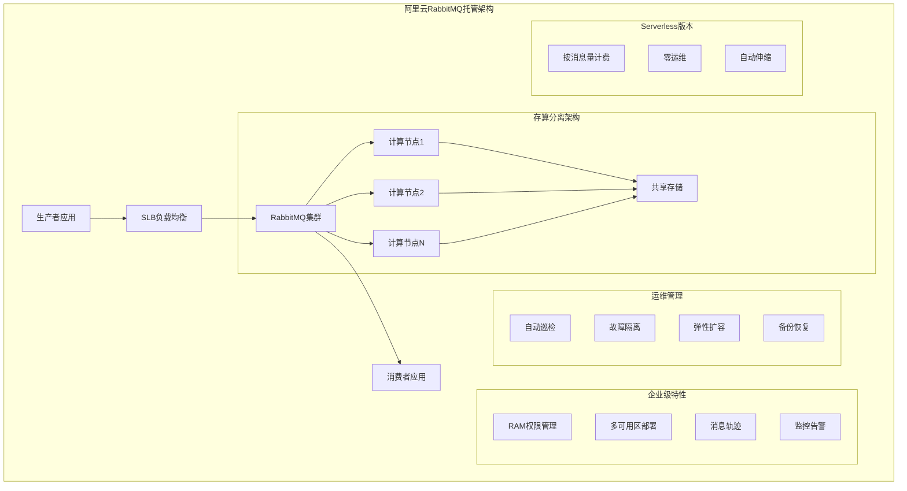
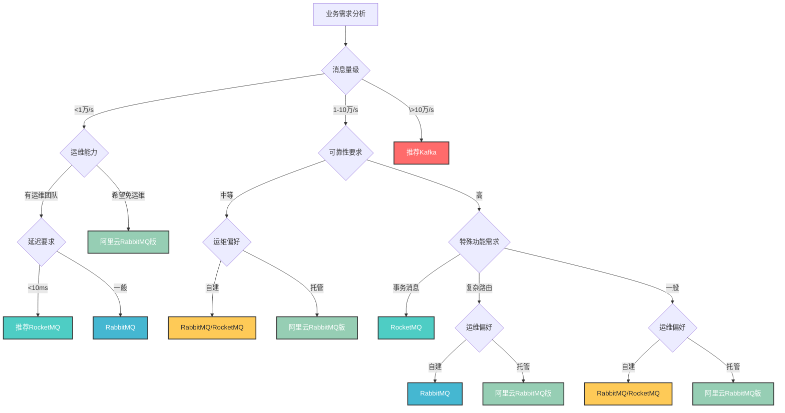

# 第七章 产品选型：选择最适合的MQ利器

> "工欲善其事，必先利其器" —— 选对工具，事半功倍！ ⚔️

## 本章学习目标 🎯

- 了解RabbitMQ、Kafka、RocketMQ三大企业级MQ产品的核心架构
- 掌握各产品的主要优势和局限性对比
- 学会根据典型业务场景进行MQ产品选型

---

## 7.1 核心架构图

### RabbitMQ：功能丰富的全能选手

**架构特点**：Exchange交换机负责消息路由，支持灵活的路由规则；Queue队列存储消息，支持持久化和镜像备份；通过routing key实现复杂的消息分发逻辑。

### Kafka：高吞吐量的流处理之王

**架构特点**：基于分区的水平扩展设计，每个分区有多个副本保证可靠性；消费者组机制支持并行处理和故障转移；ZooKeeper负责集群协调和元数据管理。

### RocketMQ：阿里巴巴的企业级选择

**架构特点**：NameServer提供轻量级服务发现，无需ZooKeeper；Master-Slave架构保证高可用；内置事务消息、延时消息等企业级特性；基于文件的高效存储机制。

### 阿里云消息队列RabbitMQ版：企业级托管服务

**架构特点**：存算分离架构实现无限扩展；多可用区部署保证高可用性；集成阿里云生态实现统一运维；Serverless版本支持按量付费；企业级安全和权限管理。

---

## 7.2 产品对比分析表

| 特性维度 | RabbitMQ | 阿里云RabbitMQ版 | Kafka | RocketMQ |
|---------|----------|-----------------|----------|----------|
| **吞吐量** | 1-3万 msg/s | **🟢 无上限（可扩展）** | **🟢 10-100万 msg/s** | 5-10万 msg/s |
| **延迟** | 10-100ms | 10-100ms | 5-50ms | **🟢 5-20ms** |
| **可靠性机制** | 确认机制+持久化+镜像 | **🟢 多可用区+存算分离** | 多副本+持久化存储 | **🟢 事务消息+多副本** |
| **功能丰富度** | 路由、死信队列、延时消息 | 路由、死信队列、消息轨迹 | 基础消息+流处理生态 | **🟢 事务、延时、顺序、过滤** |
| **扩展能力** | 垂直扩展为主 | **🟢 水平无限扩展** | **🟢 水平线性扩展** | 水平扩展良好 |
| **运维难度** | 集群管理 | **🟢 零运维（托管）** | 需要ZooKeeper | **🟢 架构相对简单** |
| **成本模式** | 自建成本 | **🟢 按量付费/包年包月** | 自建成本 | 自建成本 |
| **企业级特性** | 基础特性 | **🟢 RAM权限、监控、备份** | 开源版本 | 企业级特性 |
| **适用场景** | 企业应用集成、微服务通信 | 企业级应用、云原生架构 | 大数据处理、日志收集、流计算 | 金融级应用、复杂业务场景 |
| **突出优势** | 路由功能强大、可靠性好 | **🟢 免运维、无限扩展、企业级** | 超高吞吐、线性扩展、数据持久 | 功能最全、事务支持、企业级 |
| **主要限制** | 吞吐量有限、扩展性一般 | 仅支持AMQP协议、云厂商绑定 | 运维复杂、低延迟场景不适合 | 生态较新、主要面向Java |

---

## 7.3 典型场景选型分析

### 场景1：电商订单系统
**业务特点**：
- 消息量：中等（1-5万/s）
- 可靠性：要求极高，不能丢单
- 复杂度：需要根据订单状态路由到不同服务
- 一致性：需要事务保障

**选型分析**：
- **首选：RocketMQ**
  - 事务消息保证订单处理一致性
  - 延时消息支持订单超时处理
  - 消息过滤减少无效消费
- **备选：阿里云RabbitMQ版**
  - 免运维降低开发成本
  - 多可用区保证高可靠性
  - 消息轨迹便于问题排查
- **自建：RabbitMQ**
  - Topic Exchange支持复杂路由
  - 可靠性机制完善
  - 但缺乏事务消息支持

### 场景2：实时数据分析平台
**业务特点**：
- 消息量：超高（百万级/s）
- 延迟：中等可接受（<100ms）
- 持久化：需要历史数据分析
- 流处理：实时计算需求

**选型分析**：
- **首选：Kafka**
  - 超高吞吐量满足大数据需求
  - 数据持久化支持历史回放
  - 与Flink、Spark等流处理框架集成完善
- **不适合其他方案**：
  - RabbitMQ/RocketMQ吞吐量不足

### 场景3：游戏实时消息推送
**业务特点**：
- 消息量：高（10万级/s）
- 延迟：极低要求（<5ms）
- 可靠性：可容忍少量丢失
- 部署：希望简单运维

**选型分析**：
- **首选：RocketMQ**
  - 延迟较低（5-20ms），满足实时需求
  - 功能丰富，支持推送场景
  - 企业级可靠性保障

### 场景4：微服务间通信
**业务特点**：
- 消息量：中等（1-3万/s）
- 路由：复杂的服务间调用关系
- 可靠性：业务数据不能丢失
- 团队：多语言技术栈

**选型分析**：
- **首选：阿里云RabbitMQ版**
  - Exchange路由机制支持复杂服务拓扑
  - 免运维，专注业务开发
  - 多语言客户端支持完善
  - 企业级监控和权限管理
- **自建：RabbitMQ**
  - 成本可控，适合小团队
  - 路由功能强大，可靠性好
- **备选：RocketMQ**
  - 功能更丰富，但主要面向Java

### 场景5：日志收集系统
**业务特点**：
- 消息量：高（10万+/s）
- 可靠性：可容忍少量丢失
- 存储：需要批量处理和存储
- 成本：希望降低运维成本

**选型分析**：
- **大量日志：Kafka**
  - 高吞吐量处理大量日志
  - 批量消费降低存储成本
- **中等量级：RabbitMQ**
  - 部署相对简单，处理速度适中
  - 路由功能满足日志分类需求

### 场景6：消息通知中心
**业务特点**：
- 消息量：中等（5万级/s）
- 通知类型：邮件、短信、推送等多种方式
- 路由复杂：根据用户偏好和规则分发
- 可靠性：重要通知不能丢失

**选型分析**：
- **首选：阿里云RabbitMQ版**
  - Exchange路由机制支持复杂通知分发逻辑
  - 死信队列处理失败通知重试
  - 多语言客户端支持不同通知服务集成
  - 消息轨迹便于通知状态跟踪
  - Serverless版本支持波峰波谷弹性
- **备选：RocketMQ**
  - 延时消息支持定时通知功能
  - 消息过滤减少不必要的通知处理

### 选型决策流程

---

## 本章总结 📚

### 🎯 核心要点

1. **产品定位明确**：RabbitMQ（企业消息代理）、阿里云RabbitMQ版（托管消息服务）、Kafka（流处理平台）、RocketMQ（企业消息中间件）

2. **性能特点各异**：Kafka吞吐量最高、RocketMQ延迟最低、RabbitMQ功能均衡、阿里云版本免运维扩展无限

3. **托管vs自建权衡**：阿里云托管版本提供免运维、无限扩展、企业级特性，但存在厂商绑定；自建版本灵活可控但需要运维投入

4. **选型需综合考虑**：不仅看技术指标，还要考虑团队能力、运维成本、业务需求、云原生战略等因素

### 🚀 下章预告

第八章《实战应用：典型场景深度剖析》将基于本章的选型分析，深入讲解订单系统、秒杀系统、日志收集等场景的具体实现方案。

---

*选对工具是成功的一半！掌握选型方法论，让技术决策更加科学合理。* ⚔️