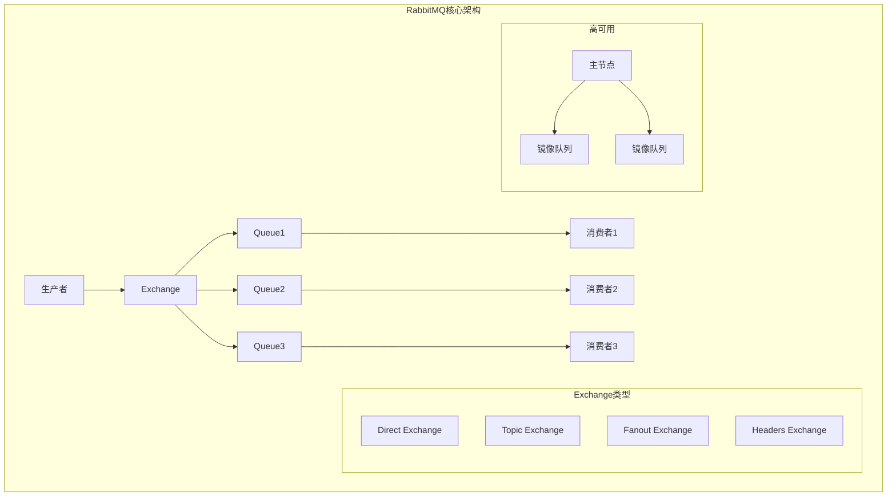
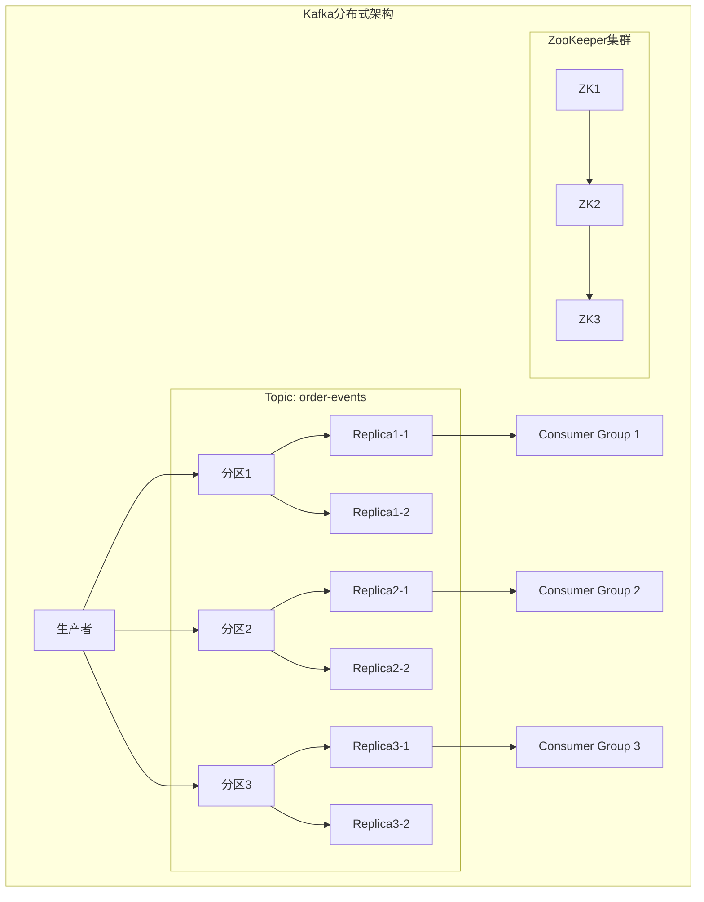
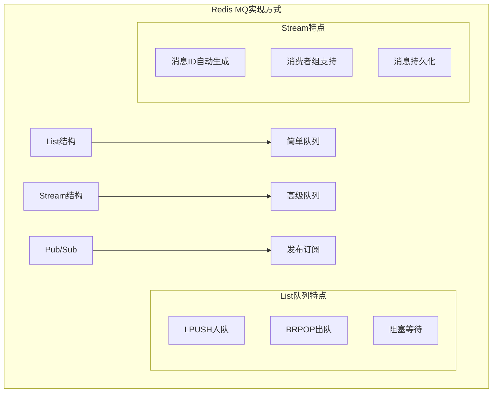
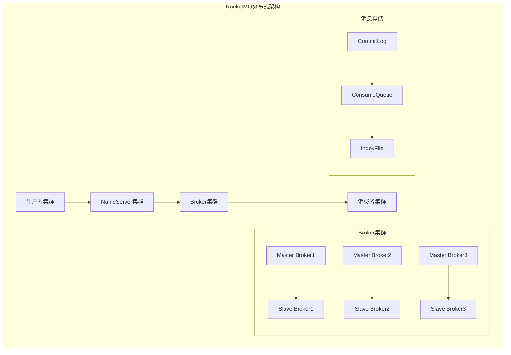
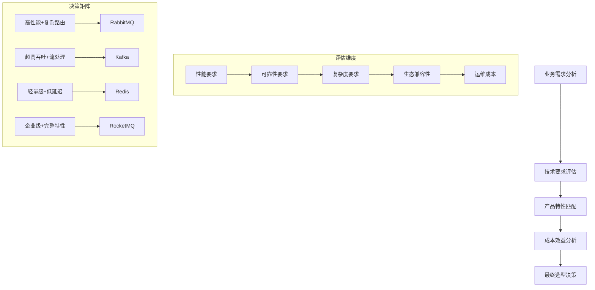

# 第七章 产品选型：选择最适合的MQ利器

> "工欲善其事，必先利其器" —— 选对工具，事半功倍！ ⚔️

## 本章学习目标 🎯

- 深入了解RabbitMQ、Kafka、Redis、RocketMQ四大主流MQ产品特性
- 掌握不同MQ产品的优势场景和局限性
- 学会根据业务需求进行技术选型决策
- 理解各产品在前面章节提到的特性上的差异表现
- 建立完整的MQ选型方法论和决策框架

---

## 7.1 RabbitMQ：功能丰富的全能选手

基于第二章的核心概念，RabbitMQ是最接近标准AMQP协议的实现，提供了丰富的消息路由功能。

### RabbitMQ架构特点



### 🎯 RabbitMQ核心优势

#### 1. 灵活的路由机制

```pseudocode
# Topic Exchange 复杂路由示例
class RabbitMQRouting {
    function setupTopicExchange() {
        exchange = createExchange("order_events", type: "topic")
        
        # 创建队列并绑定不同的路由键
        queues = [
            bindQueue("payment_queue", "order.payment.*"),
            bindQueue("shipping_queue", "order.shipping.*"),
            bindQueue("audit_queue", "order.*.audit"),
            bindQueue("all_orders_queue", "order.#")
        ]
        
        return {exchange: exchange, queues: queues}
    }
    
    function publishMessage(routingKey, message) {
        # 根据路由键智能分发消息
        exchange.publish(routingKey, message)
        
        # 例如：
        # "order.payment.completed" -> payment_queue, audit_queue, all_orders_queue
        # "order.shipping.started" -> shipping_queue, all_orders_queue
    }
}
```

#### 2. 完善的可靠性保证

| 可靠性特性 | RabbitMQ实现 | 对应章节概念 |
|------------|--------------|--------------|
| **生产者确认** | Publisher Confirms | 第三章-消息确认机制 |
| **消费者确认** | Consumer Acknowledgments | 第三章-消息确认机制 |
| **持久化** | Queue & Message Durability | 第三章-消息丢失防护 |
| **集群复制** | Mirrored Queues | 第五章-集群部署 |
| **死信队列** | Dead Letter Exchange | 第三章-死信队列 |

```pseudocode
# RabbitMQ可靠性配置
class RabbitMQReliability {
    function setupReliablePublisher() {
        connection = createConnection(host: "localhost", port: 5672)
        channel = connection.createChannel()
        
        # 启用发布者确认
        channel.confirmSelect()
        
        # 声明持久化队列
        channel.queueDeclare(
            queue: "reliable_queue",
            durable: true,      # 队列持久化
            exclusive: false,
            autoDelete: false
        )
        
        return channel
    }
    
    function publishReliableMessage(channel, message) {
        try {
            # 发送持久化消息
            channel.basicPublish(
                exchange: "",
                routingKey: "reliable_queue", 
                properties: {
                    deliveryMode: 2  # 消息持久化
                },
                body: message
            )
            
            # 等待确认
            if (channel.waitForConfirms(timeout: 5000)) {
                return {success: true, message: "消息发送成功"}
            } else {
                return {success: false, error: "消息确认超时"}
            }
        } catch (error) {
            return {success: false, error: error.message}
        }
    }
}
```

### ⚡ 性能特征分析

#### 性能基准测试

```pseudocode
class RabbitMQPerformance {
    function benchmarkTest() {
        results = {
            throughput: runThroughputTest(),
            latency: runLatencyTest(),
            resourceUsage: runResourceTest()
        }
        
        return results
    }
    
    function runThroughputTest() {
        # 基于第四章性能优化原理测试
        testConfigs = [
            {messageSize: 1024, concurrency: 1},
            {messageSize: 1024, concurrency: 10},
            {messageSize: 4096, concurrency: 10},
            {messageSize: 1024, concurrency: 50}
        ]
        
        results = []
        for (config in testConfigs) {
            throughput = measureThroughput(config)
            results.push({
                config: config,
                throughput: throughput + " msg/s"
            })
        }
        
        return results
    }
}
```

| 测试场景 | 消息大小 | 并发数 | 吞吐量 | 适用场景 |
|----------|----------|--------|--------|----------|
| **轻量级** | 1KB | 10 | ~15,000 msg/s | 通知类消息 |
| **标准** | 4KB | 10 | ~8,000 msg/s | 业务数据传输 |
| **高并发** | 1KB | 50 | ~25,000 msg/s | 高频交易 |

### 🎯 适用场景

#### 最佳适用场景

1. **企业级应用集成**
   - 复杂的消息路由需求
   - 严格的可靠性要求
   - 多种消费模式支持

2. **微服务间通信**
   - 服务解耦需求强
   - 需要灵活的订阅模式
   - 对延迟不敏感（100ms以内可接受）

#### 性能局限性

```pseudocode
class RabbitMQLimitations {
    function analyzeBottlenecks() {
        return {
            throughput: "单队列吞吐量受限于单节点性能",
            scalability: "水平扩展能力有限，主要依赖垂直扩展",
            persistence: "持久化开启后性能显著下降",
            memoryCost: "消息在内存中缓存，大量消息时内存占用高"
        }
    }
}
```

---

## 7.2 Kafka：高吞吐量的流处理之王

结合第四章性能优化和第六章进阶特性，Kafka在高吞吐量场景下表现出色。

### Kafka架构特点



### 🚄 超高吞吐量设计

#### 零拷贝技术

```pseudocode
class KafkaHighThroughput {
    function understandZeroCopy() {
        traditionalIO = {
            steps: [
                "磁盘文件 -> 内核缓冲区",
                "内核缓冲区 -> 用户空间",  
                "用户空间 -> Socket缓冲区",
                "Socket缓冲区 -> 网卡"
            ],
            copyCount: 4,
            contextSwitch: 4
        }
        
        kafkaZeroCopy = {
            steps: [
                "磁盘文件 -> 内核缓冲区",
                "内核缓冲区 -> 网卡"
            ],
            copyCount: 2,
            contextSwitch: 2,
            performance: "性能提升300-500%"
        }
        
        return {traditional: traditionalIO, kafka: kafkaZeroCopy}
    }
    
    function batchWriteOptimization() {
        # Kafka批量写入优化
        batchConfig = {
            batchSize: 16384,      # 16KB批次大小
            lingerMs: 5,           # 等待5ms收集更多消息
            compressionType: "gzip", # 压缩减少网络传输
            bufferMemory: 33554432   # 32MB发送缓冲区
        }
        
        performance = {
            singleWrite: "10,000 msg/s",
            batchWrite: "100,000+ msg/s",
            improvement: "10x提升"
        }
        
        return {config: batchConfig, performance: performance}
    }
}
```

#### 分区并行处理

```pseudocode
class KafkaPartitioning {
    function designPartitionStrategy(topicConfig) {
        # 分区数量设计原则
        partitionCount = max(
            expectedThroughput / singlePartitionThroughput,
            consumerCount,
            brokerCount * 2  # 每个Broker至少2个分区
        )
        
        partitionStrategy = {
            count: partitionCount,
            keyStrategy: determinePartitionKey(topicConfig),
            replicationFactor: 3,  # 3副本保证可靠性
            placement: distributeAcrossBrokers(partitionCount)
        }
        
        return partitionStrategy
    }
    
    function calculatePerformance(partitionStrategy) {
        # 基于第四章批量处理原理
        singlePartitionThroughput = 50000  # 单分区5万消息/秒
        totalThroughput = partitionStrategy.count * singlePartitionThroughput
        
        return {
            expectedThroughput: totalThroughput + " msg/s",
            maxLatency: "10-50ms",
            storageCapacity: "理论无限（受磁盘限制）"
        }
    }
}
```

### 📊 Kafka性能基准

| 场景 | 分区数 | 副本数 | 吞吐量 | 延迟 | 存储 |
|------|--------|--------|--------|------|------|
| **高吞吐** | 12 | 3 | 600K msg/s | 50ms | 磁盘 |
| **低延迟** | 6 | 1 | 200K msg/s | 5ms | 内存+磁盘 |
| **平衡型** | 9 | 2 | 400K msg/s | 20ms | 磁盘 |

### 🎯 流处理生态

#### Kafka Streams集成

```pseudocode
class KafkaStreamsProcessing {
    function buildStreamProcessor() {
        # 构建流处理拓扑
        builder = new StreamsBuilder()
        
        # 输入流
        orders = builder.stream("orders")
        
        # 流处理操作
        processedOrders = orders
            .filter(order => order.amount > 100)
            .map(order => enrichOrderData(order))
            .groupByKey()
            .aggregate(
                initializer: () => new OrderStats(),
                aggregator: (key, order, stats) => stats.update(order),
                materialized: Materialized.with(Serdes.String(), orderStatsSerdes)
            )
        
        # 输出到结果主题
        processedOrders.toStream().to("order-stats")
        
        return builder.build()
    }
    
    function deployStreamApp(topology) {
        config = {
            applicationId: "order-processing-app",
            bootstrapServers: "kafka1:9092,kafka2:9092,kafka3:9092",
            defaultKeySerde: Serdes.String(),
            defaultValueSerde: Serdes.String()
        }
        
        streams = new KafkaStreams(topology, config)
        streams.start()
        
        return streams
    }
}
```

### 🎯 适用场景分析

#### 最佳场景

1. **大数据流处理**
   - 日志收集与分析
   - 实时数据管道
   - 事件溯源系统

2. **高并发写入**
   - 用户行为跟踪
   - IoT设备数据收集
   - 金融交易记录

#### 使用限制

```pseudocode
class KafkaLimitations {
    function identifyConstraints() {
        return {
            complexity: "运维复杂度高，需要ZooKeeper集群",
            orderGuarantee: "只保证分区内顺序，全局顺序需要单分区",
            lowLatency: "不适合要求极低延迟的场景（<1ms）",
            smallMessage: "小消息场景下性能优势不明显",
            dynamicTopology: "主题和分区数量变更复杂"
        }
    }
}
```

---

## 7.3 Redis：轻量级的快速方案

基于第一章的简单队列实现，Redis提供了最轻量级的MQ解决方案。

### Redis消息队列实现



### 🚀 Redis队列实现

#### List-based简单队列

```pseudocode
class RedisListQueue {
    function __init__(redisClient, queueName) {
        this.redis = redisClient
        this.queueName = queueName
    }
    
    function publish(message) {
        # 从左边推入消息
        result = this.redis.lpush(this.queueName, JSON.stringify(message))
        return {success: true, queueLength: result}
    }
    
    function consume(timeout = 0) {
        # 从右边阻塞弹出消息
        result = this.redis.brpop(this.queueName, timeout)
        
        if (result) {
            return {
                success: true,
                message: JSON.parse(result[1]),
                queueName: result[0]
            }
        } else {
            return {success: false, reason: "timeout"}
        }
    }
    
    function getQueueLength() {
        return this.redis.llen(this.queueName)
    }
}
```

#### Stream-based高级队列

```pseudocode
class RedisStreamQueue {
    function __init__(redisClient, streamName) {
        this.redis = redisClient  
        this.streamName = streamName
        this.consumerGroup = streamName + "_group"
        this.consumerName = generateConsumerName()
    }
    
    function setupConsumerGroup() {
        try {
            # 创建消费者组
            this.redis.xgroup("CREATE", this.streamName, this.consumerGroup, "$", "MKSTREAM")
        } catch (error) {
            # 消费者组已存在
            if (!error.message.includes("BUSYGROUP")) {
                throw error
            }
        }
    }
    
    function publish(message) {
        # 添加消息到Stream
        messageId = this.redis.xadd(
            this.streamName,
            "*",  # 自动生成ID
            "data", JSON.stringify(message),
            "timestamp", getCurrentTime()
        )
        
        return {success: true, messageId: messageId}
    }
    
    function consumeWithGroup(count = 1, blockTime = 1000) {
        # 从消费者组读取消息
        results = this.redis.xreadgroup(
            "GROUP", this.consumerGroup, this.consumerName,
            "COUNT", count,
            "BLOCK", blockTime,
            "STREAMS", this.streamName, ">"
        )
        
        if (results && results.length > 0) {
            messages = results[0][1]  # 获取消息列表
            return {
                success: true,
                messages: messages.map(msg => ({
                    id: msg[0],
                    fields: parseMessageFields(msg[1])
                }))
            }
        }
        
        return {success: false, reason: "no_messages"}
    }
    
    function acknowledgeMessage(messageId) {
        # 确认消息处理完成
        return this.redis.xack(this.consumerGroup, this.streamName, messageId)
    }
}
```

### ⚡ Redis性能优势

#### 内存操作性能

```pseudocode
class RedisPerformanceAnalysis {
    function benchmarkRedisQueue() {
        testResults = {
            throughput: measureThroughput(),
            latency: measureLatency(),
            memoryUsage: measureMemoryUsage()
        }
        
        return testResults
    }
    
    function measureThroughput() {
        return {
            listQueue: {
                publish: "100,000+ ops/s",
                consume: "80,000+ ops/s",
                scenario: "单机Redis，1KB消息"
            },
            streamQueue: {
                publish: "60,000+ ops/s", 
                consume: "50,000+ ops/s",
                scenario: "带消费者组确认"
            }
        }
    }
    
    function measureLatency() {
        return {
            listQueue: {
                p50: "0.1ms",
                p95: "0.5ms",
                p99: "2ms"
            },
            streamQueue: {
                p50: "0.2ms",
                p95: "1ms", 
                p99: "5ms"
            }
        }
    }
}
```

### 🎯 Redis MQ特点总结

| 特性 | List队列 | Stream队列 | 适用场景 |
|------|----------|------------|----------|
| **实现复杂度** | 极简 ⭐ | 简单 ⭐⭐ | 快速原型、小型项目 |
| **功能丰富度** | 基础 ⭐⭐ | 丰富 ⭐⭐⭐⭐ | 中等复杂度需求 |
| **性能** | 极高 ⭐⭐⭐⭐⭐ | 高 ⭐⭐⭐⭐ | 低延迟要求 |
| **可靠性** | 低 ⭐⭐ | 中 ⭐⭐⭐ | 可容忍少量消息丢失 |

### 🎯 适用场景

#### 最佳使用场景

1. **轻量级任务队列**
   - 后台任务处理
   - 缓存更新通知
   - 简单的异步处理

2. **低延迟要求**
   - 实时通知系统
   - 游戏内消息传递
   - 简单的状态同步

#### 局限性分析

```pseudocode
class RedisLimitations {
    function analyzeConstraints() {
        return {
            persistence: "数据存储在内存中，重启后数据丢失风险",
            scalability: "单机性能限制，集群模式复杂",
            reliability: "缺乏事务性保证和复杂的确认机制",
            complexity: "不支持复杂路由和高级消息特性",
            capacity: "受内存容量限制，不适合大量消息存储"
        }
    }
}
```

---

## 7.4 RocketMQ：阿里巴巴的企业级选择

融合前面章节的各种特性，RocketMQ提供了企业级的完整解决方案。

### RocketMQ架构设计



### 🏢 企业级特性

#### 事务消息支持

```pseudocode
class RocketMQTransactionalMessage {
    function sendTransactionMessage(message, localTransaction) {
        # 1. 发送Half消息
        halfMessageResult = producer.sendMessageInTransaction(
            message: message,
            localTransactionExecutor: localTransaction
        )
        
        if (halfMessageResult.success) {  
            try {
                # 2. 执行本地事务
                transactionResult = localTransaction.execute()
                
                if (transactionResult.success) {
                    # 3. 提交事务消息
                    producer.commitTransaction(halfMessageResult.transactionId)
                    return {success: true, type: "committed"}
                } else {
                    # 3. 回滚事务消息
                    producer.rollbackTransaction(halfMessageResult.transactionId)
                    return {success: false, type: "rollback"}
                }
            } catch (error) {
                # 异常情况，等待事务状态回查
                return {success: false, type: "unknown", error: error}
            }
        }
        
        return {success: false, type: "send_failed"}
    }
    
    function handleTransactionCheck(transactionId) {
        # 事务状态回查机制
        localTransactionStatus = checkLocalTransactionStatus(transactionId)
        
        switch (localTransactionStatus) {
            case "COMMITTED":
                return TransactionStatus.CommitTransaction
            case "ROLLBACK":
                return TransactionStatus.RollbackTransaction
            default:
                return TransactionStatus.Unknown
        }
    }
}
```

#### 延时消息实现

```pseudocode
class RocketMQDelayedMessage {
    function sendDelayedMessage(message, delayLevel) {
        # RocketMQ支持18种延时级别
        delayLevels = {
            1: "1s", 2: "5s", 3: "10s", 4: "30s",
            5: "1m", 6: "2m", 7: "3m", 8: "4m", 9: "5m", 10: "6m",
            11: "7m", 12: "8m", 13: "9m", 14: "10m", 15: "20m",
            16: "30m", 17: "1h", 18: "2h"
        }
        
        message.setDelayTimeLevel(delayLevel)
        
        result = producer.send(message)
        
        return {
            success: result.success,
            messageId: result.messageId,
            delayTime: delayLevels[delayLevel],
            deliveryTime: getCurrentTime() + parseDelayTime(delayLevels[delayLevel])
        }
    }
}
```

### 📊 RocketMQ性能特征

#### 性能基准测试

```pseudocode
class RocketMQPerformance {
    function comprehensiveTest() {
        return {
            throughput: testThroughput(),
            reliability: testReliability(),
            scalability: testScalability(),
            latency: testLatency()
        }
    }
    
    function testThroughput() {
        scenarios = [
            {type: "sync_send", expected: "10,000 TPS"},
            {type: "async_send", expected: "100,000 TPS"},
            {type: "oneway_send", expected: "1,000,000 TPS"},
            {type: "batch_send", expected: "500,000 TPS"}
        ]
        
        return scenarios
    }
}
```

| 发送模式 | 吞吐量 | 延迟 | 可靠性 | 适用场景 |
|----------|--------|------|--------|----------|
| **同步发送** | 1万 TPS | 1-5ms | 最高 ⭐⭐⭐⭐⭐ | 重要业务消息 |
| **异步发送** | 10万 TPS | 1-2ms | 高 ⭐⭐⭐⭐ | 高并发场景 |
| **单向发送** | 100万 TPS | <1ms | 低 ⭐⭐ | 日志收集 |
| **批量发送** | 50万 TPS | 2-10ms | 高 ⭐⭐⭐⭐ | 批量数据处理 |

### 🎯 RocketMQ优势分析

#### 完整的企业特性支持

```pseudocode
class RocketMQEnterpriseFeatures {
    function listEnterpriseFeatures() {
        return {
            messageOrder: {
                description: "支持全局和分区有序消息",
                implementation: "基于MessageQueue实现",
                referenceChapter: "第六章-消息顺序"
            },
            
            messageFilter: {
                description: "支持Tag和SQL92表达式过滤",
                implementation: "Broker端过滤，减少网络传输",
                referenceChapter: "第六章-消息过滤"
            },
            
            backpressure: {
                description: "内置流控机制", 
                implementation: "基于消费者负载自动调节",
                referenceChapter: "第六章-限流与背压"
            },
            
            monitoring: {
                description: "完善的监控和运维工具",
                implementation: "Console + Metrics + Alerts",
                referenceChapter: "第五章-监控告警"
            }
        }
    }
}
```

### 🎯 适用场景

#### 最佳适用场景

1. **大型企业应用**
   - 复杂的业务流程
   - 严格的可靠性要求
   - 完整的运维需求

2. **金融级应用**
   - 事务消息需求
   - 严格的顺序保证
   - 完善的监控审计

#### 考虑因素

```pseudocode
class RocketMQConsiderations {
    function evaluateAdoption() {
        return {
            advantages: [
                "功能完整，开箱即用",
                "性能优秀，可线性扩展", 
                "运维工具完善",
                "社区活跃，文档丰富"
            ],
            
            challenges: [
                "学习曲线较陡峭",
                "部署复杂度中等",
                "资源消耗相对较高",
                "主要适用于Java生态"
            ]
        }
    }
}
```

---

## 7.5 如何根据业务场景选择MQ？

综合前面章节的知识，建立完整的选型方法论。

### 选型决策框架



### 🎯 选型决策矩阵

#### 需求-产品匹配矩阵

| 业务需求 | RabbitMQ | Kafka | Redis | RocketMQ | 推荐指数 |
|----------|----------|-------|-------|----------|----------|
| **简单队列** | ⭐⭐⭐ | ⭐⭐ | ⭐⭐⭐⭐⭐ | ⭐⭐⭐ | Redis ⭐⭐⭐⭐⭐ |
| **复杂路由** | ⭐⭐⭐⭐⭐ | ⭐⭐ | ⭐ | ⭐⭐⭐⭐ | RabbitMQ ⭐⭐⭐⭐⭐ |
| **高吞吐量** | ⭐⭐⭐ | ⭐⭐⭐⭐⭐ | ⭐⭐⭐⭐ | ⭐⭐⭐⭐ | Kafka ⭐⭐⭐⭐⭐ |
| **低延迟** | ⭐⭐⭐ | ⭐⭐ | ⭐⭐⭐⭐⭐ | ⭐⭐⭐ | Redis ⭐⭐⭐⭐⭐ |
| **事务消息** | ⭐⭐ | ⭐ | ⭐ | ⭐⭐⭐⭐⭐ | RocketMQ ⭐⭐⭐⭐⭐ |
| **流处理** | ⭐ | ⭐⭐⭐⭐⭐ | ⭐⭐ | ⭐⭐⭐ | Kafka ⭐⭐⭐⭐⭐ |
| **企业级** | ⭐⭐⭐⭐ | ⭐⭐⭐ | ⭐⭐ | ⭐⭐⭐⭐⭐ | RocketMQ ⭐⭐⭐⭐⭐ |

### 🔍 选型决策流程

#### 智能选型工具

```pseudocode
class MQSelector {
    function selectMQ(requirements) {
        # 1. 需求权重评分
        weights = {
            throughput: requirements.throughputWeight || 0.3,
            latency: requirements.latencyWeight || 0.2,
            reliability: requirements.reliabilityWeight || 0.25,
            complexity: requirements.complexityWeight || 0.15,
            cost: requirements.costWeight || 0.1
        }
        
        # 2. 各产品评分
        products = {
            rabbitmq: scoreRabbitMQ(requirements),
            kafka: scoreKafka(requirements),
            redis: scoreRedis(requirements),
            rocketmq: scoreRocketMQ(requirements)
        }
        
        # 3. 加权计算总分
        scores = {}
        for (product in products) {
            scores[product] = calculateWeightedScore(products[product], weights)
        }
        
        # 4. 排序推荐
        recommendations = sortByScore(scores)
        
        return {
            recommendations: recommendations,
            analysis: generateAnalysis(requirements, products),
            alternatives: suggestAlternatives(requirements)
        }
    }
    
    function scoreRabbitMQ(requirements) {
        return {
            throughput: requirements.expectedQPS < 50000 ? 0.8 : 0.6,
            latency: requirements.maxLatency > 10 ? 0.8 : 0.6,
            reliability: 0.9,  # 可靠性很好
            complexity: requirements.routingComplexity == "high" ? 0.9 : 0.7,
            cost: 0.7  # 中等成本
        }
    }
    
    function scoreKafka(requirements) {
        return {
            throughput: requirements.expectedQPS > 100000 ? 0.9 : 0.7,
            latency: requirements.maxLatency > 50 ? 0.8 : 0.5,
            reliability: 0.8,
            complexity: requirements.streamProcessing ? 0.9 : 0.6,
            cost: 0.6  # 资源消耗较高
        }
    }
    
    function scoreRedis(requirements) {
        return {
            throughput: requirements.expectedQPS < 100000 ? 0.9 : 0.7,
            latency: requirements.maxLatency < 5 ? 0.9 : 0.8,
            reliability: requirements.reliabilityLevel == "high" ? 0.4 : 0.7,
            complexity: requirements.featureComplexity == "simple" ? 0.9 : 0.4,
            cost: 0.9  # 成本最低
        }
    }
    
    function scoreRocketMQ(requirements) {
        return {
            throughput: 0.8,  # 各方面均衡
            latency: 0.7,
            reliability: 0.9,
            complexity: 0.8,
            cost: 0.6
        }
    }
}
```

### 📋 典型场景选型指南

#### 场景1: 电商订单系统

```pseudocode
class ECommerceOrderSystem {
    function analyzeRequirements() {
        requirements = {
            expectedQPS: 50000,
            maxLatency: 100,  # ms
            reliabilityLevel: "high",
            features: ["order_routing", "payment_confirmation", "inventory_update"],
            transactionSupport: true,
            scalability: "horizontal"
        }
        
        recommendation = {
            primary: "RocketMQ",
            reasons: [
                "支持事务消息，保证订单一致性",
                "完善的消息路由和过滤能力",
                "企业级可靠性保证",
                "优秀的监控和运维工具"
            ],
            alternatives: [
                {product: "RabbitMQ", condition: "如果不需要事务消息"},
                {product: "Kafka", condition: "如果主要用于数据流处理"}
            ]
        }
        
        return recommendation
    }
}
```

#### 场景2: 实时数据分析平台

```pseudocode
class RealTimeAnalyticsPlatform {
    function analyzeRequirements() {
        requirements = {
            expectedQPS: 1000000,
            maxLatency: 50,
            dataRetention: "7days",
            streamProcessing: true,
            features: ["data_ingestion", "real_time_processing", "historical_replay"]
        }
        
        recommendation = {
            primary: "Kafka",
            reasons: [
                "超高吞吐量支持百万级QPS",
                "完善的流处理生态系统",
                "数据可回放，支持历史数据分析",
                "优秀的数据分区和并行处理能力"
            ],
            architecture: designKafkaArchitecture(requirements)
        }
        
        return recommendation
    }
    
    function designKafkaArchitecture(requirements) {
        return {
            topics: [
                {name: "raw_events", partitions: 12, replication: 3},
                {name: "processed_events", partitions: 6, replication: 2}
            ],
            consumers: {
                realTimeProcessor: {instances: 12, groupId: "realtime_group"},
                batchProcessor: {instances: 3, groupId: "batch_group"}
            },
            retention: "168h"  # 7天
        }
    }
}
```

#### 场景3: 游戏消息推送

```pseudoda
class GameMessagePush {
    function analyzeRequirements() {
        requirements = {
            expectedQPS: 200000,
            maxLatency: 1,  # 极低延迟要求
            reliability: "medium",  # 可容忍少量消息丢失
            features: ["instant_notification", "player_matching", "game_events"],
            deployment: "simple"
        }
        
        recommendation = {
            primary: "Redis",
            reasons: [
                "极低延迟，满足实时游戏需求",
                "部署简单，运维成本低",
                "高性能内存操作",
                "支持多种数据结构"
            ],
            implementation: designRedisImplementation(requirements)
        }
        
        return recommendation
    }
    
    function designRedisImplementation(requirements) {
        return {
            structure: "Redis Stream",
            consumerGroups: ["notification_group", "matching_group", "events_group"],
            persistence: "RDB + AOF",
            clustering: "Redis Cluster (6 nodes)",
            monitoring: "Redis监控 + 自定义指标"
        }
    }
}
```

### 🎯 选型最佳实践

#### 选型checklist

```pseudocode
class SelectionChecklist {
    function generateChecklist() {
        return {
            business: [
                "✓ 明确业务场景和消息流量特征",
                "✓ 评估可靠性和一致性要求",
                "✓ 确定性能指标和SLA要求",
                "✓ 考虑未来业务增长和扩展需求"
            ],
            
            technical: [
                "✓ 评估团队技术栈和学习成本",
                "✓ 考虑系统集成和兼容性",
                "✓ 分析运维复杂度和人力成本",
                "✓ 制定迁移和回滚方案"
            ],
            
            operational: [
                "✓ 评估总体拥有成本(TCO)",
                "✓ 考虑监控和故障处理能力",
                "✓ 制定容量规划和扩容策略",
                "✓ 建立完善的测试和验证流程"
            ]
        }
    }
}
```

---

## 本章总结 📚

### 🎯 核心要点回顾

1. **RabbitMQ**：功能丰富的全能选手，适合企业级应用集成
2. **Kafka**：高吞吐量的流处理之王，适合大数据和实时分析
3. **Redis**：轻量级快速方案，适合低延迟和简单队列需求  
4. **RocketMQ**：企业级完整解决方案，适合复杂业务场景
5. **选型方法论**：基于需求权重的智能化选型决策框架

### 📊 产品对比总结

| 维度 | RabbitMQ | Kafka | Redis | RocketMQ |
|------|----------|-------|-------|----------|
| **学习曲线** | 中等 ⭐⭐⭐ | 陡峭 ⭐⭐ | 简单 ⭐⭐⭐⭐⭐ | 中等 ⭐⭐⭐ |
| **性能** | 中高 ⭐⭐⭐ | 极高 ⭐⭐⭐⭐⭐ | 极高 ⭐⭐⭐⭐⭐ | 高 ⭐⭐⭐⭐ |
| **可靠性** | 高 ⭐⭐⭐⭐ | 高 ⭐⭐⭐⭐ | 中 ⭐⭐⭐ | 高 ⭐⭐⭐⭐ |
| **功能丰富度** | 丰富 ⭐⭐⭐⭐ | 中等 ⭐⭐⭐ | 简单 ⭐⭐ | 丰富 ⭐⭐⭐⭐⭐ |
| **运维复杂度** | 中等 ⭐⭐⭐ | 高 ⭐⭐ | 低 ⭐⭐⭐⭐⭐ | 中等 ⭐⭐⭐ |

### 💡 选型建议

1. **快速原型/小项目**：首选Redis，简单高效
2. **企业级应用**：RabbitMQ或RocketMQ，功能完整
3. **大数据/流处理**：Kafka是不二选择
4. **混合场景**：考虑多MQ组合使用

### 🚀 下章预告

第八章《实战应用：典型场景深度剖析》将基于选型结果，深入分析订单系统、秒杀系统、日志收集等典型场景的具体实现方案。

---

*选对工具是成功的一半！掌握了选型方法论，你就能在任何场景下做出最优的技术决策。* ⚔️