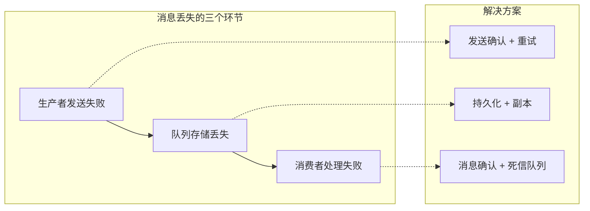
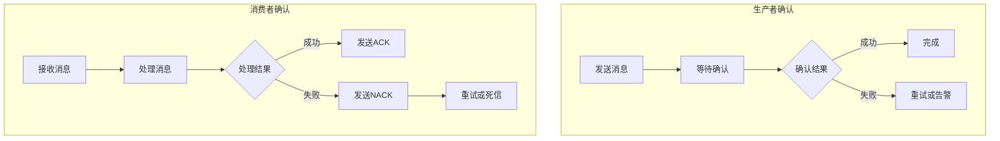
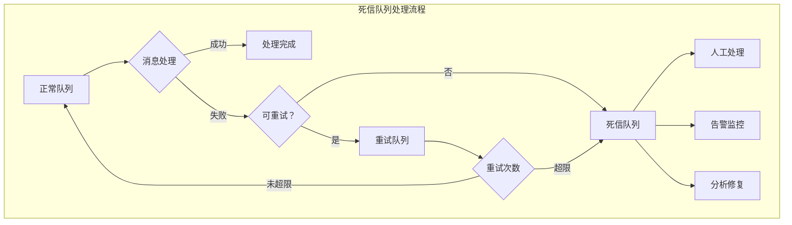
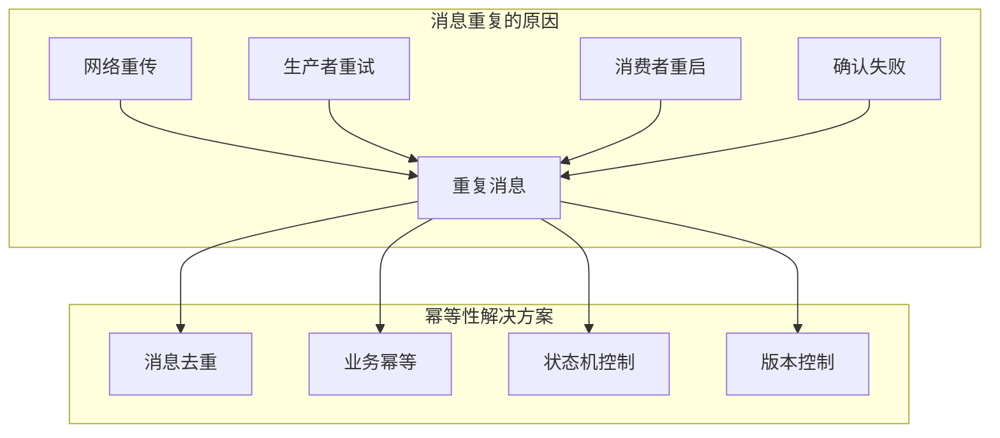
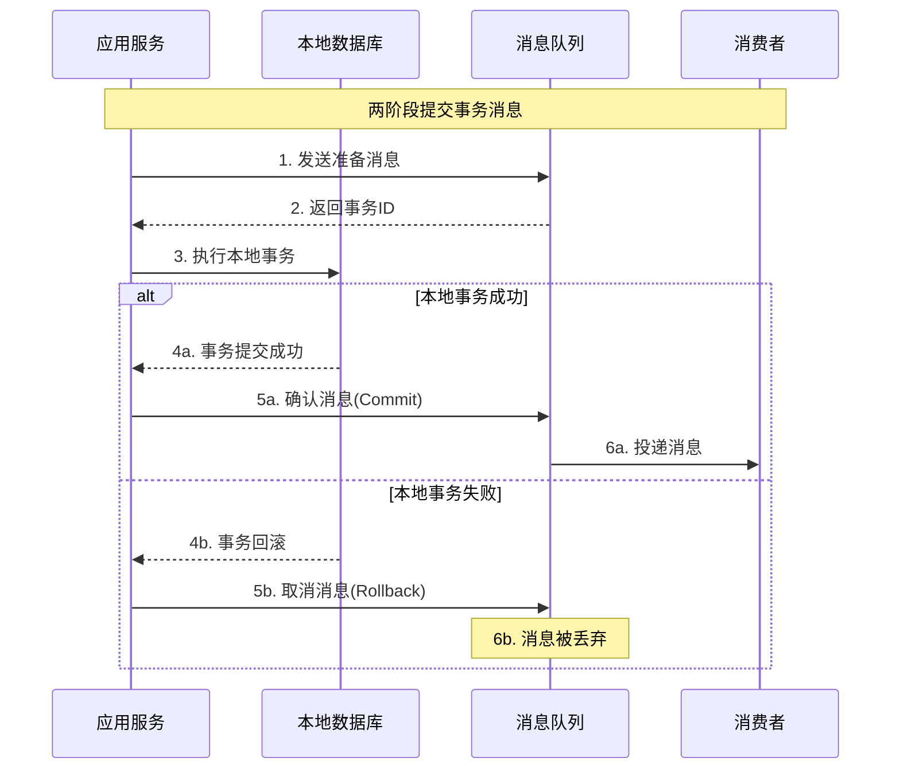

# 第三章 可靠性保障：确保消息万无一失

> "君子不立危墙之下" —— 可靠性是生产系统的生命线！ 🛡️

## 本章学习目标 🎯

- 深入分析消息丢失的三种情况并掌握对应解决方案
- 理解并实现完善的消息确认机制
- 掌握死信队列的设计与最佳实践
- 学会设计幂等性系统避免重复处理陷阱
- 了解事务消息保证强一致性的原理与实现
- 为构建生产级可靠MQ系统打下坚实基础

---

## 3.1 消息丢失的三种情况及解决方案

在第二章中，我们了解了消息的完整生命周期。现在让我们深入分析每个环节可能出现的消息丢失问题。

### 消息丢失全景分析



### 🚫 情况一：生产者发送失败

#### 失败原因分析

| 失败类型 | 具体原因 | 发生概率 | 影响程度 |
|----------|----------|----------|----------|
| **网络故障** | 网络中断、超时、丢包 | 高 ⭐⭐⭐⭐ | 中等 |
| **服务器故障** | MQ服务器宕机、重启 | 中 ⭐⭐⭐ | 高 |
| **配置错误** | 队列不存在、权限不足 | 低 ⭐⭐ | 高 |
| **资源不足** | 队列已满、内存不足 | 中 ⭐⭐⭐ | 中等 |

#### 解决方案：发送确认机制

```java
public class ReliableProducer {
    private Connection connection;
    private boolean confirmEnabled;
    private RetryPolicy retryPolicy;
    private ConcurrentHashMap<String, ConfirmInfo> pendingConfirms;
    
    public void sendReliably(Message message) {
        if (confirmEnabled) {
            connection.enableConfirm();
        }
        
        String confirmId = UUID.randomUUID().toString();
        ConfirmInfo confirmInfo = new ConfirmInfo(message, 0, retryPolicy.getMaxRetries());
        pendingConfirms.put(confirmId, confirmInfo);
        
        attemptSend(confirmId);
    }
    
    private void attemptSend(String confirmId) {
        ConfirmInfo confirmInfo = pendingConfirms.get(confirmId);
        if (confirmInfo == null) return;
        
        try {
            connection.send(confirmInfo.getMessage());
            if (confirmEnabled) {
                scheduleConfirmTimeout(confirmId);
            } else {
                pendingConfirms.remove(confirmId);
            }
        } catch (Exception e) {
            handleSendFailure(confirmId, e);
        }
    }
    
    private void handleSendFailure(String confirmId, Exception e) {
        ConfirmInfo confirmInfo = pendingConfirms.get(confirmId);
        confirmInfo.incrementRetryCount();
        
        if (confirmInfo.canRetry()) {
            int delay = calculateRetryDelay(confirmInfo.getRetryCount());
            // 延迟重试
            scheduler.schedule(() -> attemptSend(confirmId), delay, TimeUnit.MILLISECONDS);
        } else {
            pendingConfirms.remove(confirmId);
            handleFinalFailure(confirmInfo.getMessage(), e);
        }
    }
    
    private int calculateRetryDelay(int retryCount) {
        return Math.min(1000 * (1 << (retryCount - 1)), 30000);
    }
}
```

#### 本地消息表模式

对于极其重要的消息，可以使用本地消息表确保最终一致性：

```java
public class LocalMessageTable {
    private DataSource dataSource;
    private MessageScheduler scheduler;
    
    @Transactional
    public void sendWithLocalTable(BusinessData businessData, Message message) {
        // 1. 执行业务操作
        executeBusiness(businessData);
        
        // 2. 插入本地消息记录
        MessageRecord record = new MessageRecord();
        record.setId(UUID.randomUUID().toString());
        record.setDestination(message.getQueue());
        record.setPayload(serialize(message.getData()));
        record.setStatus("PENDING");
        record.setNextRetryAt(System.currentTimeMillis() + 1000);
        
        messageRepository.save(record);
        
        // 3. 异步发送消息
        scheduler.schedule(record.getId());
    }
    
    @Scheduled(fixedDelay = 60000)
    public void retryFailedMessages() {
        List<MessageRecord> failedMessages = messageRepository.findPendingMessages(
            System.currentTimeMillis()
        );
        
        failedMessages.forEach(this::attemptResend);
    }
    
    private void attemptResend(MessageRecord record) {
        try {
            Message message = deserialize(record.getPayload());
            if (messageQueue.send(message)) {
                record.setStatus("SENT");
                record.setSentAt(System.currentTimeMillis());
                messageRepository.save(record);
            } else {
                updateRetryInfo(record);
            }
        } catch (Exception e) {
            updateRetryInfo(record);
        }
    }
    
    private void updateRetryInfo(MessageRecord record) {
        int newRetryCount = record.getRetryCount() + 1;
        
        if (newRetryCount >= 5) {
            record.setStatus("FAILED");
            record.setFailedAt(System.currentTimeMillis());
            alertService.sendAlert("消息重发失败", record);
        } else {
            record.setRetryCount(newRetryCount);
            record.setNextRetryAt(System.currentTimeMillis() + (1000 << newRetryCount));
        }
        messageRepository.save(record);
    }
}
```

### 🗃️ 情况二：队列存储丢失

#### 失败原因分析

| 失败类型 | 具体原因 | 数据丢失风险 | 恢复难度 |
|----------|----------|--------------|----------|
| **内存丢失** | 服务器重启、崩溃 | 高 ⭐⭐⭐⭐⭐ | 困难 |
| **磁盘故障** | 硬盘损坏、文件系统错误 | 极高 ⭐⭐⭐⭐⭐ | 极困难 |
| **网络分区** | 集群节点网络中断 | 中等 ⭐⭐⭐ | 中等 |
| **配置错误** | 持久化未启用 | 高 ⭐⭐⭐⭐ | 困难 |

#### 解决方案：多级持久化策略

```java
public class PersistentMessageQueue {
    private ConcurrentLinkedQueue<Message> memoryQueue;
    private DiskStorage diskStorage;
    private ReplicationManager replicationManager;
    private WriteAheadLog writeAheadLog;
    private DurabilityLevel durabilityLevel;
    
    public void enqueue(Message message) {
        message.setId(UUID.randomUUID().toString());
        message.setEnqueueTime(System.currentTimeMillis());
        
        // 写入WAL
        WALEntry walEntry = new WALEntry("ENQUEUE", message.getId(), message);
        writeAheadLog.append(walEntry);
        
        switch (durabilityLevel) {
            case DISK_SYNC:
                enqueueDiskSync(message);
                break;
            case REPLICATED:
                enqueueReplicated(message);
                break;
            default:
                memoryQueue.offer(message);
        }
    }
    
    private void enqueueDiskSync(Message message) {
        try {
            memoryQueue.offer(message);
            diskStorage.write(message.getId(), message);
            diskStorage.sync(); // 强制刷盘
        } catch (Exception e) {
            memoryQueue.remove(message);
            throw new StorageException("消息持久化失败", e);
        }
    }
    
    private void enqueueReplicated(Message message) {
        try {
            memoryQueue.offer(message);
            diskStorage.write(message.getId(), message);
            
            ReplicationResult result = replicationManager.replicate(message);
            if (result.getSuccessCount() < config.getMinReplicas()) {
                // 回滚操作
                memoryQueue.remove(message);
                diskStorage.delete(message.getId());
                throw new ReplicationException("副本数不足");
            }
        } catch (Exception e) {
            rollbackReplication(message.getId());
            throw e;
        }
    }
    
    public Message dequeue() {
        Message message = memoryQueue.poll();
        if (message != null) {
            WALEntry walEntry = new WALEntry("DEQUEUE", message.getId(), null);
            writeAheadLog.append(walEntry);
            
            // 异步删除磁盘数据
            CompletableFuture.runAsync(() -> diskStorage.delete(message.getId()));
        }
        return message;
    }
    
    public void recoverFromWAL() {
        List<WALEntry> walEntries = writeAheadLog.readAll();
        Set<String> processedMessages = new HashSet<>();
        
        for (WALEntry entry : walEntries) {
            if ("ENQUEUE".equals(entry.getOperation())) {
                if (!processedMessages.contains(entry.getMessageId())) {
                    Message message = diskStorage.read(entry.getMessageId());
                    if (message != null) {
                        memoryQueue.offer(message);
                        processedMessages.add(entry.getMessageId());
                    }
                }
            } else if ("DEQUEUE".equals(entry.getOperation())) {
                memoryQueue.removeIf(m -> m.getId().equals(entry.getMessageId()));
                processedMessages.add(entry.getMessageId());
            }
        }
    }
}
```

#### 分布式副本管理

```java
public class ReplicationManager {
    private List<Replica> replicas;
    private ConcurrentHashMap<String, ReplicationInfo> pendingReplications;
    private ExecutorService executor;
    
    public ReplicationResult replicate(Message message) {
        String replicationId = UUID.randomUUID().toString();
        ReplicationInfo info = new ReplicationInfo(message.getId(), message, replicas.size());
        pendingReplications.put(replicationId, info);
        
        // 并行复制到所有副本节点
        for (Replica replica : replicas) {
            replicateToNode(replicationId, replica, message);
        }
        
        return new ReplicationResult(replicationId, info);
    }
    
    private void replicateToNode(String replicationId, Replica replica, Message message) {
        executor.submit(() -> {
            try {
                boolean success = replica.store(message);
                if (success) {
                    onReplicationSuccess(replicationId, replica.getId());
                } else {
                    onReplicationFailure(replicationId, replica.getId(), "存储失败");
                }
            } catch (Exception e) {
                onReplicationFailure(replicationId, replica.getId(), e.getMessage());
            }
        });
    }
    
    private synchronized void onReplicationSuccess(String replicationId, String replicaId) {
        ReplicationInfo info = pendingReplications.get(replicationId);
        if (info != null && !info.isCompleted()) {
            info.incrementSuccessCount();
            
            if (info.getSuccessCount() >= getRequiredReplicas()) {
                info.setCompleted(true);
                notifyReplicationComplete(replicationId, true);
            }
        }
    }
    
    private synchronized void onReplicationFailure(String replicationId, String replicaId, String error) {
        ReplicationInfo info = pendingReplications.get(replicationId);
        if (info != null && !info.isCompleted()) {
            info.incrementFailureCount();
            
            int totalTried = info.getSuccessCount() + info.getFailureCount();
            if (totalTried >= replicas.size() && info.getSuccessCount() < getRequiredReplicas()) {
                info.setCompleted(true);
                notifyReplicationComplete(replicationId, false);
            }
        }
    }
    
    private int getRequiredReplicas() {
        return replicas.size() / 2 + 1;
    }
}
```

### 🤖 情况三：消费者处理失败

#### 失败原因分析

| 失败类型 | 具体原因 | 业务影响 | 处理策略 |
|----------|----------|----------|----------|
| **业务异常** | 数据验证失败、业务规则冲突 | 中等 ⭐⭐⭐ | 重试 + 人工处理 |
| **依赖服务故障** | 下游服务不可用 | 高 ⭐⭐⭐⭐ | 重试 + 降级 |
| **资源不足** | 内存溢出、CPU过高 | 高 ⭐⭐⭐⭐ | 限流 + 扩容 |
| **消费者崩溃** | 进程异常退出 | 高 ⭐⭐⭐⭐ | 重启 + 消息重新投递 |

#### 解决方案：可靠消费模式

```java
public class ReliableConsumer {
    private Connection connection;
    private MessageProcessor processor;
    private RetryPolicy retryPolicy;
    private String deadLetterQueue;
    private ConcurrentHashMap<String, ProcessingInfo> processingMessages;
    private RedisTemplate<String, String> redisTemplate;
    
    public void startConsuming() {
        connection.setPrefetchCount(config.getPrefetchCount());
        connection.setAutoAck(false);
        connection.onMessage(this::handleMessage);
    }
    
    private void handleMessage(Message message) {
        String messageId = message.getId();
        ProcessingInfo processingInfo = new ProcessingInfo(message, System.currentTimeMillis());
        processingMessages.put(messageId, processingInfo);
        
        try {
            // 幂等性检查
            if (isDuplicate(message)) {
                acknowledgeMessage(messageId);
                return;
            }
            
            ProcessingResult result = processor.process(message);
            if (result.isSuccess()) {
                onProcessingSuccess(messageId, result);
            } else {
                onProcessingFailure(messageId, result.getError());
            }
        } catch (Exception e) {
            onProcessingException(messageId, e);
        } finally {
            processingMessages.remove(messageId);
        }
    }
    
    private void onProcessingSuccess(String messageId, ProcessingResult result) {
        ProcessingInfo info = processingMessages.get(messageId);
        long processingTime = System.currentTimeMillis() - info.getStartTime();
        
        recordProcessingMetrics(messageId, "SUCCESS", processingTime);
        acknowledgeMessage(messageId);
    }
    
    private void onProcessingFailure(String messageId, String error) {
        ProcessingInfo info = processingMessages.get(messageId);
        info.incrementRetryCount();
        info.setLastError(error);
        
        if (info.getRetryCount() <= retryPolicy.getMaxRetries()) {
            scheduleRetry(info);
        } else {
            sendToDeadLetterQueue(info.getMessage(), error);
            acknowledgeMessage(messageId);
        }
    }
    
    private void scheduleRetry(ProcessingInfo info) {
        int delay = calculateRetryDelay(info.getRetryCount());
        
        RetryMessage retryMessage = new RetryMessage();
        retryMessage.setOriginalId(info.getMessage().getId());
        retryMessage.setPayload(info.getMessage().getPayload());
        retryMessage.setRetryCount(info.getRetryCount());
        retryMessage.setRetryAt(System.currentTimeMillis() + delay);
        
        sendToRetryQueue(retryMessage, delay);
        acknowledgeMessage(info.getMessage().getId());
    }
    
    private void sendToDeadLetterQueue(Message originalMessage, String finalError) {
        DeadLetterMessage dlMessage = new DeadLetterMessage();
        dlMessage.setOriginalId(originalMessage.getId());
        dlMessage.setOriginalPayload(originalMessage.getPayload());
        dlMessage.setFinalError(finalError);
        dlMessage.setFailedAt(System.currentTimeMillis());
        
        connection.send(deadLetterQueue, dlMessage);
        alertService.sendAlert("消息处理最终失败", originalMessage.getId());
    }
    
    private boolean isDuplicate(Message message) {
        String key = "processed:" + message.getId();
        return !redisTemplate.opsForValue().setIfAbsent(key, "1", Duration.ofHours(1));
    }
    
    private void acknowledgeMessage(String messageId) {
        try {
            connection.ack(messageId);
        } catch (Exception e) {
            alertService.sendAlert("消息确认失败", messageId);
        }
    }
    
    private int calculateRetryDelay(int retryCount) {
        int exponentialDelay = 1000 * (1 << (retryCount - 1));
        int jitter = new Random().nextInt(1000);
        return Math.min(exponentialDelay, 60000) + jitter;
    }
}
```

---

## 3.2 消息确认机制：确保消息被正确处理

在第二章中我们简单了解了消息确认的概念，现在让我们深入探讨各种确认机制的设计与实现。

### 确认机制全景图



### 🔐 生产者确认（Publisher Confirm）

#### 确认模式分析

| 确认模式 | 性能 | 可靠性 | 复杂度 | 适用场景 |
|----------|------|--------|--------|----------|
| **不确认** | 极高 ⭐⭐⭐⭐⭐ | 极低 ⭐ | 极低 ⭐ | 非关键数据 |
| **同步确认** | 低 ⭐⭐ | 高 ⭐⭐⭐⭐ | 低 ⭐⭐ | 关键业务 |
| **异步确认** | 高 ⭐⭐⭐⭐ | 高 ⭐⭐⭐⭐ | 高 ⭐⭐⭐⭐ | 高性能场景 |
| **批量确认** | 极高 ⭐⭐⭐⭐⭐ | 中等 ⭐⭐⭐ | 中等 ⭐⭐⭐ | 大批量数据 |

#### 同步确认实现

```java
public class SyncConfirmProducer {
    
    public void sendWithSyncConfirm(Message message) {
        try {
            channel.enableConfirm();
            long deliveryTag = channel.send(message);
            
            // 同步等待确认
            boolean confirmed = channel.waitForConfirm(5000);
            
            if (!confirmed) {
                throw new ConfirmTimeoutException("确认超时");
            }
        } catch (Exception e) {
            throw new SendFailedException("消息发送失败", e);
        }
    }
}
```

#### 异步确认实现

```java
public class AsyncConfirmProducer {
    private ConcurrentHashMap<Long, ConfirmInfo> pendingConfirms;
    private AtomicLong deliveryTagGenerator;
    private ScheduledExecutorService scheduler;
    
    public AsyncConfirmProducer() {
        this.pendingConfirms = new ConcurrentHashMap<>();
        this.deliveryTagGenerator = new AtomicLong(0);
        setupConfirmCallbacks();
    }
    
    public long sendWithAsyncConfirm(Message message, ConfirmCallback callback) {
        try {
            long deliveryTag = deliveryTagGenerator.incrementAndGet();
            
            ConfirmInfo confirmInfo = new ConfirmInfo(message, callback, deliveryTag);
            pendingConfirms.put(deliveryTag, confirmInfo);
            
            channel.sendAsync(message, deliveryTag);
            scheduleConfirmTimeout(deliveryTag);
            
            return deliveryTag;
        } catch (Exception e) {
            callback.onError(e.getMessage());
            return -1;
        }
    }
    
    private void setupConfirmCallbacks() {
        channel.onConfirm((deliveryTag, multiple) -> handleConfirm(deliveryTag, multiple, true));
        channel.onNack((deliveryTag, multiple) -> handleConfirm(deliveryTag, multiple, false));
    }
    
    private void handleConfirm(long deliveryTag, boolean multiple, boolean success) {
        if (multiple) {
            handleBatchConfirm(deliveryTag, success);
        } else {
            handleSingleConfirm(deliveryTag, success);
        }
    }
    
    private void handleSingleConfirm(long deliveryTag, boolean success) {
        ConfirmInfo confirmInfo = pendingConfirms.remove(deliveryTag);
        if (confirmInfo != null) {
            long processingTime = System.currentTimeMillis() - confirmInfo.getTimestamp();
            
            if (success) {
                confirmInfo.getCallback().onSuccess(deliveryTag, processingTime);
            } else {
                confirmInfo.getCallback().onFailure(deliveryTag, "服务器拒绝消息");
            }
        }
    }
    
    private void handleBatchConfirm(long maxDeliveryTag, boolean success) {
        List<Long> confirmedTags = pendingConfirms.keySet().stream()
                .filter(tag -> tag <= maxDeliveryTag)
                .collect(Collectors.toList());
        
        confirmedTags.forEach(tag -> handleSingleConfirm(tag, success));
    }
    
    private void scheduleConfirmTimeout(long deliveryTag) {
        scheduler.schedule(() -> {
            ConfirmInfo confirmInfo = pendingConfirms.remove(deliveryTag);
            if (confirmInfo != null) {
                confirmInfo.getCallback().onTimeout(deliveryTag);
            }
        }, config.getConfirmTimeout(), TimeUnit.MILLISECONDS);
    }
}
```

### ✅ 消费者确认（Consumer Acknowledgment）

#### ACK/NACK机制详解

```java
public class ConsumerAcknowledgment {
    private Channel channel;
    private BusinessLogic businessLogic;
    private ConcurrentHashMap<String, ProcessingInfo> processingMessages;
    private static final Set<String> RETRYABLE_EXCEPTIONS = Set.of(
        "NetworkException", "TimeoutException", "ServiceUnavailableException"
    );
    
    public void processMessage(Message message) {
        String messageId = message.getId();
        long deliveryTag = message.getDeliveryTag();
        
        ProcessingInfo processingInfo = new ProcessingInfo(message, deliveryTag);
        processingMessages.put(messageId, processingInfo);
        
        try {
            ProcessingResult result = businessLogic.process(message);
            
            if (result.isSuccess()) {
                sendAck(deliveryTag, messageId);
            } else if (result.isRetryable()) {
                sendNackWithRequeue(deliveryTag, messageId, result.getError());
            } else {
                sendNackWithoutRequeue(deliveryTag, messageId, result.getError());
            }
        } catch (Exception e) {
            if (isRetryableException(e)) {
                sendNackWithRequeue(deliveryTag, messageId, e.getMessage());
            } else {
                sendNackWithoutRequeue(deliveryTag, messageId, e.getMessage());
            }
        } finally {
            processingMessages.remove(messageId);
        }
    }
    
    private void sendAck(long deliveryTag, String messageId) {
        try {
            channel.basicAck(deliveryTag, false);
            
            ProcessingInfo info = processingMessages.get(messageId);
            if (info != null) {
                long processingTime = System.currentTimeMillis() - info.getStartTime();
                recordMetrics("message_processed_success", processingTime);
            }
        } catch (Exception e) {
            alertService.sendAlert("ACK发送失败", messageId);
        }
    }
    
    private void sendNackWithRequeue(long deliveryTag, String messageId, String error) {
        try {
            channel.basicNack(deliveryTag, false, true);
            recordMetrics("message_processed_failure_retryable", 1);
        } catch (Exception e) {
            log.error("发送NACK失败: {}", messageId);
        }
    }
    
    private void sendNackWithoutRequeue(long deliveryTag, String messageId, String error) {
        try {
            channel.basicNack(deliveryTag, false, false);
            recordMetrics("message_processed_failure_final", 1);
            alertService.sendAlert("消息处理最终失败", messageId);
        } catch (Exception e) {
            log.error("发送NACK失败: {}", messageId);
        }
    }
    
    private boolean isRetryableException(Exception exception) {
        return RETRYABLE_EXCEPTIONS.contains(exception.getClass().getSimpleName());
    }
}
```

#### 自动恢复未确认消息

```pseudocode
class UnackedMessageRecovery {
    function __init__(config) {
        this.config = config
        this.unackedMessages = new ConcurrentHashMap()
        this.recoveryInterval = config.recoveryInterval || 60000  // 1分钟
        this.maxProcessingTime = config.maxProcessingTime || 300000  // 5分钟
        
        this.startRecoveryTask()
    }
    
    function trackMessage(deliveryTag, message) {
        trackingInfo = {
            deliveryTag: deliveryTag,
            message: message,
            startTime: getCurrentTime(),
            consumerTag: getCurrentConsumerTag()
        }
        
        this.unackedMessages.put(deliveryTag, trackingInfo)
    }
    
    function untrackMessage(deliveryTag) {
        this.unackedMessages.remove(deliveryTag)
    }
    
    function startRecoveryTask() {
        setInterval(function() {
            this.recoverStaleMessages()
        }, this.recoveryInterval)
    }
    
    function recoverStaleMessages() {
        currentTime = getCurrentTime()
        staleMessages = []
        
        for entry in this.unackedMessages.entrySet() {
            trackingInfo = entry.getValue()
            processingTime = currentTime - trackingInfo.startTime
            
            if (processingTime > this.maxProcessingTime) {
                staleMessages.add(trackingInfo)
            }
        }
        
        if (!staleMessages.isEmpty()) {
            log("发现超时未确认消息: " + staleMessages.size() + "条")
            
            for staleMessage in staleMessages {
                this.recoverStaleMessage(staleMessage)
            }
        }
    }
    
    function recoverStaleMessage(trackingInfo) {
        deliveryTag = trackingInfo.deliveryTag
        message = trackingInfo.message
        processingTime = getCurrentTime() - trackingInfo.startTime
        
        log("恢复超时消息: " + message.id + 
            ", 处理时间: " + processingTime + "ms" +
            ", 消费者: " + trackingInfo.consumerTag)
        
        try {
            // 拒绝消息，让其重新排队
            this.channel.basicNack(deliveryTag, multiple=false, requeue=true)
            
            // 从跟踪列表中移除
            this.unackedMessages.remove(deliveryTag)
            
            // 发送告警
            alertService.sendAlert("消息处理超时自动恢复", {
                messageId: message.id,
                processingTime: processingTime,
                consumerTag: trackingInfo.consumerTag
            })
            
        } catch (exception) {
            log("恢复超时消息失败: " + exception.message)
        }
    }
}
```

---

## 3.3 死信队列：处理失败消息的最佳实践

死信队列（Dead Letter Queue，DLQ）是处理失败消息的最后一道防线，就像医院的重症监护室。

### 死信队列架构设计



### 💀 死信队列的设计实现

#### 死信队列管理器

```java
public class DeadLetterQueueManager {
    private DeadLetterStorage dlqStorage;
    private AlertService alertService;
    private MetricsCollector metricsCollector;
    
    public DeadLetterQueueManager(Config config) {
        this.dlqStorage = new DeadLetterStorage(config.getStorageConfig());
        this.alertService = new AlertService(config.getAlertConfig());
        this.metricsCollector = new MetricsCollector();
        setupDeadLetterQueues();
    }
    
    private void setupDeadLetterQueues() {
        List<String> businessTypes = Arrays.asList("order", "payment", "inventory", "notification");
        
        for (String businessType : businessTypes) {
            String dlqName = "dlq_" + businessType;
            
            QueueConfig config = QueueConfig.builder()
                .durable(true)
                .ttl(Duration.ofDays(30))
                .maxLength(100000)
                .queueType("quorum")
                .build();
                
            createDeadLetterQueue(dlqName, config);
        }
        
        createDeadLetterQueue("manual_review_queue", 
            QueueConfig.builder().durable(true).queueType("classic").build());
    }
    
    public void sendToDeadLetter(Message originalMessage, FailureReason failureReason, String sourceQueue) {
        DeadLetterMessage dlMessage = createDeadLetterMessage(originalMessage, failureReason, sourceQueue);
        String targetDLQ = determineTargetDLQ(originalMessage, sourceQueue);
        
        try {
            dlqStorage.store(targetDLQ, dlMessage);
            
            metricsCollector.increment("dead_letter_messages_total", 
                Map.of("source_queue", sourceQueue, 
                       "failure_reason", failureReason.getCategory(),
                       "target_dlq", targetDLQ));
            
            sendDeadLetterAlert(dlMessage, targetDLQ);
        } catch (Exception e) {
            handleDLQFailure(originalMessage, failureReason, e);
            throw new DeadLetterException("发送到死信队列失败", e);
        }
    }
    
    private DeadLetterMessage createDeadLetterMessage(Message originalMessage, FailureReason failureReason, String sourceQueue) {
        return DeadLetterMessage.builder()
            .originalId(originalMessage.getId())
            .originalPayload(originalMessage.getPayload())
            .originalHeaders(originalMessage.getHeaders())
            .deadLetterTimestamp(System.currentTimeMillis())
            .sourceQueue(sourceQueue)
            .failureReason(failureReason)
            .businessType(extractBusinessType(originalMessage))
            .priority(calculatePriority(originalMessage, failureReason))
            .status("NEW")
            .build();
    }
    
    private String determineTargetDLQ(Message originalMessage, String sourceQueue) {
        String businessType = extractBusinessType(originalMessage);
        
        if (businessType != null && !"default".equals(businessType)) {
            return "dlq_" + businessType;
        }
        
        if (sourceQueue != null) {
            return "dlq_" + sourceQueue.replace("_queue", "");
        }
        
        return "dlq_default";
    }
    
    private String extractBusinessType(Message message) {
        if (message.getHeaders() != null && message.getHeaders().containsKey("businessType")) {
            return message.getHeaders().get("businessType");
        }
        
        if (message.getRoutingKey() != null) {
            String[] parts = message.getRoutingKey().split("\\.");
            if (parts.length > 0) {
                return parts[0];
            }
        }
        
        return "default";
    }
    
    private String calculatePriority(Message originalMessage, FailureReason failureReason) {
        if ("BUSINESS_ERROR".equals(failureReason.getCategory())) {
            return "HIGH";
        } else if ("SYSTEM_ERROR".equals(failureReason.getCategory())) {
            return "MEDIUM";
        }
        return originalMessage.getPriority() != null ? originalMessage.getPriority() : "NORMAL";
    }
    
    private void sendDeadLetterAlert(DeadLetterMessage dlMessage, String targetDLQ) {
        String alertLevel = determineAlertLevel(dlMessage);
        
        AlertInfo alertInfo = AlertInfo.builder()
            .level(alertLevel)
            .title("消息进入死信队列")
            .messageId(dlMessage.getOriginalId())
            .businessType(dlMessage.getBusinessType())
            .targetDLQ(targetDLQ)
            .build();
            
        alertService.sendAlert(alertInfo);
    }
    
    private String determineAlertLevel(DeadLetterMessage dlMessage) {
        if ("HIGH".equals(dlMessage.getPriority()) || 
            Arrays.asList("order", "payment").contains(dlMessage.getBusinessType())) {
            return "CRITICAL";
        } else if ("MEDIUM".equals(dlMessage.getPriority())) {
            return "WARNING";
        }
        return "INFO";
    }
}
```

#### 死信队列消费者

```java
public class DeadLetterQueueConsumer {
    private String dlqName;
    private DeadLetterAnalyzer messageAnalyzer;
    private RecoveryProcessor recoveryProcessor;
    private ManualReviewQueue manualReviewQueue;
    private Connection connection;
    
    public DeadLetterQueueConsumer(String dlqName, Config config) {
        this.dlqName = dlqName;
        this.messageAnalyzer = new DeadLetterAnalyzer();
        this.recoveryProcessor = new RecoveryProcessor();
        this.manualReviewQueue = new ManualReviewQueue();
    }
    
    public void startProcessing() {
        connection.consume(dlqName, false, 10, this::processDeadLetter);
    }
    
    private void processDeadLetter(DeadLetterMessage deadLetterMessage) {
        try {
            MessageAnalysis analysis = messageAnalyzer.analyze(deadLetterMessage);
            ProcessingStrategy strategy = determineProcessingStrategy(analysis);
            
            switch (strategy) {
                case AUTO_RETRY:
                    attemptAutoRecovery(deadLetterMessage, analysis);
                    break;
                case MANUAL_REVIEW:
                    sendToManualReview(deadLetterMessage, analysis);
                    break;
                case DISCARD:
                    discardMessage(deadLetterMessage, analysis);
                    break;
                case ESCALATE:
                    escalateToSupport(deadLetterMessage, analysis);
                    break;
                default:
                    sendToManualReview(deadLetterMessage, analysis);
            }
            
            connection.ack(deadLetterMessage.getDeliveryTag());
        } catch (Exception e) {
            connection.nack(deadLetterMessage.getDeliveryTag(), true);
        }
    }
    
    private ProcessingStrategy determineProcessingStrategy(MessageAnalysis analysis) {
        if ("TEMPORARY_ERROR".equals(analysis.getFailureCategory()) && 
            analysis.getRecoverability() > 0.8) {
            return ProcessingStrategy.AUTO_RETRY;
        }
        
        if ("BUSINESS_RULE_ERROR".equals(analysis.getFailureCategory()) && 
            "LOW".equals(analysis.getBusinessImpact())) {
            return ProcessingStrategy.DISCARD;
        }
        
        if ("HIGH".equals(analysis.getBusinessImpact())) {
            return ProcessingStrategy.ESCALATE;
        }
        
        return ProcessingStrategy.MANUAL_REVIEW;
    }
    
    private void attemptAutoRecovery(DeadLetterMessage dlMessage, MessageAnalysis analysis) {
        int recoveryDelay = analysis.getSuggestedDelay() != null ? 
            analysis.getSuggestedDelay() : 300000;
        
        RecoveryMessage recoveryMessage = RecoveryMessage.builder()
            .originalMessage(dlMessage)
            .recoveryAttempt((dlMessage.getRecoveryAttempt() != null ? dlMessage.getRecoveryAttempt() : 0) + 1)
            .maxRecoveryAttempts(3)
            .recoveryReason(analysis.getRecommendation())
            .build();
        
        recoveryProcessor.scheduleRecovery(recoveryMessage, recoveryDelay);
    }
    
    private void sendToManualReview(DeadLetterMessage dlMessage, MessageAnalysis analysis) {
        ReviewItem reviewItem = ReviewItem.builder()
            .id(UUID.randomUUID().toString())
            .deadLetterMessage(dlMessage)
            .analysis(analysis)
            .status("PENDING_REVIEW")
            .createdAt(System.currentTimeMillis())
            .priority(dlMessage.getPriority())
            .build();
        
        manualReviewQueue.add(reviewItem);
        notifyReviewers(reviewItem);
    }
    
    private void discardMessage(DeadLetterMessage dlMessage, MessageAnalysis analysis) {
        DiscardRecord discardRecord = DiscardRecord.builder()
            .originalId(dlMessage.getOriginalId())
            .discardReason(analysis.getDiscardReason())
            .discardedAt(System.currentTimeMillis())
            .businessType(dlMessage.getBusinessType())
            .build();
        
        recordDiscard(discardRecord);
    }
    
    private enum ProcessingStrategy {
        AUTO_RETRY, MANUAL_REVIEW, DISCARD, ESCALATE
    }
}
```

### 📊 死信队列监控与分析

#### 死信队列指标监控

```pseudocode
class DeadLetterMetrics {
    function __init__() {
        this.metricsRegistry = new MetricsRegistry()
        this.setupMetrics()
    }
    
    function setupMetrics() {
        // 死信消息总数
        this.dlqMessageCount = this.metricsRegistry.counter(
            "dlq_messages_total",
            ["source_queue", "failure_category", "business_type"]
        )
        
        // 死信队列长度
        this.dlqLength = this.metricsRegistry.gauge(
            "dlq_length_current", 
            ["dlq_name"]
        )
        
        // 恢复成功率
        this.recoverySuccessRate = this.metricsRegistry.histogram(
            "dlq_recovery_success_rate",
            ["recovery_type", "business_type"]
        )
        
        // 处理延迟
        this.processingDelay = this.metricsRegistry.histogram(
            "dlq_processing_delay_seconds",
            ["dlq_name", "processing_type"]
        )
    }
    
    function recordDeadLetterMessage(sourceQueue, failureCategory, businessType) {
        this.dlqMessageCount.increment({
            source_queue: sourceQueue,
            failure_category: failureCategory,
            business_type: businessType
        })
    }
    
    function updateQueueLength(dlqName, length) {
        this.dlqLength.set(length, { dlq_name: dlqName })
    }
    
    function recordRecoveryAttempt(recoveryType, businessType, success) {
        this.recoverySuccessRate.observe(success ? 1 : 0, {
            recovery_type: recoveryType,
            business_type: businessType
        })
    }
}
```

#### 死信消息分析器

```pseudocode
class DeadLetterAnalyzer {
    function analyze(deadLetterMessage) {
        failureReason = deadLetterMessage.failureReason
        
        analysis = {
            failureCategory: this.categorizeFailure(failureReason),
            recoverability: this.assessRecoverability(failureReason),
            businessImpact: this.assessBusinessImpact(deadLetterMessage),
            suggestedActions: [],
            estimatedEffort: "MEDIUM",
            recommendation: ""
        }
        
        // 基于历史数据进行分析
        historicalData = this.getHistoricalFailures(
            deadLetterMessage.businessType,
            analysis.failureCategory
        )
        
        analysis.recoverability = this.adjustRecoverabilityBasedOnHistory(
            analysis.recoverability, 
            historicalData
        )
        
        // 生成建议操作
        analysis.suggestedActions = this.generateSuggestedActions(analysis)
        
        // 生成处理建议
        analysis.recommendation = this.generateRecommendation(analysis)
        
        return analysis
    }
    
    function categorizeFailure(failureReason) {
        errorMessage = failureReason.message.toLowerCase()
        
        if (errorMessage.contains("timeout") || errorMessage.contains("connection")) {
            return "TEMPORARY_ERROR"
        } else if (errorMessage.contains("validation") || errorMessage.contains("invalid")) {
            return "BUSINESS_RULE_ERROR"
        } else if (errorMessage.contains("permission") || errorMessage.contains("unauthorized")) {
            return "AUTHORIZATION_ERROR"
        } else if (errorMessage.contains("service unavailable") || errorMessage.contains("503")) {
            return "DEPENDENCY_ERROR"
        } else {
            return "UNKNOWN_ERROR"
        }
    }
    
    function assessRecoverability(failureReason) {
        category = this.categorizeFailure(failureReason)
        
        recoverabilityScores = {
            "TEMPORARY_ERROR": 0.9,
            "DEPENDENCY_ERROR": 0.7,
            "AUTHORIZATION_ERROR": 0.5,
            "BUSINESS_RULE_ERROR": 0.3,
            "UNKNOWN_ERROR": 0.4
        }
        
        return recoverabilityScores.get(category, 0.4)
    }
    
    function assessBusinessImpact(deadLetterMessage) {
        businessType = deadLetterMessage.businessType
        priority = deadLetterMessage.priority
        
        // 关键业务类型
        if (businessType in ["order", "payment", "refund"]) {
            return "HIGH"
        }
        
        // 基于优先级
        if (priority == "HIGH" || priority == "CRITICAL") {
            return "HIGH"
        } else if (priority == "MEDIUM") {
            return "MEDIUM"
        } else {
            return "LOW"
        }
    }
    
    function generateSuggestedActions(analysis) {
        actions = []
        
        switch (analysis.failureCategory) {
            case "TEMPORARY_ERROR":
                actions.add("等待依赖服务恢复后重试")
                actions.add("检查网络连接状态")
                break
            case "BUSINESS_RULE_ERROR":
                actions.add("检查业务规则配置")
                actions.add("验证输入数据格式")
                actions.add("联系业务团队确认规则")
                break
            case "AUTHORIZATION_ERROR":
                actions.add("检查服务账号权限")
                actions.add("验证API密钥有效性")
                break
            case "DEPENDENCY_ERROR":
                actions.add("检查依赖服务状态")
                actions.add("考虑启用降级模式")
                break
            default:
                actions.add("详细分析错误日志")
                actions.add("联系开发团队")
        }
        
        return actions
    }
}
```

---

## 3.4 幂等性设计：避免重复处理的陷阱

在分布式系统中，消息重复是不可避免的现象。幂等性设计确保同一个操作执行多次的效果与执行一次相同，这是第一、二章中提到的可靠性保障的重要组成部分。

### 幂等性问题全景分析



### 🔄 消息级别幂等性

#### 基于消息ID的去重

```java
public class MessageDeduplicator {
    private RedisTemplate<String, String> redisTemplate;
    private String dedupePrefix = "msg_dedup:";
    private int defaultTTL = 3600;
    private BloomFilter<String> bloomFilter;
    
    public boolean isDuplicate(String messageId) {
        // 先用布隆过滤器快速判断
        if (!bloomFilter.mightContain(messageId)) {
            return false;
        }
        
        // 使用Redis精确判断
        String dedupeKey = dedupePrefix + messageId;
        
        Boolean result = redisTemplate.opsForValue().setIfAbsent(
            dedupeKey, 
            String.valueOf(System.currentTimeMillis()), 
            Duration.ofSeconds(defaultTTL)
        );
        
        if (Boolean.TRUE.equals(result)) {
            bloomFilter.put(messageId);
            return false;
        } else {
            return true;
        }
    }
    
    public void markAsProcessed(String messageId, ProcessingResult processingResult) {
        String dedupeKey = dedupePrefix + messageId;
        
        ProcessingInfo info = ProcessingInfo.builder()
            .messageId(messageId)
            .processedAt(System.currentTimeMillis())
            .result(processingResult.isSuccess() ? "SUCCESS" : "FAILURE")
            .resultData(processingResult.getData())
            .processingTime(processingResult.getProcessingTime())
            .build();
        
        redisTemplate.opsForValue().set(dedupeKey, serialize(info), Duration.ofSeconds(defaultTTL));
    }
    
    public ProcessingInfo getProcessingResult(String messageId) {
        String dedupeKey = dedupePrefix + messageId;
        String result = redisTemplate.opsForValue().get(dedupeKey);
        
        return result != null ? deserialize(result) : null;
    }
}
```

#### 分布式锁实现幂等性

```pseudocode
class DistributedIdempotency {
    function __init__(config) {
        this.redisClient = createRedisClient(config.redis)
        this.lockPrefix = "idempotent_lock:"
        this.lockTTL = config.lockTTL || 30  // 30秒锁定时间
    }
    
    function executeIdempotently(idempotencyKey, operation) {
        lockKey = this.lockPrefix + idempotencyKey
        
        // 尝试获取分布式锁
        lockResult = this.acquireLock(lockKey, this.lockTTL)
        
        if (!lockResult.success) {
            // 未获取到锁，检查是否已有处理结果
            existingResult = this.getExecutionResult(idempotencyKey)
            
            if (existingResult != null) {
                log("返回已有的执行结果: " + idempotencyKey)
                return existingResult
            } else {
                // 等待其他实例处理完成
                return this.waitForResult(idempotencyKey)
            }
        }
        
        try {
            // 获取到锁，检查是否已经执行过
            existingResult = this.getExecutionResult(idempotencyKey)
            
            if (existingResult != null) {
                log("操作已执行，返回缓存结果: " + idempotencyKey)
                return existingResult
            }
            
            // 执行业务操作
            log("执行幂等操作: " + idempotencyKey)
            result = operation.execute()
            
            // 保存执行结果
            this.saveExecutionResult(idempotencyKey, result)
            
            return result
            
        } finally {
            // 释放分布式锁
            this.releaseLock(lockKey, lockResult.lockValue)
        }
    }
    
    function acquireLock(lockKey, ttl) {
        lockValue = generateUniqueValue()
        
        // 使用SET命令的NX和EX选项实现原子性获锁
        result = this.redisClient.set(lockKey, lockValue, "NX", "EX", ttl)
        
        if (result == "OK") {
            return { success: true, lockValue: lockValue }
        } else {
            return { success: false, lockValue: null }
        }
    }
    
    function releaseLock(lockKey, lockValue) {
        // 使用Lua脚本确保原子性释放锁
        luaScript = """
            if redis.call("get", KEYS[1]) == ARGV[1] then
                return redis.call("del", KEYS[1])
            else
                return 0
            end
        """
        
        result = this.redisClient.eval(luaScript, [lockKey], [lockValue])
        
        if (result == 1) {
            log("分布式锁释放成功: " + lockKey)
        } else {
            log("分布式锁释放失败，可能已过期: " + lockKey)
        }
    }
    
    function getExecutionResult(idempotencyKey) {
        resultKey = "idempotent_result:" + idempotencyKey
        
        result = this.redisClient.get(resultKey)
        
        if (result.exists) {
            return deserialize(result.value)
        } else {
            return null
        }
    }
    
    function saveExecutionResult(idempotencyKey, result) {
        resultKey = "idempotent_result:" + idempotencyKey
        
        executionResult = {
            idempotencyKey: idempotencyKey,
            result: result,
            executedAt: getCurrentTime(),
            executionId: generateExecutionId()
        }
        
        // 保存结果，设置较长的TTL
        this.redisClient.setex(resultKey, serialize(executionResult), 3600)
        
        log("保存幂等操作结果: " + idempotencyKey)
    }
    
    function waitForResult(idempotencyKey) {
        maxWaitTime = 10000  // 最多等待10秒
        pollInterval = 100   // 100ms轮询间隔
        
        startTime = getCurrentTime()
        
        while (getCurrentTime() - startTime < maxWaitTime) {
            result = this.getExecutionResult(idempotencyKey)
            
            if (result != null) {
                log("等待获取到执行结果: " + idempotencyKey)
                return result
            }
            
            sleep(pollInterval)
        }
        
        // 等待超时
        throw new Error("等待幂等操作结果超时: " + idempotencyKey)
    }
}
```

### 💼 业务级别幂等性

#### 基于状态机的幂等设计

```pseudocode
class StateMachineIdempotency {
    function __init__(businessType) {
        this.businessType = businessType
        this.stateTransitions = this.defineStateTransitions()
        this.database = createDatabaseConnection()
    }
    
    function defineStateTransitions() {
        // 定义订单状态机
        if (this.businessType == "ORDER") {
            return {
                "CREATED": ["PAID", "CANCELLED"],
                "PAID": ["SHIPPED", "REFUNDED"],
                "SHIPPED": ["DELIVERED", "RETURNED"],
                "DELIVERED": ["COMPLETED"],
                "CANCELLED": [],
                "REFUNDED": [],
                "RETURNED": ["REFUNDED"],
                "COMPLETED": []
            }
        }
        
        // 其他业务类型的状态机定义...
        return {}
    }
    
    function executeStateTransition(entityId, targetState, operation) {
        transaction = this.database.beginTransaction()
        
        try {
            // 获取当前状态（加行锁）
            entity = this.database.selectForUpdate(
                "SELECT * FROM " + this.businessType.toLowerCase() + 
                " WHERE id = ? AND deleted = false", 
                [entityId]
            )
            
            if (entity == null) {
                throw new Error("实体不存在: " + entityId)
            }
            
            currentState = entity.status
            
            // 检查状态转换是否合法
            if (!this.isValidTransition(currentState, targetState)) {
                if (currentState == targetState) {
                    // 已经是目标状态，幂等返回成功
                    log("状态已是目标状态，幂等返回: " + entityId + 
                        " " + currentState + " -> " + targetState)
                    
                    transaction.commit()
                    return success({
                        entityId: entityId,
                        previousState: currentState,
                        currentState: targetState,
                        idempotent: true
                    })
                } else {
                    throw new Error("非法状态转换: " + currentState + " -> " + targetState)
                }
            }
            
            // 执行业务操作
            operationResult = operation.execute(entity)
            
            if (!operationResult.success) {
                throw new Error("业务操作失败: " + operationResult.error)
            }
            
            // 更新状态
            this.database.update(
                "UPDATE " + this.businessType.toLowerCase() + 
                " SET status = ?, updated_at = ?, version = version + 1 " +
                " WHERE id = ? AND version = ?",
                [targetState, getCurrentTime(), entityId, entity.version]
            )
            
            // 记录状态变更历史
            this.recordStateTransition(entityId, currentState, targetState, operationResult)
            
            transaction.commit()
            
            log("状态转换成功: " + entityId + " " + currentState + " -> " + targetState)
            
            return success({
                entityId: entityId,
                previousState: currentState,
                currentState: targetState,
                idempotent: false,
                operationResult: operationResult
            })
            
        } catch (exception) {
            transaction.rollback()
            
            log("状态转换失败: " + exception.message)
            throw exception
        }
    }
    
    function isValidTransition(currentState, targetState) {
        allowedStates = this.stateTransitions.get(currentState)
        
        if (allowedStates == null) {
            return false
        }
        
        return allowedStates.contains(targetState)
    }
    
    function recordStateTransition(entityId, fromState, toState, operationResult) {
        transitionRecord = {
            entityId: entityId,
            businessType: this.businessType,
            fromState: fromState,
            toState: toState,
            transitionTime: getCurrentTime(),
            operationData: operationResult.data,
            operatorId: getCurrentOperatorId(),
            requestId: getCurrentRequestId()
        }
        
        this.database.insert("state_transition_log", transitionRecord)
    }
}
```

#### 基于版本号的乐观锁幂等

```pseudocode
class OptimisticLockIdempotency {
    function __init__(database) {
        this.database = database
        this.maxRetries = 3
    }
    
    function updateWithOptimisticLock(entityType, entityId, updateOperation) {
        retryCount = 0
        
        while (retryCount < this.maxRetries) {
            try {
                // 查询当前实体及版本号
                entity = this.database.select(
                    "SELECT *, version FROM " + entityType + " WHERE id = ?",
                    [entityId]
                )
                
                if (entity == null) {
                    throw new Error("实体不存在: " + entityType + "#" + entityId)
                }
                
                currentVersion = entity.version
                
                // 执行更新操作
                updateResult = updateOperation.execute(entity)
                
                if (!updateResult.modified) {
                    // 数据未变更，幂等返回
                    log("数据未变更，幂等返回: " + entityType + "#" + entityId)
                    return success({
                        entityId: entityId,
                        version: currentVersion,
                        idempotent: true,
                        result: updateResult
                    })
                }
                
                // 使用乐观锁更新
                affectedRows = this.database.update(
                    "UPDATE " + entityType + " SET " + 
                    updateResult.updateClause + ", version = version + 1, updated_at = ? " +
                    " WHERE id = ? AND version = ?",
                    updateResult.updateParams.concat([getCurrentTime(), entityId, currentVersion])
                )
                
                if (affectedRows == 1) {
                    // 更新成功
                    log("乐观锁更新成功: " + entityType + "#" + entityId + 
                        ", version: " + currentVersion + " -> " + (currentVersion + 1))
                    
                    return success({
                        entityId: entityId,
                        previousVersion: currentVersion,
                        currentVersion: currentVersion + 1,
                        idempotent: false,
                        result: updateResult
                    })
                } else {
                    // 版本冲突，需要重试
                    retryCount++
                    
                    if (retryCount < this.maxRetries) {
                        // 随机延迟后重试，避免雪崩
                        delay = Math.random() * 100 + 50  // 50-150ms
                        sleep(delay)
                        
                        log("版本冲突，延迟重试: " + entityType + "#" + entityId + 
                            ", 重试次数: " + retryCount)
                    } else {
                        throw new Error("乐观锁更新重试次数超限: " + entityType + "#" + entityId)
                    }
                }
                
            } catch (exception) {
                if (retryCount >= this.maxRetries - 1) {
                    throw exception
                }
                
                retryCount++
                
                // 指数退避重试
                delay = Math.pow(2, retryCount) * 100
                sleep(delay)
                
                log("更新异常，重试: " + exception.message + ", 重试次数: " + retryCount)
            }
        }
        
        throw new Error("乐观锁更新最终失败: " + entityType + "#" + entityId)
    }
}
```

### 🔗 幂等性最佳实践

#### 幂等性检查框架

```pseudocode
class IdempotencyFramework {
    function __init__(config) {
        this.messageDeduplicator = new MessageDeduplicator(config.deduplication)
        this.distributedIdempotency = new DistributedIdempotency(config.distributed)
        this.stateMachine = new StateMachineIdempotency(config.businessType)
        this.optimisticLock = new OptimisticLockIdempotency(config.database)
        
        this.idempotencyStrategies = this.setupStrategies()
    }
    
    function setupStrategies() {
        return {
            "MESSAGE_LEVEL": this.messageDeduplicator,
            "DISTRIBUTED_LOCK": this.distributedIdempotency,
            "STATE_MACHINE": this.stateMachine,
            "OPTIMISTIC_LOCK": this.optimisticLock
        }
    }
    
    function processIdempotently(message, processor) {
        // 多层次幂等性检查
        
        // 1. 消息级别去重
        if (this.messageDeduplicator.isDuplicate(message.id)) {
            existingResult = this.messageDeduplicator.getProcessingResult(message.id)
            
            if (existingResult != null && existingResult.result == "SUCCESS") {
                log("消息级别幂等返回: " + message.id)
                return success(existingResult.resultData)
            }
        }
        
        // 2. 业务级别幂等检查
        idempotencyKey = this.generateIdempotencyKey(message)
        
        return this.distributedIdempotency.executeIdempotently(idempotencyKey, {
            execute: function() {
                // 3. 状态机级别检查（如果适用）
                if (message.businessType && message.targetState) {
                    return this.stateMachine.executeStateTransition(
                        message.entityId,
                        message.targetState,
                        processor
                    )
                } else {
                    // 4. 乐观锁级别检查（如果适用）
                    if (message.entityId && message.entityType) {
                        return this.optimisticLock.updateWithOptimisticLock(
                            message.entityType,
                            message.entityId,
                            processor
                        )
                    } else {
                        // 直接执行处理器
                        return processor.execute(message)
                    }
                }
            }
        })
    }
    
    function generateIdempotencyKey(message) {
        // 基于消息内容生成幂等性键
        keyComponents = [
            message.businessType,
            message.operation,
            message.entityId,
            message.userId
        ]
        
        // 过滤空值并排序，确保一致性
        nonEmptyComponents = keyComponents.filter(c => c != null).sorted()
        
        return "idempotent:" + sha256(nonEmptyComponents.join(":"))
    }
}
```

---

## 3.5 事务消息：保证强一致性

事务消息是保证分布式系统数据一致性的高级技术，它确保消息发送和本地事务要么同时成功，要么同时失败。

### 事务消息原理



### 🔄 两阶段提交事务消息

#### 事务消息管理器

```pseudocode
class TransactionalMessageManager {
    function __init__(config) {
        this.messageQueue = createMessageQueue(config.mq)
        this.database = createDatabase(config.db)
        this.transactionTable = "transactional_messages"
        this.checkBackService = new TransactionCheckBackService(config)
        
        this.setupTransactionTable()
        this.startCheckBackService()
    }
    
    function setupTransactionTable() {
        // 创建事务消息表
        createTableSQL = """
            CREATE TABLE IF NOT EXISTS transactional_messages (
                transaction_id VARCHAR(64) PRIMARY KEY,
                message_id VARCHAR(64) NOT NULL,
                queue_name VARCHAR(128) NOT NULL,
                message_body TEXT NOT NULL,
                message_headers JSON,
                status ENUM('PREPARED', 'COMMITTED', 'ROLLBACK') NOT NULL,
                created_at TIMESTAMP DEFAULT CURRENT_TIMESTAMP,
                updated_at TIMESTAMP DEFAULT CURRENT_TIMESTAMP ON UPDATE CURRENT_TIMESTAMP,
                check_count INT DEFAULT 0,
                next_check_time TIMESTAMP,
                business_key VARCHAR(256),
                INDEX idx_status_next_check (status, next_check_time),
                INDEX idx_business_key (business_key)
            )
        """
        
        this.database.execute(createTableSQL)
    }
    
    function sendTransactionalMessage(message, localTransaction) {
        // 生成事务ID
        transactionId = generateTransactionId()
        message.transactionId = transactionId
        
        try {
            // 第一阶段：发送准备消息
            this.sendPreparedMessage(transactionId, message)
            
            // 执行本地事务
            transactionResult = this.executeLocalTransaction(localTransaction, transactionId)
            
            if (transactionResult.success) {
                // 第二阶段：提交消息
                this.commitMessage(transactionId)
                
                log("事务消息提交成功: " + transactionId)
                return success(transactionResult.data)
            } else {
                // 第二阶段：回滚消息
                this.rollbackMessage(transactionId)
                
                log("事务消息回滚: " + transactionId + ", 原因: " + transactionResult.error)
                return error(transactionResult.error)
            }
            
        } catch (exception) {
            // 异常情况下回滚
            this.rollbackMessage(transactionId)
            
            log("事务消息异常回滚: " + transactionId + ", 异常: " + exception.message)
            throw exception
        }
    }
    
    function sendPreparedMessage(transactionId, message) {
        transaction = this.database.beginTransaction()
        
        try {
            // 1. 记录事务消息到本地表
            transactionRecord = {
                transactionId: transactionId,
                messageId: message.id,
                queueName: message.queue,
                messageBody: serialize(message.payload),
                messageHeaders: serialize(message.headers),
                status: "PREPARED",
                businessKey: message.businessKey,
                nextCheckTime: getCurrentTime() + 60000  // 1分钟后检查
            }
            
            this.database.insert(this.transactionTable, transactionRecord)
            
            // 2. 发送准备消息到MQ
            preparedMessage = {
                transactionId: transactionId,
                messageId: message.id,
                queueName: message.queue,
                messageBody: message.payload,
                messageHeaders: message.headers,
                messageType: "PREPARED"
            }
            
            this.messageQueue.sendPreparedMessage(preparedMessage)
            
            transaction.commit()
            
            log("准备消息发送成功: " + transactionId)
            
        } catch (exception) {
            transaction.rollback()
            throw new Error("发送准备消息失败: " + exception.message)
        }
    }
    
    function executeLocalTransaction(localTransaction, transactionId) {
        try {
            // 在本地事务中执行业务逻辑
            result = localTransaction.execute(transactionId)
            
            if (result.success) {
                log("本地事务执行成功: " + transactionId)
                return result
            } else {
                log("本地事务执行失败: " + transactionId + ", 错误: " + result.error)
                return result
            }
            
        } catch (exception) {
            log("本地事务执行异常: " + transactionId + ", 异常: " + exception.message)
            return error(exception.message)
        }
    }
    
    function commitMessage(transactionId) {
        transaction = this.database.beginTransaction()
        
        try {
            // 1. 更新本地事务状态为已提交
            affectedRows = this.database.update(
                "UPDATE " + this.transactionTable + 
                " SET status = 'COMMITTED', updated_at = ?" +
                " WHERE transaction_id = ? AND status = 'PREPARED'",
                [getCurrentTime(), transactionId]
            )
            
            if (affectedRows == 0) {
                throw new Error("事务状态异常，无法提交: " + transactionId)
            }
            
            // 2. 通知MQ提交消息
            this.messageQueue.commitMessage(transactionId)
            
            transaction.commit()
            
            log("消息提交成功: " + transactionId)
            
        } catch (exception) {
            transaction.rollback()
            throw new Error("提交消息失败: " + exception.message)
        }
    }
    
    function rollbackMessage(transactionId) {
        transaction = this.database.beginTransaction()
        
        try {
            // 1. 更新本地事务状态为已回滚
            this.database.update(
                "UPDATE " + this.transactionTable + 
                " SET status = 'ROLLBACK', updated_at = ?" +
                " WHERE transaction_id = ? AND status = 'PREPARED'",
                [getCurrentTime(), transactionId]
            )
            
            // 2. 通知MQ回滚消息
            this.messageQueue.rollbackMessage(transactionId)
            
            transaction.commit()
            
            log("消息回滚成功: " + transactionId)
            
        } catch (exception) {
            transaction.rollback()
            log("回滚消息失败: " + transactionId + ", 异常: " + exception.message)
        }
    }
    
    function startCheckBackService() {
        // 启动事务状态回查服务
        this.checkBackService.start(this.checkTransactionStatus)
    }
    
    function checkTransactionStatus(transactionId) {
        // 查询本地事务状态
        transactionRecord = this.database.selectOne(
            "SELECT * FROM " + this.transactionTable + " WHERE transaction_id = ?",
            [transactionId]
        )
        
        if (transactionRecord == null) {
            log("事务记录不存在，建议回滚: " + transactionId)
            return "ROLLBACK"
        }
        
        if (transactionRecord.status == "COMMITTED") {
            log("事务已提交: " + transactionId)
            return "COMMIT"
        } else if (transactionRecord.status == "ROLLBACK") {
            log("事务已回滚: " + transactionId)
            return "ROLLBACK"
        } else {
            // PREPARED状态，检查业务状态
            businessStatus = this.checkBusinessStatus(transactionRecord.businessKey)
            
            if (businessStatus == "SUCCESS") {
                // 业务成功但未提交消息，补偿提交
                this.commitMessage(transactionId)
                return "COMMIT"
            } else {
                // 业务失败或超时，回滚消息
                this.rollbackMessage(transactionId)
                return "ROLLBACK"
            }
        }
    }
    
    function checkBusinessStatus(businessKey) {
        // 根据业务键检查业务执行状态
        // 这里需要根据具体业务逻辑实现
        
        if (businessKey.startsWith("ORDER:")) {
            orderId = businessKey.substring(6)
            order = this.database.selectOne(
                "SELECT status FROM orders WHERE id = ?", 
                [orderId]
            )
            
            if (order != null && order.status in ["PAID", "COMPLETED"]) {
                return "SUCCESS"
            }
        }
        
        return "FAILURE"
    }
}
```

#### 事务状态回查服务

```pseudocode
class TransactionCheckBackService {
    function __init__(config) {
        this.config = config
        this.database = createDatabase(config.db)
        this.checkInterval = config.checkInterval || 30000  // 30秒
        this.maxCheckCount = config.maxCheckCount || 15    // 最多检查15次
        this.running = false
    }
    
    function start(checkCallback) {
        this.checkCallback = checkCallback
        this.running = true
        
        // 启动定时检查任务
        setInterval(function() {
            if (this.running) {
                this.performCheckBack()
            }
        }, this.checkInterval)
        
        log("事务回查服务启动，检查间隔: " + this.checkInterval + "ms")
    }
    
    function performCheckBack() {
        try {
            // 查询需要回查的事务
            currentTime = getCurrentTime()
            
            pendingTransactions = this.database.select(
                "SELECT * FROM transactional_messages " +
                "WHERE status = 'PREPARED' " +
                "AND next_check_time <= ? " +
                "AND check_count < ? " +
                "ORDER BY next_check_time LIMIT 100",
                [currentTime, this.maxCheckCount]
            )
            
            if (pendingTransactions.length > 0) {
                log("开始回查事务，数量: " + pendingTransactions.length)
                
                for transaction in pendingTransactions {
                    this.checkSingleTransaction(transaction)
                }
            }
            
        } catch (exception) {
            log("事务回查异常: " + exception.message)
        }
    }
    
    function checkSingleTransaction(transaction) {
        transactionId = transaction.transactionId
        
        try {
            // 更新检查次数和下次检查时间
            nextCheckTime = this.calculateNextCheckTime(transaction.checkCount + 1)
            
            this.database.update(
                "UPDATE transactional_messages " +
                "SET check_count = check_count + 1, next_check_time = ?, updated_at = ? " +
                "WHERE transaction_id = ?",
                [nextCheckTime, getCurrentTime(), transactionId]
            )
            
            // 执行状态检查回调
            checkResult = this.checkCallback(transactionId)
            
            log("事务回查结果: " + transactionId + " -> " + checkResult)
            
            if (checkResult == "COMMIT") {
                this.handleCommitResult(transactionId)
            } else if (checkResult == "ROLLBACK") {
                this.handleRollbackResult(transactionId)
            }
            // UNKNOWN状态继续等待下次检查
            
        } catch (exception) {
            log("回查单个事务异常: " + transactionId + ", 异常: " + exception.message)
            
            // 异常情况下增加检查次数，避免无限重试
            this.database.update(
                "UPDATE transactional_messages " +
                "SET check_count = check_count + 1, updated_at = ? " +
                "WHERE transaction_id = ?",
                [getCurrentTime(), transactionId]
            )
        }
    }
    
    function calculateNextCheckTime(checkCount) {
        // 指数退避策略
        baseInterval = 60000  // 1分钟
        maxInterval = 3600000 // 1小时
        
        interval = Math.min(baseInterval * Math.pow(2, checkCount - 1), maxInterval)
        
        return getCurrentTime() + interval
    }
    
    function handleCommitResult(transactionId) {
        // 事务应该提交，但当前状态还是PREPARED，需要补偿提交
        this.database.update(
            "UPDATE transactional_messages " +
            "SET status = 'COMMITTED', updated_at = ? " +
            "WHERE transaction_id = ? AND status = 'PREPARED'",
            [getCurrentTime(), transactionId]
        )
        
        log("补偿提交事务: " + transactionId)
    }
    
    function handleRollbackResult(transactionId) {
        // 事务应该回滚
        this.database.update(
            "UPDATE transactional_messages " +
            "SET status = 'ROLLBACK', updated_at = ? " +
            "WHERE transaction_id = ? AND status = 'PREPARED'",
            [getCurrentTime(), transactionId]
        )
        
        log("补偿回滚事务: " + transactionId)
    }
    
    function stop() {
        this.running = false
        log("事务回查服务停止")
    }
}
```

### 📊 事务消息使用示例

#### 订单支付场景

```pseudocode
class OrderPaymentService {
    function __init__(config) {
        this.transactionalManager = new TransactionalMessageManager(config)
        this.orderDatabase = createDatabase(config.orderDb)
        this.accountService = new AccountService(config.account)
    }
    
    function processPayment(paymentRequest) {
        // 创建支付消息
        paymentMessage = {
            id: generateMessageId(),
            queue: "payment_processing_queue",
            businessKey: "ORDER:" + paymentRequest.orderId,
            payload: {
                orderId: paymentRequest.orderId,
                userId: paymentRequest.userId,
                amount: paymentRequest.amount,
                paymentMethod: paymentRequest.paymentMethod
            },
            headers: {
                businessType: "PAYMENT",
                priority: "HIGH"
            }
        }
        
        // 定义本地事务
        localTransaction = new LocalTransaction() {
            function execute(transactionId) {
                try {
                    // 1. 更新订单状态为支付中
                    affectedRows = this.orderDatabase.update(
                        "UPDATE orders SET status = 'PAYING', updated_at = ?, transaction_id = ? " +
                        "WHERE id = ? AND status = 'CREATED'",
                        [getCurrentTime(), transactionId, paymentRequest.orderId]
                    )
                    
                    if (affectedRows == 0) {
                        return error("订单状态异常，无法支付")
                    }
                    
                    // 2. 创建支付记录
                    paymentRecord = {
                        id: generatePaymentId(),
                        orderId: paymentRequest.orderId,
                        userId: paymentRequest.userId,
                        amount: paymentRequest.amount,
                        status: "PROCESSING",
                        transactionId: transactionId,
                        createdAt: getCurrentTime()
                    }
                    
                    this.orderDatabase.insert("payments", paymentRecord)
                    
                    // 3. 预扣用户账户余额（如果是余额支付）
                    if (paymentRequest.paymentMethod == "BALANCE") {
                        freezeResult = this.accountService.freezeBalance(
                            paymentRequest.userId, 
                            paymentRequest.amount,
                            transactionId
                        )
                        
                        if (!freezeResult.success) {
                            return error("账户余额不足")
                        }
                    }
                    
                    log("本地支付事务执行成功: " + transactionId)
                    
                    return success({
                        paymentId: paymentRecord.id,
                        orderId: paymentRequest.orderId,
                        transactionId: transactionId
                    })
                    
                } catch (exception) {
                    log("本地支付事务执行异常: " + exception.message)
                    return error(exception.message)
                }
            }
        }
        
        // 发送事务消息
        return this.transactionalManager.sendTransactionalMessage(
            paymentMessage, 
            localTransaction
        )
    }
}
```

---

## 本章总结

### 🎯 核心要点回顾

1. **消息丢失三大环节**：
   - **生产者发送失败**：通过发送确认、重试机制、本地消息表解决
   - **队列存储丢失**：通过持久化、副本、WAL日志解决
   - **消费者处理失败**：通过消息确认、重试队列、死信队列解决

2. **消息确认机制**：
   - **生产者确认**：同步确认、异步确认、批量确认
   - **消费者确认**：ACK/NACK机制、自动恢复未确认消息

3. **死信队列设计**：
   - 分类处理不同类型的失败消息
   - 提供人工审核和自动恢复机制
   - 完善的监控和告警体系

4. **幂等性保障**：
   - **消息级别**：基于消息ID去重、分布式锁
   - **业务级别**：状态机控制、版本号乐观锁
   - **框架级别**：多层次幂等性检查

5. **事务消息**：
   - 两阶段提交保证强一致性
   - 事务状态回查机制
   - 本地事务与消息发送的原子性

### 💡 关键洞察

- **可靠性是系统性工程**：需要从生产、传输、存储、消费各个环节全面考虑
- **幂等性是分布式系统基础**：重复是常态，幂等设计是必需
- **监控告警不可缺少**：及时发现和处理异常情况
- **业务特性决定技术选择**：根据业务重要性选择合适的可靠性级别

### 🔗 与下一章的关联

可靠性保障解决了"消息不丢失、不重复"的问题，接下来第四章将探讨性能优化：

- **批量处理**：如何在保证可靠性的同时提升吞吐量
- **连接池管理**：优化网络资源使用
- **消息压缩**：在可靠传输基础上节省带宽
- **内存与存储优化**：平衡性能与持久化需求
- **性能监控**：在可靠性监控基础上增加性能指标

掌握了可靠性保障，我们就有了坚实的基础去追求更高的性能！

---

*🌟 "安全第一，性能第二。" 在确保消息万无一失的基础上，让我们继续探索如何让MQ系统飞起来！*