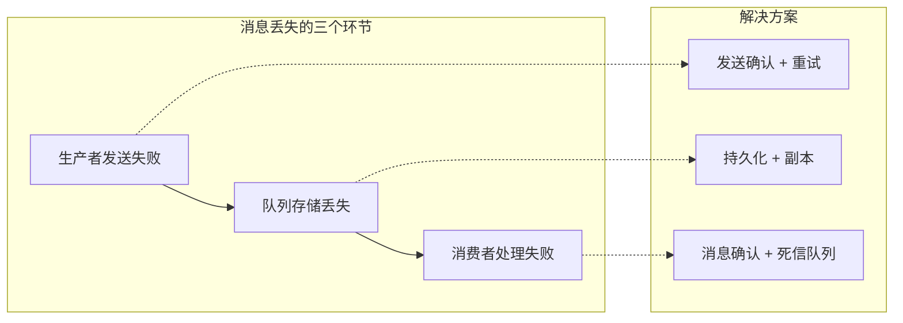
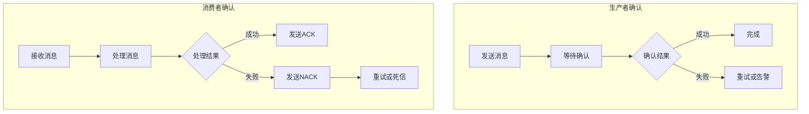
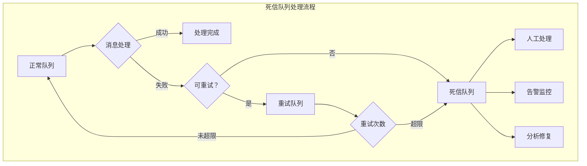
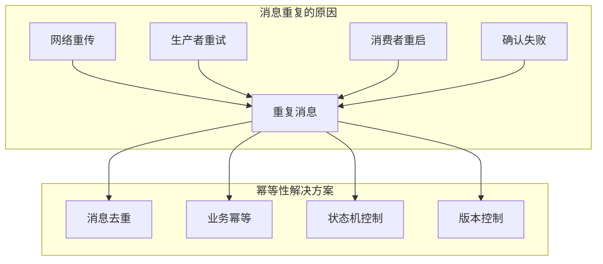
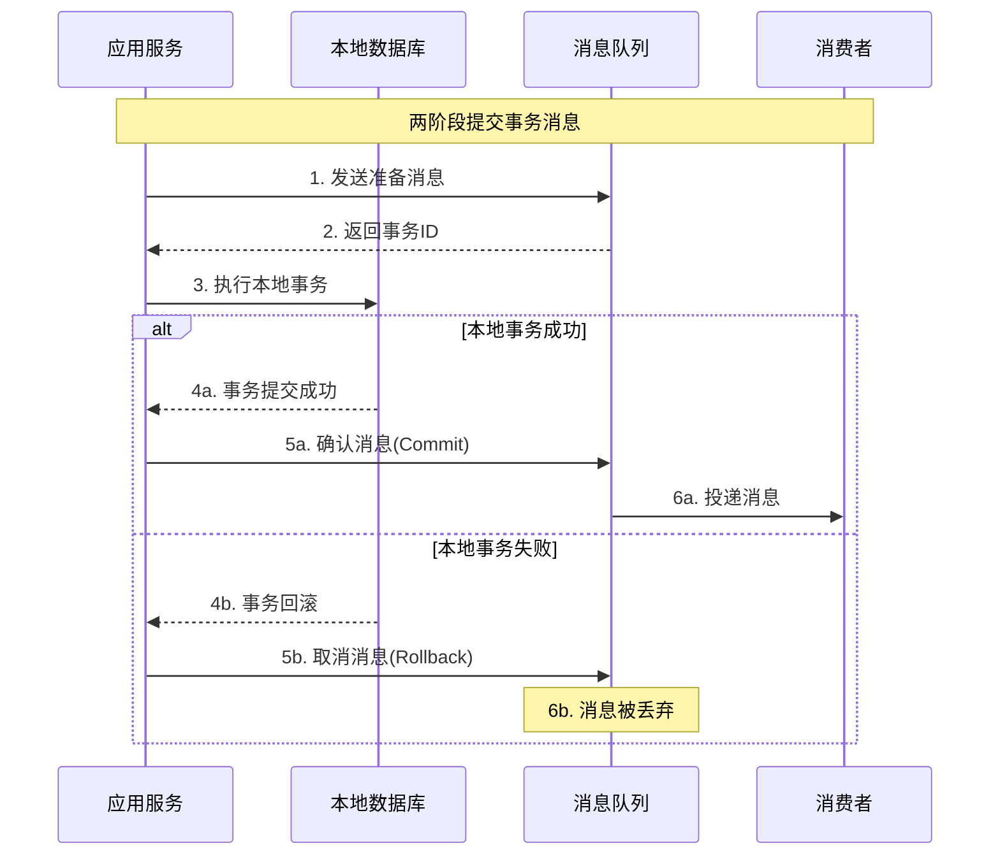

# 第三章 可靠性保障：确保消息万无一失

> "君子不立危墙之下" —— 可靠性是生产系统的生命线！ 🛡️

## 本章学习目标 🎯

- 深入分析消息丢失的三种情况并掌握对应解决方案
- 理解并实现完善的消息确认机制
- 掌握死信队列的设计与最佳实践
- 学会设计幂等性系统避免重复处理陷阱
- 了解事务消息保证强一致性的原理与实现
- 为构建生产级可靠MQ系统打下坚实基础

---

## 3.1 消息丢失的三种情况及解决方案

在第二章中，我们了解了消息的完整生命周期。现在让我们深入分析每个环节可能出现的消息丢失问题。

### 消息丢失全景分析



### 🚫 情况一：生产者发送失败

#### 失败原因分析

| 失败类型 | 具体原因 | 发生概率 | 影响程度 |
|----------|----------|----------|----------|
| **网络故障** | 网络中断、超时、丢包 | 高 ⭐⭐⭐⭐ | 中等 |
| **服务器故障** | MQ服务器宕机、重启 | 中 ⭐⭐⭐ | 高 |
| **配置错误** | 队列不存在、权限不足 | 低 ⭐⭐ | 高 |
| **资源不足** | 队列已满、内存不足 | 中 ⭐⭐⭐ | 中等 |

#### 解决方案：发送确认机制

```pseudocode
class ReliableProducer {
    function __init__(config) {
        this.connection = createConnection(config)
        this.confirmEnabled = config.enableConfirm
        this.retryPolicy = config.retryPolicy
        this.pendingConfirms = new ConcurrentHashMap()
    }
    
    function sendReliably(message) {
        // 启用发送确认模式
        if (this.confirmEnabled) {
            this.connection.enableConfirm()
        }
        
        // 生成唯一确认ID
        confirmId = generateConfirmId()
        message.confirmId = confirmId
        
        // 记录待确认消息
        confirmInfo = {
            message: message,
            timestamp: getCurrentTime(),
            retryCount: 0,
            maxRetries: this.retryPolicy.maxRetries
        }
        this.pendingConfirms.put(confirmId, confirmInfo)
        
        // 发送消息
        return this.attemptSend(confirmId)
    }
    
    function attemptSend(confirmId) {
        confirmInfo = this.pendingConfirms.get(confirmId)
        
        if (confirmInfo == null) {
            return error("确认信息不存在")
        }
        
        try {
            // 尝试发送消息
            this.connection.send(confirmInfo.message)
            
            if (this.confirmEnabled) {
                // 异步等待确认
                this.waitForConfirm(confirmId)
            } else {
                // 同步模式，立即返回成功
                this.pendingConfirms.remove(confirmId)
                return success("消息发送成功")
            }
            
        } catch (exception) {
            log("消息发送异常: " + exception.message)
            return this.handleSendFailure(confirmId, exception)
        }
    }
    
    function handleSendFailure(confirmId, exception) {
        confirmInfo = this.pendingConfirms.get(confirmId)
        confirmInfo.retryCount++
        
        if (confirmInfo.retryCount <= confirmInfo.maxRetries) {
            // 计算重试延迟（指数退避）
            delay = this.calculateRetryDelay(confirmInfo.retryCount)
            
            log("发送失败，" + delay + "ms后重试（第" + confirmInfo.retryCount + "次）")
            
            // 延迟重试
            setTimeout(function() {
                this.attemptSend(confirmId)
            }, delay)
            
            return pending("消息发送中，正在重试")
        } else {
            // 重试次数用尽
            this.pendingConfirms.remove(confirmId)
            
            // 发送到失败队列或告警
            this.handleFinalFailure(confirmInfo.message, exception)
            
            return error("消息发送失败，已达最大重试次数")
        }
    }
    
    function waitForConfirm(confirmId) {
        // 设置确认超时
        timeout = this.retryPolicy.confirmTimeout
        
        setTimeout(function() {
            confirmInfo = this.pendingConfirms.get(confirmId)
            if (confirmInfo != null) {
                log("确认超时: " + confirmId)
                this.handleSendFailure(confirmId, new Error("确认超时"))
            }
        }, timeout)
    }
    
    function onConfirmReceived(confirmId, success) {
        confirmInfo = this.pendingConfirms.remove(confirmId)
        
        if (confirmInfo != null) {
            if (success) {
                log("消息确认成功: " + confirmId)
                this.recordMetrics("message_sent_success", 1)
            } else {
                log("消息确认失败: " + confirmId)
                this.handleSendFailure(confirmId, new Error("服务器拒绝消息"))
            }
        }
    }
    
    function calculateRetryDelay(retryCount) {
        // 指数退避算法：1s, 2s, 4s, 8s, 16s, 最大30s
        baseDelay = 1000
        maxDelay = 30000
        delay = baseDelay * Math.pow(2, retryCount - 1)
        return Math.min(delay, maxDelay)
    }
}
```

#### 本地消息表模式

对于极其重要的消息，可以使用本地消息表确保最终一致性：

```pseudocode
class LocalMessageTable {
    function __init__(database) {
        this.database = database
        this.scheduler = new MessageScheduler()
    }
    
    function sendWithLocalTable(businessData, message) {
        transaction = this.database.beginTransaction()
        
        try {
            // 1. 执行业务操作
            businessResult = this.executeBusiness(businessData)
            
            // 2. 插入本地消息记录
            messageRecord = {
                id: generateUUID(),
                destination: message.queue,
                payload: serialize(message.data),
                status: "PENDING",
                createdAt: getCurrentTime(),
                nextRetryAt: getCurrentTime() + 1000,
                retryCount: 0,
                maxRetries: 5
            }
            
            this.database.insert("local_messages", messageRecord)
            
            // 3. 提交事务
            transaction.commit()
            
            // 4. 异步发送消息
            this.scheduler.schedule(messageRecord.id)
            
            return success(businessResult)
            
        } catch (exception) {
            transaction.rollback()
            return error(exception.message)
        }
    }
    
    function retryFailedMessages() {
        // 定期扫描失败的消息进行重试
        currentTime = getCurrentTime()
        
        failedMessages = this.database.select("local_messages", {
            status: "PENDING",
            nextRetryAt: { $lte: currentTime },
            retryCount: { $lt: 5 }
        })
        
        for messageRecord in failedMessages {
            this.attemptResend(messageRecord)
        }
    }
    
    function attemptResend(messageRecord) {
        try {
            message = {
                queue: messageRecord.destination,
                data: deserialize(messageRecord.payload)
            }
            
            result = messageQueue.send(message)
            
            if (result.success) {
                // 发送成功，更新状态
                this.database.update("local_messages", {
                    id: messageRecord.id,
                    status: "SENT",
                    sentAt: getCurrentTime()
                })
                
                log("本地消息重发成功: " + messageRecord.id)
            } else {
                // 发送失败，更新重试信息
                this.updateRetryInfo(messageRecord)
            }
            
        } catch (exception) {
            log("本地消息重发异常: " + exception.message)
            this.updateRetryInfo(messageRecord)
        }
    }
    
    function updateRetryInfo(messageRecord) {
        newRetryCount = messageRecord.retryCount + 1
        
        if (newRetryCount >= messageRecord.maxRetries) {
            // 超过最大重试次数，标记为失败
            this.database.update("local_messages", {
                id: messageRecord.id,
                status: "FAILED",
                failedAt: getCurrentTime()
            })
            
            // 发送告警
            alertService.sendAlert("本地消息发送最终失败", messageRecord)
        } else {
            // 更新重试信息
            nextRetryDelay = 1000 * Math.pow(2, newRetryCount)  // 指数退避
            
            this.database.update("local_messages", {
                id: messageRecord.id,
                retryCount: newRetryCount,
                nextRetryAt: getCurrentTime() + nextRetryDelay,
                lastRetryAt: getCurrentTime()
            })
        }
    }
}
```

### 🗃️ 情况二：队列存储丢失

#### 失败原因分析

| 失败类型 | 具体原因 | 数据丢失风险 | 恢复难度 |
|----------|----------|--------------|----------|
| **内存丢失** | 服务器重启、崩溃 | 高 ⭐⭐⭐⭐⭐ | 困难 |
| **磁盘故障** | 硬盘损坏、文件系统错误 | 极高 ⭐⭐⭐⭐⭐ | 极困难 |
| **网络分区** | 集群节点网络中断 | 中等 ⭐⭐⭐ | 中等 |
| **配置错误** | 持久化未启用 | 高 ⭐⭐⭐⭐ | 困难 |

#### 解决方案：多级持久化策略

```pseudocode
class PersistentMessageQueue {
    function __init__(config) {
        this.config = config
        this.memoryQueue = new ConcurrentQueue()
        this.diskStorage = new DiskStorage(config.dataDir)
        this.replicationManager = new ReplicationManager(config.replicas)
        this.writeAheadLog = new WriteAheadLog(config.walDir)
    }
    
    function enqueue(message) {
        // 1. 生成消息ID
        message.id = generateMessageId()
        message.enqueueTime = getCurrentTime()
        
        // 2. 写入WAL（Write-Ahead Log）
        walEntry = {
            operation: "ENQUEUE",
            messageId: message.id,
            message: message,
            timestamp: getCurrentTime()
        }
        
        this.writeAheadLog.append(walEntry)
        
        // 3. 根据持久化策略处理
        switch (this.config.durabilityLevel) {
            case "MEMORY_ONLY":
                return this.enqueueMemoryOnly(message)
            case "DISK_SYNC":
                return this.enqueueDiskSync(message)
            case "REPLICATED":
                return this.enqueueReplicated(message)
            default:
                return this.enqueueDefault(message)
        }
    }
    
    function enqueueDiskSync(message) {
        try {
            // 1. 写入内存队列
            this.memoryQueue.offer(message)
            
            // 2. 同步写入磁盘
            this.diskStorage.write(message.id, message)
            this.diskStorage.sync()  // 强制刷盘
            
            // 3. 记录成功日志
            log("消息持久化成功: " + message.id)
            
            return success(message.id)
            
        } catch (exception) {
            // 回滚内存操作
            this.memoryQueue.remove(message.id)
            
            log("消息持久化失败: " + exception.message)
            return error(exception.message)
        }
    }
    
    function enqueueReplicated(message) {
        try {
            // 1. 写入本地
            this.memoryQueue.offer(message)
            this.diskStorage.write(message.id, message)
            
            // 2. 复制到其他节点
            replicationResult = this.replicationManager.replicate(message)
            
            if (replicationResult.successCount < this.config.minReplicas) {
                // 副本数不足，回滚操作
                this.memoryQueue.remove(message.id)
                this.diskStorage.delete(message.id)
                
                return error("副本数不足，消息存储失败")
            }
            
            // 3. 等待副本确认
            if (this.config.waitForReplicas) {
                confirmed = this.replicationManager.waitForConfirm(
                    message.id, 
                    timeout = 5000
                )
                
                if (!confirmed) {
                    return error("副本确认超时")
                }
            }
            
            log("消息复制成功: " + message.id + ", 副本数: " + replicationResult.successCount)
            return success(message.id)
            
        } catch (exception) {
            this.rollbackReplication(message.id)
            return error(exception.message)
        }
    }
    
    function dequeue() {
        message = this.memoryQueue.poll()
        
        if (message != null) {
            // 记录出队操作到WAL
            walEntry = {
                operation: "DEQUEUE",
                messageId: message.id,
                timestamp: getCurrentTime()
            }
            
            this.writeAheadLog.append(walEntry)
            
            // 异步删除磁盘数据（性能优化）
            asyncExecute(function() {
                this.diskStorage.delete(message.id)
            })
        }
        
        return message
    }
    
    function recoverFromWAL() {
        log("开始从WAL恢复队列状态...")
        
        walEntries = this.writeAheadLog.readAll()
        processedMessages = new HashSet()
        
        for entry in walEntries {
            if (entry.operation == "ENQUEUE") {
                if (!processedMessages.contains(entry.messageId)) {
                    // 重新加载消息到内存队列
                    message = this.diskStorage.read(entry.messageId)
                    if (message != null) {
                        this.memoryQueue.offer(message)
                        processedMessages.add(entry.messageId)
                    }
                }
            } else if (entry.operation == "DEQUEUE") {
                // 从内存队列移除已出队的消息
                this.memoryQueue.removeById(entry.messageId)
                processedMessages.add(entry.messageId)
            }
        }
        
        log("WAL恢复完成，恢复消息数: " + processedMessages.size())
    }
}
```

#### 分布式副本管理

```pseudocode
class ReplicationManager {
    function __init__(replicas) {
        this.replicas = replicas  // 副本节点列表
        this.pendingReplications = new ConcurrentHashMap()
    }
    
    function replicate(message) {
        replicationId = generateReplicationId()
        replicationInfo = {
            messageId: message.id,
            message: message,
            replicas: this.replicas.clone(),
            successCount: 0,
            failureCount: 0,
            completed: false
        }
        
        this.pendingReplications.put(replicationId, replicationInfo)
        
        // 并行复制到所有副本节点
        for replica in this.replicas {
            this.replicateToNode(replicationId, replica, message)
        }
        
        return replicationInfo
    }
    
    function replicateToNode(replicationId, replica, message) {
        asyncExecute(function() {
            try {
                // 发送消息到副本节点
                result = replica.store(message)
                
                if (result.success) {
                    this.onReplicationSuccess(replicationId, replica.id)
                } else {
                    this.onReplicationFailure(replicationId, replica.id, result.error)
                }
                
            } catch (exception) {
                this.onReplicationFailure(replicationId, replica.id, exception.message)
            }
        })
    }
    
    function onReplicationSuccess(replicationId, replicaId) {
        replicationInfo = this.pendingReplications.get(replicationId)
        
        if (replicationInfo != null && !replicationInfo.completed) {
            replicationInfo.successCount++
            
            log("副本复制成功: " + replicaId + 
                ", 成功数: " + replicationInfo.successCount +
                "/" + this.replicas.size())
            
            // 检查是否满足成功条件
            if (replicationInfo.successCount >= this.getRequiredReplicas()) {
                replicationInfo.completed = true
                this.notifyReplicationComplete(replicationId, true)
            }
        }
    }
    
    function onReplicationFailure(replicationId, replicaId, error) {
        replicationInfo = this.pendingReplications.get(replicationId)
        
        if (replicationInfo != null && !replicationInfo.completed) {
            replicationInfo.failureCount++
            
            log("副本复制失败: " + replicaId + ", 错误: " + error)
            
            // 检查是否彻底失败
            totalTried = replicationInfo.successCount + replicationInfo.failureCount
            if (totalTried >= this.replicas.size()) {
                if (replicationInfo.successCount < this.getRequiredReplicas()) {
                    replicationInfo.completed = true
                    this.notifyReplicationComplete(replicationId, false)
                }
            }
        }
    }
    
    function getRequiredReplicas() {
        // 要求至少一半以上节点成功
        return Math.floor(this.replicas.size() / 2) + 1
    }
}
```

### 🤖 情况三：消费者处理失败

#### 失败原因分析

| 失败类型 | 具体原因 | 业务影响 | 处理策略 |
|----------|----------|----------|----------|
| **业务异常** | 数据验证失败、业务规则冲突 | 中等 ⭐⭐⭐ | 重试 + 人工处理 |
| **依赖服务故障** | 下游服务不可用 | 高 ⭐⭐⭐⭐ | 重试 + 降级 |
| **资源不足** | 内存溢出、CPU过高 | 高 ⭐⭐⭐⭐ | 限流 + 扩容 |
| **消费者崩溃** | 进程异常退出 | 高 ⭐⭐⭐⭐ | 重启 + 消息重新投递 |

#### 解决方案：可靠消费模式

```pseudocode
class ReliableConsumer {
    function __init__(config) {
        this.config = config
        this.connection = createConnection(config)
        this.processor = config.messageProcessor
        this.retryPolicy = config.retryPolicy
        this.deadLetterQueue = config.deadLetterQueue
        this.processingMessages = new ConcurrentHashMap()
    }
    
    function startConsuming() {
        // 设置预取数量，控制并发
        this.connection.setPrefetchCount(this.config.prefetchCount)
        
        // 启用手动确认模式
        this.connection.setAutoAck(false)
        
        // 注册消息处理器
        this.connection.onMessage(this.handleMessage)
        
        log("可靠消费者启动，预取数量: " + this.config.prefetchCount)
    }
    
    function handleMessage(message) {
        messageId = message.id
        
        // 记录正在处理的消息
        processingInfo = {
            message: message,
            startTime: getCurrentTime(),
            retryCount: message.retryCount || 0,
            lastError: null
        }
        
        this.processingMessages.put(messageId, processingInfo)
        
        try {
            // 幂等性检查
            if (this.isDuplicate(message)) {
                log("检测到重复消息，跳过处理: " + messageId)
                this.acknowledgeMessage(messageId)
                return
            }
            
            // 消息预处理
            processedMessage = this.preprocessMessage(message)
            
            // 执行业务逻辑
            result = this.processor.process(processedMessage)
            
            if (result.success) {
                // 处理成功
                this.onProcessingSuccess(messageId, result)
            } else {
                // 业务处理失败
                this.onProcessingFailure(messageId, result.error)
            }
            
        } catch (exception) {
            // 系统异常
            this.onProcessingException(messageId, exception)
        } finally {
            // 清理处理信息
            this.processingMessages.remove(messageId)
        }
    }
    
    function onProcessingSuccess(messageId, result) {
        processingInfo = this.processingMessages.get(messageId)
        processingTime = getCurrentTime() - processingInfo.startTime
        
        // 记录处理成功
        this.recordProcessingMetrics(messageId, "SUCCESS", processingTime)
        
        // 确认消息
        this.acknowledgeMessage(messageId)
        
        log("消息处理成功: " + messageId + ", 耗时: " + processingTime + "ms")
    }
    
    function onProcessingFailure(messageId, error) {
        processingInfo = this.processingMessages.get(messageId)
        processingInfo.lastError = error
        processingInfo.retryCount++
        
        log("消息处理失败: " + messageId + ", 错误: " + error + 
            ", 重试次数: " + processingInfo.retryCount)
        
        if (processingInfo.retryCount <= this.retryPolicy.maxRetries) {
            // 可以重试
            this.scheduleRetry(processingInfo)
        } else {
            // 超过重试次数，发送到死信队列
            this.sendToDeadLetterQueue(processingInfo.message, error)
            this.acknowledgeMessage(messageId)  // 确认原消息，避免重复
        }
    }
    
    function scheduleRetry(processingInfo) {
        message = processingInfo.message
        retryCount = processingInfo.retryCount
        
        // 计算重试延迟
        delay = this.calculateRetryDelay(retryCount)
        
        // 创建重试消息
        retryMessage = {
            id: generateMessageId(),
            originalId: message.id,
            payload: message.payload,
            retryCount: retryCount,
            originalError: processingInfo.lastError,
            retryAt: getCurrentTime() + delay
        }
        
        // 发送到重试队列
        this.sendToRetryQueue(retryMessage, delay)
        
        // 确认原消息
        this.acknowledgeMessage(message.id)
        
        log("消息已安排重试: " + message.id + ", 延迟: " + delay + "ms")
    }
    
    function sendToRetryQueue(retryMessage, delay) {
        // 使用延迟队列实现重试
        retryQueue = "retry_queue_" + this.getDelayBucket(delay)
        
        // 设置TTL，消息过期后自动转移到原队列
        retryMessage.ttl = delay
        retryMessage.deadLetterExchange = this.config.originalQueue
        
        this.connection.send(retryQueue, retryMessage)
    }
    
    function sendToDeadLetterQueue(originalMessage, finalError) {
        deadLetterMessage = {
            originalId: originalMessage.id,
            originalPayload: originalMessage.payload,
            finalError: finalError,
            retryHistory: originalMessage.retryHistory || [],
            failedAt: getCurrentTime(),
            originalQueue: this.config.queueName
        }
        
        this.connection.send(this.deadLetterQueue, deadLetterMessage)
        
        // 发送告警
        alertService.sendAlert("消息处理最终失败", {
            messageId: originalMessage.id,
            error: finalError,
            queue: this.config.queueName
        })
        
        log("消息发送到死信队列: " + originalMessage.id)
    }
    
    function isDuplicate(message) {
        // 基于Redis的幂等性检查
        idempotencyKey = "processed:" + message.id
        
        // 使用SETNX命令实现原子性检查
        result = redisClient.setNX(idempotencyKey, getCurrentTime(), ttl=3600)
        
        return !result.success  // 如果设置失败，说明已经处理过了
    }
    
    function acknowledgeMessage(messageId) {
        try {
            this.connection.ack(messageId)
            log("消息确认成功: " + messageId)
        } catch (exception) {
            log("消息确认失败: " + messageId + ", 错误: " + exception.message)
            // 确认失败可能导致消息重复，需要监控
            alertService.sendAlert("消息确认失败", {
                messageId: messageId,
                error: exception.message
            })
        }
    }
    
    function calculateRetryDelay(retryCount) {
        // 组合策略：固定延迟 + 指数退避 + 随机抖动
        fixedDelay = this.retryPolicy.fixedDelay || 1000
        exponentialDelay = fixedDelay * Math.pow(2, retryCount - 1)
        maxDelay = this.retryPolicy.maxDelay || 60000
        
        // 添加随机抖动，避免雪崩效应
        jitter = Math.random() * 1000
        
        finalDelay = Math.min(exponentialDelay, maxDelay) + jitter
        return Math.floor(finalDelay)
    }
}
```

---

## 3.2 消息确认机制：确保消息被正确处理

在第二章中我们简单了解了消息确认的概念，现在让我们深入探讨各种确认机制的设计与实现。

### 确认机制全景图



### 🔐 生产者确认（Publisher Confirm）

#### 确认模式分析

| 确认模式 | 性能 | 可靠性 | 复杂度 | 适用场景 |
|----------|------|--------|--------|----------|
| **不确认** | 极高 ⭐⭐⭐⭐⭐ | 极低 ⭐ | 极低 ⭐ | 非关键数据 |
| **同步确认** | 低 ⭐⭐ | 高 ⭐⭐⭐⭐ | 低 ⭐⭐ | 关键业务 |
| **异步确认** | 高 ⭐⭐⭐⭐ | 高 ⭐⭐⭐⭐ | 高 ⭐⭐⭐⭐ | 高性能场景 |
| **批量确认** | 极高 ⭐⭐⭐⭐⭐ | 中等 ⭐⭐⭐ | 中等 ⭐⭐⭐ | 大批量数据 |

#### 同步确认实现

```pseudocode
class SyncConfirmProducer {
    function sendWithSyncConfirm(message) {
        try {
            // 启用确认模式
            this.channel.enableConfirm()
            
            // 发送消息
            deliveryTag = this.channel.send(message)
            
            // 同步等待确认，设置超时
            confirmed = this.channel.waitForConfirm(timeout=5000)
            
            if (confirmed) {
                log("消息同步确认成功: " + message.id)
                return success(deliveryTag)
            } else {
                log("消息同步确认超时: " + message.id)
                return error("确认超时")
            }
            
        } catch (exception) {
            log("消息发送异常: " + exception.message)
            return error(exception.message)
        }
    }
}
```

#### 异步确认实现

```pseudocode
class AsyncConfirmProducer {
    function __init__() {
        this.pendingConfirms = new ConcurrentHashMap()
        this.deliveryTagGenerator = new AtomicLong(0)
        this.setupConfirmCallbacks()
    }
    
    function sendWithAsyncConfirm(message, callback) {
        try {
            // 生成投递标签
            deliveryTag = this.deliveryTagGenerator.incrementAndGet()
            
            // 记录待确认消息
            confirmInfo = {
                message: message,
                callback: callback,
                timestamp: getCurrentTime(),
                deliveryTag: deliveryTag
            }
            
            this.pendingConfirms.put(deliveryTag, confirmInfo)
            
            // 异步发送消息
            this.channel.sendAsync(message, deliveryTag)
            
            // 设置确认超时
            this.scheduleConfirmTimeout(deliveryTag)
            
            return deliveryTag
            
        } catch (exception) {
            callback.onError(exception.message)
            return null
        }
    }
    
    function setupConfirmCallbacks() {
        // 注册确认成功回调
        this.channel.onConfirm(function(deliveryTag, multiple) {
            this.handleConfirm(deliveryTag, multiple, true)
        })
        
        // 注册确认失败回调
        this.channel.onNack(function(deliveryTag, multiple) {
            this.handleConfirm(deliveryTag, multiple, false)
        })
    }
    
    function handleConfirm(deliveryTag, multiple, success) {
        if (multiple) {
            // 批量确认，确认所有小于等于deliveryTag的消息
            this.handleBatchConfirm(deliveryTag, success)
        } else {
            // 单个确认
            this.handleSingleConfirm(deliveryTag, success)
        }
    }
    
    function handleSingleConfirm(deliveryTag, success) {
        confirmInfo = this.pendingConfirms.remove(deliveryTag)
        
        if (confirmInfo != null) {
            processingTime = getCurrentTime() - confirmInfo.timestamp
            
            if (success) {
                confirmInfo.callback.onSuccess(deliveryTag, processingTime)
                log("消息异步确认成功: " + confirmInfo.message.id)
            } else {
                confirmInfo.callback.onFailure(deliveryTag, "服务器拒绝消息")
                log("消息异步确认失败: " + confirmInfo.message.id)
            }
        }
    }
    
    function handleBatchConfirm(maxDeliveryTag, success) {
        confirmedTags = []
        
        // 找出所有需要确认的消息
        for entry in this.pendingConfirms.entrySet() {
            if (entry.key <= maxDeliveryTag) {
                confirmedTags.add(entry.key)
            }
        }
        
        // 批量处理确认
        for tag in confirmedTags {
            this.handleSingleConfirm(tag, success)
        }
        
        log("批量确认完成: " + confirmedTags.size() + "条消息")
    }
    
    function scheduleConfirmTimeout(deliveryTag) {
        setTimeout(function() {
            confirmInfo = this.pendingConfirms.remove(deliveryTag)
            
            if (confirmInfo != null) {
                confirmInfo.callback.onTimeout(deliveryTag)
                log("消息确认超时: " + confirmInfo.message.id)
            }
        }, this.config.confirmTimeout)
    }
}
```

### ✅ 消费者确认（Consumer Acknowledgment）

#### ACK/NACK机制详解

```pseudocode
class ConsumerAcknowledgment {
    function __init__(channel, config) {
        this.channel = channel
        this.config = config
        this.processingMessages = new ConcurrentHashMap()
    }
    
    function processMessage(message) {
        messageId = message.id
        deliveryTag = message.deliveryTag
        
        // 记录处理开始
        processingInfo = {
            message: message,
            deliveryTag: deliveryTag,
            startTime: getCurrentTime(),
            ackSent: false
        }
        
        this.processingMessages.put(messageId, processingInfo)
        
        try {
            // 执行业务逻辑
            result = this.businessLogic.process(message)
            
            if (result.success) {
                // 处理成功，发送ACK
                this.sendAck(deliveryTag, messageId)
            } else if (result.retryable) {
                // 可重试失败，发送NACK with requeue
                this.sendNackWithRequeue(deliveryTag, messageId, result.error)
            } else {
                // 不可重试失败，发送NACK without requeue
                this.sendNackWithoutRequeue(deliveryTag, messageId, result.error)
            }
            
        } catch (exception) {
            // 系统异常，根据配置决定是否重试
            if (this.isRetryableException(exception)) {
                this.sendNackWithRequeue(deliveryTag, messageId, exception.message)
            } else {
                this.sendNackWithoutRequeue(deliveryTag, messageId, exception.message)
            }
        } finally {
            this.processingMessages.remove(messageId)
        }
    }
    
    function sendAck(deliveryTag, messageId) {
        try {
            this.channel.basicAck(deliveryTag, multiple=false)
            
            processingInfo = this.processingMessages.get(messageId)
            if (processingInfo != null) {
                processingInfo.ackSent = true
                processingTime = getCurrentTime() - processingInfo.startTime
                
                // 记录处理成功指标
                this.recordMetrics("message_processed_success", processingTime)
                
                log("消息ACK成功: " + messageId + ", 处理时间: " + processingTime + "ms")
            }
            
        } catch (exception) {
            log("发送ACK失败: " + messageId + ", 错误: " + exception.message)
            
            // ACK失败可能导致消息重复处理
            alertService.sendAlert("ACK发送失败", {
                messageId: messageId,
                deliveryTag: deliveryTag,
                error: exception.message
            })
        }
    }
    
    function sendNackWithRequeue(deliveryTag, messageId, error) {
        try {
            // NACK with requeue=true，消息会重新排队
            this.channel.basicNack(deliveryTag, multiple=false, requeue=true)
            
            log("消息NACK with requeue: " + messageId + ", 错误: " + error)
            
            // 记录失败指标
            this.recordMetrics("message_processed_failure_retryable", 1)
            
        } catch (exception) {
            log("发送NACK失败: " + messageId + ", 错误: " + exception.message)
        }
    }
    
    function sendNackWithoutRequeue(deliveryTag, messageId, error) {
        try {
            // NACK with requeue=false，消息会被丢弃或进入死信队列
            this.channel.basicNack(deliveryTag, multiple=false, requeue=false)
            
            log("消息NACK without requeue: " + messageId + ", 错误: " + error)
            
            // 记录失败指标
            this.recordMetrics("message_processed_failure_final", 1)
            
            // 发送告警
            alertService.sendAlert("消息处理最终失败", {
                messageId: messageId,
                error: error,
                action: "sent_to_dlq"
            })
            
        } catch (exception) {
            log("发送NACK失败: " + messageId + ", 错误: " + exception.message)
        }
    }
    
    function isRetryableException(exception) {
        // 定义可重试的异常类型
        retryableExceptions = [
            "NetworkException",
            "TimeoutException", 
            "ServiceUnavailableException",
            "TemporaryResourceException"
        ]
        
        return retryableExceptions.contains(exception.getClass().getName())
    }
}
```

#### 自动恢复未确认消息

```pseudocode
class UnackedMessageRecovery {
    function __init__(config) {
        this.config = config
        this.unackedMessages = new ConcurrentHashMap()
        this.recoveryInterval = config.recoveryInterval || 60000  // 1分钟
        this.maxProcessingTime = config.maxProcessingTime || 300000  // 5分钟
        
        this.startRecoveryTask()
    }
    
    function trackMessage(deliveryTag, message) {
        trackingInfo = {
            deliveryTag: deliveryTag,
            message: message,
            startTime: getCurrentTime(),
            consumerTag: getCurrentConsumerTag()
        }
        
        this.unackedMessages.put(deliveryTag, trackingInfo)
    }
    
    function untrackMessage(deliveryTag) {
        this.unackedMessages.remove(deliveryTag)
    }
    
    function startRecoveryTask() {
        setInterval(function() {
            this.recoverStaleMessages()
        }, this.recoveryInterval)
    }
    
    function recoverStaleMessages() {
        currentTime = getCurrentTime()
        staleMessages = []
        
        for entry in this.unackedMessages.entrySet() {
            trackingInfo = entry.getValue()
            processingTime = currentTime - trackingInfo.startTime
            
            if (processingTime > this.maxProcessingTime) {
                staleMessages.add(trackingInfo)
            }
        }
        
        if (!staleMessages.isEmpty()) {
            log("发现超时未确认消息: " + staleMessages.size() + "条")
            
            for staleMessage in staleMessages {
                this.recoverStaleMessage(staleMessage)
            }
        }
    }
    
    function recoverStaleMessage(trackingInfo) {
        deliveryTag = trackingInfo.deliveryTag
        message = trackingInfo.message
        processingTime = getCurrentTime() - trackingInfo.startTime
        
        log("恢复超时消息: " + message.id + 
            ", 处理时间: " + processingTime + "ms" +
            ", 消费者: " + trackingInfo.consumerTag)
        
        try {
            // 拒绝消息，让其重新排队
            this.channel.basicNack(deliveryTag, multiple=false, requeue=true)
            
            // 从跟踪列表中移除
            this.unackedMessages.remove(deliveryTag)
            
            // 发送告警
            alertService.sendAlert("消息处理超时自动恢复", {
                messageId: message.id,
                processingTime: processingTime,
                consumerTag: trackingInfo.consumerTag
            })
            
        } catch (exception) {
            log("恢复超时消息失败: " + exception.message)
        }
    }
}
```

---

## 3.3 死信队列：处理失败消息的最佳实践

死信队列（Dead Letter Queue，DLQ）是处理失败消息的最后一道防线，就像医院的重症监护室。

### 死信队列架构设计



### 💀 死信队列的设计实现

#### 死信队列管理器

```pseudocode
class DeadLetterQueueManager {
    function __init__(config) {
        this.config = config
        this.dlqStorage = new DeadLetterStorage(config.storageConfig)
        this.alertService = new AlertService(config.alertConfig)
        this.metricsCollector = new MetricsCollector()
        
        this.setupDeadLetterQueues()
    }
    
    function setupDeadLetterQueues() {
        // 按照业务类型创建不同的死信队列
        businessTypes = ["order", "payment", "inventory", "notification"]
        
        for businessType in businessTypes {
            dlqName = "dlq_" + businessType
            
            // 创建死信队列
            this.createDeadLetterQueue(dlqName, {
                durable: true,
                ttl: 30 * 24 * 3600 * 1000,  // 30天TTL
                maxLength: 100000,  // 最大消息数
                arguments: {
                    "x-queue-type": "quorum",  // 使用仲裁队列
                    "x-dead-letter-routing-key": "manual_review"
                }
            })
            
            log("创建死信队列: " + dlqName)
        }
        
        // 创建手动审核队列
        this.createDeadLetterQueue("manual_review_queue", {
            durable: true,
            arguments: {
                "x-queue-type": "classic"
            }
        })
    }
    
    function sendToDeadLetter(originalMessage, failureReason, sourceQueue) {
        // 构造死信消息
        deadLetterMessage = this.createDeadLetterMessage(
            originalMessage, 
            failureReason, 
            sourceQueue
        )
        
        // 确定目标死信队列
        targetDLQ = this.determineTargetDLQ(originalMessage, sourceQueue)
        
        try {
            // 发送到死信队列
            this.dlqStorage.store(targetDLQ, deadLetterMessage)
            
            // 更新统计信息
            this.metricsCollector.increment("dead_letter_messages_total", {
                source_queue: sourceQueue,
                failure_reason: failureReason.category,
                target_dlq: targetDLQ
            })
            
            // 发送告警
            this.sendDeadLetterAlert(deadLetterMessage, targetDLQ)
            
            log("消息已发送到死信队列: " + originalMessage.id + " -> " + targetDLQ)
            
            return success()
            
        } catch (exception) {
            log("发送到死信队列失败: " + exception.message)
            
            // 失败情况下的紧急处理
            this.handleDLQFailure(originalMessage, failureReason, exception)
            
            return error(exception.message)
        }
    }
    
    function createDeadLetterMessage(originalMessage, failureReason, sourceQueue) {
        return {
            // 原始消息信息
            originalId: originalMessage.id,
            originalPayload: originalMessage.payload,
            originalHeaders: originalMessage.headers,
            originalTimestamp: originalMessage.timestamp,
            
            // 死信相关信息
            deadLetterTimestamp: getCurrentTime(),
            sourceQueue: sourceQueue,
            failureReason: {
                category: failureReason.category,  // BUSINESS_ERROR, SYSTEM_ERROR, TIMEOUT等
                message: failureReason.message,
                stackTrace: failureReason.stackTrace,
                retryHistory: failureReason.retryHistory
            },
            
            // 处理跟踪信息
            processingHistory: originalMessage.processingHistory || [],
            totalRetryCount: originalMessage.retryCount || 0,
            
            // 元数据
            businessType: this.extractBusinessType(originalMessage),
            priority: this.calculatePriority(originalMessage, failureReason),
            tags: this.generateTags(originalMessage, failureReason),
            
            // 处理状态
            status: "NEW",  // NEW, IN_REVIEW, RESOLVED, DISCARDED
            assignee: null,
            reviewNotes: []
        }
    }
    
    function determineTargetDLQ(originalMessage, sourceQueue) {
        businessType = this.extractBusinessType(originalMessage)
        
        // 基于业务类型选择死信队列
        if (businessType != null) {
            return "dlq_" + businessType
        }
        
        // 基于源队列选择死信队列
        if (sourceQueue != null) {
            return "dlq_" + sourceQueue.replace("_queue", "")
        }
        
        // 默认死信队列
        return "dlq_default"
    }
    
    function extractBusinessType(message) {
        // 从消息头或内容中提取业务类型
        if (message.headers && message.headers.businessType) {
            return message.headers.businessType
        }
        
        if (message.routingKey) {
            parts = message.routingKey.split(".")
            if (parts.length > 0) {
                return parts[0]  // 假设routing key格式为 "business.operation"
            }
        }
        
        return "default"
    }
    
    function calculatePriority(originalMessage, failureReason) {
        // 基于消息重要性和失败原因计算优先级
        basePriority = originalMessage.priority || "NORMAL"
        
        if (failureReason.category == "BUSINESS_ERROR") {
            return "HIGH"  // 业务错误需要优先处理
        } else if (failureReason.category == "SYSTEM_ERROR") {
            return "MEDIUM"  // 系统错误需要及时处理
        } else {
            return basePriority
        }
    }
    
    function sendDeadLetterAlert(deadLetterMessage, targetDLQ) {
        // 根据优先级和业务类型发送不同级别的告警
        alertLevel = this.determineAlertLevel(deadLetterMessage)
        
        alertInfo = {
            level: alertLevel,
            title: "消息进入死信队列",
            details: {
                messageId: deadLetterMessage.originalId,
                businessType: deadLetterMessage.businessType,
                failureReason: deadLetterMessage.failureReason.message,
                targetDLQ: targetDLQ,
                priority: deadLetterMessage.priority,
                retryCount: deadLetterMessage.totalRetryCount
            },
            actions: [
                "查看死信队列详情",
                "手动重试消息",
                "联系开发团队"
            ]
        }
        
        this.alertService.sendAlert(alertInfo)
    }
    
    function determineAlertLevel(deadLetterMessage) {
        // 高优先级或关键业务消息发送严重告警
        if (deadLetterMessage.priority == "HIGH" || 
            deadLetterMessage.businessType in ["order", "payment"]) {
            return "CRITICAL"
        } else if (deadLetterMessage.priority == "MEDIUM") {
            return "WARNING"
        } else {
            return "INFO"
        }
    }
}
```

#### 死信队列消费者

```pseudocode
class DeadLetterQueueConsumer {
    function __init__(dlqName, config) {
        this.dlqName = dlqName
        this.config = config
        this.messageAnalyzer = new DeadLetterAnalyzer()
        this.recoveryProcessor = new RecoveryProcessor()
        this.manualReviewQueue = new ManualReviewQueue()
    }
    
    function startProcessing() {
        log("启动死信队列消费者: " + this.dlqName)
        
        this.connection.consume(this.dlqName, {
            autoAck: false,
            prefetchCount: 10
        }, this.processDeadLetter)
    }
    
    function processDeadLetter(deadLetterMessage) {
        try {
            log("处理死信消息: " + deadLetterMessage.originalId)
            
            // 分析失败原因
            analysis = this.messageAnalyzer.analyze(deadLetterMessage)
            
            // 根据分析结果决定处理策略
            strategy = this.determineProcessingStrategy(analysis)
            
            switch (strategy) {
                case "AUTO_RETRY":
                    this.attemptAutoRecovery(deadLetterMessage, analysis)
                    break
                case "MANUAL_REVIEW":
                    this.sendToManualReview(deadLetterMessage, analysis)
                    break
                case "DISCARD":
                    this.discardMessage(deadLetterMessage, analysis)
                    break
                case "ESCALATE":
                    this.escalateToSupport(deadLetterMessage, analysis)
                    break
                default:
                    this.sendToManualReview(deadLetterMessage, analysis)
            }
            
            // 确认死信消息已处理
            this.connection.ack(deadLetterMessage.deliveryTag)
            
        } catch (exception) {
            log("处理死信消息异常: " + exception.message)
            
            // 异常情况下拒绝消息，避免丢失
            this.connection.nack(deadLetterMessage.deliveryTag, requeue=true)
        }
    }
    
    function determineProcessingStrategy(analysis) {
        failureCategory = analysis.failureCategory
        recoverability = analysis.recoverability
        businessImpact = analysis.businessImpact
        
        // 如果是临时性错误且恢复概率高，尝试自动重试
        if (failureCategory == "TEMPORARY_ERROR" && recoverability > 0.8) {
            return "AUTO_RETRY"
        }
        
        // 如果是业务规则错误且影响不大，可能需要丢弃
        if (failureCategory == "BUSINESS_RULE_ERROR" && businessImpact == "LOW") {
            return "DISCARD"
        }
        
        // 如果是高优先级消息，升级到技术支持
        if (businessImpact == "HIGH") {
            return "ESCALATE"
        }
        
        // 默认情况下进入人工审核
        return "MANUAL_REVIEW"
    }
    
    function attemptAutoRecovery(deadLetterMessage, analysis) {
        // 等待一段时间，让依赖服务恢复
        recoveryDelay = analysis.suggestedDelay || 300000  // 5分钟
        
        recoveryMessage = {
            originalMessage: deadLetterMessage,
            recoveryAttempt: (deadLetterMessage.recoveryAttempt || 0) + 1,
            maxRecoveryAttempts: 3,
            recoveryReason: analysis.recommendation
        }
        
        // 发送到延迟恢复队列
        this.recoveryProcessor.scheduleRecovery(recoveryMessage, recoveryDelay)
        
        log("安排自动恢复: " + deadLetterMessage.originalId + 
            ", 延迟: " + recoveryDelay + "ms")
    }
    
    function sendToManualReview(deadLetterMessage, analysis) {
        reviewItem = {
            id: generateReviewId(),
            deadLetterMessage: deadLetterMessage,
            analysis: analysis,
            status: "PENDING_REVIEW",
            createdAt: getCurrentTime(),
            priority: deadLetterMessage.priority,
            estimatedEffort: analysis.estimatedEffort,
            suggestedActions: analysis.suggestedActions
        }
        
        this.manualReviewQueue.add(reviewItem)
        
        // 发送审核通知
        this.notifyReviewers(reviewItem)
        
        log("发送到人工审核: " + deadLetterMessage.originalId)
    }
    
    function discardMessage(deadLetterMessage, analysis) {
        // 记录丢弃的消息，用于后续分析
        discardRecord = {
            originalId: deadLetterMessage.originalId,
            discardReason: analysis.discardReason,
            discardedAt: getCurrentTime(),
            businessType: deadLetterMessage.businessType
        }
        
        this.recordDiscard(discardRecord)
        
        log("丢弃死信消息: " + deadLetterMessage.originalId + 
            ", 原因: " + analysis.discardReason)
    }
}
```

### 📊 死信队列监控与分析

#### 死信队列指标监控

```pseudocode
class DeadLetterMetrics {
    function __init__() {
        this.metricsRegistry = new MetricsRegistry()
        this.setupMetrics()
    }
    
    function setupMetrics() {
        // 死信消息总数
        this.dlqMessageCount = this.metricsRegistry.counter(
            "dlq_messages_total",
            ["source_queue", "failure_category", "business_type"]
        )
        
        // 死信队列长度
        this.dlqLength = this.metricsRegistry.gauge(
            "dlq_length_current", 
            ["dlq_name"]
        )
        
        // 恢复成功率
        this.recoverySuccessRate = this.metricsRegistry.histogram(
            "dlq_recovery_success_rate",
            ["recovery_type", "business_type"]
        )
        
        // 处理延迟
        this.processingDelay = this.metricsRegistry.histogram(
            "dlq_processing_delay_seconds",
            ["dlq_name", "processing_type"]
        )
    }
    
    function recordDeadLetterMessage(sourceQueue, failureCategory, businessType) {
        this.dlqMessageCount.increment({
            source_queue: sourceQueue,
            failure_category: failureCategory,
            business_type: businessType
        })
    }
    
    function updateQueueLength(dlqName, length) {
        this.dlqLength.set(length, { dlq_name: dlqName })
    }
    
    function recordRecoveryAttempt(recoveryType, businessType, success) {
        this.recoverySuccessRate.observe(success ? 1 : 0, {
            recovery_type: recoveryType,
            business_type: businessType
        })
    }
}
```

#### 死信消息分析器

```pseudocode
class DeadLetterAnalyzer {
    function analyze(deadLetterMessage) {
        failureReason = deadLetterMessage.failureReason
        
        analysis = {
            failureCategory: this.categorizeFailure(failureReason),
            recoverability: this.assessRecoverability(failureReason),
            businessImpact: this.assessBusinessImpact(deadLetterMessage),
            suggestedActions: [],
            estimatedEffort: "MEDIUM",
            recommendation: ""
        }
        
        // 基于历史数据进行分析
        historicalData = this.getHistoricalFailures(
            deadLetterMessage.businessType,
            analysis.failureCategory
        )
        
        analysis.recoverability = this.adjustRecoverabilityBasedOnHistory(
            analysis.recoverability, 
            historicalData
        )
        
        // 生成建议操作
        analysis.suggestedActions = this.generateSuggestedActions(analysis)
        
        // 生成处理建议
        analysis.recommendation = this.generateRecommendation(analysis)
        
        return analysis
    }
    
    function categorizeFailure(failureReason) {
        errorMessage = failureReason.message.toLowerCase()
        
        if (errorMessage.contains("timeout") || errorMessage.contains("connection")) {
            return "TEMPORARY_ERROR"
        } else if (errorMessage.contains("validation") || errorMessage.contains("invalid")) {
            return "BUSINESS_RULE_ERROR"
        } else if (errorMessage.contains("permission") || errorMessage.contains("unauthorized")) {
            return "AUTHORIZATION_ERROR"
        } else if (errorMessage.contains("service unavailable") || errorMessage.contains("503")) {
            return "DEPENDENCY_ERROR"
        } else {
            return "UNKNOWN_ERROR"
        }
    }
    
    function assessRecoverability(failureReason) {
        category = this.categorizeFailure(failureReason)
        
        recoverabilityScores = {
            "TEMPORARY_ERROR": 0.9,
            "DEPENDENCY_ERROR": 0.7,
            "AUTHORIZATION_ERROR": 0.5,
            "BUSINESS_RULE_ERROR": 0.3,
            "UNKNOWN_ERROR": 0.4
        }
        
        return recoverabilityScores.get(category, 0.4)
    }
    
    function assessBusinessImpact(deadLetterMessage) {
        businessType = deadLetterMessage.businessType
        priority = deadLetterMessage.priority
        
        // 关键业务类型
        if (businessType in ["order", "payment", "refund"]) {
            return "HIGH"
        }
        
        // 基于优先级
        if (priority == "HIGH" || priority == "CRITICAL") {
            return "HIGH"
        } else if (priority == "MEDIUM") {
            return "MEDIUM"
        } else {
            return "LOW"
        }
    }
    
    function generateSuggestedActions(analysis) {
        actions = []
        
        switch (analysis.failureCategory) {
            case "TEMPORARY_ERROR":
                actions.add("等待依赖服务恢复后重试")
                actions.add("检查网络连接状态")
                break
            case "BUSINESS_RULE_ERROR":
                actions.add("检查业务规则配置")
                actions.add("验证输入数据格式")
                actions.add("联系业务团队确认规则")
                break
            case "AUTHORIZATION_ERROR":
                actions.add("检查服务账号权限")
                actions.add("验证API密钥有效性")
                break
            case "DEPENDENCY_ERROR":
                actions.add("检查依赖服务状态")
                actions.add("考虑启用降级模式")
                break
            default:
                actions.add("详细分析错误日志")
                actions.add("联系开发团队")
        }
        
        return actions
    }
}
```

---

## 3.4 幂等性设计：避免重复处理的陷阱

在分布式系统中，消息重复是不可避免的现象。幂等性设计确保同一个操作执行多次的效果与执行一次相同，这是第一、二章中提到的可靠性保障的重要组成部分。

### 幂等性问题全景分析



### 🔄 消息级别幂等性

#### 基于消息ID的去重

```pseudoecode
class MessageDeduplicator {
    function __init__(config) {
        this.redisClient = createRedisClient(config.redis)
        this.dedupePrefix = "msg_dedup:"
        this.defaultTTL = config.dedupeTTL || 3600  // 1小时
        this.bloomFilter = new BloomFilter(config.bloomFilter)
    }
    
    function isDuplicate(messageId) {
        // 1. 先用布隆过滤器快速判断
        if (!this.bloomFilter.mightContain(messageId)) {
            return false  // 肯定不是重复消息
        }
        
        // 2. 使用Redis精确判断
        dedupeKey = this.dedupePrefix + messageId
        
        // 使用SETNX原子操作
        result = this.redisClient.setNX(dedupeKey, getCurrentTime(), this.defaultTTL)
        
        if (result.success) {
            // 设置成功，说明是第一次处理
            this.bloomFilter.add(messageId)
            return false
        } else {
            // 设置失败，说明已经处理过
            return true
        }
    }
    
    function markAsProcessed(messageId, processingResult) {
        dedupeKey = this.dedupePrefix + messageId
        
        processingInfo = {
            messageId: messageId,
            processedAt: getCurrentTime(),
            result: processingResult.success ? "SUCCESS" : "FAILURE",
            resultData: processingResult.data,
            processingTime: processingResult.processingTime
        }
        
        // 更新处理结果，延长TTL
        this.redisClient.setex(dedupeKey, serialize(processingInfo), this.defaultTTL)
    }
    
    function getProcessingResult(messageId) {
        dedupeKey = this.dedupePrefix + messageId
        
        result = this.redisClient.get(dedupeKey)
        
        if (result.exists) {
            return deserialize(result.value)
        } else {
            return null
        }
    }
}
```

#### 分布式锁实现幂等性

```pseudocode
class DistributedIdempotency {
    function __init__(config) {
        this.redisClient = createRedisClient(config.redis)
        this.lockPrefix = "idempotent_lock:"
        this.lockTTL = config.lockTTL || 30  // 30秒锁定时间
    }
    
    function executeIdempotently(idempotencyKey, operation) {
        lockKey = this.lockPrefix + idempotencyKey
        
        // 尝试获取分布式锁
        lockResult = this.acquireLock(lockKey, this.lockTTL)
        
        if (!lockResult.success) {
            // 未获取到锁，检查是否已有处理结果
            existingResult = this.getExecutionResult(idempotencyKey)
            
            if (existingResult != null) {
                log("返回已有的执行结果: " + idempotencyKey)
                return existingResult
            } else {
                // 等待其他实例处理完成
                return this.waitForResult(idempotencyKey)
            }
        }
        
        try {
            // 获取到锁，检查是否已经执行过
            existingResult = this.getExecutionResult(idempotencyKey)
            
            if (existingResult != null) {
                log("操作已执行，返回缓存结果: " + idempotencyKey)
                return existingResult
            }
            
            // 执行业务操作
            log("执行幂等操作: " + idempotencyKey)
            result = operation.execute()
            
            // 保存执行结果
            this.saveExecutionResult(idempotencyKey, result)
            
            return result
            
        } finally {
            // 释放分布式锁
            this.releaseLock(lockKey, lockResult.lockValue)
        }
    }
    
    function acquireLock(lockKey, ttl) {
        lockValue = generateUniqueValue()
        
        // 使用SET命令的NX和EX选项实现原子性获锁
        result = this.redisClient.set(lockKey, lockValue, "NX", "EX", ttl)
        
        if (result == "OK") {
            return { success: true, lockValue: lockValue }
        } else {
            return { success: false, lockValue: null }
        }
    }
    
    function releaseLock(lockKey, lockValue) {
        // 使用Lua脚本确保原子性释放锁
        luaScript = """
            if redis.call("get", KEYS[1]) == ARGV[1] then
                return redis.call("del", KEYS[1])
            else
                return 0
            end
        """
        
        result = this.redisClient.eval(luaScript, [lockKey], [lockValue])
        
        if (result == 1) {
            log("分布式锁释放成功: " + lockKey)
        } else {
            log("分布式锁释放失败，可能已过期: " + lockKey)
        }
    }
    
    function getExecutionResult(idempotencyKey) {
        resultKey = "idempotent_result:" + idempotencyKey
        
        result = this.redisClient.get(resultKey)
        
        if (result.exists) {
            return deserialize(result.value)
        } else {
            return null
        }
    }
    
    function saveExecutionResult(idempotencyKey, result) {
        resultKey = "idempotent_result:" + idempotencyKey
        
        executionResult = {
            idempotencyKey: idempotencyKey,
            result: result,
            executedAt: getCurrentTime(),
            executionId: generateExecutionId()
        }
        
        // 保存结果，设置较长的TTL
        this.redisClient.setex(resultKey, serialize(executionResult), 3600)
        
        log("保存幂等操作结果: " + idempotencyKey)
    }
    
    function waitForResult(idempotencyKey) {
        maxWaitTime = 10000  // 最多等待10秒
        pollInterval = 100   // 100ms轮询间隔
        
        startTime = getCurrentTime()
        
        while (getCurrentTime() - startTime < maxWaitTime) {
            result = this.getExecutionResult(idempotencyKey)
            
            if (result != null) {
                log("等待获取到执行结果: " + idempotencyKey)
                return result
            }
            
            sleep(pollInterval)
        }
        
        // 等待超时
        throw new Error("等待幂等操作结果超时: " + idempotencyKey)
    }
}
```

### 💼 业务级别幂等性

#### 基于状态机的幂等设计

```pseudocode
class StateMachineIdempotency {
    function __init__(businessType) {
        this.businessType = businessType
        this.stateTransitions = this.defineStateTransitions()
        this.database = createDatabaseConnection()
    }
    
    function defineStateTransitions() {
        // 定义订单状态机
        if (this.businessType == "ORDER") {
            return {
                "CREATED": ["PAID", "CANCELLED"],
                "PAID": ["SHIPPED", "REFUNDED"],
                "SHIPPED": ["DELIVERED", "RETURNED"],
                "DELIVERED": ["COMPLETED"],
                "CANCELLED": [],
                "REFUNDED": [],
                "RETURNED": ["REFUNDED"],
                "COMPLETED": []
            }
        }
        
        // 其他业务类型的状态机定义...
        return {}
    }
    
    function executeStateTransition(entityId, targetState, operation) {
        transaction = this.database.beginTransaction()
        
        try {
            // 获取当前状态（加行锁）
            entity = this.database.selectForUpdate(
                "SELECT * FROM " + this.businessType.toLowerCase() + 
                " WHERE id = ? AND deleted = false", 
                [entityId]
            )
            
            if (entity == null) {
                throw new Error("实体不存在: " + entityId)
            }
            
            currentState = entity.status
            
            // 检查状态转换是否合法
            if (!this.isValidTransition(currentState, targetState)) {
                if (currentState == targetState) {
                    // 已经是目标状态，幂等返回成功
                    log("状态已是目标状态，幂等返回: " + entityId + 
                        " " + currentState + " -> " + targetState)
                    
                    transaction.commit()
                    return success({
                        entityId: entityId,
                        previousState: currentState,
                        currentState: targetState,
                        idempotent: true
                    })
                } else {
                    throw new Error("非法状态转换: " + currentState + " -> " + targetState)
                }
            }
            
            // 执行业务操作
            operationResult = operation.execute(entity)
            
            if (!operationResult.success) {
                throw new Error("业务操作失败: " + operationResult.error)
            }
            
            // 更新状态
            this.database.update(
                "UPDATE " + this.businessType.toLowerCase() + 
                " SET status = ?, updated_at = ?, version = version + 1 " +
                " WHERE id = ? AND version = ?",
                [targetState, getCurrentTime(), entityId, entity.version]
            )
            
            // 记录状态变更历史
            this.recordStateTransition(entityId, currentState, targetState, operationResult)
            
            transaction.commit()
            
            log("状态转换成功: " + entityId + " " + currentState + " -> " + targetState)
            
            return success({
                entityId: entityId,
                previousState: currentState,
                currentState: targetState,
                idempotent: false,
                operationResult: operationResult
            })
            
        } catch (exception) {
            transaction.rollback()
            
            log("状态转换失败: " + exception.message)
            throw exception
        }
    }
    
    function isValidTransition(currentState, targetState) {
        allowedStates = this.stateTransitions.get(currentState)
        
        if (allowedStates == null) {
            return false
        }
        
        return allowedStates.contains(targetState)
    }
    
    function recordStateTransition(entityId, fromState, toState, operationResult) {
        transitionRecord = {
            entityId: entityId,
            businessType: this.businessType,
            fromState: fromState,
            toState: toState,
            transitionTime: getCurrentTime(),
            operationData: operationResult.data,
            operatorId: getCurrentOperatorId(),
            requestId: getCurrentRequestId()
        }
        
        this.database.insert("state_transition_log", transitionRecord)
    }
}
```

#### 基于版本号的乐观锁幂等

```pseudocode
class OptimisticLockIdempotency {
    function __init__(database) {
        this.database = database
        this.maxRetries = 3
    }
    
    function updateWithOptimisticLock(entityType, entityId, updateOperation) {
        retryCount = 0
        
        while (retryCount < this.maxRetries) {
            try {
                // 查询当前实体及版本号
                entity = this.database.select(
                    "SELECT *, version FROM " + entityType + " WHERE id = ?",
                    [entityId]
                )
                
                if (entity == null) {
                    throw new Error("实体不存在: " + entityType + "#" + entityId)
                }
                
                currentVersion = entity.version
                
                // 执行更新操作
                updateResult = updateOperation.execute(entity)
                
                if (!updateResult.modified) {
                    // 数据未变更，幂等返回
                    log("数据未变更，幂等返回: " + entityType + "#" + entityId)
                    return success({
                        entityId: entityId,
                        version: currentVersion,
                        idempotent: true,
                        result: updateResult
                    })
                }
                
                // 使用乐观锁更新
                affectedRows = this.database.update(
                    "UPDATE " + entityType + " SET " + 
                    updateResult.updateClause + ", version = version + 1, updated_at = ? " +
                    " WHERE id = ? AND version = ?",
                    updateResult.updateParams.concat([getCurrentTime(), entityId, currentVersion])
                )
                
                if (affectedRows == 1) {
                    // 更新成功
                    log("乐观锁更新成功: " + entityType + "#" + entityId + 
                        ", version: " + currentVersion + " -> " + (currentVersion + 1))
                    
                    return success({
                        entityId: entityId,
                        previousVersion: currentVersion,
                        currentVersion: currentVersion + 1,
                        idempotent: false,
                        result: updateResult
                    })
                } else {
                    // 版本冲突，需要重试
                    retryCount++
                    
                    if (retryCount < this.maxRetries) {
                        // 随机延迟后重试，避免雪崩
                        delay = Math.random() * 100 + 50  // 50-150ms
                        sleep(delay)
                        
                        log("版本冲突，延迟重试: " + entityType + "#" + entityId + 
                            ", 重试次数: " + retryCount)
                    } else {
                        throw new Error("乐观锁更新重试次数超限: " + entityType + "#" + entityId)
                    }
                }
                
            } catch (exception) {
                if (retryCount >= this.maxRetries - 1) {
                    throw exception
                }
                
                retryCount++
                
                // 指数退避重试
                delay = Math.pow(2, retryCount) * 100
                sleep(delay)
                
                log("更新异常，重试: " + exception.message + ", 重试次数: " + retryCount)
            }
        }
        
        throw new Error("乐观锁更新最终失败: " + entityType + "#" + entityId)
    }
}
```

### 🔗 幂等性最佳实践

#### 幂等性检查框架

```pseudocode
class IdempotencyFramework {
    function __init__(config) {
        this.messageDeduplicator = new MessageDeduplicator(config.deduplication)
        this.distributedIdempotency = new DistributedIdempotency(config.distributed)
        this.stateMachine = new StateMachineIdempotency(config.businessType)
        this.optimisticLock = new OptimisticLockIdempotency(config.database)
        
        this.idempotencyStrategies = this.setupStrategies()
    }
    
    function setupStrategies() {
        return {
            "MESSAGE_LEVEL": this.messageDeduplicator,
            "DISTRIBUTED_LOCK": this.distributedIdempotency,
            "STATE_MACHINE": this.stateMachine,
            "OPTIMISTIC_LOCK": this.optimisticLock
        }
    }
    
    function processIdempotently(message, processor) {
        // 多层次幂等性检查
        
        // 1. 消息级别去重
        if (this.messageDeduplicator.isDuplicate(message.id)) {
            existingResult = this.messageDeduplicator.getProcessingResult(message.id)
            
            if (existingResult != null && existingResult.result == "SUCCESS") {
                log("消息级别幂等返回: " + message.id)
                return success(existingResult.resultData)
            }
        }
        
        // 2. 业务级别幂等检查
        idempotencyKey = this.generateIdempotencyKey(message)
        
        return this.distributedIdempotency.executeIdempotently(idempotencyKey, {
            execute: function() {
                // 3. 状态机级别检查（如果适用）
                if (message.businessType && message.targetState) {
                    return this.stateMachine.executeStateTransition(
                        message.entityId,
                        message.targetState,
                        processor
                    )
                } else {
                    // 4. 乐观锁级别检查（如果适用）
                    if (message.entityId && message.entityType) {
                        return this.optimisticLock.updateWithOptimisticLock(
                            message.entityType,
                            message.entityId,
                            processor
                        )
                    } else {
                        // 直接执行处理器
                        return processor.execute(message)
                    }
                }
            }
        })
    }
    
    function generateIdempotencyKey(message) {
        // 基于消息内容生成幂等性键
        keyComponents = [
            message.businessType,
            message.operation,
            message.entityId,
            message.userId
        ]
        
        // 过滤空值并排序，确保一致性
        nonEmptyComponents = keyComponents.filter(c => c != null).sorted()
        
        return "idempotent:" + sha256(nonEmptyComponents.join(":"))
    }
}
```

---

## 3.5 事务消息：保证强一致性

事务消息是保证分布式系统数据一致性的高级技术，它确保消息发送和本地事务要么同时成功，要么同时失败。

### 事务消息原理



### 🔄 两阶段提交事务消息

#### 事务消息管理器

```pseudocode
class TransactionalMessageManager {
    function __init__(config) {
        this.messageQueue = createMessageQueue(config.mq)
        this.database = createDatabase(config.db)
        this.transactionTable = "transactional_messages"
        this.checkBackService = new TransactionCheckBackService(config)
        
        this.setupTransactionTable()
        this.startCheckBackService()
    }
    
    function setupTransactionTable() {
        // 创建事务消息表
        createTableSQL = """
            CREATE TABLE IF NOT EXISTS transactional_messages (
                transaction_id VARCHAR(64) PRIMARY KEY,
                message_id VARCHAR(64) NOT NULL,
                queue_name VARCHAR(128) NOT NULL,
                message_body TEXT NOT NULL,
                message_headers JSON,
                status ENUM('PREPARED', 'COMMITTED', 'ROLLBACK') NOT NULL,
                created_at TIMESTAMP DEFAULT CURRENT_TIMESTAMP,
                updated_at TIMESTAMP DEFAULT CURRENT_TIMESTAMP ON UPDATE CURRENT_TIMESTAMP,
                check_count INT DEFAULT 0,
                next_check_time TIMESTAMP,
                business_key VARCHAR(256),
                INDEX idx_status_next_check (status, next_check_time),
                INDEX idx_business_key (business_key)
            )
        """
        
        this.database.execute(createTableSQL)
    }
    
    function sendTransactionalMessage(message, localTransaction) {
        // 生成事务ID
        transactionId = generateTransactionId()
        message.transactionId = transactionId
        
        try {
            // 第一阶段：发送准备消息
            this.sendPreparedMessage(transactionId, message)
            
            // 执行本地事务
            transactionResult = this.executeLocalTransaction(localTransaction, transactionId)
            
            if (transactionResult.success) {
                // 第二阶段：提交消息
                this.commitMessage(transactionId)
                
                log("事务消息提交成功: " + transactionId)
                return success(transactionResult.data)
            } else {
                // 第二阶段：回滚消息
                this.rollbackMessage(transactionId)
                
                log("事务消息回滚: " + transactionId + ", 原因: " + transactionResult.error)
                return error(transactionResult.error)
            }
            
        } catch (exception) {
            // 异常情况下回滚
            this.rollbackMessage(transactionId)
            
            log("事务消息异常回滚: " + transactionId + ", 异常: " + exception.message)
            throw exception
        }
    }
    
    function sendPreparedMessage(transactionId, message) {
        transaction = this.database.beginTransaction()
        
        try {
            // 1. 记录事务消息到本地表
            transactionRecord = {
                transactionId: transactionId,
                messageId: message.id,
                queueName: message.queue,
                messageBody: serialize(message.payload),
                messageHeaders: serialize(message.headers),
                status: "PREPARED",
                businessKey: message.businessKey,
                nextCheckTime: getCurrentTime() + 60000  // 1分钟后检查
            }
            
            this.database.insert(this.transactionTable, transactionRecord)
            
            // 2. 发送准备消息到MQ
            preparedMessage = {
                transactionId: transactionId,
                messageId: message.id,
                queueName: message.queue,
                messageBody: message.payload,
                messageHeaders: message.headers,
                messageType: "PREPARED"
            }
            
            this.messageQueue.sendPreparedMessage(preparedMessage)
            
            transaction.commit()
            
            log("准备消息发送成功: " + transactionId)
            
        } catch (exception) {
            transaction.rollback()
            throw new Error("发送准备消息失败: " + exception.message)
        }
    }
    
    function executeLocalTransaction(localTransaction, transactionId) {
        try {
            // 在本地事务中执行业务逻辑
            result = localTransaction.execute(transactionId)
            
            if (result.success) {
                log("本地事务执行成功: " + transactionId)
                return result
            } else {
                log("本地事务执行失败: " + transactionId + ", 错误: " + result.error)
                return result
            }
            
        } catch (exception) {
            log("本地事务执行异常: " + transactionId + ", 异常: " + exception.message)
            return error(exception.message)
        }
    }
    
    function commitMessage(transactionId) {
        transaction = this.database.beginTransaction()
        
        try {
            // 1. 更新本地事务状态为已提交
            affectedRows = this.database.update(
                "UPDATE " + this.transactionTable + 
                " SET status = 'COMMITTED', updated_at = ?" +
                " WHERE transaction_id = ? AND status = 'PREPARED'",
                [getCurrentTime(), transactionId]
            )
            
            if (affectedRows == 0) {
                throw new Error("事务状态异常，无法提交: " + transactionId)
            }
            
            // 2. 通知MQ提交消息
            this.messageQueue.commitMessage(transactionId)
            
            transaction.commit()
            
            log("消息提交成功: " + transactionId)
            
        } catch (exception) {
            transaction.rollback()
            throw new Error("提交消息失败: " + exception.message)
        }
    }
    
    function rollbackMessage(transactionId) {
        transaction = this.database.beginTransaction()
        
        try {
            // 1. 更新本地事务状态为已回滚
            this.database.update(
                "UPDATE " + this.transactionTable + 
                " SET status = 'ROLLBACK', updated_at = ?" +
                " WHERE transaction_id = ? AND status = 'PREPARED'",
                [getCurrentTime(), transactionId]
            )
            
            // 2. 通知MQ回滚消息
            this.messageQueue.rollbackMessage(transactionId)
            
            transaction.commit()
            
            log("消息回滚成功: " + transactionId)
            
        } catch (exception) {
            transaction.rollback()
            log("回滚消息失败: " + transactionId + ", 异常: " + exception.message)
        }
    }
    
    function startCheckBackService() {
        // 启动事务状态回查服务
        this.checkBackService.start(this.checkTransactionStatus)
    }
    
    function checkTransactionStatus(transactionId) {
        // 查询本地事务状态
        transactionRecord = this.database.selectOne(
            "SELECT * FROM " + this.transactionTable + " WHERE transaction_id = ?",
            [transactionId]
        )
        
        if (transactionRecord == null) {
            log("事务记录不存在，建议回滚: " + transactionId)
            return "ROLLBACK"
        }
        
        if (transactionRecord.status == "COMMITTED") {
            log("事务已提交: " + transactionId)
            return "COMMIT"
        } else if (transactionRecord.status == "ROLLBACK") {
            log("事务已回滚: " + transactionId)
            return "ROLLBACK"
        } else {
            // PREPARED状态，检查业务状态
            businessStatus = this.checkBusinessStatus(transactionRecord.businessKey)
            
            if (businessStatus == "SUCCESS") {
                // 业务成功但未提交消息，补偿提交
                this.commitMessage(transactionId)
                return "COMMIT"
            } else {
                // 业务失败或超时，回滚消息
                this.rollbackMessage(transactionId)
                return "ROLLBACK"
            }
        }
    }
    
    function checkBusinessStatus(businessKey) {
        // 根据业务键检查业务执行状态
        // 这里需要根据具体业务逻辑实现
        
        if (businessKey.startsWith("ORDER:")) {
            orderId = businessKey.substring(6)
            order = this.database.selectOne(
                "SELECT status FROM orders WHERE id = ?", 
                [orderId]
            )
            
            if (order != null && order.status in ["PAID", "COMPLETED"]) {
                return "SUCCESS"
            }
        }
        
        return "FAILURE"
    }
}
```

#### 事务状态回查服务

```pseudocode
class TransactionCheckBackService {
    function __init__(config) {
        this.config = config
        this.database = createDatabase(config.db)
        this.checkInterval = config.checkInterval || 30000  // 30秒
        this.maxCheckCount = config.maxCheckCount || 15    // 最多检查15次
        this.running = false
    }
    
    function start(checkCallback) {
        this.checkCallback = checkCallback
        this.running = true
        
        // 启动定时检查任务
        setInterval(function() {
            if (this.running) {
                this.performCheckBack()
            }
        }, this.checkInterval)
        
        log("事务回查服务启动，检查间隔: " + this.checkInterval + "ms")
    }
    
    function performCheckBack() {
        try {
            // 查询需要回查的事务
            currentTime = getCurrentTime()
            
            pendingTransactions = this.database.select(
                "SELECT * FROM transactional_messages " +
                "WHERE status = 'PREPARED' " +
                "AND next_check_time <= ? " +
                "AND check_count < ? " +
                "ORDER BY next_check_time LIMIT 100",
                [currentTime, this.maxCheckCount]
            )
            
            if (pendingTransactions.length > 0) {
                log("开始回查事务，数量: " + pendingTransactions.length)
                
                for transaction in pendingTransactions {
                    this.checkSingleTransaction(transaction)
                }
            }
            
        } catch (exception) {
            log("事务回查异常: " + exception.message)
        }
    }
    
    function checkSingleTransaction(transaction) {
        transactionId = transaction.transactionId
        
        try {
            // 更新检查次数和下次检查时间
            nextCheckTime = this.calculateNextCheckTime(transaction.checkCount + 1)
            
            this.database.update(
                "UPDATE transactional_messages " +
                "SET check_count = check_count + 1, next_check_time = ?, updated_at = ? " +
                "WHERE transaction_id = ?",
                [nextCheckTime, getCurrentTime(), transactionId]
            )
            
            // 执行状态检查回调
            checkResult = this.checkCallback(transactionId)
            
            log("事务回查结果: " + transactionId + " -> " + checkResult)
            
            if (checkResult == "COMMIT") {
                this.handleCommitResult(transactionId)
            } else if (checkResult == "ROLLBACK") {
                this.handleRollbackResult(transactionId)
            }
            // UNKNOWN状态继续等待下次检查
            
        } catch (exception) {
            log("回查单个事务异常: " + transactionId + ", 异常: " + exception.message)
            
            // 异常情况下增加检查次数，避免无限重试
            this.database.update(
                "UPDATE transactional_messages " +
                "SET check_count = check_count + 1, updated_at = ? " +
                "WHERE transaction_id = ?",
                [getCurrentTime(), transactionId]
            )
        }
    }
    
    function calculateNextCheckTime(checkCount) {
        // 指数退避策略
        baseInterval = 60000  // 1分钟
        maxInterval = 3600000 // 1小时
        
        interval = Math.min(baseInterval * Math.pow(2, checkCount - 1), maxInterval)
        
        return getCurrentTime() + interval
    }
    
    function handleCommitResult(transactionId) {
        // 事务应该提交，但当前状态还是PREPARED，需要补偿提交
        this.database.update(
            "UPDATE transactional_messages " +
            "SET status = 'COMMITTED', updated_at = ? " +
            "WHERE transaction_id = ? AND status = 'PREPARED'",
            [getCurrentTime(), transactionId]
        )
        
        log("补偿提交事务: " + transactionId)
    }
    
    function handleRollbackResult(transactionId) {
        // 事务应该回滚
        this.database.update(
            "UPDATE transactional_messages " +
            "SET status = 'ROLLBACK', updated_at = ? " +
            "WHERE transaction_id = ? AND status = 'PREPARED'",
            [getCurrentTime(), transactionId]
        )
        
        log("补偿回滚事务: " + transactionId)
    }
    
    function stop() {
        this.running = false
        log("事务回查服务停止")
    }
}
```

### 📊 事务消息使用示例

#### 订单支付场景

```pseudocode
class OrderPaymentService {
    function __init__(config) {
        this.transactionalManager = new TransactionalMessageManager(config)
        this.orderDatabase = createDatabase(config.orderDb)
        this.accountService = new AccountService(config.account)
    }
    
    function processPayment(paymentRequest) {
        // 创建支付消息
        paymentMessage = {
            id: generateMessageId(),
            queue: "payment_processing_queue",
            businessKey: "ORDER:" + paymentRequest.orderId,
            payload: {
                orderId: paymentRequest.orderId,
                userId: paymentRequest.userId,
                amount: paymentRequest.amount,
                paymentMethod: paymentRequest.paymentMethod
            },
            headers: {
                businessType: "PAYMENT",
                priority: "HIGH"
            }
        }
        
        // 定义本地事务
        localTransaction = new LocalTransaction() {
            function execute(transactionId) {
                try {
                    // 1. 更新订单状态为支付中
                    affectedRows = this.orderDatabase.update(
                        "UPDATE orders SET status = 'PAYING', updated_at = ?, transaction_id = ? " +
                        "WHERE id = ? AND status = 'CREATED'",
                        [getCurrentTime(), transactionId, paymentRequest.orderId]
                    )
                    
                    if (affectedRows == 0) {
                        return error("订单状态异常，无法支付")
                    }
                    
                    // 2. 创建支付记录
                    paymentRecord = {
                        id: generatePaymentId(),
                        orderId: paymentRequest.orderId,
                        userId: paymentRequest.userId,
                        amount: paymentRequest.amount,
                        status: "PROCESSING",
                        transactionId: transactionId,
                        createdAt: getCurrentTime()
                    }
                    
                    this.orderDatabase.insert("payments", paymentRecord)
                    
                    // 3. 预扣用户账户余额（如果是余额支付）
                    if (paymentRequest.paymentMethod == "BALANCE") {
                        freezeResult = this.accountService.freezeBalance(
                            paymentRequest.userId, 
                            paymentRequest.amount,
                            transactionId
                        )
                        
                        if (!freezeResult.success) {
                            return error("账户余额不足")
                        }
                    }
                    
                    log("本地支付事务执行成功: " + transactionId)
                    
                    return success({
                        paymentId: paymentRecord.id,
                        orderId: paymentRequest.orderId,
                        transactionId: transactionId
                    })
                    
                } catch (exception) {
                    log("本地支付事务执行异常: " + exception.message)
                    return error(exception.message)
                }
            }
        }
        
        // 发送事务消息
        return this.transactionalManager.sendTransactionalMessage(
            paymentMessage, 
            localTransaction
        )
    }
}
```

---

## 本章总结

### 🎯 核心要点回顾

1. **消息丢失三大环节**：
   - **生产者发送失败**：通过发送确认、重试机制、本地消息表解决
   - **队列存储丢失**：通过持久化、副本、WAL日志解决
   - **消费者处理失败**：通过消息确认、重试队列、死信队列解决

2. **消息确认机制**：
   - **生产者确认**：同步确认、异步确认、批量确认
   - **消费者确认**：ACK/NACK机制、自动恢复未确认消息

3. **死信队列设计**：
   - 分类处理不同类型的失败消息
   - 提供人工审核和自动恢复机制
   - 完善的监控和告警体系

4. **幂等性保障**：
   - **消息级别**：基于消息ID去重、分布式锁
   - **业务级别**：状态机控制、版本号乐观锁
   - **框架级别**：多层次幂等性检查

5. **事务消息**：
   - 两阶段提交保证强一致性
   - 事务状态回查机制
   - 本地事务与消息发送的原子性

### 💡 关键洞察

- **可靠性是系统性工程**：需要从生产、传输、存储、消费各个环节全面考虑
- **幂等性是分布式系统基础**：重复是常态，幂等设计是必需
- **监控告警不可缺少**：及时发现和处理异常情况
- **业务特性决定技术选择**：根据业务重要性选择合适的可靠性级别

### 🔗 与下一章的关联

可靠性保障解决了"消息不丢失、不重复"的问题，接下来第四章将探讨性能优化：

- **批量处理**：如何在保证可靠性的同时提升吞吐量
- **连接池管理**：优化网络资源使用
- **消息压缩**：在可靠传输基础上节省带宽
- **内存与存储优化**：平衡性能与持久化需求
- **性能监控**：在可靠性监控基础上增加性能指标

掌握了可靠性保障，我们就有了坚实的基础去追求更高的性能！

---

*🌟 "安全第一，性能第二。" 在确保消息万无一失的基础上，让我们继续探索如何让MQ系统飞起来！*