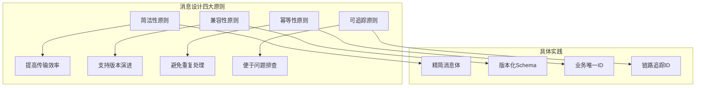
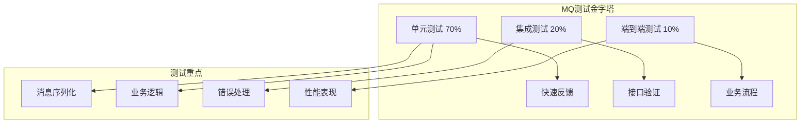
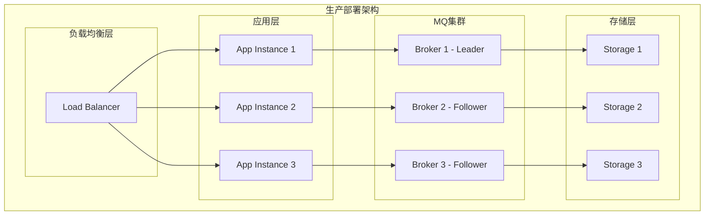
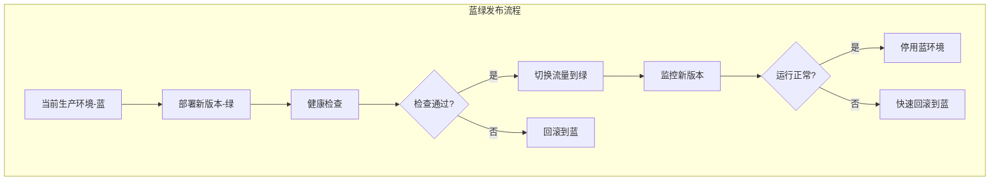
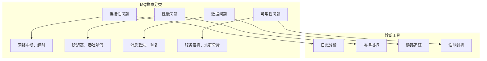
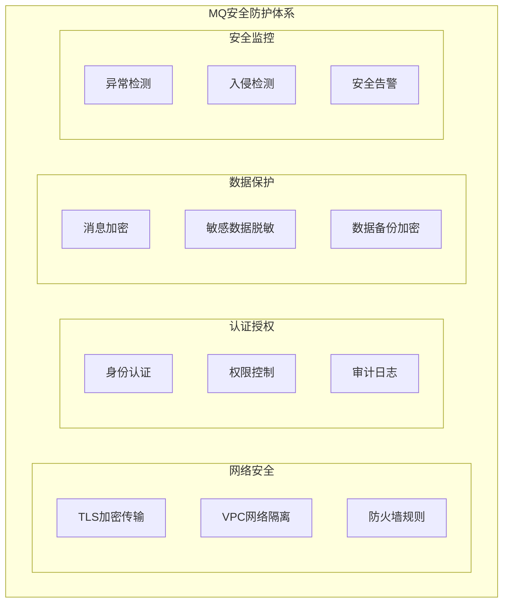
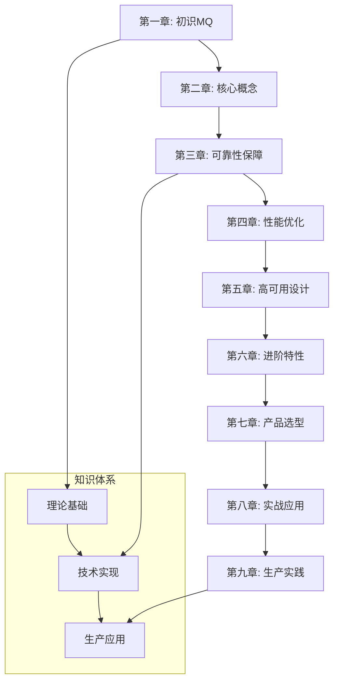

# 第九章 生产实践：从开发到上线的完整指南

> "千里之行，始于足下" —— 从理论到实践，这是技术人必经的修炼之路！ 🎯

## 本章学习目标 🎯

- 掌握消息设计与编码的最佳实践规范
- 学会构建完善的异步系统测试策略
- 理解MQ系统的部署运维和发布策略
- 掌握生产环境故障排查的方法和工具
- 了解MQ系统的安全防护和权限管理
- 完成从开发到生产的完整MQ实践闭环

---

## 9.1 开发规范：消息设计与编码最佳实践

基于前八章的理论基础，现在我们来制定生产级MQ系统的开发规范。

### 消息设计原则



#### 消息结构设计规范

**标准消息格式**

```json
{
  "header": {
    "messageId": "msg_20241225_001",
    "traceId": "trace_abc123",
    "timestamp": 1640419200000,
    "version": "v1.0",
    "source": "order-service",
    "eventType": "ORDER_CREATED"
  },
  "body": {
    "orderId": "order_123456",
    "userId": "user_789",
    "amount": 99.99,
    "items": [...]
  }
}
```

**设计规范对比**

| 规范项目 | ✅ 推荐做法 | ❌ 不推荐做法 | 原因说明 |
|----------|-------------|---------------|----------|
| **消息大小** | < 1MB，核心数据 | > 10MB，包含大文件 | 影响性能和稳定性 |
| **字段命名** | 驼峰命名，语义清晰 | 缩写，意义模糊 | 提高可读性和维护性 |
| **数据类型** | 明确类型定义 | 字符串承载一切 | 避免类型转换错误 |
| **版本管理** | 版本号+向后兼容 | 无版本控制 | 支持平滑升级 |

### 编码最佳实践

#### 1. 生产者编码规范

```pseudocode
# 消息生产者封装
class MessageProducer {
    function constructor(config) {
        this.mqClient = new MQClient(config)
        this.retryPolicy = new RetryPolicy({
            maxRetries: 3,
            backoffStrategy: 'exponential'
        })
    }
    
    function sendMessage(topic, message, options) {
        # 消息预处理
        processedMessage = this.preprocessMessage(message)
        
        # 参数校验
        this.validateMessage(processedMessage)
        
        # 发送with重试
        return this.retryPolicy.execute(() => {
            return this.mqClient.send(topic, processedMessage, options)
        })
    }
    
    function preprocessMessage(message) {
        return {
            ...message,
            header: {
                ...message.header,
                messageId: generateMessageId(),
                traceId: getCurrentTraceId(),
                timestamp: currentTime()
            }
        }
    }
}
```

#### 2. 消费者编码规范

```pseudocode
# 消息消费者封装
class MessageConsumer {
    function constructor(config) {
        this.mqClient = new MQClient(config)
        this.deadLetterHandler = new DeadLetterHandler()
    }
    
    function consume(topic, handler, options) {
        return this.mqClient.subscribe(topic, (message) => {
            try {
                # 消息预处理
                processedMessage = this.preprocessMessage(message)
                
                # 幂等性检查
                if (this.isDuplicate(processedMessage)) {
                    return this.ack(message)
                }
                
                # 业务处理
                handler(processedMessage)
                
                # 确认消息
                return this.ack(message)
                
            } catch (error) {
                return this.handleError(message, error)
            }
        }, options)
    }
    
    function handleError(message, error) {
        # 记录错误日志
        logger.error('Message processing failed', {
            messageId: message.header.messageId,
            error: error.message
        })
        
        # 重试逻辑
        if (message.retryCount < MAX_RETRY_COUNT) {
            return this.retry(message)
        }
        
        # 进入死信队列
        return this.deadLetterHandler.handle(message)
    }
}
```

### 配置管理规范

#### 环境配置分离

```yaml
# config/production.yml
mq:
  brokers: 
    - "broker1.prod.com:9092"
    - "broker2.prod.com:9092"
  security:
    enabled: true
    protocol: "SASL_SSL"
  performance:
    batchSize: 1000
    maxWaitTime: 100
    
# config/development.yml  
mq:
  brokers:
    - "localhost:9092"
  security:
    enabled: false
  performance:
    batchSize: 10
    maxWaitTime: 1000
```

---

## 9.2 测试策略：如何测试异步系统

异步系统的测试面临着时序性、并发性等挑战，需要特殊的测试策略。

### 测试金字塔架构



#### 1. 单元测试策略

**消息处理逻辑测试**

```pseudocode
# 测试消息处理器
describe('OrderMessageHandler', () => {
    handler = null
    mockRepository = null
    
    beforeEach(() => {
        mockRepository = createMock('./OrderRepository')
        handler = new OrderMessageHandler(mockRepository)
    })
    
    test('should process valid order message', () => {
        # 准备测试数据
        message = {
            header: { messageId: 'test-001', eventType: 'ORDER_CREATED' },
            body: { orderId: '12345', amount: 99.99 }
        }
        
        # 执行测试
        handler.handle(message)
        
        # 验证结果
        expect(mockRepository.save).toHaveBeenCalledWith(
            objectContaining({
                orderId: '12345',
                amount: 99.99
            })
        )
    })
    
    test('should handle invalid message gracefully', () => {
        invalidMessage = { body: {} }
        
        expect(() => handler.handle(invalidMessage))
            .toThrow('Invalid message format')
    })
})
```

#### 2. 集成测试策略

**使用测试容器模拟MQ环境**

```pseudocode
# 集成测试示例
describe('Order Processing Integration', () => {
    mqContainer = null
    producer = null
    consumer = null
    
    beforeAll(() => {
        # 启动测试用MQ容器
        mqContainer = new TestContainer('kafka:latest')
            .withExposedPorts(9092)
        mqContainer.start()
        
        # 初始化生产者和消费者
        brokerUrl = "localhost:" + mqContainer.getMappedPort(9092)
        producer = new MessageProducer({ brokers: [brokerUrl] })
        consumer = new MessageConsumer({ brokers: [brokerUrl] })
    })
    
    afterAll(() => {
        mqContainer.stop()
    })
    
    test('should process order end-to-end', () => {
        processedMessage = null
        
        # 设置消费者
        consumer.consume('order-events', (message) => {
            processedMessage = message
        })
        
        # 发送消息
        orderMessage = createTestOrderMessage()
        producer.sendMessage('order-events', orderMessage)
        
        # 等待消息处理
        waitFor(() => processedMessage != null, { timeout: 5000 })
        
        # 验证结果
        expect(processedMessage.body.orderId).toBe(orderMessage.body.orderId)
    })
})
```

#### 3. 性能测试策略

**负载测试框架**

```pseudocode
# 性能测试脚本
class MQPerformanceTest {
    function constructor(config) {
        this.producer = new MessageProducer(config)
        this.metrics = new MetricsCollector()
    }
    
    function runThroughputTest(options) {
        messageCount = options.messageCount
        concurrency = options.concurrency
        messageSize = options.messageSize
        
        startTime = currentTime()
        promises = []
        
        for (i = 0; i < concurrency; i++) {
            promises.push(this.sendMessages(messageCount / concurrency, messageSize))
        }
        
        waitForAll(promises)
        
        endTime = currentTime()
        duration = endTime - startTime
        
        return {
            totalMessages: messageCount,
            duration: duration,
            throughput: messageCount / (duration / 1000),
            avgLatency: this.metrics.getAverageLatency()
        }
    }
    
    function sendMessages(count, size) {
        for (i = 0; i < count; i++) {
            message = generateTestMessage(size)
            this.producer.sendMessage('test-topic', message)
        }
    }
}
```

### 测试环境管理

| 环境类型 | 用途 | MQ配置 | 数据策略 |
|----------|------|--------|----------|
| **单元测试** | 逻辑验证 | Mock对象 | 内存数据 |
| **集成测试** | 接口测试 | 测试容器 | 临时数据 |
| **性能测试** | 压力测试 | 独立集群 | 模拟数据 |
| **预发布环境** | 验收测试 | 生产镜像 | 脱敏数据 |

---

## 9.3 部署运维：环境配置与发布策略

生产环境的部署运维需要考虑高可用、可扩展、可监控等多个维度。

### 部署架构设计



#### 容器化部署配置

**Docker配置**

```dockerfile
# Dockerfile
FROM openjdk:11-jre-slim

# 应用配置
COPY target/mq-application.jar /app/app.jar
COPY config/ /app/config/

# 环境变量
ENV MQ_BROKERS=""
ENV LOG_LEVEL="INFO"
ENV HEAP_SIZE="2g"

# 健康检查
HEALTHCHECK --interval=30s --timeout=3s --start-period=5s --retries=3 \
  CMD curl -f http://localhost:8080/health || exit 1

# 启动命令
ENTRYPOINT ["java", "-Xmx${HEAP_SIZE}", "-jar", "/app/app.jar"]
```

**Docker Compose编排**

```yaml
# docker-compose.prod.yml
version: '3.8'

services:
  app:
    image: mq-app:latest
    deploy:
      replicas: 3
      update_config:
        parallelism: 1
        delay: 30s
        failure_action: rollback
      rollback_config:
        parallelism: 1
        delay: 30s
      restart_policy:
        condition: on-failure
        delay: 5s
        max_attempts: 3
    environment:
      - MQ_BROKERS=kafka1:9092,kafka2:9092,kafka3:9092
      - LOG_LEVEL=INFO
    healthcheck:
      test: ["CMD", "curl", "-f", "http://localhost:8080/health"]
      interval: 30s
      timeout: 3s
      retries: 3
      start_period: 40s
    
  kafka:
    image: confluentinc/cp-kafka:latest
    deploy:
      replicas: 3
    environment:
      KAFKA_ZOOKEEPER_CONNECT: zoo1:2181
      KAFKA_ADVERTISED_LISTENERS: PLAINTEXT://kafka:9092
      KAFKA_OFFSETS_TOPIC_REPLICATION_FACTOR: 3
    volumes:
      - kafka-data:/var/lib/kafka/data
    
volumes:
  kafka-data:
    external: true
```

#### Kubernetes部署配置

**应用部署清单**

```yaml
# k8s-deployment.yml
apiVersion: apps/v1
kind: Deployment
metadata:
  name: mq-application
  labels:
    app: mq-application
spec:
  replicas: 3
  strategy:
    type: RollingUpdate
    rollingUpdate:
      maxSurge: 1
      maxUnavailable: 0
  selector:
    matchLabels:
      app: mq-application
  template:
    metadata:
      labels:
        app: mq-application
    spec:
      containers:
      - name: app
        image: mq-app:v1.0.0
        ports:
        - containerPort: 8080
        env:
        - name: MQ_BROKERS
          valueFrom:
            configMapKeyRef:
              name: mq-config
              key: brokers
        resources:
          requests:
            memory: "1Gi"
            cpu: "500m"
          limits:
            memory: "2Gi"
            cpu: "1000m"
        livenessProbe:
          httpGet:
            path: /health
            port: 8080
          initialDelaySeconds: 30
          periodSeconds: 10
        readinessProbe:
          httpGet:
            path: /ready
            port: 8080
          initialDelaySeconds: 5
          periodSeconds: 5
```

### 发布策略

#### 蓝绿发布流程



**发布检查清单**

| 检查项目 | 检查内容 | 通过标准 | 负责人 |
|----------|----------|----------|--------|
| **代码质量** | 单元测试覆盖率 | ≥ 80% | 开发 |
| **性能测试** | 吞吐量基准测试 | 不低于基线 | 测试 |
| **安全扫描** | 依赖安全漏洞扫描 | 无高危漏洞 | 安全 |
| **配置检查** | 生产配置审核 | 配置正确 | 运维 |
| **监控就绪** | 监控告警配置 | 告警正常 | 运维 |

---

## 9.4 故障排查：常见问题诊断与解决

生产环境中MQ系统可能遇到各种故障，需要建立系统的排查和解决流程。

### 故障分类与诊断流程



#### 常见故障排查手册

**1. 消息积压问题**

*症状表现*
- 队列长度持续增长
- 消费延迟不断增加
- 系统响应变慢

*排查步骤*

```bash
# 1. 检查队列积压情况
kafka-consumer-groups.sh --bootstrap-server localhost:9092 \
    --describe --group your-consumer-group

# 2. 检查消费者状态
curl http://localhost:8080/metrics/consumers

# 3. 分析消费者日志
tail -f /var/log/app/consumer.log | grep ERROR

# 4. 检查系统资源
top -p $(pgrep -f consumer)
iostat -x 1
```

*解决方案*

| 原因分析 | 解决方案 | 实施步骤 |
|----------|----------|----------|
| **消费能力不足** | 增加消费者实例 | 水平扩容，监控效果 |
| **消费逻辑缓慢** | 优化业务代码 | 性能剖析，代码重构 |
| **外部依赖慢** | 增加超时熔断 | 实施熔断器模式 |
| **消息格式异常** | 修复消息解析 | 增强错误处理逻辑 |

**2. 消息丢失问题**

*排查工具脚本*

```python
# 消息丢失排查脚本
class MessageLossDetector:
    def __init__(self, config):
        self.producer_logs = LogAnalyzer(config.producer_log_path)
        self.consumer_logs = LogAnalyzer(config.consumer_log_path)
        self.mq_metrics = MetricsCollector(config.mq_endpoint)
    
    def detect_message_loss(self, time_range):
        # 分析生产者发送记录
        sent_messages = self.producer_logs.get_sent_messages(time_range)
        
        # 分析消费者处理记录
        processed_messages = self.consumer_logs.get_processed_messages(time_range)
        
        # 分析MQ存储情况
        stored_messages = self.mq_metrics.get_stored_messages(time_range)
        
        # 对比分析
        lost_in_sending = sent_messages - stored_messages
        lost_in_consuming = stored_messages - processed_messages
        
        return {
            'lost_in_sending': lost_in_sending,
            'lost_in_consuming': lost_in_consuming,
            'total_loss_rate': (len(lost_in_sending) + len(lost_in_consuming)) / len(sent_messages)
        }
```

**3. 性能瓶颈排查**

*性能分析脚本*

```bash
#!/bin/bash
# MQ性能诊断脚本

echo "=== MQ性能诊断报告 ==="

# CPU使用情况
echo "1. CPU使用情况:"
top -bn1 | grep "mq\|kafka\|rabbit" | head -5

# 内存使用情况  
echo "2. 内存使用情况:"
ps aux | grep -E "mq|kafka|rabbit" | awk '{sum+=$6} END {print "Total Memory: " sum/1024 " MB"}'

# 网络连接情况
echo "3. 网络连接情况:"
netstat -an | grep :9092 | wc -l

# 磁盘I/O情况
echo "4. 磁盘I/O情况:"
iostat -x 1 1 | grep -A 10 "Device"

# JVM堆内存使用
echo "5. JVM堆内存使用:"
jstat -gc $(pgrep -f kafka) | tail -1
```

### 故障预防机制

#### 健康检查体系

```pseudocode
# 健康检查实现
class MQHealthChecker {
    function constructor(mqClient) {
        this.mqClient = mqClient
        this.checks = [
            new ConnectivityCheck(),
            new ProducerHealthCheck(),
            new ConsumerHealthCheck(),
            new ResourceCheck()
        ]
    }
    
    function performHealthCheck() {
        results = executeAllChecks(
            this.checks.map(check => check.execute())
        )
        
        healthReport = {
            status: 'HEALTHY',
            timestamp: currentTime(),
            checks: {}
        }
        
        for (i = 0; i < results.length; i++) {
            checkName = this.checks[i].name
            if (results[i].status == 'fulfilled') {
                healthReport.checks[checkName] = results[i].value
            } else {
                healthReport.checks[checkName] = {
                    status: 'UNHEALTHY',
                    error: results[i].reason.message
                }
                healthReport.status = 'UNHEALTHY'
            }
        }
        
        return healthReport
    }
}
```

---

## 9.5 安全考虑：认证、授权与数据保护

MQ系统的安全防护涉及多个层面，需要建立纵深防御体系。

### 安全架构设计



#### 1. 认证机制实现

**SASL认证配置**

```properties
# Kafka SASL配置
security.protocol=SASL_SSL
sasl.mechanism=SCRAM-SHA-256
sasl.jaas.config=org.apache.kafka.common.security.scram.ScramLoginModule required \
    username="mq-user" \
    password="secure-password";

# SSL配置
ssl.truststore.location=/path/to/kafka.client.truststore.jks
ssl.truststore.password=truststore-password
ssl.keystore.location=/path/to/kafka.client.keystore.jks
ssl.keystore.password=keystore-password
```

**JWT令牌认证**

```pseudocode
# JWT认证中间件
class JWTAuthMiddleware {
    function constructor(secretKey) {
        this.secretKey = secretKey
    }
    
    function authenticate(token) {
        try {
            decoded = jwt.verify(token, this.secretKey)
            return {
                valid: true,
                userId: decoded.sub,
                roles: decoded.roles,
                permissions: decoded.permissions
            }
        } catch (error) {
            return { valid: false, error: error.message }
        }
    }
    
    function authorize(userAuth, requiredPermission) {
        return userAuth.permissions.includes(requiredPermission)
    }
}
```

#### 2. 权限控制实现

**基于角色的访问控制（RBAC）**

```yaml
# 权限配置文件
roles:
  producer:
    permissions:
      - "topic:write:order-events"
      - "topic:write:user-events"
    
  consumer:
    permissions:
      - "topic:read:order-events"
      - "consumer-group:join:order-processors"
    
  admin:
    permissions:
      - "topic:*:*"
      - "consumer-group:*:*"
      - "cluster:admin"

users:
  order-service:
    roles: ["producer"]
  notification-service:
    roles: ["consumer"]
  ops-team:
    roles: ["admin"]
```

**权限检查实现**

```pseudocode
class PermissionChecker {
    function constructor(permissions) {
        this.permissions = permissions
    }
    
    function checkTopicAccess(user, action, topic) {
        userPermissions = this.getUserPermissions(user)
        
        for (permission in userPermissions) {
            parts = permission.split(':')
            resource = parts[0]
            permAction = parts[1] 
            permTopic = parts[2]
            
            if (resource == 'topic' && 
               (permAction == '*' || permAction == action) &&
               (permTopic == '*' || permTopic == topic)) {
                return true
            }
        }
        return false
    }
    
    function checkConsumerGroupAccess(user, action, group) {
        userPermissions = this.getUserPermissions(user)
        
        for (permission in userPermissions) {
            parts = permission.split(':')
            resource = parts[0]
            permAction = parts[1]
            permGroup = parts[2]
            
            if (resource == 'consumer-group' && 
               (permAction == '*' || permAction == action) &&
               (permGroup == '*' || permGroup == group)) {
                return true
            }
        }
        return false
    }
}
```

#### 3. 数据加密保护

**消息端到端加密**

```pseudocode
# 消息加密服务
class MessageEncryption {
    function constructor(encryptionKey) {
        this.algorithm = 'aes-256-gcm'
        this.key = crypto.scryptSync(encryptionKey, 'salt', 32)
    }
    
    function encryptMessage(message) {
        iv = crypto.randomBytes(16)
        cipher = crypto.createCipher(this.algorithm, this.key, iv)
        
        encrypted = cipher.update(stringify(message), 'utf8', 'hex')
        encrypted += cipher.final('hex')
        
        authTag = cipher.getAuthTag()
        
        return {
            encrypted: encrypted,
            iv: iv.toString('hex'),
            authTag: authTag.toString('hex')
        }
    }
    
    function decryptMessage(encryptedData) {
        decipher = crypto.createDecipher(
            this.algorithm, 
            this.key, 
            bufferFromHex(encryptedData.iv)
        )
        
        decipher.setAuthTag(bufferFromHex(encryptedData.authTag))
        
        decrypted = decipher.update(encryptedData.encrypted, 'hex', 'utf8')
        decrypted += decipher.final('utf8')
        
        return parseJSON(decrypted)
    }
}
```

#### 4. 安全监控与告警

**安全事件监控**

```pseudocode
# 安全事件监控
class SecurityMonitor {
    function constructor() {
        this.eventHandlers = new Map()
        this.initializeHandlers()
    }
    
    function initializeHandlers() {
        this.eventHandlers.set('AUTHENTICATION_FAILURE', this.handleAuthFailure)
        this.eventHandlers.set('UNAUTHORIZED_ACCESS', this.handleUnauthorizedAccess)
        this.eventHandlers.set('SUSPICIOUS_ACTIVITY', this.handleSuspiciousActivity)
    }
    
    function recordSecurityEvent(eventType, details) {
        event = {
            type: eventType,
            timestamp: currentTime(),
            details: details,
            severity: this.getSeverity(eventType)
        }
        
        # 记录到安全日志
        this.logSecurityEvent(event)
        
        # 触发告警
        if (event.severity >= 'HIGH') {
            this.triggerAlert(event)
        }
        
        # 执行对应处理器
        handler = this.eventHandlers.get(eventType)
        if (handler) {
            handler(event)
        }
    }
    
    function handleAuthFailure(event) {
        # 统计失败次数，必要时锁定账户
        failureCount = this.getFailureCount(event.details.user)
        if (failureCount > 5) {
            this.lockUser(event.details.user)
        }
    }
    
    function handleUnauthorizedAccess(event) {
        # 记录违规访问，分析攻击模式
        this.analyzeAccessPattern(event.details)
    }
}
```

### 安全配置检查清单

| 安全项目 | 检查内容 | 配置要求 | 风险等级 |
|----------|----------|----------|----------|
| **传输加密** | TLS/SSL配置 | 强制HTTPS | 🔴 高危 |
| **身份认证** | 认证机制 | 双因子认证 | 🔴 高危 |
| **权限控制** | RBAC配置 | 最小权限原则 | 🟡 中危 |
| **审计日志** | 日志记录 | 完整操作记录 | 🟡 中危 |
| **数据加密** | 敏感数据 | 端到端加密 | 🔴 高危 |
| **网络隔离** | 防火墙规则 | 白名单访问 | 🟡 中危 |

---

## 本章总结

经过九章的系统学习，我们完成了从MQ基础概念到生产实践的完整修炼之路：

### 🎯 九章精华回顾



### 关键能力获得

通过本章的学习，你已经掌握了：

- ✅ **开发规范**：消息设计和编码的最佳实践
- ✅ **测试策略**：异步系统的完整测试方法  
- ✅ **部署运维**：从容器化到Kubernetes的部署实践
- ✅ **故障排查**：生产环境问题诊断和解决能力
- ✅ **安全防护**：认证授权和数据保护的实现

### 后续发展建议

1. **深入特定MQ产品**：根据实际需要深入学习Kafka、RabbitMQ等
2. **关注新技术趋势**：如事件流处理、Serverless消息服务
3. **参与开源社区**：贡献代码，学习最佳实践
4. **构建技术影响力**：分享经验，帮助他人成长

---

## 下一步行动

🚀 **恭喜你完成了《消息队列实战指南》的完整学习！**

现在你已经：
- 🎯 掌握了MQ的核心理论和实践技能
- 🛠️ 具备了解决复杂业务场景的能力  
- 🏗️ 建立了生产级系统的设计和运维能力
- 🔒 了解了安全防护的重要性和实现方法

**九章通MQ之道，从此异步通信无难事！** 

祝你在技术成长的道路上不断精进，用所学知识创造更大的价值！ ⚡️

---

*"路漫漫其修远兮，吾将上下而求索" —— 技术学习永无止境，愿你保持初心，持续前行！* 🌟