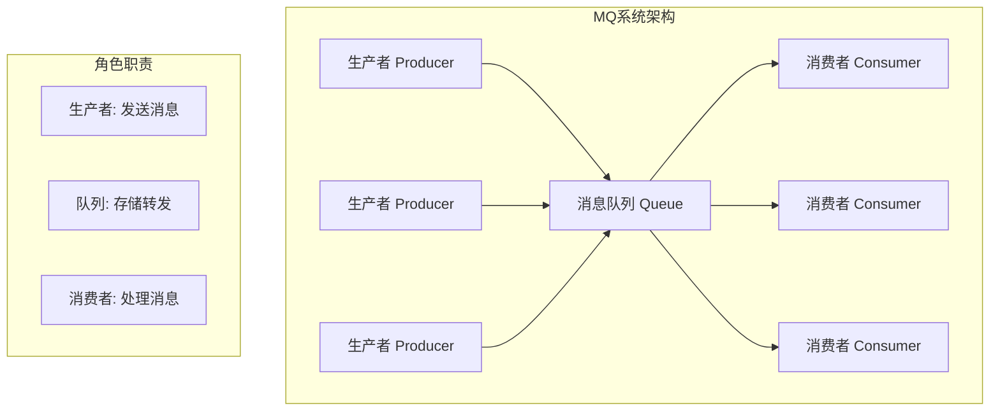
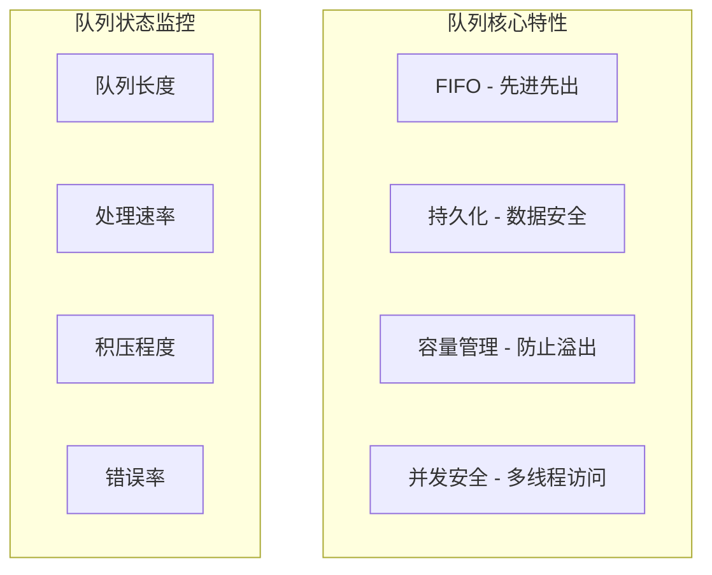
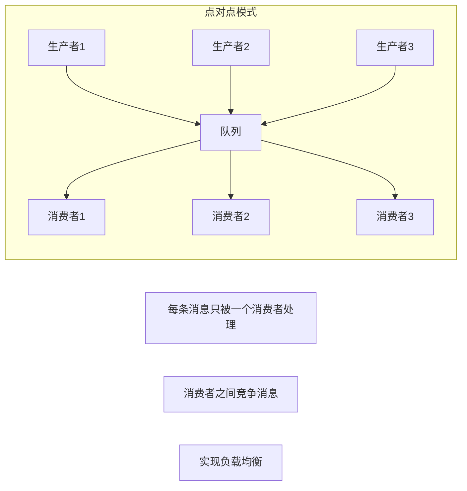
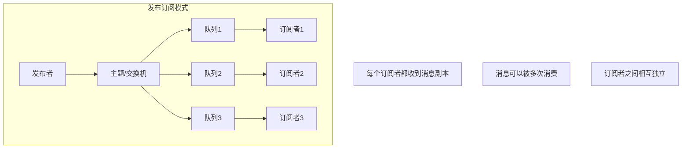
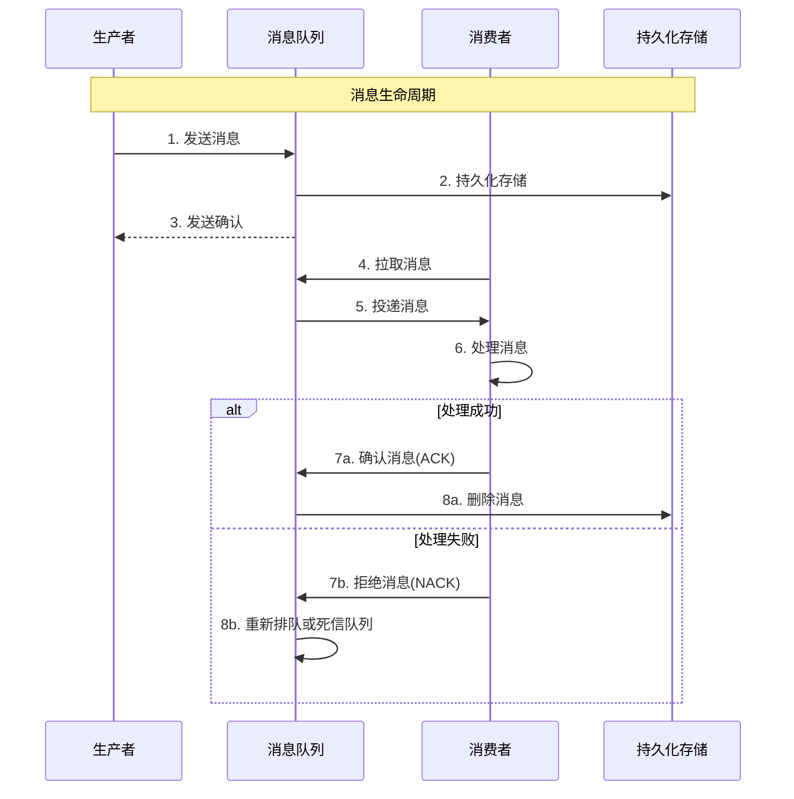
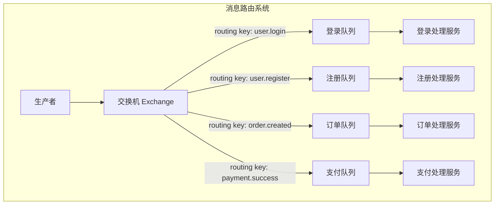

# 第二章 核心概念：掌握MQ的基本功

> "万丈高楼平地起" —— 扎实的基础概念是深入掌握MQ的前提！ 🏗️

## 本章学习目标 🎯

- 深入理解生产者、消费者、队列三要素的工作机制
- 掌握点对点和发布订阅两种基本通信模式的应用场景
- 跟踪消息从发送到消费的完整生命周期
- 理解交换机与路由的智能消息投递机制
- 为后续可靠性设计和性能优化打下坚实基础

---

## 2.1 生产者、消费者、队列：MQ的三要素

### MQ架构全景图

正如第一章提到的餐厅点餐例子，MQ系统也有三个核心角色：



### 🏭 生产者（Producer）：消息的制造者

生产者负责创建和发送消息，就像工厂生产产品一样。

#### 生产者的核心职责

| 职责 | 说明 | 代码示例 |
|------|------|----------|
| **消息创建** | 构造具有特定格式的消息 | `message = createMessage(data)` |
| **连接管理** | 建立和维护与MQ的连接 | `connection = connect(mqServer)` |
| **消息发送** | 将消息投递到指定队列 | `producer.send(queue, message)` |
| **异常处理** | 处理发送失败等异常情况 | `try...catch` |

#### 生产者实现模式

#### 生产者实现模式

```java
// 1. 同步发送：等待确认
class SyncProducer {
    public Result sendMessage(String queue, Object data) {
        Message message = createMessage(data);
        return connection.send(queue, message);  // 阻塞等待
    }
}

// 2. 异步发送：立即返回
class AsyncProducer {
    public String sendMessage(String queue, Object data, Callback callback) {
        Message message = createMessage(data);
        connection.sendAsync(queue, message, callback);
        return message.id;  // 立即返回
    }
}

// 3. 批量发送：提高效率
class BatchProducer {
    private List<Message> buffer = new ArrayList<>();
    
    public void sendMessage(String queue, Object data) {
        buffer.add(createMessage(data));
        if (buffer.size() >= BATCH_SIZE) {
            connection.sendBatch(queue, buffer);
            buffer.clear();
        }
    }
}
```
```

### 📦 消息队列（Queue）：可靠的中间人

队列是消息的临时存储和转发中心，保证消息在生产者和消费者之间可靠传递。

#### 队列的核心特性



#### 队列的工作机制

#### 队列的工作机制

```java
// 基本队列实现
class MessageQueue {
    private final Queue<Message> messages = new ConcurrentLinkedQueue<>();
    private final int maxSize;
    
    public synchronized void enqueue(Message message) {
        if (messages.size() >= maxSize) {
            throw new QueueFullException("队列已满");
        }
        messages.offer(message);
    }
    
    public synchronized Message dequeue() {
        return messages.poll();  // FIFO取出
    }
}

// 持久化队列
class PersistentQueue extends MessageQueue {
    private final FileStorage storage;
    
    @Override
    public void enqueue(Message message) {
        super.enqueue(message);
        storage.save(message);  // 持久化
    }
    
    @Override
    public Message dequeue() {
        Message message = super.dequeue();
        if (message != null) {
            storage.remove(message.id);  // 从磁盘删除
        }
        return message;
    }
}
```
```

### 🤖 消费者（Consumer）：消息的处理者

消费者从队列中获取消息并进行业务处理，就像工人从传送带上取产品进行加工。

#### 消费者的核心职责

| 职责 | 说明 | 重要性 |
|------|------|--------|
| **消息拉取** | 从队列中获取待处理消息 | ⭐⭐⭐⭐⭐ |
| **业务处理** | 执行具体的业务逻辑 | ⭐⭐⭐⭐⭐ |
| **确认机制** | 告知队列消息已处理完成 | ⭐⭐⭐⭐ |
| **错误处理** | 处理失败消息的重试和告警 | ⭐⭐⭐⭐ |

#### 消费者实现模式

#### 消费者实现模式

```java
// 1. 拉取模式：主动获取消息
class PullConsumer {
    public void start() {
        while (running) {
            Message message = connection.receive(queueName, 1000);
            if (message != null) {
                processMessage(message);
            }
        }
    }
    
    private void processMessage(Message message) {
        try {
            Result result = processor.process(message.data);
            if (result.success) {
                connection.ack(message.id);  // 确认处理
            } else {
                connection.nack(message.id); // 拒绝消息
            }
        } catch (Exception e) {
            connection.nack(message.id);
        }
    }
}

// 2. 推送模式：被动接收消息
class PushConsumer {
    public void start() {
        connection.subscribe(queueName, this::onMessage);
    }
    
    private void onMessage(Message message) {
        // 异步处理避免阻塞
        executor.submit(() -> processMessage(message));
    }
}

// 3. 并发消费：多线程处理
class ConcurrentConsumer {
    private final ExecutorService workers = 
        Executors.newFixedThreadPool(workerCount);
    
    public void start() {
        while (running) {
            Message message = connection.receive(queueName);
            if (message != null) {
                workers.submit(() -> processMessage(message));
            }
        }
    }
}
```
```

---

## 2.2 点对点 vs 发布订阅：两种基本模式

消息队列有两种基本的通信模式，就像寄信有平信和群发邮件两种方式。

### 📮 点对点模式（Point-to-Point）

点对点模式就像寄快递：一个发件人，一个收件人，消息只能被消费一次。



#### 点对点模式的特点

| 特点 | 说明 | 应用场景 |
|------|------|----------|
| **消息唯一性** | 每条消息只被一个消费者处理 | 订单处理、任务分发 |
| **负载均衡** | 多个消费者自动分担负载 | 高并发处理 |
| **竞争消费** | 消费者之间竞争获取消息 | 工作队列 |
| **消息确认** | 处理完成后消息从队列删除 | 确保不重复处理 |

#### 实战示例：订单处理系统

```pseudocode
#### 实战示例：订单处理系统

```java
// 订单生产者
class OrderProducer {
    public String submitOrder(OrderData orderData) {
        OrderMessage message = new OrderMessage(
            orderData.id, orderData.userId, 
            orderData.items, orderData.totalAmount
        );
        
        orderQueue.send("order_processing", message);
        return "订单提交成功，正在处理中";
    }
}

// 订单消费者
class OrderConsumer {
    public void processOrder(OrderMessage message) {
        try {
            // 业务处理流程
            validateOrder(message);
            inventoryService.reduceStock(message.items);
            paymentService.createPayment(message.totalAmount);
            orderService.updateStatus(message.orderId, "PROCESSING");
            
            log("订单处理完成: " + message.orderId);
        } catch (Exception e) {
            log("订单处理失败: " + e.getMessage());
            alertService.sendAlert("订单处理失败", message);
        }
    }
}

// 负载均衡：多个消费者实例
consumer1.start();  // 处理订单 1, 4, 7...
consumer2.start();  // 处理订单 2, 5, 8...
consumer3.start();  // 处理订单 3, 6, 9...
```
```

### 📡 发布订阅模式（Publish-Subscribe）

发布订阅模式就像电视台广播：一个发布者，多个订阅者，每个订阅者都能收到完整的消息。



#### 发布订阅模式的特点

| 特点 | 说明 | 应用场景 |
|------|------|----------|
| **消息复制** | 每个订阅者都收到消息副本 | 事件通知、数据同步 |
| **解耦发布** | 发布者不知道谁在订阅 | 系统集成、微服务通信 |
| **动态订阅** | 可以随时增加或删除订阅者 | 插件系统、监控告警 |
| **主题过滤** | 可以基于主题选择性订阅 | 分类消息处理 |

#### 实战示例：用户行为事件系统

```pseudocode
#### 实战示例：用户行为事件系统

```java
// 事件发布者
class UserEventPublisher {
    public void publishUserEvent(String userId, String eventType, Object eventData) {
        UserEvent event = new UserEvent(userId, eventType, eventData, System.currentTimeMillis());
        eventTopic.publish("user.events", event);
    }
}

// 订阅者1：推荐系统
@EventSubscriber("user.events")
class RecommendationSubscriber {
    public void onUserEvent(UserEvent event) {
        if (Arrays.asList("BROWSE", "PURCHASE", "SEARCH").contains(event.eventType)) {
            // 更新用户画像和推荐
            userProfile.updateInterests(event.userId, event.eventData);
            List<Product> recommendations = recommendationEngine.compute(event.userId);
            pushService.sendRecommendations(event.userId, recommendations);
        }
    }
}

// 订阅者2：数据统计
@EventSubscriber("user.events")
class AnalyticsSubscriber {
    public void onUserEvent(UserEvent event) {
        // 统计更新
        statisticsDB.increment("daily_" + event.eventType);
        
        // 异常检测
        if ("LOGIN".equals(event.eventType)) {
            String location = geoIP.getLocation(event.eventData.ip);
            if (fraudDetection.isSuspicious(event.userId, location)) {
                alertService.sendSecurityAlert(event.userId, location);
            }
        }
    }
}

// 订阅者3：审计日志
@EventSubscriber("user.events")
class AuditSubscriber {
    public void onUserEvent(UserEvent event) {
        AuditLog auditLog = new AuditLog(event.userId, event.eventType, 
                                        event.timestamp, event.eventData);
        auditDatabase.save(auditLog);
        
        if (complianceChecker.needsReview(event)) {
            complianceQueue.send(auditLog);
        }
    }
}
```
```

### 模式选择指南

| 场景类型 | 推荐模式 | 原因 |
|----------|----------|------|
| **任务分发** | 点对点 | 每个任务只需要处理一次 |
| **负载均衡** | 点对点 | 多个处理者分担负载 |
| **事件通知** | 发布订阅 | 多个系统需要响应同一事件 |
| **数据同步** | 发布订阅 | 多个目标需要同步数据 |
| **系统集成** | 发布订阅 | 解耦不同子系统 |
| **日志收集** | 发布订阅 | 多个分析系统处理同一日志 |

---

## 2.3 消息的生命周期：从发送到消费

理解消息的完整生命周期对于设计可靠的MQ系统至关重要，就像了解快递从发件到签收的全过程。

### 消息生命周期全景图



### 阶段一：消息创建与发送

#### 消息创建与预处理

```java
// 消息构造
public Message createMessage(Object data) {
    return Message.builder()
        .id(UUID.randomUUID().toString())
        .timestamp(System.currentTimeMillis())
        .ttl(3600000)  // 1小时过期
        .payload(data)
        .persistent(true)
        .retryCount(0)
        .maxRetries(3)
        .build();
}

// 消息预处理
class MessagePreprocessor {
    public Message preprocess(Message message) {
        validateMessage(message);
        
        // 大消息压缩
        if (message.payload.size() > 1024) {
            message.payload = compress(message.payload);
            message.compressed = true;
        }
        
        // 敏感数据加密
        if (message.sensitive) {
            message.payload = encrypt(message.payload);
        }
        
        return message;
    }
}
```
```

### 阶段二：消息存储与确认

#### 消息存储与确认

```java
// 持久化存储
class MessageStorage {
    @Transactional
    public void store(Message message) {
        // 存储消息内容
        MessageRecord record = new MessageRecord(
            message.id, message.payload, "PENDING", 
            message.timestamp, message.timestamp + message.ttl
        );
        database.insert("messages", record);
        
        // 更新队列索引
        QueueIndex index = new QueueIndex(
            message.targetQueue, message.id, message.priority
        );
        database.insert("queue_index", index);
    }
}

// 发送确认机制
class PublisherConfirm {
    private final Map<String, PendingConfirm> pendingConfirms = new ConcurrentHashMap<>();
    
    public String sendWithConfirm(Message message, ConfirmCallback callback) {
        String confirmId = UUID.randomUUID().toString();
        
        // 记录待确认消息
        pendingConfirms.put(confirmId, new PendingConfirm(message, callback));
        
        // 发送消息
        message.confirmId = confirmId;
        connection.send(message);
        
        // 超时处理
        scheduler.schedule(() -> handleTimeout(confirmId), 30, TimeUnit.SECONDS);
        
        return confirmId;
    }
    
    public void onConfirmReceived(String confirmId, boolean success) {
        PendingConfirm confirm = pendingConfirms.remove(confirmId);
        if (confirm != null) {
            if (success) {
                confirm.callback.onSuccess(confirm.message.id);
            } else {
                confirm.callback.onFailure(confirm.message.id);
            }
        }
    }
}
```
```

### 阶段三：消息投递与消费

#### 消息投递与处理

```java
// 智能投递策略
class MessageDelivery {
    public void deliverMessage(Consumer consumer) {
        while (consumer.isActive()) {
            Message message = selectMessage(consumer);
            if (message != null) {
                attemptDelivery(consumer, message);
            } else {
                Thread.sleep(100);  // 无消息时休眠
            }
        }
    }
    
    private Message selectMessage(Consumer consumer) {
        // 基于消费者负载选择消息
        if (consumer.getPrefetchCount() >= consumer.getMaxPrefetch()) {
            return null;
        }
        
        return consumer.getProcessingCapacity() < 0.8 ? 
            selectHighPriorityMessage(consumer.getQueueName()) :
            selectNormalMessage(consumer.getQueueName());
    }
}

// 消费者消息处理
class MessageProcessor {
    public void handleMessage(Message message) {
        long startTime = System.currentTimeMillis();
        
        try {
            // 消息预处理（解压缩、解密、反序列化）
            Message processedMessage = preprocessMessage(message);
            
            // 业务处理
            Result result = businessLogic.process(processedMessage);
            
            if (result.success) {
                acknowledgeMessage(message.id);
                recordMetrics("message_processed", System.currentTimeMillis() - startTime);
            } else {
                handleBusinessFailure(message, result.error);
            }
        } catch (Exception e) {
            handleSystemException(message, e);
        }
    }
    
    private void handleBusinessFailure(Message message, String error) {
        message.retryCount++;
        
        if (message.retryCount <= message.maxRetries) {
            // 指数退避重试
            long delay = 1000 * (long) Math.pow(2, message.retryCount - 1);
            scheduleRetry(message, Math.min(delay, 60000));
        } else {
            sendToDeadLetterQueue(message, error);
        }
    }
}
```

### 阶段四：消息确认与清理

#### 消息确认与清理

```java
class MessageAcknowledgment {
    @Transactional
    public void acknowledgeMessage(String messageId) {
        // 更新消息状态
        database.update("messages", Map.of(
            "id", messageId,
            "status", "ACKNOWLEDGED",
            "acknowledgedAt", System.currentTimeMillis()
        ));
        
        // 从队列索引删除
        database.delete("queue_index", Map.of("messageId", messageId));
        
        // 更新统计
        database.increment("consumer_stats", Map.of(
            "consumerId", getCurrentConsumerId(),
            "processedCount", 1
        ));
    }
    
    @Scheduled(fixedRate = 3600000)  // 每小时执行
    public void cleanupAcknowledgedMessages() {
        long cutoffTime = System.currentTimeMillis() - 24 * 3600 * 1000;
        
        int deletedCount = database.delete("messages", Map.of(
            "status", "ACKNOWLEDGED",
            "acknowledgedAt", Map.of("$lt", cutoffTime)
        ));
        
        log("清理已确认消息: " + deletedCount + "条");
    }
}
```

---

## 2.4 交换机与路由：消息如何找到目的地

在第一章中，我们了解了MQ的基本作用。现在让我们深入了解消息是如何智能地找到正确目的地的。

### 路由系统架构



### 🔀 交换机（Exchange）：智能调度中心

交换机就像邮局的分拣中心，根据地址信息将邮件分发到正确的投递路线。

#### 交换机的基本类型

| 类型 | 路由规则 | 应用场景 | 特点 |
|------|----------|----------|------|
| **Direct** | 精确匹配路由键 | 点对点消息 | 简单直接 |
| **Topic** | 模式匹配路由键 | 分类订阅 | 灵活强大 |
| **Fanout** | 广播所有队列 | 全网通知 | 简单快速 |
| **Headers** | 匹配消息头属性 | 复杂路由 | 功能丰富 |

#### 1. Direct Exchange - 精确路由

```java
class DirectExchange {
    private final Map<String, List<String>> bindings = new HashMap<>();
    
    public void bind(String queueName, String routingKey) {
        bindings.computeIfAbsent(routingKey, k -> new ArrayList<>())
                .add(queueName);
    }
    
    public List<String> route(Message message) {
        List<String> targetQueues = bindings.get(message.routingKey);
        return targetQueues != null ? targetQueues : Collections.emptyList();
    }
}

// 使用示例
DirectExchange userExchange = new DirectExchange("user_events");

// 绑定路由
userExchange.bind("user_login_queue", "user.login");
userExchange.bind("user_register_queue", "user.register");

// 路由消息
Message message = new Message("user.login", loginData);
List<String> queues = userExchange.route(message);  // [“user_login_queue”]
```
```

#### 2. Topic Exchange - 模式匹配路由

```java
class TopicExchange {
    private final List<Binding> bindings = new ArrayList<>();
    
    public void bind(String queueName, String pattern) {
        bindings.add(new Binding(pattern, queueName));
    }
    
    public List<String> route(Message message) {
        return bindings.stream()
            .filter(binding -> matchPattern(message.routingKey, binding.pattern))
            .map(binding -> binding.queueName)
            .distinct()
            .collect(Collectors.toList());
    }
    
    private boolean matchPattern(String routingKey, String pattern) {
        // * 匹配一个单词，# 匹配多个单词
        String[] routingParts = routingKey.split("\\.");
        String[] patternParts = pattern.split("\\.");
        return matchParts(routingParts, 0, patternParts, 0);
    }
    
    private boolean matchParts(String[] routing, int rIndex, String[] pattern, int pIndex) {
        if (pIndex == pattern.length) return rIndex == routing.length;
        
        String currentPattern = pattern[pIndex];
        if ("#".equals(currentPattern)) {
            // # 匹配任意数量单词
            for (int i = rIndex; i <= routing.length; i++) {
                if (matchParts(routing, i, pattern, pIndex + 1)) return true;
            }
            return false;
        } else if ("*".equals(currentPattern)) {
            // * 匹配一个单词
            return rIndex < routing.length && 
                   matchParts(routing, rIndex + 1, pattern, pIndex + 1);
        } else {
            // 精确匹配
            return rIndex < routing.length && 
                   routing[rIndex].equals(currentPattern) &&
                   matchParts(routing, rIndex + 1, pattern, pIndex + 1);
        }
    }
}

// 使用示例
TopicExchange exchange = new TopicExchange("ecommerce_events");
exchange.bind("order_queue", "order.*");      // 所有订单事件
exchange.bind("audit_queue", "#");           // 所有事件

// 路由测试
List<String> queues = exchange.route(new Message("order.created", data));
// 结果: ["order_queue", "audit_queue"]
```
```

#### 3. Fanout Exchange - 广播路由

```java
class FanoutExchange {
    private final Set<String> boundQueues = new HashSet<>();
    
    public void bind(String queueName) {
        boundQueues.add(queueName);
    }
    
    public List<String> route(Message message) {
        // 忽略路由键，广播到所有队列
        return new ArrayList<>(boundQueues);
    }
}

// 使用示例：系统公告
FanoutExchange announcementExchange = new FanoutExchange("system_announcements");

// 绑定所有通知渠道
announcementExchange.bind("web_notification_queue");
announcementExchange.bind("mobile_push_queue");
announcementExchange.bind("email_queue");
announcementExchange.bind("sms_queue");

// 发送公告 - 所有队列都收到
Message announcement = new Message(null, maintenanceNotice);
List<String> allQueues = announcementExchange.route(announcement);
// 结果: [“web_notification_queue”, “mobile_push_queue”, “email_queue”, “sms_queue”]
```
```

### 🗺️ 路由键设计最佳实践

#### 路由键设计最佳实践

```java
// 推荐的层次化命名规范
String[] routingKeys = {
    // 业务域.操作.资源
    "user.created.profile",
    "user.updated.profile", 
    "user.deleted.profile",
    
    // 业务域.资源.操作
    "order.item.added",
    "order.payment.completed",
    
    // 系统.服务.事件
    "system.auth.login",
    "system.cache.cleared"
};

// 智能路由策略
class SmartRouter {
    public List<String> route(Message message) {
        // 基于优先级路由
        if ("HIGH".equals(message.priority)) {
            return routeToHighPriorityQueue(message.routingKey);
        }
        
        // 基于消息大小路由
        if (message.size > LARGE_MESSAGE_THRESHOLD) {
            return routeToLargeMessageQueue(message.routingKey);
        }
        
        // 基于负载均衡路由
        return routeWithLoadBalancing(message.routingKey);
    }
}

// 条件路由
class ConditionalRouter {
    public List<String> route(Message message) {
        List<String> queues = new ArrayList<>();
        
        // 根据业务条件选择队列
        if ("VIP".equals(message.userType)) {
            queues.add("vip_service_queue");
        }
        if (message.amount > 10000) {
            queues.add("high_value_queue");
        }
        
        return queues;
    }
}
```

---

## 本章总结

### 🎯 核心概念回顾

1. **MQ三要素**：
   - **生产者**：负责创建和发送消息，支持同步、异步、批量等多种发送模式
   - **队列**：可靠存储和转发消息，提供FIFO、持久化、并发控制等特性
   - **消费者**：从队列获取并处理消息，支持拉取、推送、并发等多种消费模式

2. **两种基本模式**：
   - **点对点**：一对一通信，消息只被一个消费者处理，适用于任务分发和负载均衡
   - **发布订阅**：一对多通信，消息被多个订阅者处理，适用于事件通知和数据同步

3. **消息生命周期**：从创建、发送、存储、投递到确认的完整流程，每个阶段都有相应的可靠性保障机制

4. **路由机制**：通过交换机和路由键实现消息的智能投递，支持精确匹配、模式匹配、广播等多种路由策略

### 💡 关键洞察

- **解耦的层次**：不仅是业务逻辑的解耦，还包括时间解耦、空间解耦、速度解耦
- **可靠性设计**：每个环节都需要考虑失败场景和恢复机制
- **性能优化**：批量处理、连接复用、智能路由都是提升性能的有效手段
- **模式选择**：根据业务场景选择合适的通信模式和路由策略

### 🔗 与下一章的关联

掌握了核心概念后，接下来第三章将深入探讨可靠性保障：

- **消息丢失的三种情况**：生产者、队列、消费者各个环节的可靠性问题
- **消息确认机制**：如何确保消息被正确处理  
- **死信队列**：如何处理失败消息
- **幂等性设计**：如何避免重复处理
- **事务消息**：如何保证强一致性

这些可靠性机制将在本章介绍的基础概念之上，构建真正生产可用的消息队列系统！

---

*🌟 "千里之行，始于足下。" 扎实的基础概念是构建复杂MQ系统的基石，让我们继续深入探索可靠性的奥秘！*