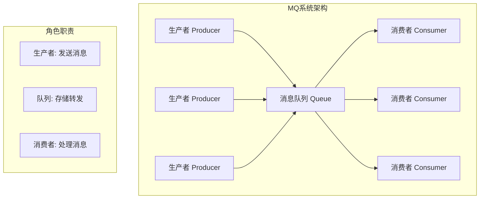
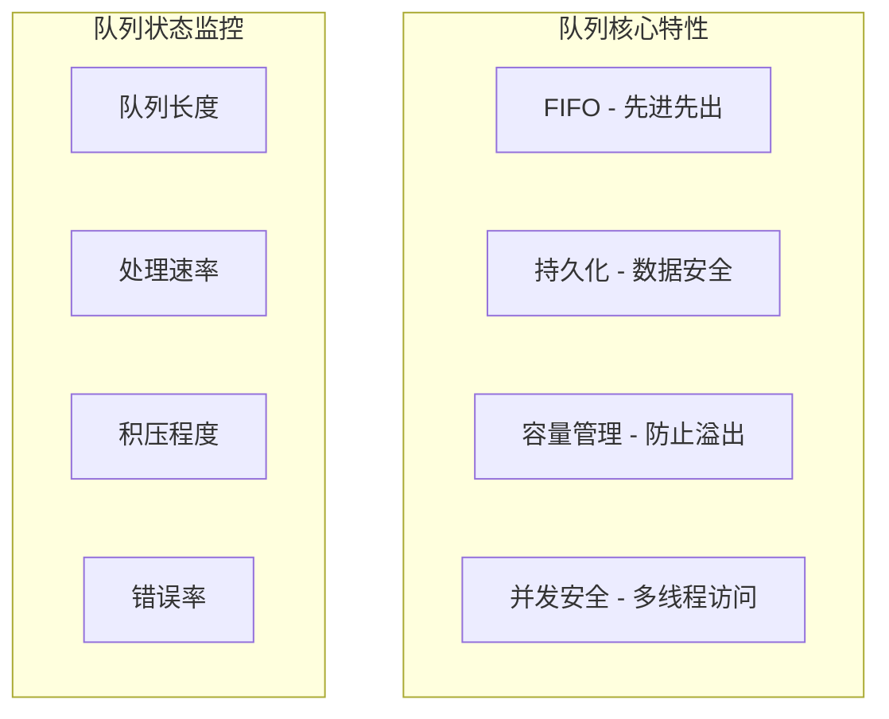
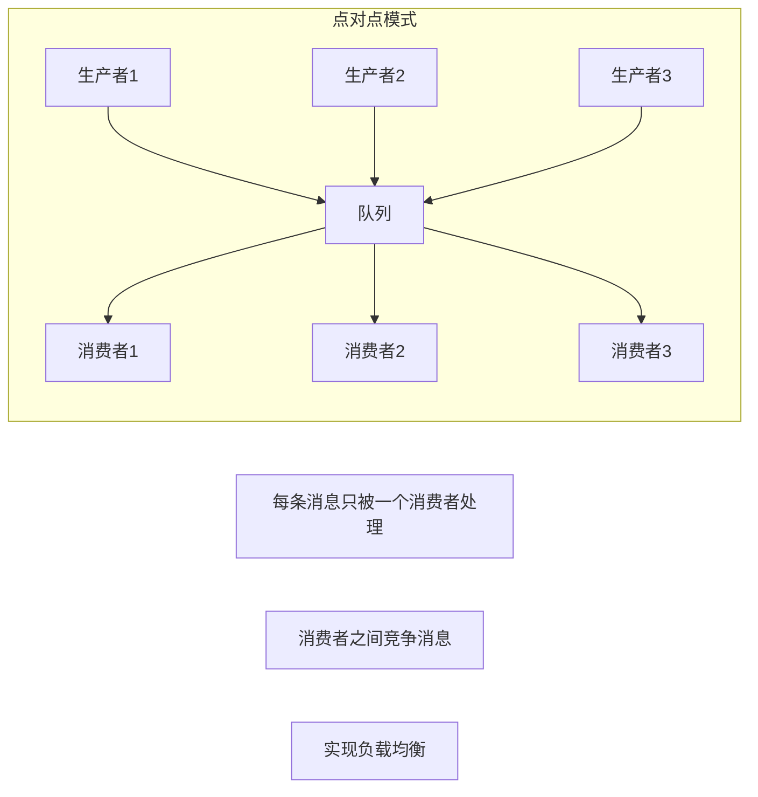
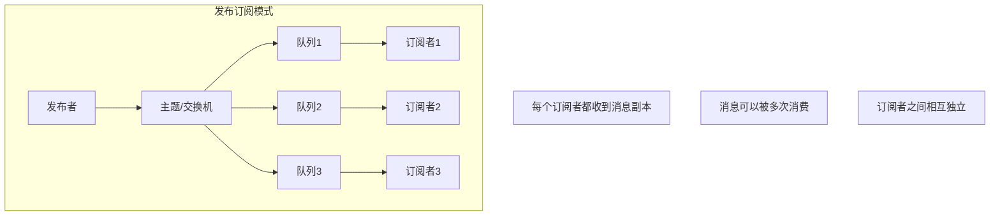
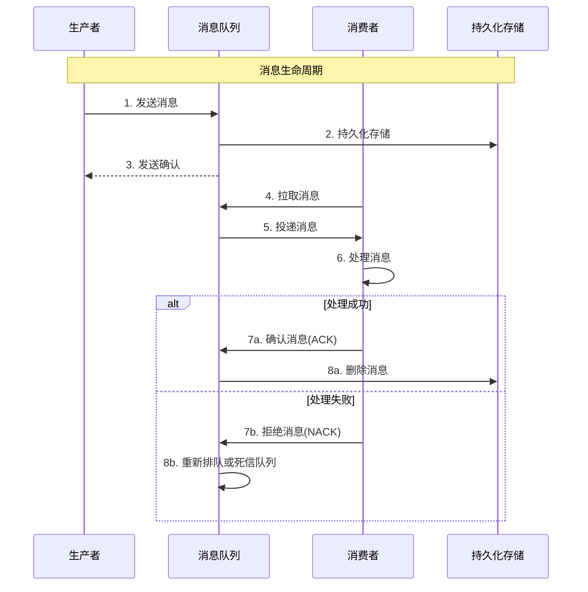
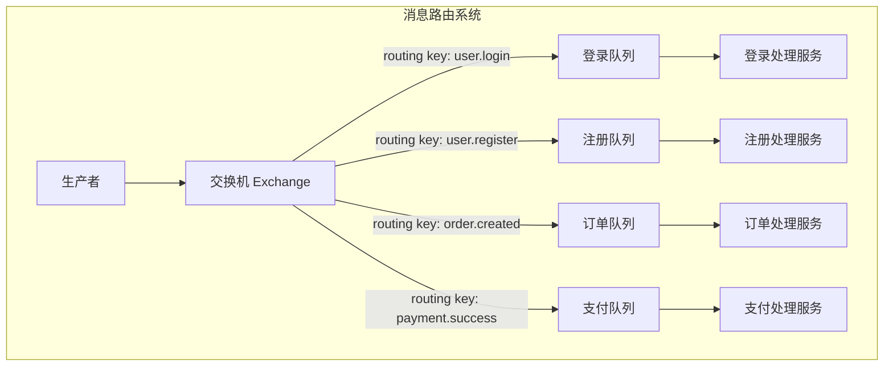

# 第二章 核心概念：掌握MQ的基本功

> "万丈高楼平地起" —— 扎实的基础概念是深入掌握MQ的前提！ 🏗️

## 本章学习目标 🎯

- 深入理解生产者、消费者、队列三要素的工作机制
- 掌握点对点和发布订阅两种基本通信模式的应用场景
- 跟踪消息从发送到消费的完整生命周期
- 理解交换机与路由的智能消息投递机制
- 为后续可靠性设计和性能优化打下坚实基础

---

## 2.1 生产者、消费者、队列：MQ的三要素

### MQ架构全景图

正如第一章提到的餐厅点餐例子，MQ系统也有三个核心角色：



### 🏭 生产者（Producer）：消息的制造者

生产者负责创建和发送消息，就像工厂生产产品一样。

#### 生产者的核心职责

| 职责 | 说明 | 代码示例 |
|------|------|----------|
| **消息创建** | 构造具有特定格式的消息 | `message = createMessage(data)` |
| **连接管理** | 建立和维护与MQ的连接 | `connection = connect(mqServer)` |
| **消息发送** | 将消息投递到指定队列 | `producer.send(queue, message)` |
| **异常处理** | 处理发送失败等异常情况 | `try...catch` |

#### 生产者实现模式

**1. 同步发送模式**
```pseudocode
class SyncProducer {
    function sendMessage(queueName, messageData) {
        try {
            // 创建消息
            message = {
                id: generateMessageId(),
                timestamp: getCurrentTime(),
                data: messageData,
                retryCount: 0
            }
            
            // 同步发送，等待确认
            result = this.connection.send(queueName, message)
            
            if (result.success) {
                log("消息发送成功: " + message.id)
                return success(message.id)
            } else {
                log("消息发送失败: " + result.error)
                return error(result.error)
            }
        } catch (exception) {
            log("发送异常: " + exception.message)
            return error(exception.message)
        }
    }
}

// 使用示例
producer = new SyncProducer()
result = producer.sendMessage("order_queue", {
    orderId: "ORD001",
    userId: "USER123",
    amount: 99.99
})
```

**2. 异步发送模式**
```pseudocode
class AsyncProducer {
    function sendMessage(queueName, messageData, callback) {
        message = {
            id: generateMessageId(),
            timestamp: getCurrentTime(),
            data: messageData
        }
        
        // 异步发送，通过回调处理结果
        this.connection.sendAsync(queueName, message, function(result) {
            if (result.success) {
                callback.onSuccess(message.id)
            } else {
                callback.onError(result.error)
            }
        })
        
        // 立即返回，不等待结果
        return message.id
    }
}

// 使用示例
producer = new AsyncProducer()
messageId = producer.sendMessage("order_queue", orderData, {
    onSuccess: function(id) { log("发送成功: " + id) },
    onError: function(error) { log("发送失败: " + error) }
})
```

**3. 批量发送模式**
```pseudocode
class BatchProducer {
    function __init__() {
        this.batchSize = 100
        this.messageBuffer = []
        this.flushInterval = 1000  // 1秒
        this.startFlushTimer()
    }
    
    function sendMessage(queueName, messageData) {
        message = createMessage(messageData)
        this.messageBuffer.add(message)
        
        // 达到批量大小时立即发送
        if (this.messageBuffer.size() >= this.batchSize) {
            this.flushBuffer()
        }
        
        return message.id
    }
    
    function flushBuffer() {
        if (this.messageBuffer.empty()) {
            return
        }
        
        // 批量发送所有消息
        this.connection.sendBatch(this.messageBuffer)
        log("批量发送消息: " + this.messageBuffer.size() + "条")
        
        this.messageBuffer.clear()
    }
    
    function startFlushTimer() {
        setInterval(function() {
            this.flushBuffer()  // 定时发送缓存的消息
        }, this.flushInterval)
    }
}
```

### 📦 消息队列（Queue）：可靠的中间人

队列是消息的临时存储和转发中心，保证消息在生产者和消费者之间可靠传递。

#### 队列的核心特性



#### 队列的工作机制

**1. 消息存储结构**
```pseudocode
class MessageQueue {
    function __init__(name, maxSize) {
        this.name = name
        this.maxSize = maxSize
        this.messages = []  // 消息存储
        this.head = 0       // 队列头指针
        this.tail = 0       // 队列尾指针
        this.size = 0       // 当前大小
        this.lock = createMutex()  // 并发控制
    }
    
    function enqueue(message) {
        this.lock.acquire()
        try {
            // 检查队列容量
            if (this.size >= this.maxSize) {
                throw new Error("队列已满")
            }
            
            // 添加消息到队列尾部
            this.messages[this.tail] = message
            this.tail = (this.tail + 1) % this.maxSize
            this.size++
            
            log("消息入队: " + message.id + ", 队列大小: " + this.size)
        } finally {
            this.lock.release()
        }
    }
    
    function dequeue() {
        this.lock.acquire()
        try {
            if (this.size == 0) {
                return null  // 队列为空
            }
            
            // 从队列头部取出消息
            message = this.messages[this.head]
            this.messages[this.head] = null  // 清空引用
            this.head = (this.head + 1) % this.maxSize
            this.size--
            
            log("消息出队: " + message.id + ", 队列大小: " + this.size)
            return message
        } finally {
            this.lock.release()
        }
    }
}
```

**2. 队列持久化机制**
```pseudocode
class PersistentQueue extends MessageQueue {
    function __init__(name, maxSize, storageFile) {
        super(name, maxSize)
        this.storageFile = storageFile
        this.loadFromDisk()  // 启动时加载历史消息
    }
    
    function enqueue(message) {
        super.enqueue(message)
        
        // 持久化到磁盘
        this.appendToDisk(message)
    }
    
    function dequeue() {
        message = super.dequeue()
        
        if (message) {
            // 从磁盘删除已处理的消息
            this.removeFromDisk(message.id)
        }
        
        return message
    }
    
    function appendToDisk(message) {
        // 将消息追加到日志文件
        logEntry = {
            action: "ENQUEUE",
            messageId: message.id,
            timestamp: getCurrentTime(),
            data: message
        }
        
        this.storageFile.append(serialize(logEntry))
    }
    
    function loadFromDisk() {
        // 启动时重建队列状态
        entries = this.storageFile.readAll()
        
        for entry in entries {
            if (entry.action == "ENQUEUE") {
                this.messages.add(entry.data)
            } else if (entry.action == "DEQUEUE") {
                this.messages.remove(entry.messageId)
            }
        }
    }
}
```

### 🤖 消费者（Consumer）：消息的处理者

消费者从队列中获取消息并进行业务处理，就像工人从传送带上取产品进行加工。

#### 消费者的核心职责

| 职责 | 说明 | 重要性 |
|------|------|--------|
| **消息拉取** | 从队列中获取待处理消息 | ⭐⭐⭐⭐⭐ |
| **业务处理** | 执行具体的业务逻辑 | ⭐⭐⭐⭐⭐ |
| **确认机制** | 告知队列消息已处理完成 | ⭐⭐⭐⭐ |
| **错误处理** | 处理失败消息的重试和告警 | ⭐⭐⭐⭐ |

#### 消费者实现模式

**1. 拉取模式（Pull Model）**
```pseudocode
class PullConsumer {
    function __init__(queueName, processor) {
        this.queueName = queueName
        this.processor = processor
        this.running = false
        this.pollInterval = 100  // 100ms轮询间隔
    }
    
    function start() {
        this.running = true
        
        while (this.running) {
            try {
                // 主动拉取消息
                message = this.connection.receive(this.queueName, timeout=1000)
                
                if (message != null) {
                    this.processMessage(message)
                } else {
                    // 没有消息时短暂休眠
                    sleep(this.pollInterval)
                }
            } catch (exception) {
                log("消费异常: " + exception.message)
                sleep(this.pollInterval)
            }
        }
    }
    
    function processMessage(message) {
        try {
            log("开始处理消息: " + message.id)
            
            // 执行业务逻辑
            result = this.processor.process(message.data)
            
            if (result.success) {
                // 确认消息已处理
                this.connection.acknowledge(message.id)
                log("消息处理成功: " + message.id)
            } else {
                // 处理失败，消息重新入队
                this.connection.reject(message.id, requeue=true)
                log("消息处理失败，重新入队: " + message.id)
            }
        } catch (exception) {
            log("处理异常: " + exception.message)
            this.connection.reject(message.id, requeue=false)  // 不重试
        }
    }
}
```

**2. 推送模式（Push Model）**
```pseudocode
class PushConsumer {
    function __init__(queueName, processor) {
        this.queueName = queueName
        this.processor = processor
    }
    
    function start() {
        // 注册消息监听器
        this.connection.subscribe(this.queueName, this.onMessageReceived)
        log("消费者启动，等待消息推送...")
    }
    
    function onMessageReceived(message) {
        // 异步处理消息，避免阻塞消息推送
        asyncExecute(function() {
            this.processMessage(message)
        })
    }
    
    function processMessage(message) {
        startTime = getCurrentTime()
        
        try {
            result = this.processor.process(message.data)
            
            if (result.success) {
                this.connection.acknowledge(message.id)
                
                processingTime = getCurrentTime() - startTime
                log("消息处理完成: " + message.id + ", 耗时: " + processingTime + "ms")
            } else {
                this.handleProcessingFailure(message, result.error)
            }
        } catch (exception) {
            this.handleProcessingException(message, exception)
        }
    }
    
    function handleProcessingFailure(message, error) {
        message.retryCount = (message.retryCount || 0) + 1
        
        if (message.retryCount <= 3) {
            // 重试次数未超限，延迟重试
            this.connection.rejectWithDelay(message.id, delay=1000 * message.retryCount)
            log("消息处理失败，第" + message.retryCount + "次重试: " + message.id)
        } else {
            // 超过重试次数，发送到死信队列
            this.connection.sendToDeadLetter(message)
            log("消息重试次数超限，发送到死信队列: " + message.id)
        }
    }
}
```

**3. 并发消费模式**
```pseudocode
class ConcurrentConsumer {
    function __init__(queueName, processor, workerCount=5) {
        this.queueName = queueName
        this.processor = processor
        this.workerCount = workerCount
        this.workers = []
        this.taskQueue = createBlockingQueue()
    }
    
    function start() {
        // 启动多个工作线程
        for (i = 0; i < this.workerCount; i++) {
            worker = new Thread(this.workerLoop)
            this.workers.add(worker)
            worker.start()
        }
        
        // 主线程负责拉取消息
        this.messageLoop()
    }
    
    function messageLoop() {
        while (this.running) {
            message = this.connection.receive(this.queueName)
            
            if (message != null) {
                // 将消息分发给工作线程
                this.taskQueue.put(message)
            }
        }
    }
    
    function workerLoop() {
        while (this.running) {
            try {
                // 工作线程从任务队列获取消息
                message = this.taskQueue.take(timeout=1000)
                
                if (message != null) {
                    this.processMessage(message)
                }
            } catch (exception) {
                log("工作线程异常: " + exception.message)
            }
        }
    }
}
```

---

## 2.2 点对点 vs 发布订阅：两种基本模式

消息队列有两种基本的通信模式，就像寄信有平信和群发邮件两种方式。

### 📮 点对点模式（Point-to-Point）

点对点模式就像寄快递：一个发件人，一个收件人，消息只能被消费一次。



#### 点对点模式的特点

| 特点 | 说明 | 应用场景 |
|------|------|----------|
| **消息唯一性** | 每条消息只被一个消费者处理 | 订单处理、任务分发 |
| **负载均衡** | 多个消费者自动分担负载 | 高并发处理 |
| **竞争消费** | 消费者之间竞争获取消息 | 工作队列 |
| **消息确认** | 处理完成后消息从队列删除 | 确保不重复处理 |

#### 实战示例：订单处理系统

```pseudocode
// 订单生产者 - 多个订单服务实例
class OrderProducer {
    function submitOrder(orderData) {
        message = {
            orderId: orderData.id,
            userId: orderData.userId,
            items: orderData.items,
            totalAmount: orderData.totalAmount,
            timestamp: getCurrentTime()
        }
        
        // 发送到订单处理队列
        orderQueue.send("order_processing", message)
        
        return "订单提交成功，正在处理中"
    }
}

// 订单消费者 - 多个订单处理服务实例
class OrderConsumer {
    function processOrder(orderMessage) {
        orderId = orderMessage.orderId
        log("开始处理订单: " + orderId)
        
        try {
            // 1. 验证订单信息
            validateOrder(orderMessage)
            
            // 2. 扣减库存
            inventoryService.reduceStock(orderMessage.items)
            
            // 3. 创建支付单
            paymentService.createPayment(orderMessage.totalAmount)
            
            // 4. 更新订单状态
            orderService.updateStatus(orderId, "PROCESSING")
            
            log("订单处理完成: " + orderId)
            return success()
            
        } catch (exception) {
            log("订单处理失败: " + orderId + ", 原因: " + exception.message)
            
            // 重要：失败的订单需要人工处理
            alertService.sendAlert("订单处理失败", orderMessage)
            return error(exception.message)
        }
    }
}

// 部署多个消费者实例实现负载均衡
consumer1 = new OrderConsumer()
consumer2 = new OrderConsumer()
consumer3 = new OrderConsumer()

// 每个消费者独立处理订单，不会重复
consumer1.start()  // 处理订单 1, 4, 7, 10...
consumer2.start()  // 处理订单 2, 5, 8, 11...
consumer3.start()  // 处理订单 3, 6, 9, 12...
```

### 📡 发布订阅模式（Publish-Subscribe）

发布订阅模式就像电视台广播：一个发布者，多个订阅者，每个订阅者都能收到完整的消息。



#### 发布订阅模式的特点

| 特点 | 说明 | 应用场景 |
|------|------|----------|
| **消息复制** | 每个订阅者都收到消息副本 | 事件通知、数据同步 |
| **解耦发布** | 发布者不知道谁在订阅 | 系统集成、微服务通信 |
| **动态订阅** | 可以随时增加或删除订阅者 | 插件系统、监控告警 |
| **主题过滤** | 可以基于主题选择性订阅 | 分类消息处理 |

#### 实战示例：用户行为事件系统

```pseudocode
// 事件发布者 - 用户行为追踪
class UserEventPublisher {
    function publishUserEvent(userId, eventType, eventData) {
        event = {
            userId: userId,
            eventType: eventType,  // LOGIN, PURCHASE, BROWSE等
            eventData: eventData,
            timestamp: getCurrentTime(),
            sessionId: getCurrentSession()
        }
        
        // 发布到用户事件主题
        eventTopic.publish("user.events", event)
        
        log("用户事件已发布: " + eventType + " for user " + userId)
    }
}

// 订阅者1：实时推荐系统
class RecommendationSubscriber {
    function onUserEvent(event) {
        if (event.eventType in ["BROWSE", "PURCHASE", "SEARCH"]) {
            // 更新用户画像
            userProfile.updateInterests(event.userId, event.eventData)
            
            // 实时计算推荐
            recommendations = recommendationEngine.compute(event.userId)
            
            // 推送个性化推荐
            pushService.sendRecommendations(event.userId, recommendations)
            
            log("为用户 " + event.userId + " 更新推荐")
        }
    }
}

// 订阅者2：数据统计系统
class AnalyticsSubscriber {
    function onUserEvent(event) {
        // 实时统计更新
        statisticsDB.increment("daily_" + event.eventType)
        statisticsDB.increment("user_activity_" + event.userId)
        
        // 异常行为检测
        if (event.eventType == "LOGIN") {
            location = geoIP.getLocation(event.eventData.ip)
            if (fraudDetection.isSuspicious(event.userId, location)) {
                alertService.sendSecurityAlert(event.userId, location)
            }
        }
        
        log("统计数据已更新: " + event.eventType)
    }
}

// 订阅者3：审计日志系统
class AuditSubscriber {
    function onUserEvent(event) {
        auditLog = {
            userId: event.userId,
            action: event.eventType,
            timestamp: event.timestamp,
            details: event.eventData,
            traceId: generateTraceId()
        }
        
        // 持久化审计日志
        auditDatabase.save(auditLog)
        
        // 合规性检查
        if (complianceChecker.needsReview(event)) {
            complianceQueue.send(auditLog)
        }
        
        log("审计日志已记录: " + event.eventType)
    }
}

// 注册所有订阅者
eventTopic.subscribe("user.events", new RecommendationSubscriber())
eventTopic.subscribe("user.events", new AnalyticsSubscriber())  
eventTopic.subscribe("user.events", new AuditSubscriber())

// 发布事件 - 所有订阅者都会收到
publisher = new UserEventPublisher()
publisher.publishUserEvent("USER123", "PURCHASE", {
    productId: "PROD456",
    amount: 99.99,
    category: "electronics"
})
```

### 模式选择指南

| 场景类型 | 推荐模式 | 原因 |
|----------|----------|------|
| **任务分发** | 点对点 | 每个任务只需要处理一次 |
| **负载均衡** | 点对点 | 多个处理者分担负载 |
| **事件通知** | 发布订阅 | 多个系统需要响应同一事件 |
| **数据同步** | 发布订阅 | 多个目标需要同步数据 |
| **系统集成** | 发布订阅 | 解耦不同子系统 |
| **日志收集** | 发布订阅 | 多个分析系统处理同一日志 |

---

## 2.3 消息的生命周期：从发送到消费

理解消息的完整生命周期对于设计可靠的MQ系统至关重要，就像了解快递从发件到签收的全过程。

### 消息生命周期全景图



### 阶段一：消息创建与发送

#### 1. 消息构造
```pseudocode
function createMessage(data) {
    message = {
        // 消息唯一标识
        id: generateUUID(),
        
        // 消息元数据
        timestamp: getCurrentTime(),
        ttl: 3600000,  // 存活时间1小时
        priority: "NORMAL",
        
        // 路由信息
        exchange: "user_events",
        routingKey: "user.login",
        
        // 消息内容
        payload: data,
        
        // 消息属性
        persistent: true,  // 是否持久化
        mandatory: false,  // 是否必须投递
        
        // 追踪信息
        correlationId: generateCorrelationId(),
        replyTo: null,
        
        // 重试信息
        retryCount: 0,
        maxRetries: 3
    }
    
    return message
}
```

#### 2. 发送前预处理
```pseudocode
class MessagePreprocessor {
    function preprocess(message) {
        // 消息验证
        this.validateMessage(message)
        
        // 消息压缩
        if (message.payload.size() > 1024) {
            message.payload = compress(message.payload)
            message.compressed = true
        }
        
        // 消息加密
        if (message.sensitive) {
            message.payload = encrypt(message.payload)
            message.encrypted = true
        }
        
        // 添加追踪信息
        message.traceId = getDistributedTraceId()
        message.spanId = createSpanId()
        
        return message
    }
    
    function validateMessage(message) {
        if (!message.id) {
            throw new Error("消息ID不能为空")
        }
        
        if (!message.payload) {
            throw new Error("消息内容不能为空")
        }
        
        if (message.payload.size() > MAX_MESSAGE_SIZE) {
            throw new Error("消息大小超过限制")
        }
    }
}
```

### 阶段二：消息存储与确认

#### 1. 持久化存储
```pseudocode
class MessageStorage {
    function store(message) {
        try {
            // 开始事务
            transaction = this.database.beginTransaction()
            
            // 存储消息内容
            messageRecord = {
                id: message.id,
                exchange: message.exchange,
                routingKey: message.routingKey,
                payload: message.payload,
                properties: serialize(message.properties),
                status: "PENDING",  // 待处理
                createdAt: message.timestamp,
                expiredAt: message.timestamp + message.ttl
            }
            
            this.database.insert("messages", messageRecord)
            
            // 更新队列索引
            queueRecord = {
                queueName: message.targetQueue,
                messageId: message.id,
                priority: message.priority,
                enqueuedAt: getCurrentTime()
            }
            
            this.database.insert("queue_index", queueRecord)
            
            // 提交事务
            transaction.commit()
            
            log("消息存储成功: " + message.id)
            return success()
            
        } catch (exception) {
            transaction.rollback()
            log("消息存储失败: " + exception.message)
            return error(exception.message)
        }
    }
}
```

#### 2. 发送确认机制
```pseudocode
class PublisherConfirm {
    function __init__() {
        this.pendingConfirms = new ConcurrentHashMap()
        this.confirmTimeout = 30000  // 30秒超时
    }
    
    function sendWithConfirm(message) {
        // 记录待确认消息
        confirmId = generateConfirmId()
        this.pendingConfirms.put(confirmId, {
            message: message,
            timestamp: getCurrentTime(),
            callback: message.callback
        })
        
        // 发送消息，携带确认ID
        message.confirmId = confirmId
        this.connection.send(message)
        
        // 启动超时检查
        this.scheduleConfirmTimeout(confirmId)
        
        return confirmId
    }
    
    function onConfirmReceived(confirmId, success) {
        confirm = this.pendingConfirms.remove(confirmId)
        
        if (confirm) {
            if (success) {
                confirm.callback.onSuccess(confirm.message.id)
                log("消息确认成功: " + confirm.message.id)
            } else {
                confirm.callback.onFailure(confirm.message.id, "发送失败")
                log("消息确认失败: " + confirm.message.id)
            }
        }
    }
    
    function scheduleConfirmTimeout(confirmId) {
        setTimeout(function() {
            confirm = this.pendingConfirms.remove(confirmId)
            if (confirm) {
                confirm.callback.onTimeout(confirm.message.id)
                log("消息确认超时: " + confirm.message.id)
            }
        }, this.confirmTimeout)
    }
}
```

### 阶段三：消息投递与消费

#### 1. 智能投递策略
```pseudocode
class MessageDelivery {
    function deliverMessage(consumer) {
        while (consumer.isActive()) {
            // 根据消费者能力选择合适的消息
            message = this.selectMessage(consumer)
            
            if (message == null) {
                sleep(100)  // 无消息时短暂休眠
                continue
            }
            
            // 投递消息
            deliveryResult = this.attemptDelivery(consumer, message)
            
            if (deliveryResult.success) {
                this.updateMessageStatus(message.id, "DELIVERED")
            } else {
                this.handleDeliveryFailure(message, deliveryResult.error)
            }
        }
    }
    
    function selectMessage(consumer) {
        // 基于消费者预取数量限制
        if (consumer.getPrefetchCount() >= consumer.getMaxPrefetch()) {
            return null
        }
        
        // 基于消费者处理能力
        if (consumer.getProcessingCapacity() < 0.8) {
            return this.selectHighPriorityMessage(consumer.getQueueName())
        } else {
            return this.selectNormalMessage(consumer.getQueueName())
        }
    }
    
    function attemptDelivery(consumer, message) {
        try {
            // 更新消息状态
            this.updateMessageStatus(message.id, "IN_DELIVERY")
            
            // 设置投递超时
            deliveryTimeout = setTimeout(function() {
                this.handleDeliveryTimeout(message.id)
            }, message.deliveryTimeout)
            
            // 投递消息给消费者
            consumer.handleMessage(message)
            
            clearTimeout(deliveryTimeout)
            return success()
            
        } catch (exception) {
            log("消息投递异常: " + exception.message)
            return error(exception.message)
        }
    }
}
```

#### 2. 消费者消息处理
```pseudocode
class MessageProcessor {
    function handleMessage(message) {
        processingStart = getCurrentTime()
        
        try {
            // 消息预处理
            processedMessage = this.preprocessMessage(message)
            
            // 业务逻辑处理
            result = this.businessLogic.process(processedMessage)
            
            if (result.success) {
                // 处理成功，发送ACK
                this.acknowledgeMessage(message.id)
                
                processingTime = getCurrentTime() - processingStart
                this.recordMetrics("message_processed", processingTime)
                
                log("消息处理成功: " + message.id + ", 耗时: " + processingTime + "ms")
            } else {
                // 业务处理失败
                this.handleBusinessFailure(message, result.error)
            }
            
        } catch (exception) {
            // 系统异常
            this.handleSystemException(message, exception)
        }
    }
    
    function preprocessMessage(message) {
        // 消息解压缩
        if (message.compressed) {
            message.payload = decompress(message.payload)
        }
        
        // 消息解密
        if (message.encrypted) {
            message.payload = decrypt(message.payload)
        }
        
        // 消息反序列化
        if (message.serialized) {
            message.payload = deserialize(message.payload)
        }
        
        return message
    }
    
    function handleBusinessFailure(message, error) {
        message.retryCount++
        
        if (message.retryCount <= message.maxRetries) {
            // 延迟重试
            delay = this.calculateRetryDelay(message.retryCount)
            this.scheduleRetry(message, delay)
            
            log("消息处理失败，计划重试: " + message.id + ", 重试次数: " + message.retryCount)
        } else {
            // 超过重试次数，发送到死信队列
            this.sendToDeadLetterQueue(message, error)
            
            log("消息重试次数超限，发送到死信队列: " + message.id)
        }
    }
    
    function calculateRetryDelay(retryCount) {
        // 指数退避算法
        baseDelay = 1000  // 1秒
        maxDelay = 60000  // 最大60秒
        
        delay = baseDelay * Math.pow(2, retryCount - 1)
        return Math.min(delay, maxDelay)
    }
}
```

### 阶段四：消息确认与清理

#### 消息确认机制详解
```pseudocode
class MessageAcknowledgment {
    function acknowledgeMessage(messageId) {
        try {
            // 开始事务
            transaction = this.database.beginTransaction()
            
            // 更新消息状态
            this.database.update("messages", {
                id: messageId,
                status: "ACKNOWLEDGED",
                acknowledgedAt: getCurrentTime()
            })
            
            // 从队列索引中删除
            this.database.delete("queue_index", {
                messageId: messageId
            })
            
            // 更新消费者统计
            this.database.increment("consumer_stats", {
                consumerId: getCurrentConsumerId(),
                processedCount: 1
            })
            
            // 提交事务
            transaction.commit()
            
            log("消息确认成功: " + messageId)
            return success()
            
        } catch (exception) {
            transaction.rollback()
            log("消息确认失败: " + exception.message)
            return error(exception.message)
        }
    }
    
    function scheduleMessageCleanup() {
        // 定期清理已确认的消息
        setInterval(function() {
            this.cleanupAcknowledgedMessages()
        }, 3600000)  // 每小时执行一次
    }
    
    function cleanupAcknowledgedMessages() {
        cutoffTime = getCurrentTime() - 24 * 3600 * 1000  // 24小时前
        
        deletedCount = this.database.delete("messages", {
            status: "ACKNOWLEDGED",
            acknowledgedAt: { $lt: cutoffTime }
        })
        
        log("清理已确认消息: " + deletedCount + "条")
    }
}
```

---

## 2.4 交换机与路由：消息如何找到目的地

在第一章中，我们了解了MQ的基本作用。现在让我们深入了解消息是如何智能地找到正确目的地的。

### 路由系统架构



### 🔀 交换机（Exchange）：智能调度中心

交换机就像邮局的分拣中心，根据地址信息将邮件分发到正确的投递路线。

#### 交换机的基本类型

| 类型 | 路由规则 | 应用场景 | 特点 |
|------|----------|----------|------|
| **Direct** | 精确匹配路由键 | 点对点消息 | 简单直接 |
| **Topic** | 模式匹配路由键 | 分类订阅 | 灵活强大 |
| **Fanout** | 广播所有队列 | 全网通知 | 简单快速 |
| **Headers** | 匹配消息头属性 | 复杂路由 | 功能丰富 |

#### 1. Direct Exchange - 精确路由

```pseudocode
class DirectExchange {
    function __init__(name) {
        this.name = name
        this.type = "direct"
        this.bindings = new HashMap()  // routingKey -> [queue1, queue2, ...]
    }
    
    function bind(queueName, routingKey) {
        if (!this.bindings.contains(routingKey)) {
            this.bindings.put(routingKey, [])
        }
        
        this.bindings.get(routingKey).add(queueName)
        log("绑定成功: " + queueName + " -> " + routingKey)
    }
    
    function route(message) {
        routingKey = message.routingKey
        targetQueues = this.bindings.get(routingKey)
        
        if (targetQueues == null || targetQueues.isEmpty()) {
            log("未找到匹配的队列: " + routingKey)
            return []
        }
        
        log("路由消息到队列: " + targetQueues + ", 路由键: " + routingKey)
        return targetQueues
    }
}

// 使用示例
userExchange = new DirectExchange("user_events")

// 绑定队列到特定路由键
userExchange.bind("user_login_queue", "user.login")
userExchange.bind("user_register_queue", "user.register")
userExchange.bind("user_logout_queue", "user.logout")

// 发送消息
message = {
    routingKey: "user.login",
    payload: { userId: "123", ip: "192.168.1.1" }
}

// 只会路由到 user_login_queue
targetQueues = userExchange.route(message)
```

#### 2. Topic Exchange - 模式匹配路由

```pseudocode
class TopicExchange {
    function __init__(name) {
        this.name = name
        this.type = "topic"
        this.bindings = []  // [{pattern, queues}, ...]
    }
    
    function bind(queueName, pattern) {
        binding = this.findBinding(pattern)
        
        if (binding == null) {
            binding = { pattern: pattern, queues: [] }
            this.bindings.add(binding)
        }
        
        binding.queues.add(queueName)
        log("主题绑定: " + queueName + " -> " + pattern)
    }
    
    function route(message) {
        routingKey = message.routingKey
        matchedQueues = []
        
        for binding in this.bindings {
            if (this.matchPattern(routingKey, binding.pattern)) {
                matchedQueues.addAll(binding.queues)
            }
        }
        
        log("主题路由: " + routingKey + " -> " + matchedQueues)
        return matchedQueues.unique()
    }
    
    function matchPattern(routingKey, pattern) {
        // * 匹配一个单词
        // # 匹配零个或多个单词
        
        routingParts = routingKey.split(".")
        patternParts = pattern.split(".")
        
        return this.matchParts(routingParts, 0, patternParts, 0)
    }
    
    function matchParts(routing, rIndex, pattern, pIndex) {
        // 递归匹配算法
        if (pIndex == pattern.length) {
            return rIndex == routing.length
        }
        
        currentPattern = pattern[pIndex]
        
        if (currentPattern == "#") {
            // # 可以匹配任意数量的单词
            if (pIndex == pattern.length - 1) {
                return true  // # 在末尾，匹配剩余所有
            }
            
            // 尝试匹配0到N个单词
            for i in range(rIndex, routing.length + 1) {
                if (this.matchParts(routing, i, pattern, pIndex + 1)) {
                    return true
                }
            }
            return false
        } else if (currentPattern == "*") {
            // * 匹配一个单词
            if (rIndex >= routing.length) {
                return false
            }
            return this.matchParts(routing, rIndex + 1, pattern, pIndex + 1)
        } else {
            // 精确匹配
            if (rIndex >= routing.length || routing[rIndex] != currentPattern) {
                return false
            }
            return this.matchParts(routing, rIndex + 1, pattern, pIndex + 1)
        }
    }
}

// 使用示例：电商系统事件路由
ecommerceExchange = new TopicExchange("ecommerce_events")

// 绑定不同的队列到不同的主题模式
ecommerceExchange.bind("order_queue", "order.*")           // 所有订单事件
ecommerceExchange.bind("payment_queue", "payment.*")       // 所有支付事件
ecommerceExchange.bind("inventory_queue", "inventory.*")   // 所有库存事件
ecommerceExchange.bind("audit_queue", "#")                // 所有事件（审计）
ecommerceExchange.bind("order_created_queue", "order.created")  // 特定事件

// 测试路由
testCases = [
    "order.created",      // 路由到: order_queue, audit_queue, order_created_queue
    "order.updated",      // 路由到: order_queue, audit_queue
    "payment.success",    // 路由到: payment_queue, audit_queue
    "inventory.low",      // 路由到: inventory_queue, audit_queue
    "user.login"         // 路由到: audit_queue
]

for routingKey in testCases {
    message = { routingKey: routingKey, payload: {} }
    queues = ecommerceExchange.route(message)
    log(routingKey + " -> " + queues)
}
```

#### 3. Fanout Exchange - 广播路由

```pseudocode
class FanoutExchange {
    function __init__(name) {
        this.name = name
        this.type = "fanout"
        this.boundQueues = []
    }
    
    function bind(queueName) {
        if (!this.boundQueues.contains(queueName)) {
            this.boundQueues.add(queueName)
            log("广播绑定: " + queueName)
        }
    }
    
    function route(message) {
        // 忽略路由键，广播到所有绑定的队列
        log("广播消息到所有队列: " + this.boundQueues)
        return this.boundQueues.clone()
    }
}

// 使用示例：系统公告广播
announcementExchange = new FanoutExchange("system_announcements")

// 绑定所有需要接收公告的队列
announcementExchange.bind("web_notification_queue")
announcementExchange.bind("mobile_push_queue")
announcementExchange.bind("email_queue")
announcementExchange.bind("sms_queue")

// 发送系统维护公告
message = {
    payload: {
        title: "系统维护通知",
        content: "系统将于今晚22:00-24:00进行维护",
        level: "IMPORTANT"
    }
}

// 所有队列都会收到这条消息
targetQueues = announcementExchange.route(message)
```

### 🗺️ 路由键设计最佳实践

#### 1. 层次化命名规范
```pseudocode
// 推荐的路由键命名模式
routes = {
    // 业务域.操作.资源
    "user.created.profile",
    "user.updated.profile", 
    "user.deleted.profile",
    
    // 业务域.资源.操作
    "order.item.added",
    "order.item.removed",
    "order.payment.completed",
    
    // 系统.服务.事件
    "system.auth.login",
    "system.auth.logout",
    "system.cache.cleared"
}
```

#### 2. 智能路由策略
```pseudocode
class SmartRouter {
    function __init__() {
        this.routingStrategies = new HashMap()
        this.loadBalancers = new HashMap()
    }
    
    function addRoutingStrategy(pattern, strategy) {
        this.routingStrategies.put(pattern, strategy)
    }
    
    function route(message) {
        routingKey = message.routingKey
        
        // 1. 基于消息优先级路由
        if (message.priority == "HIGH") {
            return this.routeToHighPriorityQueue(routingKey, message)
        }
        
        // 2. 基于消息大小路由
        if (message.size > LARGE_MESSAGE_THRESHOLD) {
            return this.routeToLargeMessageQueue(routingKey, message)
        }
        
        // 3. 基于地理位置路由
        if (message.headers.contains("region")) {
            return this.routeToRegionalQueue(routingKey, message)
        }
        
        // 4. 基于负载均衡路由
        return this.routeWithLoadBalancing(routingKey, message)
    }
    
    function routeWithLoadBalancing(routingKey, message) {
        availableQueues = this.getAvailableQueues(routingKey)
        
        if (availableQueues.isEmpty()) {
            return []
        }
        
        // 基于队列长度选择最空闲的队列
        selectedQueue = availableQueues.min(queue -> queue.getLength())
        
        log("负载均衡路由: " + routingKey + " -> " + selectedQueue.name)
        return [selectedQueue.name]
    }
}
```

#### 3. 条件路由实现
```pseudocode
class ConditionalRouter {
    function route(message) {
        conditions = message.routingConditions
        targetQueues = []
        
        // 基于消息内容的条件路由
        if (conditions.userType == "VIP") {
            targetQueues.add("vip_service_queue")
        }
        
        if (conditions.amount > 10000) {
            targetQueues.add("high_value_transaction_queue")
        }
        
        if (conditions.region in ["US", "EU"]) {
            targetQueues.add("international_compliance_queue")
        }
        
        // 基于时间的条件路由
        currentHour = getCurrentTime().hour
        if (currentHour >= 9 && currentHour <= 17) {
            targetQueues.add("business_hours_queue")
        } else {
            targetQueues.add("after_hours_queue")
        }
        
        return targetQueues
    }
}
```

---

## 本章总结

### 🎯 核心概念回顾

1. **MQ三要素**：
   - **生产者**：负责创建和发送消息，支持同步、异步、批量等多种发送模式
   - **队列**：可靠存储和转发消息，提供FIFO、持久化、并发控制等特性
   - **消费者**：从队列获取并处理消息，支持拉取、推送、并发等多种消费模式

2. **两种基本模式**：
   - **点对点**：一对一通信，消息只被一个消费者处理，适用于任务分发和负载均衡
   - **发布订阅**：一对多通信，消息被多个订阅者处理，适用于事件通知和数据同步

3. **消息生命周期**：从创建、发送、存储、投递到确认的完整流程，每个阶段都有相应的可靠性保障机制

4. **路由机制**：通过交换机和路由键实现消息的智能投递，支持精确匹配、模式匹配、广播等多种路由策略

### 💡 关键洞察

- **解耦的层次**：不仅是业务逻辑的解耦，还包括时间解耦、空间解耦、速度解耦
- **可靠性设计**：每个环节都需要考虑失败场景和恢复机制
- **性能优化**：批量处理、连接复用、智能路由都是提升性能的有效手段
- **模式选择**：根据业务场景选择合适的通信模式和路由策略

### 🔗 与下一章的关联

掌握了核心概念后，接下来第三章将深入探讨可靠性保障：

- **消息丢失的三种情况**：生产者、队列、消费者各个环节的可靠性问题
- **消息确认机制**：如何确保消息被正确处理  
- **死信队列**：如何处理失败消息
- **幂等性设计**：如何避免重复处理
- **事务消息**：如何保证强一致性

这些可靠性机制将在本章介绍的基础概念之上，构建真正生产可用的消息队列系统！

---

*🌟 "千里之行，始于足下。" 扎实的基础概念是构建复杂MQ系统的基石，让我们继续深入探索可靠性的奥秘！*