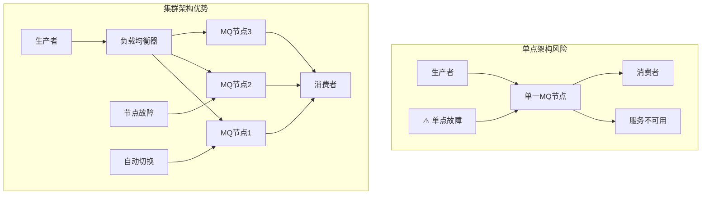
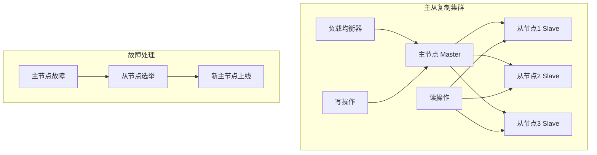
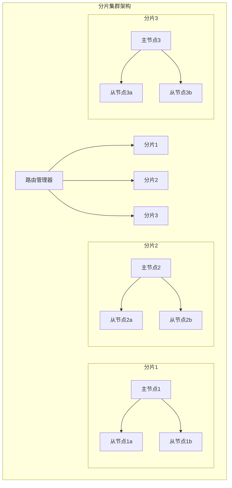
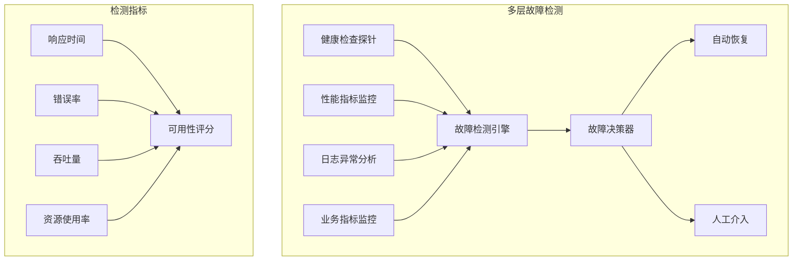
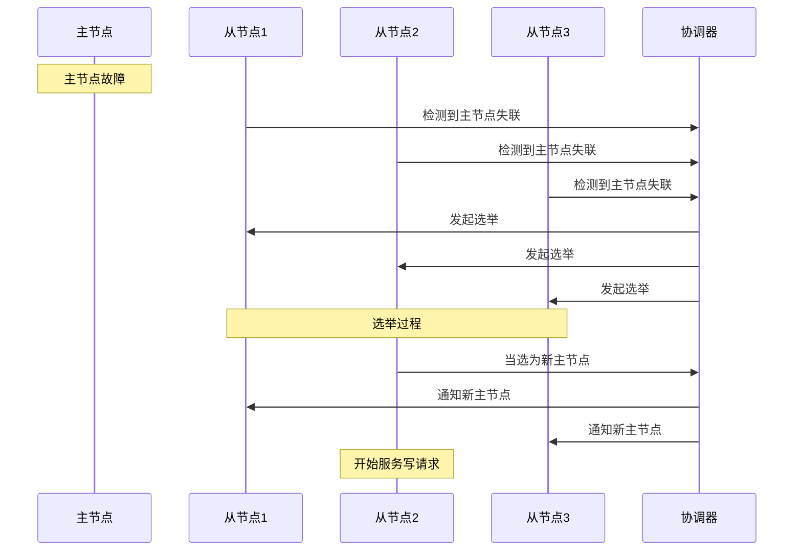
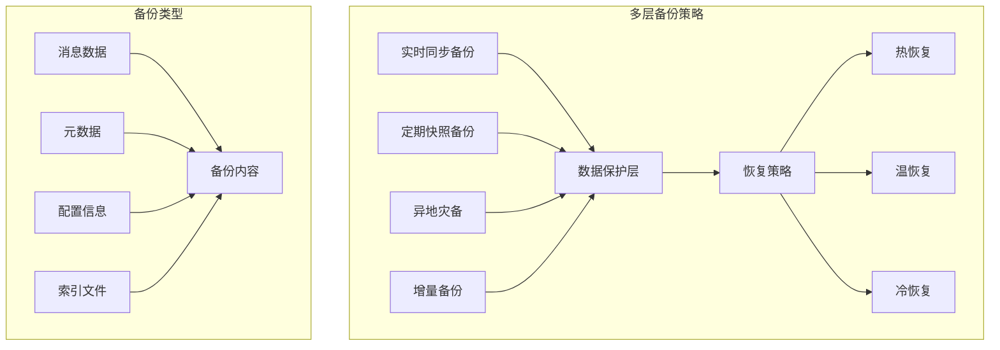
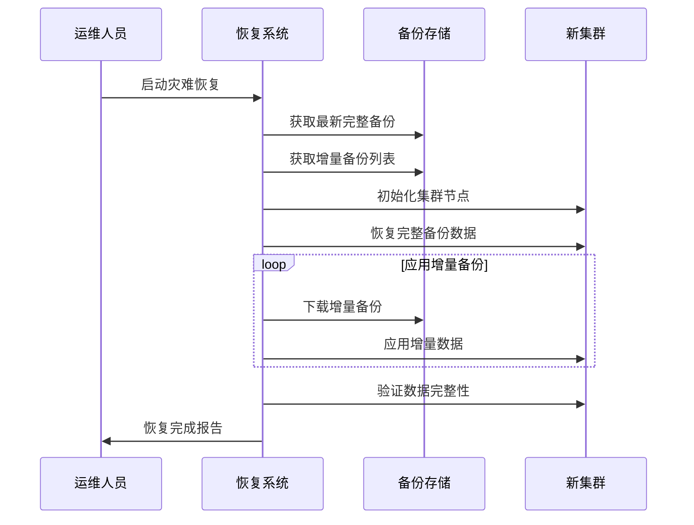
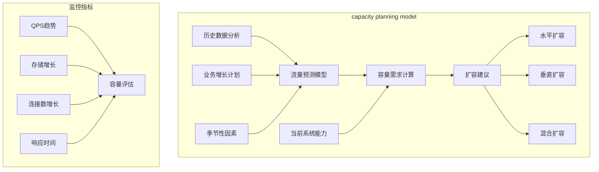
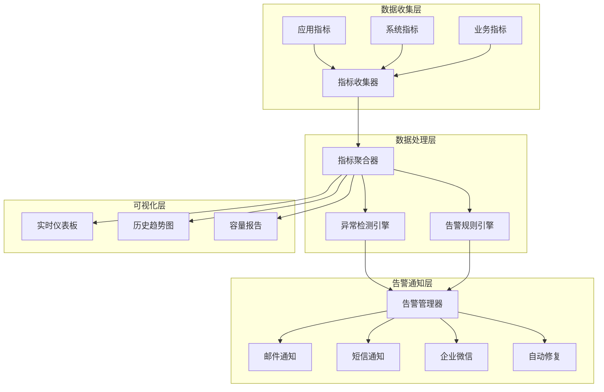

# 第五章 高可用设计：构建永不宕机的系统

> "兵马未动，粮草先行" —— 高可用设计是系统稳定运行的根本保障！ ⚔️

## 本章学习目标 🎯

- 掌握MQ集群部署架构避免单点故障风险
- 理解故障转移机制实现自动恢复能力
- 学会设计完善的数据备份与恢复策略
- 掌握容量规划方法应对业务增长需求
- 建立完善的监控告警体系保障系统健康
- 在前四章基础上构建生产级高可用MQ系统

---

## 5.1 集群部署：避免单点故障

在第三章中我们讨论了消息可靠性，而高可用设计则是从系统架构层面保障服务的持续运行。

### 单点故障的风险分析



### 🏗️ 集群部署架构设计

#### 主从复制模式



**主从模式配置示例：**

```java
// 主节点配置
public class MasterConfig {
    private String nodeRole = "master";
    private String clusterId = "mq-cluster-01";
    private int replicationFactor = 3;
    private String syncMode = "async"; // 异步复制提升性能
    private int electionTimeout = 5000;
    private int heartbeatInterval = 1000;
}

// 从节点配置  
public class SlaveConfig {
    private String nodeRole = "slave";
    private String masterId = "master-node-01";
    private String clusterId = "mq-cluster-01";
    private int replicationDelay = 100;
    private int maxLagAllowed = 1000;
}
```

#### 分片集群模式



### 📊 集群模式对比分析

| 模式 | 优势 | 劣势 | 适用场景 |
|------|------|------|----------|
| **主从复制** | 简单易管理<br/>数据一致性好<br/>故障恢复快 | 写性能瓶颈<br/>主节点压力大<br/>资源利用率低 | 中小型系统<br/>读多写少场景 |
| **分片集群** | 水平扩展能力强<br/>写性能优秀<br/>资源利用充分 | 复杂度高<br/>数据迁移困难<br/>跨分片事务复杂 | 大型系统<br/>高并发写入场景 |

### 🔧 集群部署最佳实践

#### 1. 节点规划策略

```java
public class ClusterPlanner {
    public ClusterPlan planCluster(int expectedQPS, int dataSizeGB) {
        // 计算节点数量
        int baseNodes = (int) Math.ceil(expectedQPS / 10000.0); // 每节点1万QPS
        int replicationNodes = baseNodes * 2; // 2倍冗余
        
        // 存储规划  
        double storagePerNode = (double) dataSizeGB / baseNodes * 1.5; // 1.5倍存储冗余
        
        String recommendedMode = expectedQPS > 50000 ? "分片集群" : "主从复制";
        
        return new ClusterPlan(baseNodes, replicationNodes, storagePerNode, recommendedMode);
    }
}
```

#### 2. 网络分区处理

```java
public class NetworkPartitionHandler {
    
    public void handlePartition(Cluster cluster) {
        // 脑裂预防策略
        if (cluster.getActiveNodes() < cluster.getTotalNodes() / 2) {
            cluster.enterReadOnlyMode();
        }
        
        // 选举仲裁
        int quorumSize = cluster.getTotalNodes() / 2 + 1;
        if (cluster.getConnectedNodes() >= quorumSize) {
            cluster.setAllowElection(true);
        }
    }
    
    public PartitionStatus detectNetworkPartition(Cluster cluster) {
        double partitionRisk = 0;
        
        // 检查节点间连通性
        for (Node nodeA : cluster.getNodes()) {
            int unreachableCount = 0;
            for (Node nodeB : cluster.getNodes()) {
                if (!nodeA.canReach(nodeB)) {
                    unreachableCount++;
                }
            }
            partitionRisk = Math.max(partitionRisk, 
                (double) unreachableCount / cluster.getNodes().size());
        }
        
        // 分区风险评估
        if (partitionRisk > 0.5) {
            return new PartitionStatus("partition_detected", partitionRisk, 
                "启动分区处理流程");
        }
        
        return new PartitionStatus("healthy", partitionRisk, null);
    }
}
```

#### 3. 生产环境集群配置实例

**Kafka集群配置示例：**

```java
// Kafka集群配置
public class KafkaClusterConfig {
    
    public static class BrokerConfig {
        private int brokerId;
        private String host;
        private int port = 9092;
        private String[] logDirs = {"/kafka-logs-1", "/kafka-logs-2"};
        
        // 复制配置
        private int defaultReplicationFactor = 3;
        private int minInsyncReplicas = 2;
        
        // 性能配置
        private int numNetworkThreads = 8;
        private int numIoThreads = 16;
        
        // 日志配置
        private int logRetentionHours = 168;
        private long logSegmentBytes = 1073741824L;
    }
    
    public static class ClusterConfig {
        private String zookeeperConnect = "zk1:2181,zk2:2181,zk3:2181/kafka";
        private int controllerSocketTimeoutMs = 30000;
        private boolean controlledShutdownEnable = true;
        private boolean autoCreateTopicsEnable = false;
    }
}
```

**RabbitMQ集群配置示例：**

```java
// RabbitMQ集群配置
public class RabbitMQClusterConfig {
    
    public static class NodeConfig {
        private String name;
        private String host;
        private String type; // "disc" 或 "ram"
        private String erlangCookie = "cluster-secret-cookie";
        
        public NodeConfig(String name, String host, String type) {
            this.name = name;
            this.host = host;
            this.type = type;
        }
    }
    
    public static class HAPolicy {
        private String pattern = "^ha\\.";
        private String haMode = "exactly";
        private int haParams = 2;
        private String haSyncMode = "automatic";
    }
    
    public static class Federation {
        private String name = "backup-datacenter";
        private String uri = "amqp://backup-cluster:5672";
        private String trustStore = "/etc/ssl/certs/ca-certificates.crt";
    }
}
```

---

## 5.2 故障转移：自动恢复机制

结合第四章的性能监控，我们需要建立智能化的故障检测和自动恢复机制。

### 故障检测体系



### 🚨 智能故障检测

#### 健康检查机制

```java
public class HealthChecker {
    
    public HealthResult performHealthCheck(Node node) {
        double healthScore = 0;
        
        // 执行各项检查
        healthScore += checkConnectivity(node).getScore() * 0.3;
        healthScore += checkResourceUsage(node).getScore() * 0.25;
        healthScore += checkMessageProcessing(node).getScore() * 0.25;
        healthScore += checkDiskSpace(node).getScore() * 0.2;
        
        return new HealthResult(healthScore > 0.8, healthScore);
    }
    
    private CheckResult checkConnectivity(Node node) {
        long startTime = System.currentTimeMillis();
        try {
            node.ping(5000); // 5秒超时
            long latency = System.currentTimeMillis() - startTime;
            
            double score = latency < 100 ? 1.0 : Math.max(0, (500 - latency) / 400.0);
            return new CheckResult(score, "连接延迟: " + latency + "ms");
        } catch (Exception e) {
            return new CheckResult(0, "连接失败: " + e.getMessage());
        }
    }
}
```

#### 故障模式识别

```java
public class FailureDetector {
    
    public FailurePattern analyzeFailurePattern(SystemMetrics metrics) {
        Map<String, Double> patterns = new HashMap<>();
        patterns.put("网络分区", detectNetworkPartition(metrics));
        patterns.put("内存泄漏", detectMemoryLeak(metrics));
        patterns.put("磁盘故障", detectDiskFailure(metrics));
        patterns.put("CPU过载", detectCPUOverload(metrics));
        patterns.put("消息堆积", detectMessageBacklog(metrics));
        
        return patterns.entrySet().stream()
            .filter(entry -> entry.getValue() > 0.7)
            .max(Map.Entry.comparingByValue())
            .map(entry -> new FailurePattern(entry.getKey(), entry.getValue()))
            .orElse(new FailurePattern("正常", 0.0));
    }
    
    private double detectNetworkPartition(SystemMetrics metrics) {
        // 网络分区特征：连接数下降但CPU/内存正常
        boolean connectionDrop = metrics.getConnectionCount() < metrics.getAvgConnectionCount() * 0.5;
        boolean resourceNormal = metrics.getCpuUsage() < 0.8 && metrics.getMemoryUsage() < 0.8;
        
        return (connectionDrop && resourceNormal) ? 0.9 : 0.0;
    }
}
```

### 🔄 自动故障转移

#### 主节点故障转移



#### 选举算法实现

```java
public class LeaderElection {
    
    public Node startElection(List<Node> candidates) {
        int currentTerm = getCurrentTerm() + 1;
        
        // Raft选举算法
        for (Node candidate : candidates) {
            candidate.requestVotes(currentTerm);
        }
        
        // 等待投票结果并统计
        Node winner = waitAndCountVotes(candidates, 5000);
        if (winner != null && winner.getVoteCount() > candidates.size() / 2) {
            promoteToLeader(winner);
            return winner;
        }
        
        // 选举失败，重新开始
        return startElection(candidates);
    }
    
    public void requestVotes(int term) {
        int votesReceived = 0;
        for (Node node : getClusterNodes()) {
            VoteRequest request = new VoteRequest(term, this.getNodeId(), 
                getLastLogIndex(), getLastLogTerm());
            
            if (node.requestVote(request).isGranted()) {
                votesReceived++;
            }
        }
        this.setVoteCount(votesReceived);
    }
}
```

### ⚡ 快速故障恢复

#### 数据同步与追赶

```java
public class FailoverRecovery {
    
    public PromotionResult promoteSlaveToMaster(Node slaveNode) {
        // 1. 停止从节点的复制进程
        slaveNode.stopReplication();
        
        // 2. 升级为主节点
        slaveNode.setRole("master");
        slaveNode.startAcceptingWrites();
        
        // 3. 通知其他节点
        broadcastNewMaster(slaveNode.getNodeId());
        
        // 4. 更新路由信息
        updateRoutingTable(slaveNode);
        
        DataLoss dataLoss = calculateDataLoss(slaveNode);
        return new PromotionResult(slaveNode.getNodeId(), 
            System.currentTimeMillis(), dataLoss);
    }
    
    private DataLoss calculateDataLoss(Node newMaster) {
        long lastReplicatedOffset = newMaster.getLastReplicatedOffset();
        long oldMasterLastOffset = getLastKnownMasterOffset();
        
        long lostMessages = oldMasterLastOffset - lastReplicatedOffset;
        double lossPercentage = (double) lostMessages / oldMasterLastOffset * 100;
        
        return new DataLoss(lostMessages, lossPercentage);
    }
}
```

---

## 5.3 数据备份与恢复：保障数据安全

在第三章消息持久化基础上，我们需要建立更完善的数据保护体系。

### 备份策略全景



### 💾 备份实现策略

#### 增量备份机制

```java
public class IncrementalBackup {
    
    public BackupResult performIncrementalBackup() {
        long lastBackupTime = getLastBackupTimestamp();
        long currentTime = System.currentTimeMillis();
        
        // 获取增量数据
        IncrementalData data = new IncrementalData(
            getMessagesAfter(lastBackupTime),
            getQueueChangesAfter(lastBackupTime),
            getConfigChangesAfter(lastBackupTime)
        );
        
        // 压缩和加密
        byte[] compressedData = compress(data);
        byte[] encryptedData = encrypt(compressedData, getBackupKey());
        
        // 存储备份
        String backupFile = "backup_" + currentTime + ".inc";
        StorageResult result = uploadToBackupStorage(backupFile, encryptedData);
        
        // 更新备份记录
        BackupIndex index = new BackupIndex(backupFile, currentTime, 
            "incremental", encryptedData.length, calculateChecksum(encryptedData));
        updateBackupIndex(index);
        
        return new BackupResult(result.isSuccess(), backupFile);
    }
}
```

#### 快照备份系统

```java
public class SnapshotBackup {
    
    public SnapshotResult createSnapshot(String clusterId) {
        String snapshotId = generateSnapshotId();
        
        // 创建一致性快照
        Snapshot snapshot = new Snapshot(clusterId, System.currentTimeMillis());
        
        // 并行创建各节点快照
        for (Node node : getClusterNodes()) {
            NodeSnapshot nodeSnapshot = createNodeSnapshot(node);
            snapshot.addNodeSnapshot(nodeSnapshot);
        }
        
        // 保存全局状态
        GlobalState globalState = new GlobalState(
            getClusterTopology(),
            getRoutingTable(),
            getGlobalConfigurations()
        );
        snapshot.setGlobalState(globalState);
        
        // 验证快照一致性
        if (validateSnapshotConsistency(snapshot)) {
            persistSnapshot(snapshotId, snapshot);
            return new SnapshotResult(true, snapshotId, null);
        } else {
            return new SnapshotResult(false, null, "快照一致性验证失败");
        }
    }
}
```

### 🔧 数据恢复流程

#### 灾难恢复策略



#### 自动恢复系统

```java
public class DisasterRecovery {
    
    public RecoveryResult executeRecovery(RecoveryPlan recoveryPlan) {
        long startTime = System.currentTimeMillis();
        try {
            // 1. 准备恢复环境
            prepareRecoveryEnvironment(recoveryPlan.getTargetCluster());
            
            // 2. 恢复基础数据
            Backup baseBackup = findLatestFullBackup();
            restoreFullBackup(baseBackup, recoveryPlan.getTargetCluster());
            
            // 3. 应用增量备份
            List<Backup> incrementalBackups = findIncrementalBackupsAfter(baseBackup.getTimestamp());
            for (Backup backup : incrementalBackups) {
                applyIncrementalBackup(backup, recoveryPlan.getTargetCluster());
            }
            
            // 4. 验证恢复结果
            ValidationResult validation = validateRecoveredData(recoveryPlan.getTargetCluster());
            if (!validation.isSuccess()) {
                throw new RuntimeException("数据验证失败: " + validation.getErrors());
            }
            
            // 5. 启动集群服务
            startClusterServices(recoveryPlan.getTargetCluster());
            
            long recoveryTime = System.currentTimeMillis() - startTime;
            return new RecoveryResult(true, recoveryTime, "恢复成功完成");
            
        } catch (Exception e) {
            rollbackRecovery(recoveryPlan.getTargetCluster());
            return new RecoveryResult(false, 0, e.getMessage());
        }
    }
}
```

---

## 5.4 容量规划：应对流量增长

基于第四章的性能优化经验，我们需要建立前瞻性的容量规划体系。

### 容量规划模型



### 📈 流量预测算法

#### 时间序列预测

```java
public class CapacityPredictor {
    
    public PredictionResult predictCapacityNeeds(double[] historicalData, int timeHorizon) {
        // 分解时间序列
        TimeSeriesDecomposition decomposition = decomposeTimeSeries(historicalData);
        
        // 预测各组件
        double[] trendForecast = predictTrend(decomposition.getTrend(), timeHorizon);
        double[] seasonalForecast = predictSeasonal(decomposition.getSeasonal(), timeHorizon);
        
        // 组合预测结果
        double[] forecast = combineForecast(trendForecast, seasonalForecast);
        
        // 计算置信区间
        ConfidenceInterval interval = calculateConfidenceInterval(forecast, decomposition.getNoise());
        
        return new PredictionResult(forecast, interval.getUpper(), 
            interval.getLower(), evaluatePredictionAccuracy(historicalData, forecast));
    }
    
    private double[] predictTrend(double[] trendData, int horizon) {
        // 使用线性回归预测趋势
        LinearRegression model = new LinearRegression();
        double[] timePoints = IntStream.range(0, trendData.length).asDoubleStream().toArray();
        model.fit(timePoints, trendData);
        
        double[] futureTimePoints = IntStream.range(trendData.length, trendData.length + horizon)
            .asDoubleStream().toArray();
        return model.predict(futureTimePoints);
    }
}
```

### 🔄 动态扩容策略

#### 自动扩容决策

```java
public class AutoScaler {
    
    public ScalingDecision makeScalingDecision(CurrentMetrics currentMetrics, PredictionResult predictions) {
        // 评估当前负载
        LoadUtilization currentLoad = new LoadUtilization(
            currentMetrics.getQps() / clusterCapacity.getMaxQPS(),
            currentMetrics.getMemory() / clusterCapacity.getTotalMemory(),
            currentMetrics.getStorage() / clusterCapacity.getTotalStorage()
        );
        
        // 预测未来负载
        LoadUtilization futureLoad = predictions.getNextHourPrediction();
        
        // 扩容决策逻辑
        if (shouldScaleOut(currentLoad, futureLoad)) {
            return planScaleOut(currentLoad, futureLoad);
        } else if (shouldScaleIn(currentLoad, futureLoad)) {
            return planScaleIn(currentLoad, futureLoad);
        } else {
            return new ScalingDecision("maintain", "负载在正常范围内");
        }
    }
    
    private boolean shouldScaleOut(LoadUtilization current, LoadUtilization future) {
        // 当前负载高 OR 预期负载增长
        boolean highCurrentLoad = current.getQpsUtilization() > 0.8 || 
                                 current.getMemoryUtilization() > 0.8;
        boolean expectedGrowth = future.getQpsUtilization() > 0.8;
        
        return highCurrentLoad || expectedGrowth;
    }
    
    private ScalingDecision planScaleOut(LoadUtilization current, LoadUtilization future) {
        // 计算需要的额外容量
        double requiredQPSCapacity = future.getMaxQPS() * 1.2; // 20% 缓冲
        double requiredMemory = future.getMaxMemory() * 1.2;
        
        // 计算需要增加的节点数
        int nodesNeeded = Math.max(
            (int) Math.ceil(requiredQPSCapacity / nodeCapacity.getQps()),
            (int) Math.ceil(requiredMemory / nodeCapacity.getMemory())
        );
        
        return new ScalingDecision("scale_out", nodesNeeded, 
            calculateScalingCost(nodesNeeded), "15-30分钟");
    }
}
```

### 📊 容量管理仪表板

#### 实时容量监控

```java
public class CapacityDashboard {
    
    public CapacityReport generateCapacityReport() {
        long currentTime = System.currentTimeMillis();
        
        return new CapacityReport(
            currentTime,
            assessClusterHealth(),
            calculateCapacityUtilization(),
            analyzeGrowthTrends(),
            generateRecommendations()
        );
    }
    
    private CapacityUtilization calculateCapacityUtilization() {
        // 计算总容量
        double totalQPS = clusterNodes.stream().mapToDouble(Node::getMaxQPS).sum();
        double totalMemory = clusterNodes.stream().mapToDouble(Node::getTotalMemory).sum();
        double totalStorage = clusterNodes.stream().mapToDouble(Node::getTotalStorage).sum();
        
        // 当前使用量
        double currentQPS = getCurrentQPS();
        double currentMemory = getCurrentMemoryUsage();
        double currentStorage = getCurrentStorageUsage();
        
        return new CapacityUtilization(
            currentQPS / totalQPS,
            currentMemory / totalMemory,
            currentStorage / totalStorage
        );
    }
    
    private List<Recommendation> generateRecommendations() {
        CapacityUtilization utilization = calculateCapacityUtilization();
        List<Recommendation> recommendations = new ArrayList<>();
        
        // 当前容量建议
        if (utilization.getOverallUtilization() > 0.8) {
            recommendations.add(new Recommendation("immediate_action", "high",
                "当前容量使用率超过80%，建议立即扩容", "增加2个节点"));
        }
        
        // 成本优化建议
        if (utilization.getOverallUtilization() < 0.3) {
            recommendations.add(new Recommendation("cost_optimization", "low",
                "当前容量使用率较低，可考虑缩容节省成本", "评估缩容可行性"));
        }
        
        return recommendations;
    }
}
```

#### 容量规划实战案例

**案例1：电商大促容量规划**

```java
// 大促容量规划（简化版）
public class PromotionCapacityPlanning {
    
    public PromotionPlan planForPromotion(PromotionData promotionData) {
        // 预测大促流量
        double baseTraffic = getCurrentAverageQPS();
        double promotionMultiplier = calculatePromotionMultiplier(promotionData);
        double peakQPS = baseTraffic * promotionMultiplier;
        
        // 容量需求计算
        double currentCapacity = getCurrentClusterCapacity();
        double requiredCapacity = peakQPS * 1.5; // 50%安全缓冲
        
        if (requiredCapacity > currentCapacity) {
            int additionalNodes = (int) Math.ceil((requiredCapacity - currentCapacity) / getNodeCapacity());
            return new PromotionPlan(true, additionalNodes, "需要扩容" + additionalNodes + "个节点");
        }
        
        return new PromotionPlan(false, 0, "当前容量足够");
    }
    
    private double calculatePromotionMultiplier(PromotionData promotionData) {
        double discountFactor = promotionData.getMaxDiscount() / 100.0;
        double baseMultiplier = 2.0; // 基础倍数
        return Math.min(baseMultiplier * (1 + discountFactor), 10.0); // 最大10倍流量
    }
}
```

**案例2：渐进式扩容策略**

```java
// 渐进式扩容策略（简化版）
public class GradualScalingStrategy {
    
    public ScalingResult executeGradualScaling(double targetCapacity) {
        double currentCapacity = getCurrentCapacity();
        List<ScalingStep> steps = planScalingSteps(currentCapacity, targetCapacity);
        
        for (ScalingStep step : steps) {
            // 执行扩容步骤
            boolean stepSuccess = executeScalingStep(step);
            if (!stepSuccess) {
                rollbackScalingStep(step);
                return new ScalingResult(false, "扩容步骤失败");
            }
            
            // 等待系统稳定
            waitForSystemStabilization(300); // 5分钟稳定时间
        }
        
        return new ScalingResult(true, "渐进式扩容成功完成");
    }
    
    private List<ScalingStep> planScalingSteps(double current, double target) {
        List<ScalingStep> steps = new ArrayList<>();
        
        // 分阶段扩容，每次增加不超过50%
        while (current < target) {
            double stepIncrement = Math.min(current * 0.5, target - current);
            int nodesAdded = (int) Math.ceil(stepIncrement / getNodeCapacity());
            steps.add(new ScalingStep(current, current + stepIncrement, nodesAdded));
            current += stepIncrement;
        }
        
        return steps;
    }
}
```

---

## 5.5 监控告警：建立完善的观测体系

结合第四章的性能监控，建立更完善的可观测性体系。

### 监控体系架构



### 🚨 智能告警系统

#### 多级告警策略

| 告警级别 | 触发条件 | 响应时间 | 通知方式 | 处理动作 |
|----------|----------|----------|----------|----------|
| **🔴 紧急** | 服务不可用<br/>数据丢失风险 | 1分钟内 | 电话+短信+邮件 | 自动故障转移 |
| **🟡 警告** | 性能下降<br/>资源不足 | 5分钟内 | 短信+邮件 | 自动扩容 |
| **🔵 提醒** | 指标异常<br/>容量预警 | 15分钟内 | 邮件+IM | 人工确认 |

#### 智能告警规则

```java
public class IntelligentAlerting {
    
    public List<Alert> evaluateAlertRules(SystemMetrics metrics) {
        List<Alert> alerts = new ArrayList<>();
        
        // 服务可用性告警
        if (metrics.getAvailability() < 0.99) {
            String severity = metrics.getAvailability() < 0.95 ? "critical" : "warning";
            alerts.add(createAlert("service_availability", severity, 
                "用户服务受影响", metrics.getAvailability()))            
        }
        
        // 性能异常告警
        AnomalyResult responseTimeAlert = detectResponseTimeAnomaly(metrics.getResponseTime());
        if (responseTimeAlert.isAnomalous()) {
            alerts.add(createAlert("response_time_anomaly", "warning",
                "响应时间异常", responseTimeAlert.getDeviation()));
        }
        
        // 容量预警  
        CapacityAlert capacityAlert = predictCapacityShortage(metrics);
        if (capacityAlert.getShortageRisk() > 0.7) {
            alerts.add(createAlert("capacity_shortage", "info", 
                "容量不足预警", capacityAlert.getTimeToShortage()));
        }
        
        return filterAndDeduplicateAlerts(alerts);
    }
    
    private AnomalyResult detectResponseTimeAnomaly(double currentResponseTime) {
        // 使用统计方法检测异常
        double[] historicalData = getHistoricalResponseTime("7d");
        double mean = Arrays.stream(historicalData).average().orElse(0);
        double stdDev = calculateStandardDeviation(historicalData);
        
        // 3-sigma规则检测异常
        double upperBound = mean + 3 * stdDev;
        double lowerBound = mean - 3 * stdDev;
        
        boolean isAnomalous = currentResponseTime > upperBound || currentResponseTime < lowerBound;
        double deviation = Math.abs(currentResponseTime - mean) / stdDev;
        
        return new AnomalyResult(isAnomalous, new double[]{lowerBound, upperBound}, deviation);
    }
}
```

### 📊 可观测性最佳实践

#### 黄金指标监控

```java
public class GoldenMetrics {
    
    // SRE 四个黄金指标
    public SystemGoldenMetrics collectGoldenMetrics() {
        return new SystemGoldenMetrics(
            // 延迟 (Latency)
            new LatencyMetrics(
                calculatePercentile(getResponseTimes(), 50),
                calculatePercentile(getResponseTimes(), 95),
                calculatePercentile(getResponseTimes(), 99),
                getMaxResponseTime()
            ),
            
            // 流量 (Traffic)
            new TrafficMetrics(
                getCurrentQPS(),
                getMessageThroughput(),
                getNewConnectionRate()
            ),
            
            // 错误率 (Errors)
            new ErrorMetrics(
                getErrorRate(),
                getErrorCount(),
                getErrorTypeDistribution()
            ),
            
            // 饱和度 (Saturation)
            new SaturationMetrics(
                getCPUUtilization(),
                getMemoryUtilization(),
                getAverageQueueDepth(),
                getConnectionUtilization()
            )
        );
    }
}
```

---

## 本章总结 📚

### 🎯 核心要点回顾

1. **集群部署**：通过主从复制和分片集群避免单点故障
2. **故障转移**：建立智能检测和自动恢复机制  
3. **数据备份**：实施多层备份策略保障数据安全
4. **容量规划**：基于预测模型实现动态扩容
5. **监控告警**：构建完善的可观测性体系

### 🔗 与前后章节的联系

- **承接第四章**：在性能优化基础上构建高可用架构
- **结合第三章**：将消息可靠性扩展到系统级可靠性
- **为第六章铺垫**：高可用设计为进阶特性提供稳定基础

### 💡 实践建议

1. **渐进式高可用**：从主从复制开始，逐步演进到分片集群
2. **故障演练**：定期进行故障注入测试验证恢复能力
3. **监控先行**：先建立监控体系，再优化告警策略
4. **自动化优先**：将运维操作自动化，减少人为错误

### 🚀 下章预告

第六章《进阶特性：解决复杂业务场景》将在高可用基础上，深入探讨消息顺序、延时消息、消息过滤等进阶特性，帮助你应对更复杂的业务需求。

---

*高可用不是一蹴而就的，而是持续演进的过程。让我们在稳定性的基础上继续探索MQ的进阶玩法！* 🛡️