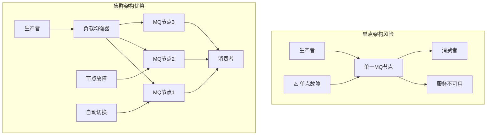
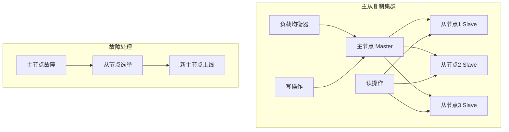
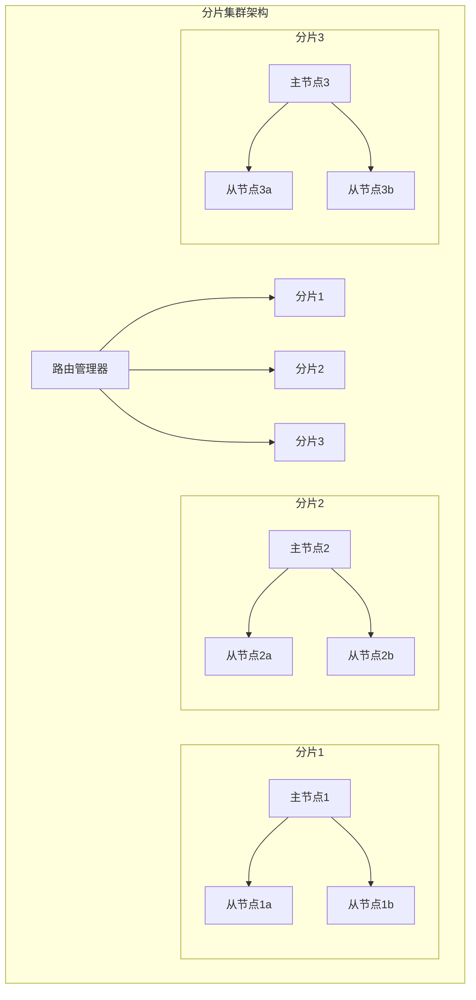
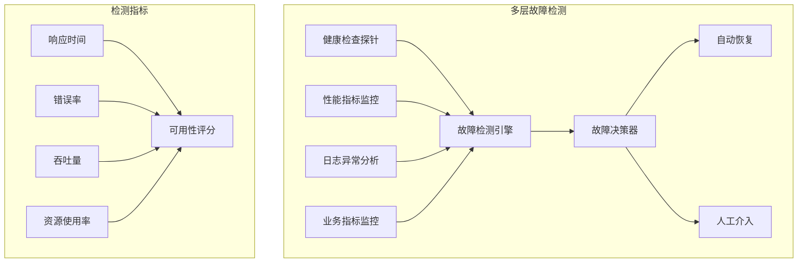
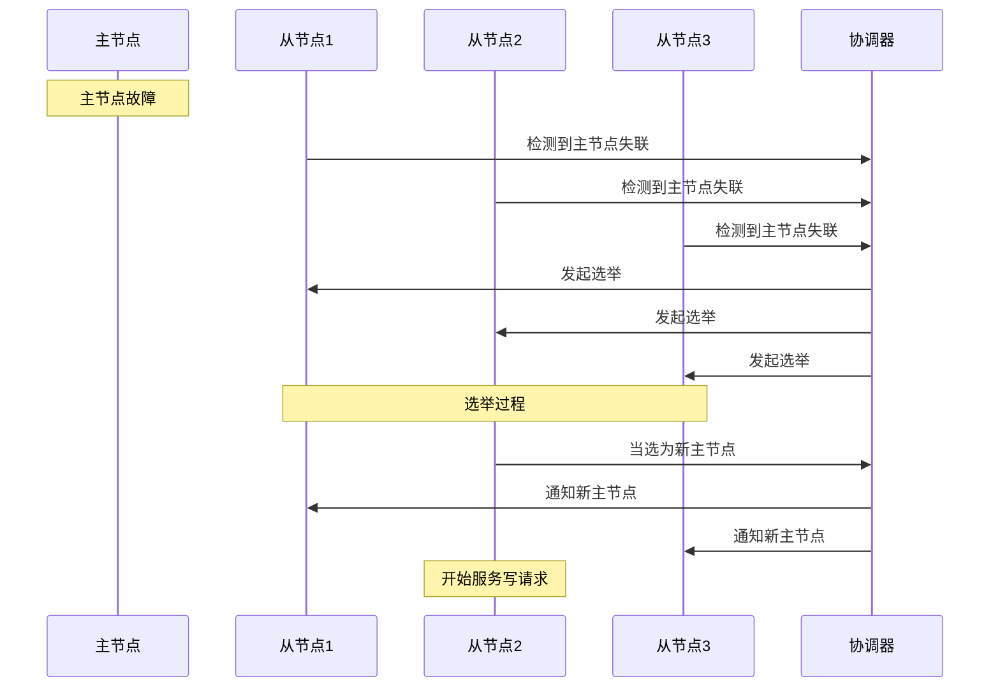
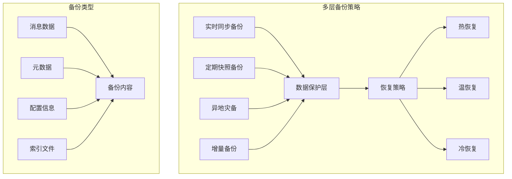
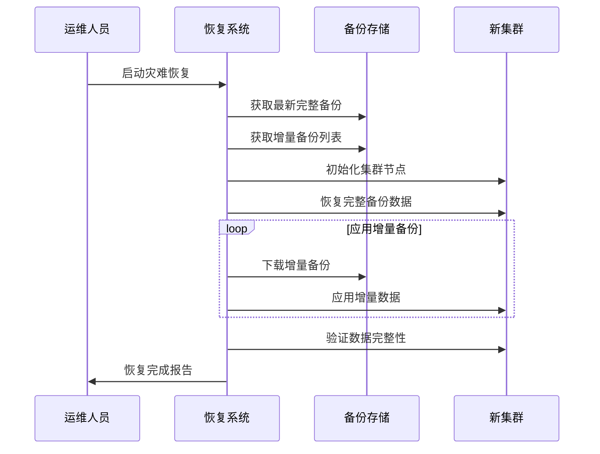
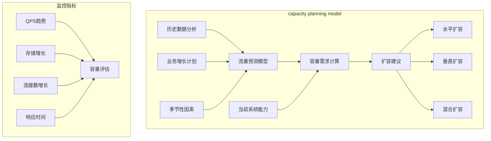
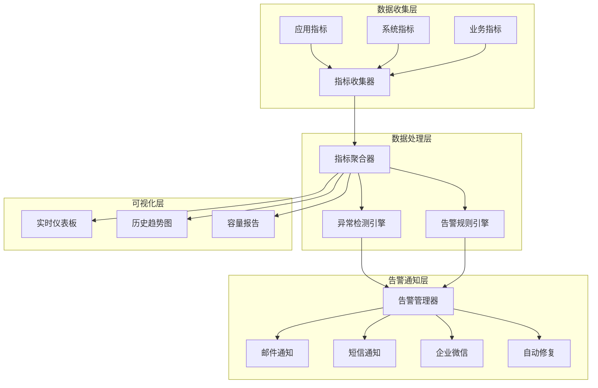

# 第五章 高可用设计：构建永不宕机的系统

> "兵马未动，粮草先行" —— 高可用设计是系统稳定运行的根本保障！ ⚔️

## 本章学习目标 🎯

- 掌握MQ集群部署架构避免单点故障风险
- 理解故障转移机制实现自动恢复能力
- 学会设计完善的数据备份与恢复策略
- 掌握容量规划方法应对业务增长需求
- 建立完善的监控告警体系保障系统健康
- 在前四章基础上构建生产级高可用MQ系统

---

## 5.1 集群部署：避免单点故障

在第三章中我们讨论了消息可靠性，而高可用设计则是从系统架构层面保障服务的持续运行。

### 单点故障的风险分析



### 🏗️ 集群部署架构设计

#### 主从复制模式



**主从模式配置示例：**

```pseudocode
# 主节点配置
masterConfig = {
    nodeRole: "master",
    clusterId: "mq-cluster-01",
    replicationFactor: 3,
    syncMode: "async",  # 异步复制提升性能
    
    # 选举配置
    electionTimeout: 5000,
    heartbeatInterval: 1000
}

# 从节点配置
slaveConfig = {
    nodeRole: "slave", 
    masterId: "master-node-01",
    clusterId: "mq-cluster-01",
    
    # 复制配置
    replicationDelay: 100,
    maxLagAllowed: 1000
}
```

#### 分片集群模式



### 📊 集群模式对比分析

| 模式 | 优势 | 劣势 | 适用场景 |
|------|------|------|----------|
| **主从复制** | 简单易管理<br/>数据一致性好<br/>故障恢复快 | 写性能瓶颈<br/>主节点压力大<br/>资源利用率低 | 中小型系统<br/>读多写少场景 |
| **分片集群** | 水平扩展能力强<br/>写性能优秀<br/>资源利用充分 | 复杂度高<br/>数据迁移困难<br/>跨分片事务复杂 | 大型系统<br/>高并发写入场景 |

### 🔧 集群部署最佳实践

#### 1. 节点规划策略

```pseudocode
class ClusterPlanner {
    function planCluster(expectedQPS, dataSizeGB) {
        # 计算节点数量
        baseNodes = ceil(expectedQPS / 10000)  # 每节点1万QPS
        replicationNodes = baseNodes * 2        # 2倍冗余
        
        # 存储规划
        storagePerNode = dataSizeGB / baseNodes * 1.5  # 1.5倍存储冗余
        
        return {
            masterNodes: baseNodes,
            slaveNodes: replicationNodes,
            storagePerNode: storagePerNode,
            recommendedMode: expectedQPS > 50000 ? "分片集群" : "主从复制"
        }
    }
}
```

#### 2. 网络分区处理

```pseudocode
class NetworkPartitionHandler {
    function handlePartition(cluster) {
        # 脑裂预防策略
        if (cluster.activeNodes < cluster.totalNodes / 2) {
            cluster.enterReadOnlyMode()
            logger.warn("集群进入只读模式，等待网络恢复")
        }
        
        # 选举仲裁
        quorumSize = cluster.totalNodes / 2 + 1
        if (cluster.connectedNodes >= quorumSize) {
            cluster.allowElection = true
        }
    }
    
    function detectNetworkPartition(cluster) {
        # 网络分区检测机制
        partitionRisk = 0
        
        # 检查节点间连通性
        for (nodeA in cluster.nodes) {
            unreachableCount = 0
            for (nodeB in cluster.nodes) {
                if (!nodeA.canReach(nodeB)) {
                    unreachableCount++
                }
            }
            partitionRisk = max(partitionRisk, unreachableCount / cluster.nodes.length)
        }
        
        # 分区风险评估
        if (partitionRisk > 0.5) {
            return {
                status: "partition_detected",
                riskLevel: partitionRisk,
                recommendedAction: "启动分区处理流程"
            }
        }
        
        return {status: "healthy", riskLevel: partitionRisk}
    }
}
```

#### 3. 生产环境集群配置实例

**Kafka集群配置示例：**

```pseudocode
# 3节点Kafka集群配置
kafkaClusterConfig = {
    # 节点1配置
    broker1: {
        brokerId: 1,
        host: "kafka-broker-1.internal",
        port: 9092,
        logDirs: ["/kafka-logs-1", "/kafka-logs-2"],
        
        # 复制配置
        defaultReplicationFactor: 3,
        minInsyncReplicas: 2,
        
        # 性能配置
        numNetworkThreads: 8,
        numIoThreads: 16,
        socketSendBufferBytes: 102400,
        socketReceiveBufferBytes: 102400,
        
        # 日志配置
        logRetentionHours: 168,
        logSegmentBytes: 1073741824,
        logRetentionCheckIntervalMs: 300000
    },
    
    # 节点2和节点3配置类似，但brokerId和host不同
    broker2: {
        brokerId: 2,
        host: "kafka-broker-2.internal",
        # ... 其他配置与broker1相同
    },
    
    broker3: {
        brokerId: 3, 
        host: "kafka-broker-3.internal",
        # ... 其他配置与broker1相同
    },
    
    # 集群级配置
    clusterConfig: {
        zookeeperConnect: "zk1:2181,zk2:2181,zk3:2181/kafka",
        controllerSocketTimeoutMs: 30000,
        controlledShutdownEnable: true,
        autoCreateTopicsEnable: false
    }
}
```

**RabbitMQ集群配置示例：**

```pseudocode
# RabbitMQ集群配置
rabbitMQClusterConfig = {
    # 节点配置
    nodes: [
        {
            name: "rabbit@node1",
            host: "rabbitmq-1.cluster.local",
            type: "disc",  # 磁盘节点
            erlangCookie: "cluster-secret-cookie"
        },
        {
            name: "rabbit@node2", 
            host: "rabbitmq-2.cluster.local",
            type: "disc",
            erlangCookie: "cluster-secret-cookie"
        },
        {
            name: "rabbit@node3",
            host: "rabbitmq-3.cluster.local", 
            type: "ram",   # 内存节点，提升性能
            erlangCookie: "cluster-secret-cookie"
        }
    ],
    
    # 高可用策略
    haPolicy: {
        pattern: "^ha\\.",
        definition: {
            "ha-mode": "exactly",
            "ha-params": 2,
            "ha-sync-mode": "automatic"
        }
    },
    
    # 联邦配置（跨数据中心）
    federation: {
        upstreams: [
            {
                name: "backup-datacenter",
                uri: "amqp://backup-cluster:5672",
                trustStore: "/etc/ssl/certs/ca-certificates.crt"
            }
        ]
    }
}
```

---

## 5.2 故障转移：自动恢复机制

结合第四章的性能监控，我们需要建立智能化的故障检测和自动恢复机制。

### 故障检测体系



### 🚨 智能故障检测

#### 健康检查机制

```pseudocode
class HealthChecker {
    function performHealthCheck(node) {
        checks = [
            checkConnectivity(node),
            checkResourceUsage(node), 
            checkMessageProcessing(node),
            checkDiskSpace(node)
        ]
        
        healthScore = 0
        for (check in checks) {
            result = check.execute()
            healthScore += result.score * check.weight
        }
        
        return {
            healthy: healthScore > 0.8,
            score: healthScore,
            details: checks.map(c => c.result)
        }
    }
    
    function checkConnectivity(node) {
        startTime = currentTime()
        try {
            response = node.ping(timeout: 5000)
            latency = currentTime() - startTime
            
            return {
                score: latency < 100 ? 1.0 : (500 - latency) / 400,
                message: "连接延迟: " + latency + "ms"
            }
        } catch (error) {
            return {score: 0, message: "连接失败: " + error}
        }
    }
}
```

#### 故障模式识别

```pseudocode
class FailureDetector {
    function analyzeFailurePattern(metrics) {
        patterns = {
            "网络分区": detectNetworkPartition(metrics),
            "内存泄漏": detectMemoryLeak(metrics),
            "磁盘故障": detectDiskFailure(metrics),
            "CPU过载": detectCPUOverload(metrics),
            "消息堆积": detectMessageBacklog(metrics)
        }
        
        activePatterns = patterns.filter(p => p.confidence > 0.7)
        return selectPrimaryPattern(activePatterns)
    }
    
    function detectNetworkPartition(metrics) {
        # 网络分区特征：连接数下降但CPU/内存正常
        connectionDrop = metrics.connectionCount < metrics.avgConnectionCount * 0.5
        resourceNormal = metrics.cpuUsage < 0.8 && metrics.memoryUsage < 0.8
        
        if (connectionDrop && resourceNormal) {
            return {pattern: "网络分区", confidence: 0.9}
        }
        return {pattern: "网络分区", confidence: 0.0}
    }
}
```

### 🔄 自动故障转移

#### 主节点故障转移



#### 选举算法实现

```pseudocode
class LeaderElection {
    function startElection(candidates) {
        election = {
            term: currentTerm + 1,
            candidates: candidates,
            votes: {},
            winner: null
        }
        
        # Raft选举算法
        for (candidate in candidates) {
            candidate.requestVotes(election.term)
        }
        
        # 等待投票结果
        waitForVotes(election, timeout: 5000)
        
        # 统计选举结果
        winner = countVotes(election)
        if (winner && winner.voteCount > candidates.length / 2) {
            promoteToLeader(winner)
            return winner
        }
        
        # 选举失败，重新开始
        return startElection(candidates)
    }
    
    function requestVotes(term) {
        for (node in clusterNodes) {
            vote = node.requestVote({
                term: term,
                candidateId: this.nodeId,
                lastLogIndex: this.getLastLogIndex(),
                lastLogTerm: this.getLastLogTerm()
            })
            
            if (vote.granted) {
                this.votesReceived++
            }
        }
    }
}
```

### ⚡ 快速故障恢复

#### 数据同步与追赶

```pseudocode
class FailoverRecovery {
    function promoteSlaveToMaster(slaveNode) {
        # 1. 停止从节点的复制进程
        slaveNode.stopReplication()
        
        # 2. 升级为主节点
        slaveNode.role = "master"
        slaveNode.startAcceptingWrites()
        
        # 3. 通知其他节点
        broadcastNewMaster(slaveNode.nodeId)
        
        # 4. 更新路由信息
        updateRoutingTable(slaveNode)
        
        return {
            newMaster: slaveNode.nodeId,
            promotionTime: currentTime(),
            dataLoss: calculateDataLoss(slaveNode)
        }
    }
    
    function calculateDataLoss(newMaster) {
        lastReplicatedOffset = newMaster.getLastReplicatedOffset()
        oldMasterLastOffset = getLastKnownMasterOffset()
        
        return {
            lostMessages: oldMasterLastOffset - lastReplicatedOffset,
            lossPercentage: (lostMessages / oldMasterLastOffset) * 100
        }
    }
}
```

---

## 5.3 数据备份与恢复：保障数据安全

在第三章消息持久化基础上，我们需要建立更完善的数据保护体系。

### 备份策略全景



### 💾 备份实现策略

#### 增量备份机制

```pseudocode
class IncrementalBackup {
    function performIncrementalBackup() {
        lastBackupTime = getLastBackupTimestamp()
        currentTime = getCurrentTimestamp()
        
        # 获取增量数据
        incrementalData = {
            messages: getMessagesAfter(lastBackupTime),
            queueMetadata: getQueueChangesAfter(lastBackupTime),
            configurations: getConfigChangesAfter(lastBackupTime)
        }
        
        # 压缩和加密
        compressedData = compress(incrementalData)
        encryptedData = encrypt(compressedData, backupKey)
        
        # 存储备份
        backupFile = "backup_" + currentTime + ".inc"
        storageResult = uploadToBackupStorage(backupFile, encryptedData)
        
        # 更新备份记录
        updateBackupIndex({
            file: backupFile,
            timestamp: currentTime,
            type: "incremental",
            size: encryptedData.size,
            checksum: calculateChecksum(encryptedData)
        })
        
        return storageResult
    }
}
```

#### 快照备份系统

```pseudocode
class SnapshotBackup {
    function createSnapshot(clusterId) {
        snapshotId = generateSnapshotId()
        
        # 创建一致性快照
        snapshot = {
            clusterId: clusterId,
            timestamp: currentTime(),
            nodes: [],
            globalState: {}
        }
        
        # 并行创建各节点快照
        for (node in clusterNodes) {
            nodeSnapshot = createNodeSnapshot(node)
            snapshot.nodes.push(nodeSnapshot)
        }
        
        # 保存全局状态
        snapshot.globalState = {
            clusterTopology: getClusterTopology(),
            routingTable: getRoutingTable(),
            configurations: getGlobalConfigurations()
        }
        
        # 验证快照一致性
        if (validateSnapshotConsistency(snapshot)) {
            persistSnapshot(snapshotId, snapshot)
            return {success: true, snapshotId: snapshotId}
        } else {
            return {success: false, error: "快照一致性验证失败"}
        }
    }
}
```

### 🔧 数据恢复流程

#### 灾难恢复策略



#### 自动恢复系统

```pseudocode
class DisasterRecovery {
    function executeRecovery(recoveryPlan) {
        try {
            # 1. 准备恢复环境
            prepareRecoveryEnvironment(recoveryPlan.targetCluster)
            
            # 2. 恢复基础数据
            baseBackup = findLatestFullBackup()
            restoreFullBackup(baseBackup, recoveryPlan.targetCluster)
            
            # 3. 应用增量备份
            incrementalBackups = findIncrementalBackupsAfter(baseBackup.timestamp)
            for (backup in incrementalBackups) {
                applyIncrementalBackup(backup, recoveryPlan.targetCluster)
            }
            
            # 4. 验证恢复结果
            validationResult = validateRecoveredData(recoveryPlan.targetCluster)
            if (!validationResult.success) {
                throw new Error("数据验证失败: " + validationResult.errors)
            }
            
            # 5. 启动集群服务
            startClusterServices(recoveryPlan.targetCluster)
            
            return {
                success: true,
                recoveryTime: getCurrentTime() - recoveryPlan.startTime,
                dataLoss: calculateDataLoss(baseBackup.timestamp),
                message: "恢复成功完成"
            }
            
        } catch (error) {
            rollbackRecovery(recoveryPlan.targetCluster)
            return {success: false, error: error.message}
        }
    }
}
```

---

## 5.4 容量规划：应对流量增长

基于第四章的性能优化经验，我们需要建立前瞻性的容量规划体系。

### 容量规划模型



### 📈 流量预测算法

#### 时间序列预测

```pseudocode
class CapacityPredictor {
    function predictCapacityNeeds(historicalData, timeHorizon) {
        # 分解时间序列
        decomposition = decomposeTimeSeries(historicalData)
        trend = decomposition.trend
        seasonal = decomposition.seasonal
        noise = decomposition.noise
        
        # 预测各组件
        trendForecast = predictTrend(trend, timeHorizon)
        seasonalForecast = predictSeasonal(seasonal, timeHorizon)
        
        # 组合预测结果
        forecast = combineForecast(trendForecast, seasonalForecast)
        
        # 计算置信区间
        confidenceInterval = calculateConfidenceInterval(forecast, noise)
        
        return {
            prediction: forecast,
            upperBound: confidenceInterval.upper,
            lowerBound: confidenceInterval.lower,
            accuracy: evaluatePredictionAccuracy(historicalData, forecast)
        }
    }
    
    function predictTrend(trendData, horizon) {
        # 使用线性回归预测趋势
        model = LinearRegression()
        timePoints = range(0, trendData.length)
        model.fit(timePoints, trendData)
        
        futureTimePoints = range(trendData.length, trendData.length + horizon)
        return model.predict(futureTimePoints)
    }
}
```

### 🔄 动态扩容策略

#### 自动扩容决策

```pseudocode
class AutoScaler {
    function makeScalingDecision(currentMetrics, predictions) {
        # 评估当前负载
        currentLoad = {
            qpsUtilization: currentMetrics.qps / clusterCapacity.maxQPS,
            memoryUtilization: currentMetrics.memory / clusterCapacity.totalMemory,
            storageUtilization: currentMetrics.storage / clusterCapacity.totalStorage
        }
        
        # 预测未来负载
        futureLoad = predictions.nextHourPrediction
        
        # 扩容决策逻辑
        if (shouldScaleOut(currentLoad, futureLoad)) {
            return planScaleOut(currentLoad, futureLoad)
        } else if (shouldScaleIn(currentLoad, futureLoad)) {
            return planScaleIn(currentLoad, futureLoad)
        } else {
            return {action: "maintain", reason: "负载在正常范围内"}
        }
    }
    
    function shouldScaleOut(current, future) {
        # 当前负载高 OR 预期负载增长
        highCurrentLoad = current.qpsUtilization > 0.8 || 
                         current.memoryUtilization > 0.8
        expectedGrowth = future.qpsUtilization > 0.8
        
        return highCurrentLoad || expectedGrowth
    }
    
    function planScaleOut(current, future) {
        # 计算需要的额外容量
        requiredQPSCapacity = future.maxQPS * 1.2  # 20% 缓冲
        requiredMemory = future.maxMemory * 1.2
        
        # 计算需要增加的节点数
        nodesNeeded = max(
            ceil(requiredQPSCapacity / nodeCapacity.qps),
            ceil(requiredMemory / nodeCapacity.memory)
        )
        
        return {
            action: "scale_out",
            nodesNeeded: nodesNeeded,
            estimatedCost: calculateScalingCost(nodesNeeded),
            timeline: "15-30分钟"
        }
    }
}
```

### 📊 容量管理仪表板

#### 实时容量监控

```pseudocode
class CapacityDashboard {
    function generateCapacityReport() {
        currentTime = getCurrentTime()
        
        report = {
            timestamp: currentTime,
            clusterHealth: assessClusterHealth(),
            capacityUtilization: calculateCapacityUtilization(),
            growthTrends: analyzeGrowthTrends(),
            recommendations: generateRecommendations()
        }
        
        return formatDashboardReport(report)
    }
    
    function calculateCapacityUtilization() {
        totalCapacity = {
            qps: sum(node.maxQPS for node in clusterNodes),
            memory: sum(node.totalMemory for node in clusterNodes),
            storage: sum(node.totalStorage for node in clusterNodes)
        }
        
        currentUsage = {
            qps: getCurrentQPS(),
            memory: getCurrentMemoryUsage(),
            storage: getCurrentStorageUsage()
        }
        
        return {
            qpsUtilization: currentUsage.qps / totalCapacity.qps,
            memoryUtilization: currentUsage.memory / totalCapacity.memory,
            storageUtilization: currentUsage.storage / totalCapacity.storage,
            overallUtilization: max(上述三个利用率)
        }
    }
    
    function generateRecommendations() {
        utilization = calculateCapacityUtilization()
        predictions = getCapacityPredictions()
        recommendations = []
        
        # 当前容量建议
        if (utilization.overallUtilization > 0.8) {
            recommendations.push({
                type: "immediate_action",
                priority: "high",
                message: "当前容量使用率超过80%，建议立即扩容",
                suggestedAction: "增加2个节点"
            })
        }
        
        # 预测性建议
        if (predictions.timeToCapacityExhaustion < 7) {  # 7天内容量耗尽
            recommendations.push({
                type: "proactive_planning",
                priority: "medium", 
                message: "预计" + predictions.timeToCapacityExhaustion + "天后容量不足",
                suggestedAction: "制定扩容计划"
            })
        }
        
        # 成本优化建议
        if (utilization.overallUtilization < 0.3) {
            recommendations.push({
                type: "cost_optimization",
                priority: "low",
                message: "当前容量使用率较低，可考虑缩容节省成本",
                suggestedAction: "评估缩容可行性"
            })
        }
        
        return recommendations
    }
}
```

#### 容量规划实战案例

**案例1：电商大促容量规划**

```pseudocode
class PromotionCapacityPlanning {
    function planForPromotion(promotionData) {
        # 历史大促数据分析
        historicalPromotions = getHistoricalPromotionData()
        
        # 预测本次大促流量
        baseTraffic = getCurrentAverageQPS()
        promotionMultiplier = calculatePromotionMultiplier(promotionData, historicalPromotions)
        peakQPS = baseTraffic * promotionMultiplier
        
        # 容量需求计算
        currentCapacity = getCurrentClusterCapacity()
        requiredCapacity = peakQPS * 1.5  # 50%安全缓冲
        
        if (requiredCapacity > currentCapacity) {
            additionalNodes = ceil((requiredCapacity - currentCapacity) / nodeCapacity)
            
            return {
                needsExpansion: true,
                currentCapacity: currentCapacity,
                requiredCapacity: requiredCapacity,
                additionalNodes: additionalNodes,
                estimatedCost: calculatePromotionCost(additionalNodes),
                timeline: {
                    preparationTime: "7天",
                    deploymentTime: "2天", 
                    testingTime: "1天"
                },
                rollbackPlan: generateRollbackPlan()
            }
        }
        
        return {needsExpansion: false, message: "当前容量足够"}
    }
    
    function calculatePromotionMultiplier(currentPromotion, historical) {
        # 根据促销力度计算流量倍数
        discountFactor = currentPromotion.maxDiscount / 100
        durationFactor = currentPromotion.durationHours / 24
        categoryFactor = getCategoryPopularityFactor(currentPromotion.categories)
        
        baseMultiplier = 2.0  # 基础倍数
        adjustedMultiplier = baseMultiplier * (1 + discountFactor) * 
                           (1 + durationFactor) * categoryFactor
        
        # 与历史数据对比校验
        historicalAverage = calculateHistoricalAverageMultiplier(historical)
        finalMultiplier = (adjustedMultiplier + historicalAverage) / 2
        
        return min(finalMultiplier, 10.0)  # 最大不超过10倍流量
    }
}
```

**案例2：渐进式扩容策略**

```pseudocode
class GradualScalingStrategy {
    function executeGradualScaling(targetCapacity) {
        currentCapacity = getCurrentCapacity()
        scalingSteps = planScalingSteps(currentCapacity, targetCapacity)
        
        scalingResults = []
        
        for (step in scalingSteps) {
            # 执行扩容步骤
            stepResult = executeScalingStep(step)
            scalingResults.push(stepResult)
            
            # 验证扩容效果
            validation = validateScalingStep(step, stepResult)
            if (!validation.success) {
                # 扩容失败，执行回滚
                rollbackResult = rollbackScalingStep(step)
                return {
                    success: false,
                    error: validation.error,
                    rollbackResult: rollbackResult
                }
            }
            
            # 等待系统稳定
            waitForSystemStabilization(step.stabilizationTime)
        }
        
        return {
            success: true,
            scalingResults: scalingResults,
            finalCapacity: getCurrentCapacity(),
            totalTime: calculateTotalScalingTime(scalingResults)
        }
    }
    
    function planScalingSteps(current, target) {
        steps = []
        capacityGap = target - current
        
        # 分阶段扩容，每次增加不超过50%
        while (current < target) {
            stepIncrement = min(current * 0.5, capacityGap)
            steps.push({
                fromCapacity: current,
                toCapacity: current + stepIncrement,
                nodesAdded: ceil(stepIncrement / nodeCapacity),
                stabilizationTime: 300  # 5分钟稳定时间
            })
            current += stepIncrement
            capacityGap -= stepIncrement
        }
        
        return steps
    }
}
```

---

## 5.5 监控告警：建立完善的观测体系

结合第四章的性能监控，建立更完善的可观测性体系。

### 监控体系架构



### 🚨 智能告警系统

#### 多级告警策略

| 告警级别 | 触发条件 | 响应时间 | 通知方式 | 处理动作 |
|----------|----------|----------|----------|----------|
| **🔴 紧急** | 服务不可用<br/>数据丢失风险 | 1分钟内 | 电话+短信+邮件 | 自动故障转移 |
| **🟡 警告** | 性能下降<br/>资源不足 | 5分钟内 | 短信+邮件 | 自动扩容 |
| **🔵 提醒** | 指标异常<br/>容量预警 | 15分钟内 | 邮件+IM | 人工确认 |

#### 智能告警规则

```pseudocode
class IntelligentAlerting {
    function evaluateAlertRules(metrics) {
        alerts = []
        
        # 服务可用性告警
        if (metrics.availability < 0.99) {
            severity = metrics.availability < 0.95 ? "critical" : "warning"
            alerts.push(createAlert("service_availability", severity, {
                current: metrics.availability,
                threshold: 0.99,
                impact: "用户服务受影响"
            }))
        }
        
        # 性能异常告警
        responseTimeAlert = detectResponseTimeAnomaly(metrics.responseTime)
        if (responseTimeAlert.isAnomalous) {
            alerts.push(createAlert("response_time_anomaly", "warning", {
                current: metrics.responseTime,
                expected: responseTimeAlert.expectedRange,
                deviation: responseTimeAlert.deviation
            }))
        }
        
        # 容量预警
        capacityAlert = predictCapacityShortage(metrics)
        if (capacityAlert.shortageRisk > 0.7) {
            alerts.push(createAlert("capacity_shortage", "info", {
                expectedShortage: capacityAlert.timeToShortage,
                recommendation: capacityAlert.scaleOutSuggestion
            }))
        }
        
        return filterAndDeduplicateAlerts(alerts)
    }
    
    function detectResponseTimeAnomaly(currentResponseTime) {
        # 使用统计方法检测异常
        historicalData = getHistoricalResponseTime(period: "7d")
        mean = calculateMean(historicalData)
        stdDev = calculateStandardDeviation(historicalData)
        
        # 3-sigma规则检测异常
        upperBound = mean + 3 * stdDev
        lowerBound = mean - 3 * stdDev
        
        isAnomalous = currentResponseTime > upperBound || currentResponseTime < lowerBound
        
        return {
            isAnomalous: isAnomalous,
            expectedRange: [lowerBound, upperBound],
            deviation: abs(currentResponseTime - mean) / stdDev
        }
    }
}
```

### 📊 可观测性最佳实践

#### 黄金指标监控

```pseudocode
class GoldenMetrics {
    # SRE 四个黄金指标
    function collectGoldenMetrics() {
        return {
            # 延迟 (Latency)
            latency: {
                p50: calculatePercentile(responseTime, 50),
                p95: calculatePercentile(responseTime, 95),
                p99: calculatePercentile(responseTime, 99),
                max: getMaxResponseTime()
            },
            
            # 流量 (Traffic)  
            traffic: {
                requestsPerSecond: getCurrentQPS(),
                messagesPerSecond: getMessageThroughput(),
                connectionsPerSecond: getNewConnectionRate()
            },
            
            # 错误率 (Errors)
            errors: {
                errorRate: getErrorRate(),
                errorCount: getErrorCount(),
                errorTypes: getErrorTypeDistribution()
            },
            
            # 饱和度 (Saturation)
            saturation: {
                cpuUtilization: getCPUUtilization(),
                memoryUtilization: getMemoryUtilization(),
                queueDepth: getAverageQueueDepth(),
                connectionUtilization: getConnectionUtilization()
            }
        }
    }
}
```

---

## 本章总结 📚

### 🎯 核心要点回顾

1. **集群部署**：通过主从复制和分片集群避免单点故障
2. **故障转移**：建立智能检测和自动恢复机制  
3. **数据备份**：实施多层备份策略保障数据安全
4. **容量规划**：基于预测模型实现动态扩容
5. **监控告警**：构建完善的可观测性体系

### 🔗 与前后章节的联系

- **承接第四章**：在性能优化基础上构建高可用架构
- **结合第三章**：将消息可靠性扩展到系统级可靠性
- **为第六章铺垫**：高可用设计为进阶特性提供稳定基础

### 💡 实践建议

1. **渐进式高可用**：从主从复制开始，逐步演进到分片集群
2. **故障演练**：定期进行故障注入测试验证恢复能力
3. **监控先行**：先建立监控体系，再优化告警策略
4. **自动化优先**：将运维操作自动化，减少人为错误

### 🚀 下章预告

第六章《进阶特性：解决复杂业务场景》将在高可用基础上，深入探讨消息顺序、延时消息、消息过滤等进阶特性，帮助你应对更复杂的业务需求。

---

*高可用不是一蹴而就的，而是持续演进的过程。让我们在稳定性的基础上继续探索MQ的进阶玩法！* 🛡️