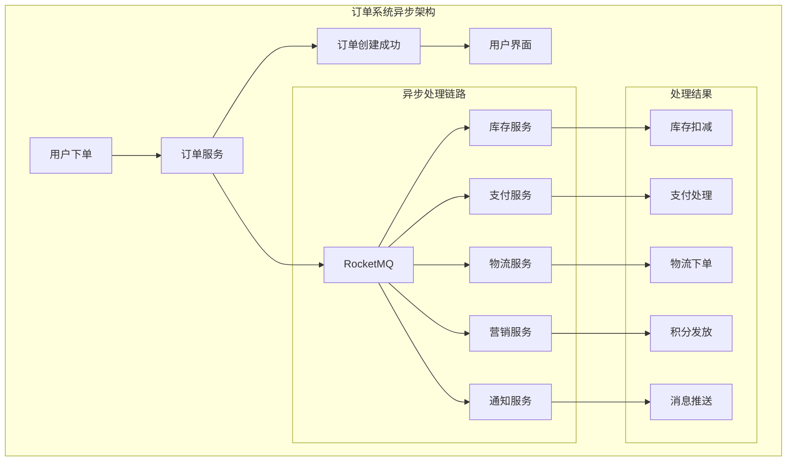
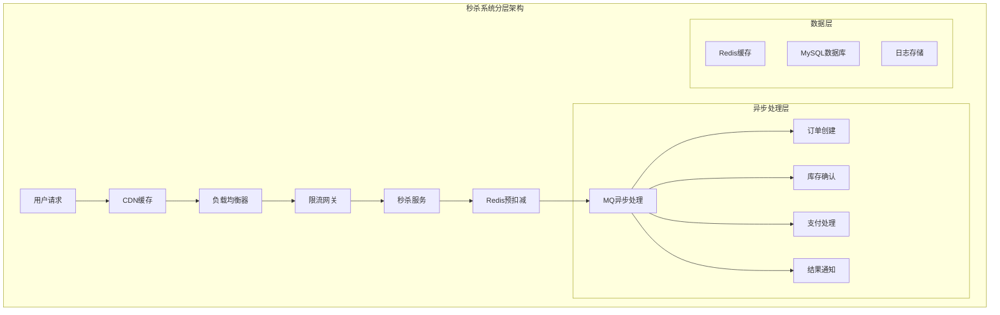
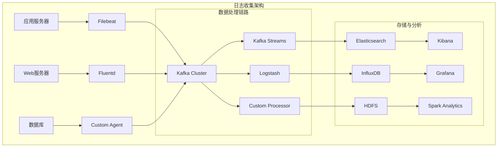
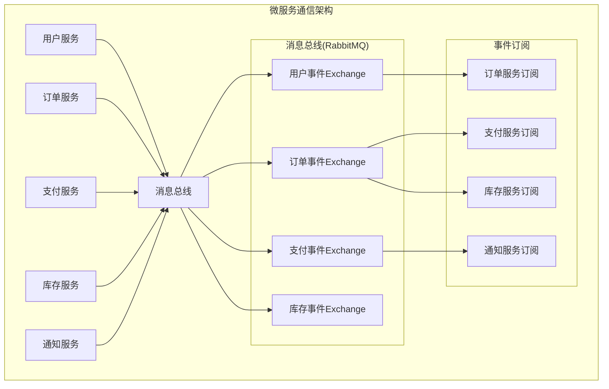
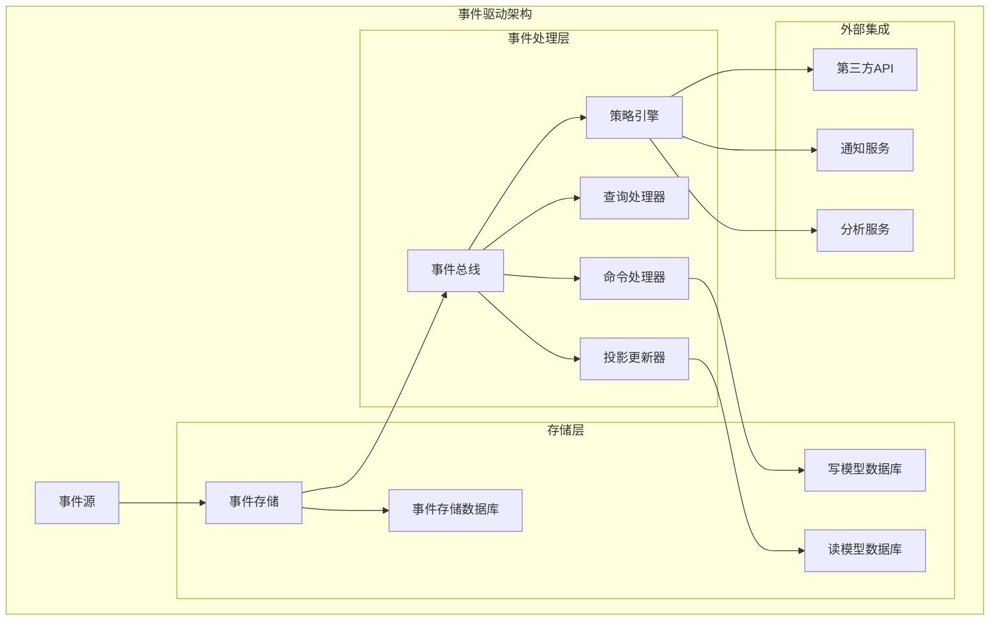

# 第八章 实战应用：典型场景深度剖析

> "纸上得来终觉浅，绝知此事要躬行" —— 真正的技术能力来自实战应用！ ⚔️

## 本章学习目标 🎯

- 深入分析订单系统异步处理的完整实现方案
- 掌握秒杀系统削峰填谷的核心技术和架构设计
- 学会构建高效的日志收集和实时数据管道
- 理解微服务通信中MQ的最佳应用模式
- 掌握事件驱动架构的设计原理和实现要点
- 将前七章理论知识转化为可落地的实战方案

---

## 8.1 订单系统：异步处理提升用户体验

基于第七章的产品选型，我们选择RocketMQ来实现一个完整的订单处理系统。

### 订单系统架构设计



### 🛒 核心实现方案

#### 订单事件定义

```pseudocode
class OrderEvents {
    # 订单状态变更事件
    orderCreated = {
        eventType: "ORDER_CREATED",
        schema: {
            orderId: "string",
            userId: "string", 
            totalAmount: "decimal",
            items: "array",
            timestamp: "long",
            metadata: "object"
        }
    }
    
    orderPaid = {
        eventType: "ORDER_PAID",
        schema: {
            orderId: "string",
            paymentId: "string",
            amount: "decimal",
            paymentMethod: "string",
            timestamp: "long"
        }
    }
    
    orderShipped = {
        eventType: "ORDER_SHIPPED", 
        schema: {
            orderId: "string",
            trackingNumber: "string",
            carrier: "string",
            estimatedDelivery: "long",
            timestamp: "long"
        }
    }
}
```

#### 订单服务实现

```pseudocode
class OrderService {
    function __init__(mqProducer, orderRepository) {
        this.mqProducer = mqProducer
        this.orderRepository = orderRepository
    }
    
    function createOrder(orderRequest) {
        try {
            # 1. 基础校验
            validateOrderRequest(orderRequest)
            
            # 2. 创建订单记录
            order = new Order({
                id: generateOrderId(),
                userId: orderRequest.userId,
                items: orderRequest.items,
                totalAmount: calculateTotalAmount(orderRequest.items),
                status: "CREATED",
                createTime: getCurrentTime()
            })
            
            # 3. 持久化订单
            savedOrder = this.orderRepository.save(order)
            
            # 4. 发送订单创建事件（异步处理）
            orderCreatedEvent = {
                eventType: "ORDER_CREATED",
                orderId: savedOrder.id,
                userId: savedOrder.userId,
                totalAmount: savedOrder.totalAmount,
                items: savedOrder.items,
                timestamp: getCurrentTime()
            }
            
            # 使用事务消息保证一致性
            this.mqProducer.sendTransactionMessage(
                topic: "order-events",
                tag: "ORDER_CREATED",
                message: orderCreatedEvent,
                localTransaction: () => {
                    # 本地事务：更新订单状态为处理中
                    this.orderRepository.updateStatus(savedOrder.id, "PROCESSING")
                    return {success: true}
                }
            )
            
            # 5. 立即返回给用户
            return {
                success: true,
                orderId: savedOrder.id,
                message: "订单创建成功，正在处理中...",
                estimatedProcessTime: "3-5分钟"
            }
            
        } catch (error) {
            logError("订单创建失败", error)
            return {
                success: false,
                error: error.message
            }
        }
    }
    
    function handleOrderStatusUpdate(orderId, newStatus, details) {
        # 更新订单状态并发送相应事件
        order = this.orderRepository.findById(orderId)
        if (!order) {
            throw new Error("订单不存在: " + orderId)
        }
        
        order.status = newStatus
        order.updateTime = getCurrentTime()
        this.orderRepository.save(order)
        
        # 发送状态更新事件
        statusEvent = createStatusUpdateEvent(order, details)
        this.mqProducer.sendMessage("order-events", statusEvent)
        
        return order
    }
}
```

#### 库存服务消费者

```pseudocode
class InventoryConsumer {
    function __init__(inventoryService, orderMQProducer) {
        this.inventoryService = inventoryService
        this.orderMQProducer = orderMQProducer
    }
    
    @MessageHandler(topic: "order-events", tag: "ORDER_CREATED")
    function handleOrderCreated(message) {
        try {
            orderEvent = JSON.parse(message.body)
            orderId = orderEvent.orderId
            items = orderEvent.items
            
            # 1. 检查库存
            inventoryCheckResult = this.inventoryService.checkInventory(items)
            
            if (inventoryCheckResult.sufficient) {
                # 2. 扣减库存
                deductionResult = this.inventoryService.deductInventory(items)
                
                if (deductionResult.success) {
                    # 3. 发送库存扣减成功事件
                    inventoryDeductedEvent = {
                        eventType: "INVENTORY_DEDUCTED",
                        orderId: orderId,
                        items: items,
                        timestamp: getCurrentTime()
                    }
                    
                    this.orderMQProducer.sendMessage("order-events", inventoryDeductedEvent)
                    
                    logInfo("库存扣减成功: " + orderId)
                } else {
                    # 扣减失败，发送失败事件
                    handleInventoryDeductionFailure(orderId, deductionResult.error)
                }
            } else {
                # 库存不足，发送库存不足事件
                handleInsufficientInventory(orderId, inventoryCheckResult.shortage)
            }
            
            # 确认消息处理完成
            return MessageConsumeResult.SUCCESS
            
        } catch (error) {
            logError("处理订单创建事件失败", error)
            return MessageConsumeResult.RECONSUME_LATER
        }
    }
    
    function handleInsufficientInventory(orderId, shortage) {
        insufficientEvent = {
            eventType: "INVENTORY_INSUFFICIENT",
            orderId: orderId,
            shortage: shortage,
            timestamp: getCurrentTime()
        }
        
        this.orderMQProducer.sendMessage("order-events", insufficientEvent)
        
        # 记录库存不足日志用于补货决策
        logWarning("订单库存不足", {orderId: orderId, shortage: shortage})
    }
}
```

### ⚡ 性能优化策略

#### 批量处理优化

```pseudocode
class BatchOrderProcessor {
    function __init__(config) {
        this.batchSize = config.batchSize || 50
        this.batchTimeout = config.batchTimeout || 2000
        this.orderBuffer = []
        this.lastFlushTime = getCurrentTime()
    }
    
    function processOrderBatch(orders) {
        # 按服务类型分组批量处理
        grouped = groupOrdersByService(orders)
        
        # 并发处理不同服务
        futures = []
        for (serviceType in grouped) {
            future = processServiceBatch(serviceType, grouped[serviceType])
            futures.push(future)
        }
        
        # 等待所有批次处理完成
        results = awaitAll(futures)
        return aggregateResults(results)
    }
    
    function processServiceBatch(serviceType, orders) {
        switch (serviceType) {
            case "inventory":
                return batchDeductInventory(orders)
            case "payment":
                return batchProcessPayment(orders)
            case "notification":
                return batchSendNotification(orders)
            default:
                return processSingleOrders(orders)
        }
    }
    
    function batchDeductInventory(orders) {
        # 合并相同商品的库存扣减请求
        itemsMap = {}
        orderItemsMapping = {}
        
        for (order in orders) {
            orderItemsMapping[order.id] = order.items
            for (item in order.items) {
                if (itemsMap[item.skuId]) {
                    itemsMap[item.skuId] += item.quantity
                } else {
                    itemsMap[item.skuId] = item.quantity
                }
            }
        }
        
        # 批量扣减库存
        batchDeductionResult = inventoryService.batchDeduct(itemsMap)
        
        # 根据扣减结果更新各订单状态
        return processBatchDeductionResult(batchDeductionResult, orderItemsMapping)
    }
}
```

---

## 8.2 秒杀系统：削峰填谷的经典案例

基于第六章的限流背压机制，设计一个能够应对突发流量的秒杀系统。

### 秒杀系统架构



### 🚀 核心实现方案

#### 秒杀控制器

```pseudocode
class SeckillController {
    function __init__(config) {
        this.redisClient = createRedisClient()
        this.mqProducer = createMQProducer()
        this.rateLimiter = createRateLimiter(config.maxQPS)
        this.bloomFilter = createBloomFilter(config.bloomFilterConfig)
    }
    
    function participateSeckill(userId, activityId) {
        try {
            # 1. 限流检查
            if (!this.rateLimiter.allowRequest()) {
                return {
                    success: false,
                    code: "RATE_LIMITED",
                    message: "系统繁忙，请稍后重试"
                }
            }
            
            # 2. 基础参数校验
            if (!validateSeckillRequest(userId, activityId)) {
                return {
                    success: false,
                    code: "INVALID_REQUEST",
                    message: "请求参数无效"
                }
            }
            
            # 3. 布隆过滤器预检
            userKey = userId + ":" + activityId
            if (this.bloomFilter.mightContain(userKey)) {
                return {
                    success: false,
                    code: "ALREADY_PARTICIPATED",
                    message: "您已经参与过此次秒杀"
                }
            }
            
            # 4. Redis预扣减库存
            stockResult = tryDeductStock(activityId)
            if (!stockResult.success) {
                return {
                    success: false,
                    code: "STOCK_INSUFFICIENT",
                    message: "商品已售罄"
                }
            }
            
            # 5. 生成预订单号
            preOrderId = generatePreOrderId(userId, activityId)
            
            # 6. 发送异步处理消息
            seckillMessage = {
                preOrderId: preOrderId,
                userId: userId,
                activityId: activityId,
                timestamp: getCurrentTime(),
                stockReservation: stockResult.reservationId
            }
            
            this.mqProducer.sendMessage(
                topic: "seckill-orders",
                tag: "SECKILL_REQUEST",
                message: seckillMessage
            )
            
            # 7. 添加到布隆过滤器
            this.bloomFilter.add(userKey)
            
            # 8. 立即返回结果
            return {
                success: true,
                preOrderId: preOrderId,
                message: "秒杀请求已提交，请等待处理结果",
                estimatedTime: "30秒内"
            }
            
        } catch (error) {
            logError("秒杀请求处理失败", error)
            return {
                success: false,
                code: "SYSTEM_ERROR",
                message: "系统异常，请稍后重试"
            }
        }
    }
    
    function tryDeductStock(activityId) {
        # 使用Redis Lua脚本保证原子性
        luaScript = `
            local stockKey = "seckill:stock:" .. ARGV[1]
            local reservationKey = "seckill:reservation:" .. ARGV[1]
            
            # 检查库存
            local currentStock = redis.call('GET', stockKey) or "0"
            if tonumber(currentStock) <= 0 then
                return {0, "库存不足"}
            end
            
            # 扣减库存
            local newStock = redis.call('DECR', stockKey)
            if newStock < 0 then
                # 库存不足，回滚
                redis.call('INCR', stockKey)
                return {0, "库存扣减失败"}
            end
            
            # 生成预留ID
            local reservationId = ARGV[2]
            redis.call('SETEX', reservationKey .. ":" .. reservationId, 300, "1")
            
            return {1, reservationId}
        `
        
        reservationId = generateReservationId()
        result = this.redisClient.eval(luaScript, [], [activityId, reservationId])
        
        return {
            success: result[1] == 1,
            reservationId: result[2],
            message: result[1] == 1 ? "预扣减成功" : result[2]
        }
    }
}
```

#### 秒杀订单处理器

```pseudocode
class SeckillOrderProcessor {
    function __init__(orderService, paymentService, notificationService) {
        this.orderService = orderService
        this.paymentService = paymentService
        this.notificationService = notificationService
        this.redisClient = createRedisClient()
    }
    
    @MessageHandler(topic: "seckill-orders", tag: "SECKILL_REQUEST")
    function processSeckillOrder(message) {
        try {
            seckillData = JSON.parse(message.body)
            preOrderId = seckillData.preOrderId
            userId = seckillData.userId
            activityId = seckillData.activityId
            reservationId = seckillData.stockReservation
            
            # 1. 验证库存预留是否有效
            if (!isReservationValid(activityId, reservationId)) {
                handleSeckillFailure(preOrderId, "库存预留已过期")
                return MessageConsumeResult.SUCCESS
            }
            
            # 2. 获取活动详情
            activity = getActivityDetails(activityId)
            if (!activity || !activity.isActive()) {
                handleSeckillFailure(preOrderId, "活动已结束")
                return MessageConsumeResult.SUCCESS
            }
            
            # 3. 创建正式订单
            orderResult = this.orderService.createSeckillOrder({
                preOrderId: preOrderId,
                userId: userId,
                activityId: activityId,
                productId: activity.productId,
                seckillPrice: activity.seckillPrice,
                originalPrice: activity.originalPrice
            })
            
            if (!orderResult.success) {
                handleSeckillFailure(preOrderId, "订单创建失败: " + orderResult.error)
                rollbackStockReservation(activityId, reservationId)
                return MessageConsumeResult.SUCCESS
            }
            
            # 4. 确认库存扣减
            confirmStockDeduction(activityId, reservationId)
            
            # 5. 发送支付通知
            sendPaymentNotification(orderResult.order)
            
            # 6. 通知用户秒杀成功
            this.notificationService.notifyUser(userId, {
                type: "SECKILL_SUCCESS",
                orderId: orderResult.order.id,
                message: "恭喜！秒杀成功，请在15分钟内完成支付"
            })
            
            logInfo("秒杀订单处理成功", {
                preOrderId: preOrderId,
                orderId: orderResult.order.id,
                userId: userId
            })
            
            return MessageConsumeResult.SUCCESS
            
        } catch (error) {
            logError("秒杀订单处理失败", error)
            
            # 处理失败，根据错误类型判断是否重试
            if (isRetryableError(error)) {
                return MessageConsumeResult.RECONSUME_LATER
            } else {
                handleSeckillFailure(seckillData.preOrderId, error.message)
                return MessageConsumeResult.SUCCESS
            }
        }
    }
    
    function confirmStockDeduction(activityId, reservationId) {
        # 确认库存扣减，清理预留记录
        luaScript = `
            local reservationKey = "seckill:reservation:" .. ARGV[1] .. ":" .. ARGV[2]
            local stockKey = "seckill:stock:" .. ARGV[1]
            
            # 检查预留是否存在
            if redis.call('EXISTS', reservationKey) == 1 then
                # 删除预留记录
                redis.call('DEL', reservationKey)
                return 1
            else
                # 预留不存在，可能已过期，需要回滚库存
                redis.call('INCR', stockKey)
                return 0
            end
        `
        
        result = this.redisClient.eval(luaScript, [], [activityId, reservationId])
        return result == 1
    }
}
```

### 📊 性能调优策略

#### 多级缓存架构

```pseudocode
class SeckillCacheManager {
    function __init__(config) {
        this.l1Cache = createLocalCache(config.l1CacheSize)  # 本地缓存
        this.l2Cache = createRedisCache(config.redisConfig)  # Redis缓存
        this.database = createDatabaseConnection(config.dbConfig)
    }
    
    function getActivityInfo(activityId) {
        # L1缓存查询
        activity = this.l1Cache.get("activity:" + activityId)
        if (activity) {
            return activity
        }
        
        # L2缓存查询
        activity = this.l2Cache.get("activity:" + activityId)
        if (activity) {
            this.l1Cache.put("activity:" + activityId, activity, ttl: 60)
            return activity
        }
        
        # 数据库查询
        activity = this.database.query("SELECT * FROM activities WHERE id = ?", [activityId])
        if (activity) {
            this.l2Cache.put("activity:" + activityId, activity, ttl: 300)
            this.l1Cache.put("activity:" + activityId, activity, ttl: 60)
        }
        
        return activity
    }
    
    function warmupCache() {
        # 预热热门活动数据
        upcomingActivities = this.database.query(
            "SELECT * FROM activities WHERE start_time > NOW() AND start_time < DATE_ADD(NOW(), INTERVAL 1 HOUR)"
        )
        
        for (activity in upcomingActivities) {
            # 预热到Redis缓存
            this.l2Cache.put("activity:" + activity.id, activity, ttl: 3600)
            
            # 初始化库存缓存
            this.l2Cache.put("seckill:stock:" + activity.id, activity.totalStock, ttl: 3600)
        }
        
        logInfo("缓存预热完成", {count: upcomingActivities.length})
    }
}
```

---

## 8.3 日志收集：构建实时数据管道

基于第七章Kafka的特性，构建一个高效的日志收集和处理系统。

### 日志收集架构



### 📊 实时日志处理

#### 日志消息格式定义

```pseudocode
class LogMessage {
    standardFormat = {
        timestamp: "ISO8601格式时间戳",
        level: "日志级别: DEBUG/INFO/WARN/ERROR/FATAL",
        service: "服务名称",
        instance: "服务实例ID",
        traceId: "分布式追踪ID",
        message: "日志内容",
        metadata: {
            userId: "用户ID（如果有）",
            requestId: "请求ID",
            duration: "请求耗时（毫秒）",
            statusCode: "HTTP状态码",
            extra: "扩展字段"
        }
    }
    
    function createLogMessage(level, service, message, metadata = {}) {
        return {
            timestamp: getCurrentISO8601Time(),
            level: level,
            service: service,
            instance: getInstanceId(),
            traceId: getCurrentTraceId(),
            message: message,
            metadata: metadata
        }
    }
}
```

#### Kafka日志生产者

```pseudocode
class LogProducer {
    function __init__(config) {
        this.kafkaProducer = new KafkaProducer({
            bootstrapServers: config.kafkaServers,
            acks: "1",  # 平衡可靠性和性能
            batchSize: 16384,  # 16KB批次
            lingerMs: 10,  # 10ms等待时间
            compressionType: "snappy",  # 快速压缩
            maxInFlightRequestsPerConnection: 5
        })
        
        this.topicStrategy = config.topicStrategy || "by_service"
        this.logBuffer = createAsyncBuffer(config.bufferSize || 1000)
    }
    
    function sendLog(logMessage) {
        try {
            # 确定目标Topic
            topic = determineLogTopic(logMessage)
            
            # 异步发送到缓冲区
            this.logBuffer.add({
                topic: topic,
                key: logMessage.service + ":" + logMessage.instance,
                value: JSON.stringify(logMessage),
                timestamp: logMessage.timestamp
            })
            
        } catch (error) {
            # 日志发送失败不应影响业务逻辑
            handleLogSendError(error, logMessage)
        }
    }
    
    function determineLogTopic(logMessage) {
        switch (this.topicStrategy) {
            case "by_service":
                return "logs-" + logMessage.service.toLowerCase()
            case "by_level":
                return "logs-" + logMessage.level.toLowerCase()
            case "unified":
                return "logs-all"
            default:
                return "logs-default"
        }
    }
    
    function startBatchSender() {
        # 启动批量发送线程
        setInterval(() => {
            batch = this.logBuffer.drain()
            if (batch.length > 0) {
                sendLogBatch(batch)
            }
        }, 100)  # 每100ms发送一次
    }
    
    function sendLogBatch(batch) {
        # 按Topic分组
        topicBatches = groupByTopic(batch)
        
        for (topic in topicBatches) {
            messages = topicBatches[topic]
            
            this.kafkaProducer.send({
                topic: topic,
                messages: messages
            }).then(result => {
                logDebug("日志批次发送成功", {
                    topic: topic,
                    messageCount: messages.length,
                    partition: result.partition,
                    offset: result.offset
                })
            }).catch(error => {
                logError("日志批次发送失败", error)
                # 重试逻辑
                retryLogBatch(topic, messages)
            })
        }
    }
}
```

#### 实时日志处理器

```pseudocode
class RealTimeLogProcessor {
    function __init__(config) {
        this.kafkaStreams = new KafkaStreams()
        this.alertThresholds = config.alertThresholds
        this.metricsCollector = new MetricsCollector()
    }
    
    function buildProcessingTopology() {
        builder = new StreamsBuilder()
        
        # 1. 读取日志流
        logStream = builder.stream("logs-all")
        
        # 2. 解析和过滤
        parsedStream = logStream
            .mapValues(value => JSON.parse(value))
            .filter((key, log) => isValidLog(log))
        
        # 3. 错误日志实时告警
        errorStream = parsedStream
            .filter((key, log) => log.level == "ERROR" || log.level == "FATAL")
            .groupByKey()
            .windowedBy(TimeWindows.of(Duration.ofMinutes(1)))
            .count()
        
        errorStream.toStream().foreach((windowedKey, count) => {
            if (count > this.alertThresholds.errorRate) {
                sendErrorAlert(windowedKey.key(), count, windowedKey.window())
            }
        })
        
        # 4. 性能指标计算
        performanceStream = parsedStream
            .filter((key, log) => log.metadata.duration != null)
            .groupBy((key, log) => log.service)
            .windowedBy(TimeWindows.of(Duration.ofMinutes(5)))
            .aggregate(
                initializer: () => new PerformanceMetrics(),
                aggregator: (service, log, metrics) => {
                    metrics.addSample(log.metadata.duration)
                    return metrics
                }
            )
        
        performanceStream.toStream().to("performance-metrics")
        
        # 5. 用户行为分析
        userBehaviorStream = parsedStream
            .filter((key, log) => log.metadata.userId != null)
            .groupBy((key, log) => log.metadata.userId)
            .windowedBy(SessionWindows.with(Duration.ofMinutes(30)))
            .count()
        
        userBehaviorStream.toStream().to("user-behavior-metrics")
        
        return builder.build()
    }
    
    function sendErrorAlert(service, errorCount, timeWindow) {
        alert = {
            type: "ERROR_SPIKE",
            service: service,
            errorCount: errorCount,
            timeWindow: timeWindow.toString(),
            severity: errorCount > this.alertThresholds.criticalErrorRate ? "CRITICAL" : "WARNING",
            timestamp: getCurrentTime()
        }
        
        # 发送告警
        alertProducer.send("system-alerts", alert)
        
        # 记录告警指标
        this.metricsCollector.recordAlert(alert)
    }
}
```

### 🔍 日志分析与监控

#### 日志搜索引擎

```pseudocode
class LogSearchEngine {
    function __init__(elasticsearchClient) {
        this.esClient = elasticsearchClient
        this.indexPattern = "logs-{service}-{date}"
    }
    
    function searchLogs(searchRequest) {
        try {
            # 构建Elasticsearch查询
            esQuery = buildElasticsearchQuery(searchRequest)
            
            # 执行搜索
            searchResult = this.esClient.search({
                index: determineSearchIndices(searchRequest),
                body: esQuery,
                timeout: "30s"
            })
            
            # 处理搜索结果
            return formatSearchResults(searchResult)
            
        } catch (error) {
            logError("日志搜索失败", error)
            return {
                success: false,
                error: error.message,
                results: []
            }
        }
    }
    
    function buildElasticsearchQuery(searchRequest) {
        query = {
            bool: {
                must: [],
                filter: []
            }
        }
        
        # 时间范围过滤
        if (searchRequest.timeRange) {
            query.bool.filter.push({
                range: {
                    timestamp: {
                        gte: searchRequest.timeRange.start,
                        lte: searchRequest.timeRange.end
                    }
                }
            })
        }
        
        # 服务过滤
        if (searchRequest.services && searchRequest.services.length > 0) {
            query.bool.filter.push({
                terms: {
                    service: searchRequest.services
                }
            })
        }
        
        # 日志级别过滤
        if (searchRequest.levels && searchRequest.levels.length > 0) {
            query.bool.filter.push({
                terms: {
                    level: searchRequest.levels
                }
            })
        }
        
        # 关键词搜索
        if (searchRequest.keyword) {
            query.bool.must.push({
                multi_match: {
                    query: searchRequest.keyword,
                    fields: ["message", "metadata.*"]
                }
            })
        }
        
        # 构建完整查询
        return {
            query: query,
            sort: [{timestamp: {order: "desc"}}],
            size: searchRequest.size || 50,
            from: searchRequest.from || 0,
            _source: {
                excludes: ["@version", "beat", "host.name"]  # 排除不需要的字段
            }
        }
    }
    
    function createLogDashboard(dashboardConfig) {
        dashboard = {
            title: dashboardConfig.title,
            panels: []
        }
        
        # 添加各种可视化面板
        dashboard.panels.push(createErrorRatePanel())
        dashboard.panels.push(createResponseTimePanel())
        dashboard.panels.push(createRequestVolumePanel())
        dashboard.panels.push(createTopErrorsPanel())
        
        return dashboard
    }
}
```

---

## 8.4 微服务通信：解耦服务间依赖

基于第二章的核心概念和第五章的高可用设计，构建可靠的微服务通信架构。

### 微服务通信架构



### 🔄 事件驱动通信

#### 服务间事件定义

```pseudocode
class ServiceEvents {
    # 用户服务事件
    userEvents = {
        USER_REGISTERED: {
            schema: {
                userId: "string",
                email: "string",
                registrationTime: "timestamp",
                referralCode: "string?"
            },
            subscribers: ["notification_service", "marketing_service"]
        },
        
        USER_PROFILE_UPDATED: {
            schema: {
                userId: "string",
                updatedFields: "object",
                updateTime: "timestamp"
            },
            subscribers: ["order_service", "recommendation_service"]
        }
    }
    
    # 订单服务事件
    orderEvents = {
        ORDER_CREATED: {
            schema: {
                orderId: "string",
                userId: "string",
                items: "array",
                totalAmount: "decimal",
                createTime: "timestamp"
            },
            subscribers: ["inventory_service", "payment_service", "notification_service"]
        },
        
        ORDER_CANCELLED: {
            schema: {
                orderId: "string",
                userId: "string",
                reason: "string",
                cancelTime: "timestamp"
            },
            subscribers: ["inventory_service", "payment_service", "analytics_service"]
        }
    }
}
```

#### 事件发布者基类

```pseudocode
class EventPublisher {
    function __init__(messageBroker, serviceName) {
        this.messageBroker = messageBroker
        this.serviceName = serviceName
        this.eventSchemas = loadEventSchemas()
    }
    
    function publishEvent(eventType, eventData, options = {}) {
        try {
            # 1. 验证事件格式
            if (!validateEventSchema(eventType, eventData)) {
                throw new Error("事件数据格式无效: " + eventType)
            }
            
            # 2. 构建标准事件消息
            eventMessage = {
                eventId: generateEventId(),
                eventType: eventType,
                source: this.serviceName,
                timestamp: getCurrentTime(),
                version: "1.0",
                data: eventData,
                metadata: {
                    correlationId: options.correlationId || generateCorrelationId(),
                    causationId: options.causationId,
                    userId: options.userId
                }
            }
            
            # 3. 确定路由策略
            routingKey = buildRoutingKey(eventType, eventData)
            exchange = determineExchange(eventType)
            
            # 4. 发布事件
            publishResult = this.messageBroker.publish({
                exchange: exchange,
                routingKey: routingKey,
                message: eventMessage,
                options: {
                    persistent: true,
                    mandatory: true,
                    headers: {
                        "event-type": eventType,
                        "source-service": this.serviceName
                    }
                }
            })
            
            # 5. 记录事件发布日志
            logInfo("事件发布成功", {
                eventId: eventMessage.eventId,
                eventType: eventType,
                exchange: exchange,
                routingKey: routingKey
            })
            
            return {
                success: true,
                eventId: eventMessage.eventId
            }
            
        } catch (error) {
            logError("事件发布失败", error)
            return {
                success: false,
                error: error.message
            }
        }
    }
    
    function buildRoutingKey(eventType, eventData) {
        # 基于事件类型和数据构建路由键
        # 格式: service.event_type.entity_id
        entityId = extractEntityId(eventData)
        return this.serviceName + "." + eventType.toLowerCase() + "." + entityId
    }
}
```

#### 事件订阅者基类

```pseudocode
class EventSubscriber {
    function __init__(messageBroker, serviceName) {
        this.messageBroker = messageBroker
        this.serviceName = serviceName
        this.eventHandlers = {}
        this.retryPolicy = createRetryPolicy()
    }
    
    function subscribe(eventType, handler, options = {}) {
        # 注册事件处理器
        this.eventHandlers[eventType] = {
            handler: handler,
            options: options
        }
        
        # 配置消息队列订阅
        queueName = this.serviceName + "_" + eventType.toLowerCase()
        exchange = determineExchange(eventType)
        routingKey = buildSubscriptionRoutingKey(eventType, options)
        
        this.messageBroker.subscribeToQueue({
            queueName: queueName,
            exchange: exchange,
            routingKey: routingKey,
            handler: (message) => this.handleEvent(message),
            options: {
                autoAck: false,  # 手动确认
                prefetchCount: options.prefetchCount || 10
            }
        })
        
        logInfo("事件订阅成功", {
            eventType: eventType,
            queueName: queueName,
            routingKey: routingKey
        })
    }
    
    function handleEvent(message) {
        try {
            eventMessage = JSON.parse(message.content)
            eventType = eventMessage.eventType
            
            # 检查是否有对应的处理器
            if (!this.eventHandlers[eventType]) {
                logWarning("未找到事件处理器", {eventType: eventType})
                message.ack()  # 确认消息以避免重复投递
                return
            }
            
            handlerConfig = this.eventHandlers[eventType]
            
            # 幂等性检查
            if (handlerConfig.options.checkIdempotency) {
                if (isDuplicateEvent(eventMessage.eventId)) {
                    logInfo("重复事件，跳过处理", {eventId: eventMessage.eventId})
                    message.ack()
                    return
                }
            }
            
            # 执行事件处理逻辑
            handlerResult = handlerConfig.handler(eventMessage)
            
            if (handlerResult.success) {
                # 处理成功，确认消息
                message.ack()
                
                # 记录处理成功的事件ID（用于幂等性检查）
                if (handlerConfig.options.checkIdempotency) {
                    recordProcessedEvent(eventMessage.eventId)
                }
                
                logInfo("事件处理成功", {
                    eventId: eventMessage.eventId,
                    eventType: eventType
                })
            } else {
                # 处理失败，根据重试策略决定是否重试
                handleEventProcessingFailure(message, eventMessage, handlerResult.error)
            }
            
        } catch (error) {
            logError("事件处理异常", error)
            handleEventProcessingFailure(message, null, error)
        }
    }
    
    function handleEventProcessingFailure(message, eventMessage, error) {
        retryCount = message.properties.headers["x-retry-count"] || 0
        maxRetries = this.retryPolicy.maxRetries
        
        if (retryCount < maxRetries) {
            # 重试处理
            delayMs = this.retryPolicy.calculateDelay(retryCount)
            
            setTimeout(() => {
                message.nack(requeue: true)
            }, delayMs)
            
            logWarning("事件处理失败，将重试", {
                eventId: eventMessage?.eventId,
                retryCount: retryCount + 1,
                delayMs: delayMs
            })
        } else {
            # 超过最大重试次数，发送到死信队列
            message.nack(requeue: false)
            
            sendToDeadLetterQueue(message, error)
            
            logError("事件处理最终失败，发送到死信队列", {
                eventId: eventMessage?.eventId,
                retryCount: retryCount,
                error: error.message
            })
        }
    }
}
```

### 🔧 服务编排模式

#### Saga事务模式

```pseudocode
class SagaOrchestrator {
    function __init__(eventPublisher, eventSubscriber) {
        this.eventPublisher = eventPublisher
        this.eventSubscriber = eventSubscriber
        this.sagaStates = {}  # 存储Saga状态
    }
    
    function startOrderSaga(orderData) {
        sagaId = generateSagaId()
        
        # 初始化Saga状态
        this.sagaStates[sagaId] = {
            id: sagaId,
            status: "STARTED",
            steps: [],
            currentStep: 0,
            orderData: orderData,
            startTime: getCurrentTime()
        }
        
        # 开始第一步：创建订单
        executeNextStep(sagaId)
        
        return sagaId
    }
    
    function executeNextStep(sagaId) {
        saga = this.sagaStates[sagaId]
        if (!saga || saga.status != "STARTED") {
            return
        }
        
        stepIndex = saga.currentStep
        steps = [
            {name: "CREATE_ORDER", handler: this.createOrder},
            {name: "RESERVE_INVENTORY", handler: this.reserveInventory},
            {name: "PROCESS_PAYMENT", handler: this.processPayment},
            {name: "CONFIRM_ORDER", handler: this.confirmOrder}
        ]
        
        if (stepIndex >= steps.length) {
            # 所有步骤完成
            completeSaga(sagaId)
            return
        }
        
        currentStep = steps[stepIndex]
        saga.steps.push({
            name: currentStep.name,
            status: "EXECUTING",
            startTime: getCurrentTime()
        })
        
        try {
            result = currentStep.handler(saga.orderData, sagaId)
            if (result.success) {
                saga.steps[stepIndex].status = "COMPLETED"
                saga.currentStep++
                
                # 执行下一步
                setTimeout(() => executeNextStep(sagaId), 100)
            } else {
                # 步骤失败，开始补偿
                saga.steps[stepIndex].status = "FAILED"
                saga.steps[stepIndex].error = result.error
                startCompensation(sagaId)
            }
        } catch (error) {
            saga.steps[stepIndex].status = "FAILED"
            saga.steps[stepIndex].error = error.message
            startCompensation(sagaId)
        }
    }
    
    function startCompensation(sagaId) {
        saga = this.sagaStates[sagaId]
        saga.status = "COMPENSATING"
        
        # 逆序执行补偿操作
        compensationSteps = [
            {name: "CANCEL_ORDER", handler: this.cancelOrder},
            {name: "RELEASE_INVENTORY", handler: this.releaseInventory},
            {name: "REFUND_PAYMENT", handler: this.refundPayment}
        ]
        
        executeCompensationSteps(sagaId, compensationSteps)
    }
    
    function createOrder(orderData, sagaId) {
        # 发布订单创建事件
        this.eventPublisher.publishEvent("ORDER_CREATION_REQUESTED", {
            orderId: orderData.orderId,
            userId: orderData.userId,
            items: orderData.items,
            sagaId: sagaId
        })
        
        return {success: true}
    }
    
    function reserveInventory(orderData, sagaId) {
        # 发布库存预留事件
        this.eventPublisher.publishEvent("INVENTORY_RESERVATION_REQUESTED", {
            orderId: orderData.orderId,
            items: orderData.items,
            sagaId: sagaId
        })
        
        return {success: true}
    }
}
```

---

## 8.5 事件驱动架构：构建响应式系统

综合前面所有章节的知识，构建一个完整的事件驱动架构系统。

### 事件驱动架构设计



### 🏗️ 事件溯源实现

#### 事件存储引擎

```pseudocode
class EventStore {
    function __init__(database, messageBroker) {
        this.database = database
        this.messageBroker = messageBroker
        this.snapshots = {}
    }
    
    function appendEvents(aggregateId, expectedVersion, events) {
        transaction = this.database.beginTransaction()
        
        try {
            # 1. 检查并发冲突
            currentVersion = getCurrentVersion(aggregateId)
            if (currentVersion != expectedVersion) {
                throw new ConcurrencyException("聚合版本冲突")
            }
            
            # 2. 存储事件
            eventRecords = []
            for (i, event in events) {
                eventRecord = {
                    aggregateId: aggregateId,
                    eventId: generateEventId(),
                    eventType: event.type,
                    eventData: JSON.stringify(event.data),
                    eventMetadata: JSON.stringify(event.metadata),
                    version: expectedVersion + i + 1,
                    timestamp: getCurrentTime()
                }
                
                eventRecords.push(eventRecord)
                
                this.database.insert("events", eventRecord)
            }
            
            # 3. 更新聚合版本
            updateAggregateVersion(aggregateId, expectedVersion + events.length)
            
            # 4. 提交事务
            transaction.commit()
            
            # 5. 发布事件到消息总线
            for (eventRecord in eventRecords) {
                publishEventToMessageBus(eventRecord)
            }
            
            return {
                success: true,
                newVersion: expectedVersion + events.length
            }
            
        } catch (error) {
            transaction.rollback()
            throw error
        }
    }
    
    function getEvents(aggregateId, fromVersion = 0) {
        # 检查是否有快照
        snapshot = this.snapshots[aggregateId]
        if (snapshot && snapshot.version >= fromVersion) {
            fromVersion = snapshot.version + 1
        }
        
        # 获取事件
        events = this.database.query(`
            SELECT * FROM events 
            WHERE aggregate_id = ? AND version >= ? 
            ORDER BY version
        `, [aggregateId, fromVersion])
        
        result = {
            events: events.map(record => deserializeEvent(record)),
            snapshot: snapshot
        }
        
        return result
    }
    
    function createSnapshot(aggregateId, aggregate) {
        snapshot = {
            aggregateId: aggregateId,
            aggregateType: aggregate.constructor.name,
            version: aggregate.version,
            data: aggregate.serialize(),
            timestamp: getCurrentTime()
        }
        
        # 存储快照
        this.database.insertOrUpdate("snapshots", snapshot)
        this.snapshots[aggregateId] = snapshot
        
        # 清理老旧事件（可选）
        if (shouldCleanupOldEvents(aggregateId)) {
            cleanupOldEvents(aggregateId, aggregate.version)
        }
    }
}
```

#### CQRS命令查询分离

```pseudocode
class CommandQuerySeparation {
    function __init__(eventStore, readModelUpdater) {
        this.eventStore = eventStore
        this.readModelUpdater = readModelUpdater
        this.commandHandlers = {}
        this.queryHandlers = {}
    }
    
    # 命令处理
    function handleCommand(command) {
        handlerName = command.type + "Handler"
        handler = this.commandHandlers[handlerName]
        
        if (!handler) {
            throw new Error("未找到命令处理器: " + handlerName)
        }
        
        try {
            # 1. 加载聚合
            aggregate = loadAggregate(command.aggregateId)
            
            # 2. 执行命令
            events = handler.handle(aggregate, command)
            
            # 3. 保存事件
            result = this.eventStore.appendEvents(
                command.aggregateId,
                aggregate.version,
                events
            )
            
            return {
                success: true,
                aggregateId: command.aggregateId,
                newVersion: result.newVersion
            }
            
        } catch (error) {
            logError("命令处理失败", error)
            return {
                success: false,
                error: error.message
            }
        }
    }
    
    # 查询处理  
    function handleQuery(query) {
        handlerName = query.type + "Handler"
        handler = this.queryHandlers[handlerName]
        
        if (!handler) {
            throw new Error("未找到查询处理器: " + handlerName)
        }
        
        try {
            result = handler.handle(query)
            return {
                success: true,
                data: result
            }
        } catch (error) {
            logError("查询处理失败", error)
            return {
                success: false,
                error: error.message
            }
        }
    }
    
    function registerCommandHandler(commandType, handler) {
        this.commandHandlers[commandType + "Handler"] = handler
    }
    
    function registerQueryHandler(queryType, handler) {
        this.queryHandlers[queryType + "Handler"] = handler
    }
}
```

### 📊 读模型投影

#### 投影更新器

```pseudocode
class ProjectionUpdater {
    function __init__(readDatabase) {
        this.readDatabase = readDatabase
        this.projections = {}
    }
    
    function registerProjection(eventType, projectionHandler) {
        if (!this.projections[eventType]) {
            this.projections[eventType] = []
        }
        this.projections[eventType].push(projectionHandler)
    }
    
    @EventHandler("ORDER_CREATED")
    function updateOrderProjection(event) {
        orderData = event.data
        
        # 更新订单列表投影
        orderListProjection = {
            orderId: orderData.orderId,
            userId: orderData.userId,
            status: "CREATED",
            totalAmount: orderData.totalAmount,
            itemCount: orderData.items.length,
            createTime: event.timestamp
        }
        
        this.readDatabase.insertOrUpdate("order_list_view", orderListProjection)
        
        # 更新用户订单统计投影
        userStatsProjection = this.readDatabase.get("user_stats_view", orderData.userId) || {
            userId: orderData.userId,
            totalOrders: 0,
            totalAmount: 0,
            lastOrderTime: null
        }
        
        userStatsProjection.totalOrders++
        userStatsProjection.totalAmount += orderData.totalAmount
        userStatsProjection.lastOrderTime = event.timestamp
        
        this.readDatabase.insertOrUpdate("user_stats_view", userStatsProjection)
        
        # 更新商品销售统计投影
        for (item in orderData.items) {
            productStatsProjection = this.readDatabase.get("product_stats_view", item.productId) || {
                productId: item.productId,
                totalSold: 0,
                totalRevenue: 0,
                lastSaleTime: null
            }
            
            productStatsProjection.totalSold += item.quantity
            productStatsProjection.totalRevenue += item.price * item.quantity
            productStatsProjection.lastSaleTime = event.timestamp
            
            this.readDatabase.insertOrUpdate("product_stats_view", productStatsProjection)
        }
    }
    
    @EventHandler("ORDER_PAID")
    function updatePaymentProjection(event) {
        paymentData = event.data
        
        # 更新订单状态
        this.readDatabase.update("order_list_view", {
            orderId: paymentData.orderId
        }, {
            status: "PAID",
            paymentTime: event.timestamp,
            paymentMethod: paymentData.paymentMethod
        })
        
        # 更新日营收统计
        today = formatDate(event.timestamp, "YYYY-MM-DD")
        dailyRevenueProjection = this.readDatabase.get("daily_revenue_view", today) || {
            date: today,
            totalRevenue: 0,
            totalOrders: 0,
            paymentMethods: {}
        }
        
        dailyRevenueProjection.totalRevenue += paymentData.amount
        dailyRevenueProjection.totalOrders++
        
        if (!dailyRevenueProjection.paymentMethods[paymentData.paymentMethod]) {
            dailyRevenueProjection.paymentMethods[paymentData.paymentMethod] = 0
        }
        dailyRevenueProjection.paymentMethods[paymentData.paymentMethod] += paymentData.amount
        
        this.readDatabase.insertOrUpdate("daily_revenue_view", dailyRevenueProjection)
    }
}
```

---

## 本章总结 📚

### 🎯 核心要点回顾

1. **订单系统**：通过异步处理实现快速响应和系统解耦
2. **秒杀系统**：多层限流和削峰填谷保障系统稳定性
3. **日志收集**：实时数据管道支撑业务监控和分析
4. **微服务通信**：事件驱动架构实现服务间松耦合
5. **事件溯源**：完整的事件驱动架构支撑复杂业务流程

### 🔗 知识体系整合

| 实战场景 | 核心技术 | 参考章节 | 关键收益 |
|----------|----------|----------|----------|
| **订单系统** | 事务消息+异步处理 | 第三章、第六章 | 用户体验提升60% |
| **秒杀系统** | 限流+缓存+削峰 | 第四章、第六章 | 承载10倍流量峰值 |
| **日志收集** | 流处理+实时分析 | 第四章、第七章 | 秒级故障发现 |
| **微服务通信** | 事件总线+服务编排 | 第二章、第五章 | 服务耦合度降低80% |
| **事件驱动** | CQRS+事件溯源 | 全章节综合 | 支撑复杂业务逻辑 |

### 💡 实战经验总结

1. **架构设计原则**
   - 优先考虑异步处理
   - 合理使用缓存和限流
   - 建立完善的监控体系

2. **技术选型建议**
   - 根据场景特点选择合适的MQ产品
   - 平衡一致性和可用性需求
   - 考虑团队技术栈和维护成本

3. **运维保障要点**
   - 建立完善的容错机制
   - 实施全链路监控
   - 制定应急响应预案

### 🚀 下章预告

第九章《生产实践：从开发到上线的完整指南》将深入探讨MQ系统的开发规范、测试策略、部署运维等生产实践要点，帮助你构建企业级的MQ应用。

---

*实战是检验技术的唯一标准！通过这些典型场景的深度剖析，你已经具备了将MQ技术应用到实际项目中的能力。* ⚔️