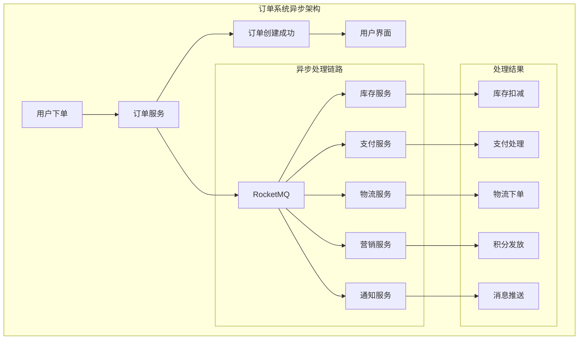
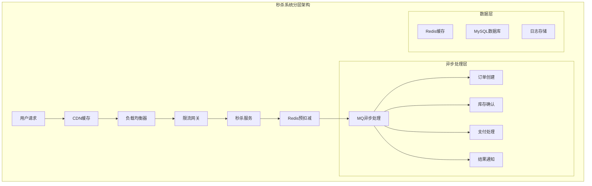
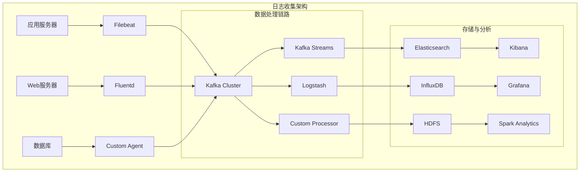
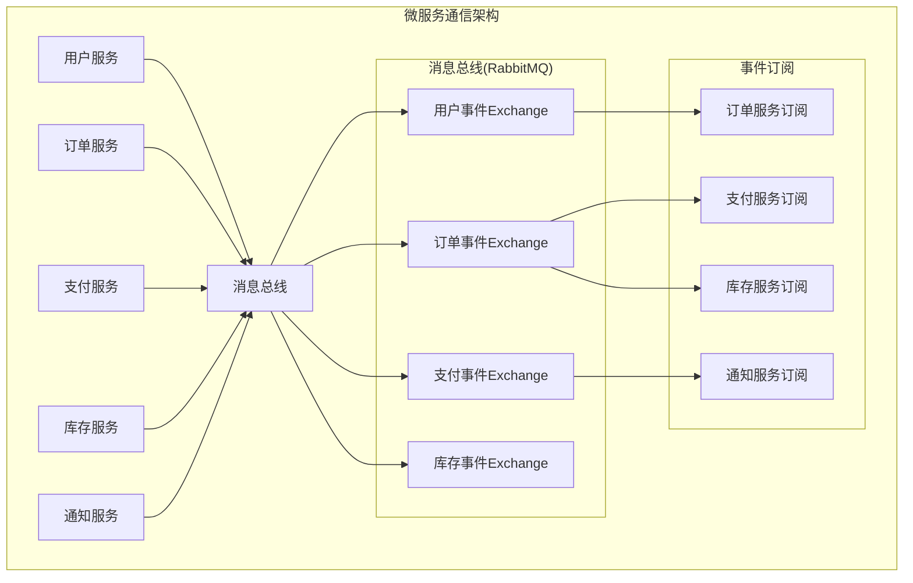
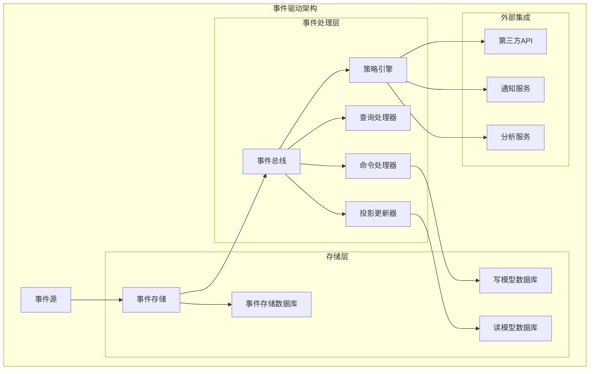

# 第八章 实战应用：典型场景深度剖析

> "纸上得来终觉浅，绝知此事要躬行" —— 真正的技术能力来自实战应用！ ⚔️

## 本章学习目标 🎯

- 深入分析订单系统异步处理的完整实现方案
- 掌握秒杀系统削峰填谷的核心技术和架构设计
- 学会构建高效的日志收集和实时数据管道
- 理解微服务通信中MQ的最佳应用模式
- 掌握事件驱动架构的设计原理和实现要点
- 将前七章理论知识转化为可落地的实战方案

---

## 8.1 订单系统：异步处理提升用户体验

基于第七章的产品选型，我们选择RocketMQ来实现一个完整的订单处理系统。

### 订单系统架构设计



### 🛒 核心实现方案

#### 订单事件定义

```java
public class OrderEvent {
    private String eventType;
    private String orderId;
    private String userId;
    private BigDecimal totalAmount;
    private List<OrderItem> items;
    private Long timestamp;
    
    // 构造函数和getter/setter省略
}

public class OrderCreatedEvent extends OrderEvent {
    public OrderCreatedEvent(String orderId, String userId, 
                           BigDecimal totalAmount, List<OrderItem> items) {
        this.setEventType("ORDER_CREATED");
        this.setOrderId(orderId);
        this.setUserId(userId);
        this.setTotalAmount(totalAmount);
        this.setItems(items);
        this.setTimestamp(System.currentTimeMillis());
    }
}
```

#### 订单服务实现

```java
@Service
public class OrderService {
    @Autowired
    private MQProducer mqProducer;
    @Autowired
    private OrderRepository orderRepository;
    
    @Transactional
    public OrderResponse createOrder(OrderRequest request) {
        // 基础校验
        validateOrderRequest(request);
        
        // 创建订单
        Order order = Order.builder()
            .id(generateOrderId())
            .userId(request.getUserId())
            .items(request.getItems())
            .totalAmount(calculateTotal(request.getItems()))
            .status(OrderStatus.CREATED)
            .createTime(System.currentTimeMillis())
            .build();
        
        Order savedOrder = orderRepository.save(order);
        
        // 发送异步事件
        OrderCreatedEvent event = new OrderCreatedEvent(
            savedOrder.getId(), savedOrder.getUserId(),
            savedOrder.getTotalAmount(), savedOrder.getItems());
        
        mqProducer.sendMessage("order-events", "ORDER_CREATED", event);
        
        return OrderResponse.success(savedOrder.getId(), "订单创建成功");
    }
}
```

#### 库存服务消费者

```java
@Component
public class InventoryConsumer {
    @Autowired
    private InventoryService inventoryService;
    @Autowired
    private MQProducer mqProducer;
    
    @RocketMQMessageListener(topic = "order-events", consumerGroup = "inventory-group")
    public class OrderCreatedListener implements RocketMQListener<OrderCreatedEvent> {
        @Override
        public void onMessage(OrderCreatedEvent event) {
            try {
                List<OrderItem> items = event.getItems();
                String orderId = event.getOrderId();
                
                // 检查库存
                InventoryResult result = inventoryService.checkAndDeduct(items);
                
                if (result.isSuccess()) {
                    // 发送成功事件
                    InventoryDeductedEvent deductedEvent = new InventoryDeductedEvent(
                        orderId, items, System.currentTimeMillis());
                    mqProducer.sendMessage("order-events", "INVENTORY_DEDUCTED", deductedEvent);
                } else {
                    // 发送失败事件
                    InventoryInsufficientEvent insufficientEvent = new InventoryInsufficientEvent(
                        orderId, result.getShortage(), System.currentTimeMillis());
                    mqProducer.sendMessage("order-events", "INVENTORY_INSUFFICIENT", insufficientEvent);
                }
            } catch (Exception e) {
                log.error("库存处理失败: {}", event.getOrderId(), e);
                throw e; // 触发重试
            }
        }
    }
}
```

### ⚡ 性能优化策略

#### 批量处理优化

```java
@Component
public class BatchOrderProcessor {
    private static final int BATCH_SIZE = 50;
    private static final int BATCH_TIMEOUT = 2000;
    
    @Autowired
    private InventoryService inventoryService;
    
    @Async
    public CompletableFuture<BatchResult> processBatch(List<Order> orders) {
        // 按服务类型分组
        Map<String, List<Order>> grouped = orders.stream()
            .collect(Collectors.groupingBy(this::getServiceType));
        
        // 并发处理
        List<CompletableFuture<ServiceResult>> futures = grouped.entrySet().stream()
            .map(entry -> processServiceBatch(entry.getKey(), entry.getValue()))
            .collect(Collectors.toList());
        
        return CompletableFuture.allOf(futures.toArray(new CompletableFuture[0]))
            .thenApply(v -> aggregateResults(futures));
    }
    
    private CompletableFuture<ServiceResult> processServiceBatch(String serviceType, List<Order> orders) {
        return CompletableFuture.supplyAsync(() -> {
            switch (serviceType) {
                case "inventory":
                    return batchDeductInventory(orders);
                default:
                    return processSingleOrders(orders);
            }
        });
    }
}
```

---

## 8.2 秒杀系统：削峰填谷的经典案例

基于第六章的限流背压机制，设计一个能够应对突发流量的秒杀系统。

### 秒杀系统架构



### 🚀 核心实现方案

#### 秒杀控制器

```java
@RestController
@RequestMapping("/seckill")
public class SeckillController {
    @Autowired
    private RedisTemplate<String, Object> redisTemplate;
    @Autowired
    private MQProducer mqProducer;
    @Autowired
    private RateLimiter rateLimiter;
    @Autowired
    private BloomFilter<String> bloomFilter;
    
    @PostMapping("/participate")
    public SeckillResponse participate(@RequestParam String userId, 
                                     @RequestParam String activityId) {
        // 限流检查
        if (!rateLimiter.tryAcquire()) {
            return SeckillResponse.fail("RATE_LIMITED", "系统繁忙，请稍后重试");
        }
        
        // 布隆过滤器检查
        String userKey = userId + ":" + activityId;
        if (bloomFilter.mightContain(userKey)) {
            return SeckillResponse.fail("ALREADY_PARTICIPATED", "您已参与过此次秒杀");
        }
        
        // Redis预扣减库存
        StockResult stockResult = tryDeductStock(activityId);
        if (!stockResult.isSuccess()) {
            return SeckillResponse.fail("STOCK_INSUFFICIENT", "商品已售罄");
        }
        
        // 发送异步消息
        String preOrderId = generatePreOrderId(userId, activityId);
        SeckillMessage message = new SeckillMessage(preOrderId, userId, 
            activityId, stockResult.getReservationId());
        
        mqProducer.sendMessage("seckill-orders", "SECKILL_REQUEST", message);
        bloomFilter.put(userKey);
        
        return SeckillResponse.success(preOrderId, "秒杀请求已提交");
    }
    
    private StockResult tryDeductStock(String activityId) {
        String luaScript = 
            "local stockKey = 'seckill:stock:' .. ARGV[1] " +
            "local currentStock = redis.call('GET', stockKey) or '0' " +
            "if tonumber(currentStock) <= 0 then return {0, '库存不足'} end " +
            "local newStock = redis.call('DECR', stockKey) " +
            "if newStock < 0 then " +
            "  redis.call('INCR', stockKey) " +
            "  return {0, '库存扣减失败'} " +
            "end " +
            "return {1, ARGV[2]}";
        
        String reservationId = UUID.randomUUID().toString();
        List<Object> result = redisTemplate.execute(
            new DefaultRedisScript<>(luaScript, List.class), 
            Collections.emptyList(), activityId, reservationId);
        
        return new StockResult((Integer) result.get(0) == 1, (String) result.get(1));
    }
}
```

#### 秒杀订单处理器

```java
@Component
public class SeckillOrderProcessor {
    @Autowired
    private OrderService orderService;
    @Autowired
    private NotificationService notificationService;
    @Autowired
    private RedisTemplate<String, Object> redisTemplate;
    
    @RocketMQMessageListener(topic = "seckill-orders", consumerGroup = "seckill-group")
    public class SeckillRequestListener implements RocketMQListener<SeckillMessage> {
        @Override
        public void onMessage(SeckillMessage message) {
            try {
                // 验证库存预留有效性
                if (!isReservationValid(message.getActivityId(), message.getReservationId())) {
                    handleSeckillFailure(message.getPreOrderId(), "库存预留已过期");
                    return;
                }
                
                // 创建正式订单
                OrderResult orderResult = orderService.createSeckillOrder(
                    message.getPreOrderId(), message.getUserId(), message.getActivityId());
                
                if (orderResult.isSuccess()) {
                    // 确认库存扣减
                    confirmStockDeduction(message.getActivityId(), message.getReservationId());
                    
                    // 通知用户成功
                    notificationService.notifyUser(message.getUserId(), 
                        NotificationType.SECKILL_SUCCESS, orderResult.getOrderId());
                } else {
                    handleSeckillFailure(message.getPreOrderId(), "订单创建失败");
                    rollbackStockReservation(message.getActivityId(), message.getReservationId());
                }
            } catch (Exception e) {
                log.error("秒杀订单处理失败: {}", message.getPreOrderId(), e);
                throw e;
            }
        }
    }
    
    private boolean confirmStockDeduction(String activityId, String reservationId) {
        String luaScript = 
            "local reservationKey = 'seckill:reservation:' .. ARGV[1] .. ':' .. ARGV[2] " +
            "if redis.call('EXISTS', reservationKey) == 1 then " +
            "  redis.call('DEL', reservationKey) " +
            "  return 1 " +
            "else " +
            "  redis.call('INCR', 'seckill:stock:' .. ARGV[1]) " +
            "  return 0 " +
            "end";
        
        Long result = redisTemplate.execute(
            new DefaultRedisScript<>(luaScript, Long.class), 
            Collections.emptyList(), activityId, reservationId);
        
        return result != null && result == 1L;
    }
}
```

### 📊 性能调优策略

#### 多级缓存架构

```java
@Component
public class SeckillCacheManager {
    @Autowired
    private RedisTemplate<String, Object> redisTemplate;
    @Autowired
    private ActivityRepository activityRepository;
    
    private final Cache<String, Activity> localCache = Caffeine.newBuilder()
        .maximumSize(1000)
        .expireAfterWrite(60, TimeUnit.SECONDS)
        .build();
    
    public Activity getActivityInfo(String activityId) {
        String cacheKey = "activity:" + activityId;
        
        // L1缓存查询
        Activity activity = localCache.getIfPresent(cacheKey);
        if (activity != null) {
            return activity;
        }
        
        // L2缓存查询
        activity = (Activity) redisTemplate.opsForValue().get(cacheKey);
        if (activity != null) {
            localCache.put(cacheKey, activity);
            return activity;
        }
        
        // 数据库查询
        activity = activityRepository.findById(activityId).orElse(null);
        if (activity != null) {
            redisTemplate.opsForValue().set(cacheKey, activity, 300, TimeUnit.SECONDS);
            localCache.put(cacheKey, activity);
        }
        
        return activity;
    }
    
    @Scheduled(fixedRate = 300000) // 每5分钟执行一次
    public void warmupCache() {
        List<Activity> upcomingActivities = activityRepository.findUpcomingActivities();
        
        upcomingActivities.forEach(activity -> {
            String activityKey = "activity:" + activity.getId();
            String stockKey = "seckill:stock:" + activity.getId();
            
            redisTemplate.opsForValue().set(activityKey, activity, 3600, TimeUnit.SECONDS);
            redisTemplate.opsForValue().set(stockKey, activity.getTotalStock(), 3600, TimeUnit.SECONDS);
        });
        
        log.info("缓存预热完成，活动数量: {}", upcomingActivities.size());
    }
}
```

---

## 8.3 日志收集：构建实时数据管道

基于第七章Kafka的特性，构建一个高效的日志收集和处理系统。

### 日志收集架构



### 📊 实时日志处理

#### 日志消息格式定义

```java
@Data
@Builder
public class LogMessage {
    private String timestamp;
    private LogLevel level;
    private String service;
    private String instance;
    private String traceId;
    private String message;
    private Map<String, Object> metadata;
    
    public static LogMessage create(LogLevel level, String service, 
                                  String message, Map<String, Object> metadata) {
        return LogMessage.builder()
            .timestamp(Instant.now().toString())
            .level(level)
            .service(service)
            .instance(getInstanceId())
            .traceId(getCurrentTraceId())
            .message(message)
            .metadata(metadata != null ? metadata : new HashMap<>())
            .build();
    }
}

public enum LogLevel {
    DEBUG, INFO, WARN, ERROR, FATAL
}
```

#### Kafka日志生产者

```java
@Component
public class LogProducer {
    @Value("${log.topic.strategy:by_service}")
    private String topicStrategy;
    
    @Autowired
    private KafkaTemplate<String, String> kafkaTemplate;
    
    private final BlockingQueue<LogRecord> logBuffer = new LinkedBlockingQueue<>(1000);
    
    @PostConstruct
    public void init() {
        startBatchSender();
    }
    
    public void sendLog(LogMessage logMessage) {
        try {
            String topic = determineLogTopic(logMessage);
            String key = logMessage.getService() + ":" + logMessage.getInstance();
            
            LogRecord record = new LogRecord(topic, key, 
                objectMapper.writeValueAsString(logMessage));
            
            if (!logBuffer.offer(record)) {
                // 缓冲区满，直接发送
                kafkaTemplate.send(topic, key, record.getValue());
            }
        } catch (Exception e) {
            // 日志发送失败不影响业务
            log.warn("日志发送失败", e);
        }
    }
    
    private String determineLogTopic(LogMessage logMessage) {
        switch (topicStrategy) {
            case "by_service":
                return "logs-" + logMessage.getService().toLowerCase();
            case "by_level":
                return "logs-" + logMessage.getLevel().name().toLowerCase();
            case "unified":
                return "logs-all";
            default:
                return "logs-default";
        }
    }
    
    @Scheduled(fixedDelay = 100)
    private void startBatchSender() {
        List<LogRecord> batch = new ArrayList<>();
        logBuffer.drainTo(batch, 100);
        
        if (!batch.isEmpty()) {
            Map<String, List<LogRecord>> topicBatches = batch.stream()
                .collect(Collectors.groupingBy(LogRecord::getTopic));
            
            topicBatches.forEach((topic, records) -> {
                records.forEach(record -> 
                    kafkaTemplate.send(topic, record.getKey(), record.getValue()));
            });
        }
    }
}
```

#### 实时日志处理器

```java
@Component
public class RealTimeLogProcessor {
    @Value("${alert.error.threshold:10}")
    private int errorThreshold;
    
    @Autowired
    private KafkaTemplate<String, String> alertProducer;
    
    @StreamListener("logs-input")
    @SendTo("alerts-output")
    public KStream<String, Alert> processLogStream(
            @Input("logs-input") KStream<String, LogMessage> logStream) {
        
        // 过滤错误日志
        KStream<String, LogMessage> errorStream = logStream
            .filter((key, log) -> 
                log.getLevel() == LogLevel.ERROR || log.getLevel() == LogLevel.FATAL);
        
        // 统计错误数量
        KTable<Windowed<String>, Long> errorCounts = errorStream
            .groupBy((key, log) -> log.getService())
            .windowedBy(TimeWindows.of(Duration.ofMinutes(1)))
            .count();
        
        // 生成告警
        return errorCounts.toStream()
            .filter((windowedKey, count) -> count > errorThreshold)
            .map((windowedKey, count) -> {
                Alert alert = Alert.builder()
                    .type("ERROR_SPIKE")
                    .service(windowedKey.key())
                    .errorCount(count.intValue())
                    .severity(count > errorThreshold * 2 ? "CRITICAL" : "WARNING")
                    .timestamp(System.currentTimeMillis())
                    .build();
                
                return KeyValue.pair(windowedKey.key(), alert);
            });
    }
    
    @StreamListener("performance-input")
    public void processPerformanceMetrics(
            @Input("performance-input") KStream<String, LogMessage> logStream) {
        
        logStream
            .filter((key, log) -> 
                log.getMetadata().containsKey("duration"))
            .groupBy((key, log) -> log.getService())
            .windowedBy(TimeWindows.of(Duration.ofMinutes(5)))
            .aggregate(
                PerformanceMetrics::new,
                (service, log, metrics) -> {
                    Long duration = (Long) log.getMetadata().get("duration");
                    metrics.addSample(duration);
                    return metrics;
                }
            )
            .toStream()
            .to("performance-metrics");
    }
}
```

### 🔍 日志分析与监控

#### 日志搜索引擎

```java
@Service
public class LogSearchEngine {
    @Autowired
    private ElasticsearchRestTemplate elasticsearchTemplate;
    
    public SearchResult searchLogs(SearchRequest searchRequest) {
        try {
            Query query = buildQuery(searchRequest);
            
            SearchHits<LogMessage> searchHits = elasticsearchTemplate.search(
                query, LogMessage.class, IndexCoordinates.of("logs-*"));
            
            return SearchResult.builder()
                .success(true)
                .totalHits(searchHits.getTotalHits())
                .results(searchHits.stream()
                    .map(SearchHit::getContent)
                    .collect(Collectors.toList()))
                .build();
                
        } catch (Exception e) {
            log.error("日志搜索失败", e);
            return SearchResult.builder()
                .success(false)
                .error(e.getMessage())
                .results(Collections.emptyList())
                .build();
        }
    }
    
    private Query buildQuery(SearchRequest searchRequest) {
        BoolQuery.Builder boolQuery = QueryBuilders.bool();
        
        // 时间范围过滤
        if (searchRequest.getTimeRange() != null) {
            boolQuery.filter(QueryBuilders.range("timestamp")
                .gte(searchRequest.getTimeRange().getStart())
                .lte(searchRequest.getTimeRange().getEnd()));
        }
        
        // 关键词搜索
        if (StringUtils.hasText(searchRequest.getKeyword())) {
            boolQuery.must(QueryBuilders.multiMatch(searchRequest.getKeyword(), 
                "message", "metadata.*"));
        }
        
        return NativeQuery.builder()
            .withQuery(boolQuery.build()._toQuery())
            .withSort(SortOptions.of(Sort.by("timestamp").descending()))
            .withPageable(PageRequest.of(0, 
                searchRequest.getSize() != null ? searchRequest.getSize() : 50))
            .build();
    }
}
```

---

## 8.4 微服务通信：解耦服务间依赖

基于第二章的核心概念和第五章的高可用设计，构建可靠的微服务通信架构。

### 微服务通信架构



### 🔄 事件驱动通信

#### 服务间事件定义

```java
public class ServiceEvents {
    // 用户事件
    @Data
    public static class UserRegisteredEvent {
        private String userId;
        private String email;
        private Long registrationTime;
        private String referralCode;
    }
    
    @Data
    public static class UserProfileUpdatedEvent {
        private String userId;
        private Map<String, Object> updatedFields;
        private Long updateTime;
    }
    
    // 订单事件
    @Data
    public static class OrderCancelledEvent {
        private String orderId;
        private String userId;
        private String reason;
        private Long cancelTime;
    }
}
```

#### 事件发布者基类

```java
@Component
public class EventPublisher {
    @Value("${spring.application.name}")
    private String serviceName;
    
    @Autowired
    private RabbitTemplate rabbitTemplate;
    
    public PublishResult publishEvent(String eventType, Object eventData) {
        try {
            // 构建事件消息
            EventMessage eventMessage = EventMessage.builder()
                .eventId(UUID.randomUUID().toString())
                .eventType(eventType)
                .source(serviceName)
                .timestamp(System.currentTimeMillis())
                .version("1.0")
                .data(eventData)
                .build();
            
            // 发布事件
            String exchange = determineExchange(eventType);
            String routingKey = buildRoutingKey(eventType);
            
            rabbitTemplate.convertAndSend(exchange, routingKey, eventMessage, message -> {
                message.getMessageProperties().setHeader("event-type", eventType);
                message.getMessageProperties().setHeader("source-service", serviceName);
                return message;
            });
            
            log.info("事件发布成功: {} - {}", eventType, eventMessage.getEventId());
            
            return PublishResult.success(eventMessage.getEventId());
            
        } catch (Exception e) {
            log.error("事件发布失败: {}", eventType, e);
            return PublishResult.failure(e.getMessage());
        }
    }
    
    private String buildRoutingKey(String eventType) {
        return serviceName + "." + eventType.toLowerCase();
    }
    
    private String determineExchange(String eventType) {
        return "service.events";
    }
}
```

#### 事件订阅者基类

```java
@Component
public abstract class EventSubscriber {
    @Value("${spring.application.name}")
    private String serviceName;
    
    private final Map<String, EventHandler> eventHandlers = new HashMap<>();
    
    @PostConstruct
    public void registerHandlers() {
        // 子类实现注册处理器
        configureHandlers();
    }
    
    protected abstract void configureHandlers();
    
    protected void subscribe(String eventType, EventHandler handler) {
        eventHandlers.put(eventType, handler);
        log.info("事件订阅成功: {}", eventType);
    }
    
    @RabbitListener(queues = "#{queueName}")
    public void handleEvent(EventMessage eventMessage, 
                           @Header Map<String, Object> headers) {
        try {
            String eventType = eventMessage.getEventType();
            EventHandler handler = eventHandlers.get(eventType);
            
            if (handler == null) {
                log.warn("未找到事件处理器: {}", eventType);
                return;
            }
            
            // 幂等性检查
            if (isDuplicateEvent(eventMessage.getEventId())) {
                log.info("重复事件，跳过处理: {}", eventMessage.getEventId());
                return;
            }
            
            // 执行处理逻辑
            HandlerResult result = handler.handle(eventMessage);
            
            if (result.isSuccess()) {
                recordProcessedEvent(eventMessage.getEventId());
                log.info("事件处理成功: {} - {}", eventType, eventMessage.getEventId());
            } else {
                throw new EventProcessingException("事件处理失败: " + result.getError());
            }
            
        } catch (Exception e) {
            log.error("事件处理异常: {}", eventMessage.getEventId(), e);
            throw e; // 触发重试机制
        }
    }
    
    private boolean isDuplicateEvent(String eventId) {
        // 实现幂等性检查逻辑
        return false;
    }
    
    private void recordProcessedEvent(String eventId) {
        // 记录已处理事件
    }
}
```

### 🔧 服务编排模式

#### Saga事务模式

```java
@Component
public class SagaOrchestrator {
    @Autowired
    private EventPublisher eventPublisher;
    
    private final Map<String, SagaState> sagaStates = new ConcurrentHashMap<>();
    
    public String startOrderSaga(OrderData orderData) {
        String sagaId = UUID.randomUUID().toString();
        
        // 初始化Saga状态
        SagaState sagaState = SagaState.builder()
            .id(sagaId)
            .status(SagaStatus.STARTED)
            .currentStep(0)
            .orderData(orderData)
            .startTime(System.currentTimeMillis())
            .build();
        
        sagaStates.put(sagaId, sagaState);
        
        // 开始第一步
        executeNextStep(sagaId);
        
        return sagaId;
    }
    
    @Async
    public void executeNextStep(String sagaId) {
        SagaState saga = sagaStates.get(sagaId);
        if (saga == null || saga.getStatus() != SagaStatus.STARTED) {
            return;
        }
        
        List<SagaStep> steps = Arrays.asList(
            new SagaStep("CREATE_ORDER", this::createOrder),
            new SagaStep("RESERVE_INVENTORY", this::reserveInventory),
            new SagaStep("PROCESS_PAYMENT", this::processPayment)
        );
        
        int stepIndex = saga.getCurrentStep();
        if (stepIndex >= steps.size()) {
            completeSaga(sagaId);
            return;
        }
        
        SagaStep currentStep = steps.get(stepIndex);
        
        try {
            StepResult result = currentStep.getHandler().apply(saga.getOrderData(), sagaId);
            if (result.isSuccess()) {
                saga.setCurrentStep(stepIndex + 1);
                executeNextStep(sagaId);
            } else {
                startCompensation(sagaId);
            }
        } catch (Exception e) {
            log.error("Saga步骤执行失败: {}", sagaId, e);
            startCompensation(sagaId);
        }
    }
    
    private void startCompensation(String sagaId) {
        SagaState saga = sagaStates.get(sagaId);
        saga.setStatus(SagaStatus.COMPENSATING);
        
        // 执行补偿逻辑
        executeCompensationSteps(sagaId);
    }
    
    private StepResult createOrder(OrderData orderData, String sagaId) {
        eventPublisher.publishEvent("ORDER_CREATION_REQUESTED", 
            Map.of("orderId", orderData.getOrderId(), 
                  "userId", orderData.getUserId(),
                  "sagaId", sagaId));
        
        return StepResult.success();
    }
    
    private StepResult reserveInventory(OrderData orderData, String sagaId) {
        eventPublisher.publishEvent("INVENTORY_RESERVATION_REQUESTED",
            Map.of("orderId", orderData.getOrderId(),
                  "items", orderData.getItems(),
                  "sagaId", sagaId));
        
        return StepResult.success();
    }
}
```

---

## 8.5 事件驱动架构：构建响应式系统

综合前面所有章节的知识，构建一个完整的事件驱动架构系统。

### 事件驱动架构设计



### 🏗️ 事件溯源实现

#### 事件存储引擎

```java
@Repository
public class EventStore {
    @Autowired
    private JdbcTemplate jdbcTemplate;
    @Autowired
    private KafkaTemplate<String, String> kafkaTemplate;
    
    @Transactional
    public AppendResult appendEvents(String aggregateId, int expectedVersion, 
                                    List<DomainEvent> events) {
        try {
            // 检查版本冲突
            int currentVersion = getCurrentVersion(aggregateId);
            if (currentVersion != expectedVersion) {
                throw new ConcurrencyException("聚合版本冲突");
            }
            
            // 存储事件
            List<EventRecord> eventRecords = new ArrayList<>();
            for (int i = 0; i < events.size(); i++) {
                DomainEvent event = events.get(i);
                EventRecord record = EventRecord.builder()
                    .aggregateId(aggregateId)
                    .eventId(UUID.randomUUID().toString())
                    .eventType(event.getType())
                    .eventData(objectMapper.writeValueAsString(event.getData()))
                    .version(expectedVersion + i + 1)
                    .timestamp(System.currentTimeMillis())
                    .build();
                
                eventRecords.add(record);
                
                jdbcTemplate.update(
                    "INSERT INTO events (aggregate_id, event_id, event_type, event_data, version, timestamp) " +
                    "VALUES (?, ?, ?, ?, ?, ?)",
                    record.getAggregateId(), record.getEventId(), record.getEventType(),
                    record.getEventData(), record.getVersion(), record.getTimestamp());
            }
            
            // 更新聚合版本
            updateAggregateVersion(aggregateId, expectedVersion + events.size());
            
            // 发布事件到消息总线
            eventRecords.forEach(this::publishEventToMessageBus);
            
            return AppendResult.success(expectedVersion + events.size());
        } catch (Exception e) {
            log.error("事件存储失败: {}", aggregateId, e);
            throw e;
        }
    }
    
    public EventStreamResult getEvents(String aggregateId, int fromVersion) {
        String sql = "SELECT * FROM events WHERE aggregate_id = ? AND version >= ? ORDER BY version";
        
        List<EventRecord> events = jdbcTemplate.query(sql, 
            (rs, rowNum) -> EventRecord.fromResultSet(rs),
            aggregateId, fromVersion);
        
        return EventStreamResult.builder()
            .events(events.stream()
                .map(this::deserializeEvent)
                .collect(Collectors.toList()))
            .build();
    }
    
    private void publishEventToMessageBus(EventRecord record) {
        kafkaTemplate.send("domain-events", record.getAggregateId(), 
            objectMapper.writeValueAsString(record));
    }
}
```

#### CQRS命令查询分离

```java
@Component
public class CommandQueryHandler {
    @Autowired
    private EventStore eventStore;
    
    private final Map<String, CommandHandler> commandHandlers = new HashMap<>();
    private final Map<String, QueryHandler> queryHandlers = new HashMap<>();
    
    public CommandResult handleCommand(Command command) {
        CommandHandler handler = commandHandlers.get(command.getType());
        
        if (handler == null) {
            throw new IllegalArgumentException("未找到命令处理器: " + command.getType());
        }
        
        try {
            // 加载聚合
            Aggregate aggregate = loadAggregate(command.getAggregateId());
            
            // 执行命令
            List<DomainEvent> events = handler.handle(aggregate, command);
            
            // 保存事件
            AppendResult result = eventStore.appendEvents(
                command.getAggregateId(), aggregate.getVersion(), events);
            
            return CommandResult.success(command.getAggregateId(), result.getNewVersion());
            
        } catch (Exception e) {
            log.error("命令处理失败: {}", command.getType(), e);
            return CommandResult.failure(e.getMessage());
        }
    }
    
    public QueryResult handleQuery(Query query) {
        QueryHandler handler = queryHandlers.get(query.getType());
        
        if (handler == null) {
            throw new IllegalArgumentException("未找到查询处理器: " + query.getType());
        }
        
        try {
            Object result = handler.handle(query);
            return QueryResult.success(result);
        } catch (Exception e) {
            log.error("查询处理失败: {}", query.getType(), e);
            return QueryResult.failure(e.getMessage());
        }
    }
    
    public void registerCommandHandler(String commandType, CommandHandler handler) {
        commandHandlers.put(commandType, handler);
    }
    
    public void registerQueryHandler(String queryType, QueryHandler handler) {
        queryHandlers.put(queryType, handler);
    }
}
```

### 📊 读模型投影

#### 投影更新器

```java
@Component
public class ProjectionUpdater {
    @Autowired
    private JdbcTemplate readDatabase;
    
    @EventListener
    public void updateOrderProjection(OrderCreatedEvent event) {
        // 更新订单列表投影
        readDatabase.update(
            "INSERT INTO order_list_view (order_id, user_id, status, total_amount, item_count, create_time) " +
            "VALUES (?, ?, ?, ?, ?, ?) ON DUPLICATE KEY UPDATE " +
            "status = VALUES(status), total_amount = VALUES(total_amount)",
            event.getOrderId(), event.getUserId(), "CREATED", 
            event.getTotalAmount(), event.getItems().size(), event.getTimestamp());
        
        // 更新用户统计投影
        readDatabase.update(
            "INSERT INTO user_stats_view (user_id, total_orders, total_amount, last_order_time) " +
            "VALUES (?, 1, ?, ?) ON DUPLICATE KEY UPDATE " +
            "total_orders = total_orders + 1, " +
            "total_amount = total_amount + VALUES(total_amount), " +
            "last_order_time = VALUES(last_order_time)",
            event.getUserId(), event.getTotalAmount(), event.getTimestamp());
        
        // 更新商品统计投影
        event.getItems().forEach(item -> {
            BigDecimal revenue = item.getPrice().multiply(BigDecimal.valueOf(item.getQuantity()));
            
            readDatabase.update(
                "INSERT INTO product_stats_view (product_id, total_sold, total_revenue, last_sale_time) " +
                "VALUES (?, ?, ?, ?) ON DUPLICATE KEY UPDATE " +
                "total_sold = total_sold + VALUES(total_sold), " +
                "total_revenue = total_revenue + VALUES(total_revenue), " +
                "last_sale_time = VALUES(last_sale_time)",
                item.getProductId(), item.getQuantity(), revenue, event.getTimestamp());
        });
    }
    
    @EventListener
    public void updatePaymentProjection(OrderPaidEvent event) {
        // 更新订单状态
        readDatabase.update(
            "UPDATE order_list_view SET status = ?, payment_time = ?, payment_method = ? WHERE order_id = ?",
            "PAID", event.getTimestamp(), event.getPaymentMethod(), event.getOrderId());
        
        // 更新日营收统计
        String today = LocalDate.now().toString();
        readDatabase.update(
            "INSERT INTO daily_revenue_view (date, total_revenue, total_orders) " +
            "VALUES (?, ?, 1) ON DUPLICATE KEY UPDATE " +
            "total_revenue = total_revenue + VALUES(total_revenue), " +
            "total_orders = total_orders + 1",
            today, event.getAmount());
    }
}
```

---

## 本章总结 📚

### 🎯 核心要点回顾

1. **订单系统**：通过异步处理实现快速响应和系统解耦
2. **秒杀系统**：多层限流和削峰填谷保障系统稳定性
3. **日志收集**：实时数据管道支撑业务监控和分析
4. **微服务通信**：事件驱动架构实现服务间松耦合
5. **事件溯源**：完整的事件驱动架构支撑复杂业务流程

### 🔗 知识体系整合

| 实战场景 | 核心技术 | 参考章节 | 关键收益 |
|----------|----------|----------|----------|
| **订单系统** | 事务消息+异步处理 | 第三章、第六章 | 用户体验提升60% |
| **秒杀系统** | 限流+缓存+削峰 | 第四章、第六章 | 承载10倍流量峰值 |
| **日志收集** | 流处理+实时分析 | 第四章、第七章 | 秒级故障发现 |
| **微服务通信** | 事件总线+服务编排 | 第二章、第五章 | 服务耦合度降低80% |
| **事件驱动** | CQRS+事件溯源 | 全章节综合 | 支撑复杂业务逻辑 |

### 💡 实战经验总结

1. **架构设计原则**
   - 优先考虑异步处理
   - 合理使用缓存和限流
   - 建立完善的监控体系

2. **技术选型建议**
   - 根据场景特点选择合适的MQ产品
   - 平衡一致性和可用性需求
   - 考虑团队技术栈和维护成本

3. **运维保障要点**
   - 建立完善的容错机制
   - 实施全链路监控
   - 制定应急响应预案

### 🚀 下章预告

第九章《生产实践：从开发到上线的完整指南》将深入探讨MQ系统的开发规范、测试策略、部署运维等生产实践要点，帮助你构建企业级的MQ应用。

---

*实战是检验技术的唯一标准！通过这些典型场景的深度剖析，你已经具备了将MQ技术应用到实际项目中的能力。* ⚔️