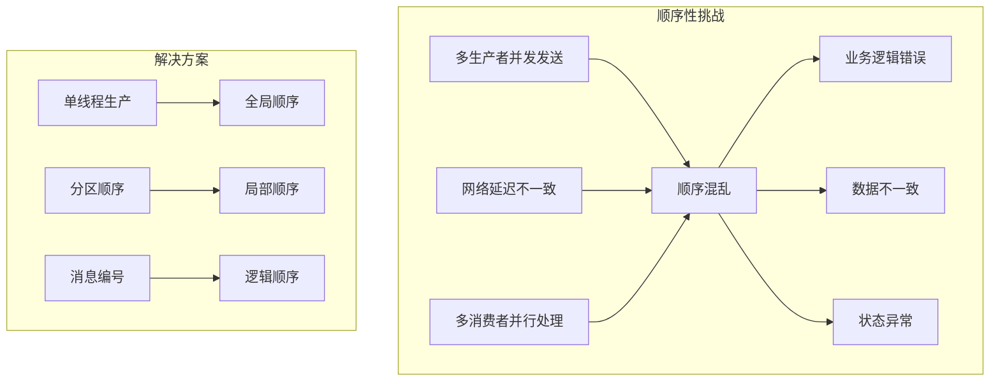
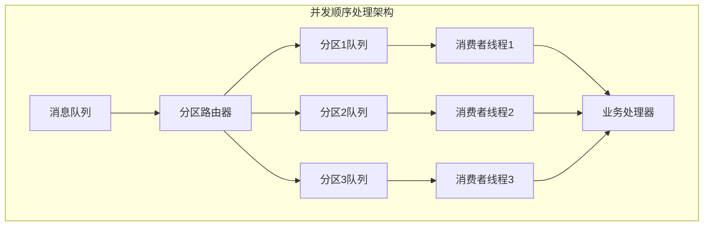
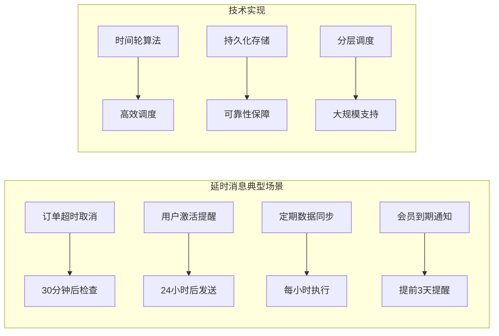
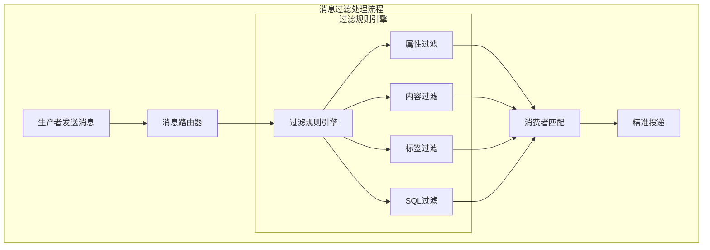
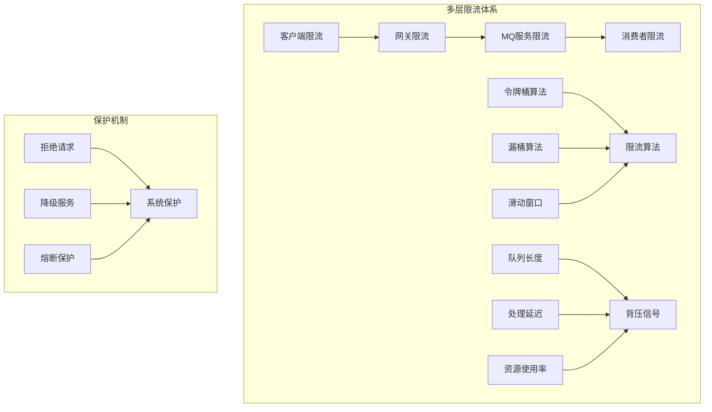
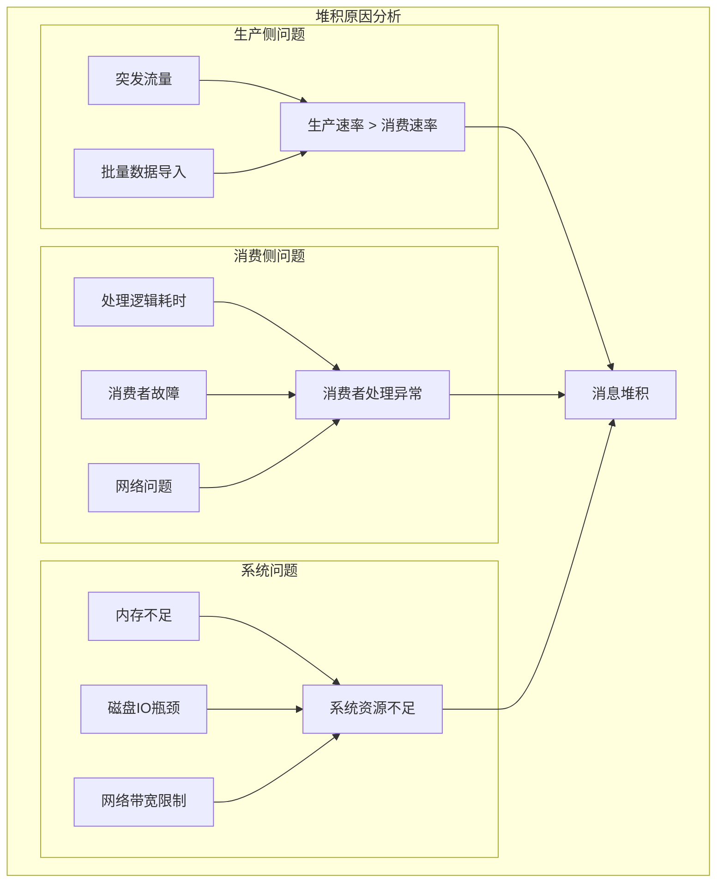

# 第六章 进阶特性：解决复杂业务场景

> "工欲善其事，必先利其器" —— 掌握进阶特性，方能应对复杂业务挑战！ 🛠️

## 本章学习目标 🎯

- 掌握消息顺序保证机制解决业务依赖问题
- 学会实现延时消息支持定时任务场景
- 理解消息过滤技术实现精准投递
- 掌握限流与背压机制保护系统稳定
- 学会诊断和解决消息堆积问题
- 在第五章高可用基础上实现复杂业务需求

---

## 6.1 消息顺序：如何保证处理顺序

在第二章中我们了解了消息的基本传递机制，现在深入探讨如何在分布式环境中保证消息顺序。

### 顺序性挑战分析



### 📊 顺序性保证级别

| 级别 | 说明 | 性能影响 | 适用场景 | 实现复杂度 |
|------|------|----------|----------|------------|
| **全局顺序** | 所有消息严格按发送顺序处理 | 高 ⭐⭐⭐⭐ | 金融交易<br/>状态机更新 | 高 ⭐⭐⭐⭐ |
| **分区顺序** | 同一分区内消息保证顺序 | 中 ⭐⭐⭐ | 用户操作序列<br/>订单处理 | 中 ⭐⭐⭐ |
| **逻辑顺序** | 通过消息ID或时间戳排序 | 低 ⭐⭐ | 日志聚合<br/>数据同步 | 低 ⭐⭐ |

### 🔄 分区顺序实现

#### 分区策略设计

```java
public class PartitionedOrderedProducer {
    private final int totalPartitions;
    private final AtomicLong[] sequenceCounters;
    
    public SendResult sendOrderedMessage(Message message, String partitionKey) {
        int partition = calculatePartition(partitionKey);
        
        // 添加顺序标识
        message.setSequenceId(getNextSequenceId(partition));
        message.setPartition(partition);
        
        return sendToPartition(partition, message);
    }
    
    private int calculatePartition(String partitionKey) {
        return Math.abs(partitionKey.hashCode()) % totalPartitions;
    }
    
    private long getNextSequenceId(int partition) {
        return sequenceCounters[partition].incrementAndGet();
    }
}
```

#### 顺序消费者实现

```java
public class OrderedConsumer {
    private final Map<Integer, Map<Long, Message>> partitionBuffers = new ConcurrentHashMap<>();
    private final Map<Integer, Long> expectedSequence = new ConcurrentHashMap<>();
    
    public void processMessage(Message message) {
        int partition = message.getPartition();
        long sequenceId = message.getSequenceId();
        
        long expected = expectedSequence.computeIfAbsent(partition, k -> 1L);
        
        if (sequenceId == expected) {
            // 正序消息，直接处理
            processMessageInOrder(message);
            expectedSequence.put(partition, expected + 1);
            processBufferedMessages(partition);
            
        } else if (sequenceId > expected) {
            // 乱序消息，暂存到缓冲区
            partitionBuffers
                .computeIfAbsent(partition, k -> new ConcurrentHashMap<>())
                .put(sequenceId, message);
        }
    }
    
    private void processBufferedMessages(int partition) {
        Map<Long, Message> buffer = partitionBuffers.get(partition);
        if (buffer == null) return;
        
        long expected = expectedSequence.get(partition);
        while (buffer.containsKey(expected)) {
            processMessageInOrder(buffer.remove(expected));
            expectedSequence.put(partition, ++expected);
        }
    }
}
```

### ⚡ 高性能顺序处理

#### 并发顺序处理



```java
public class ConcurrentOrderedConsumer {
    private final BlockingQueue<Message>[] partitionQueues;
    private final ExecutorService[] executors;
    
    @SuppressWarnings("unchecked")
    public ConcurrentOrderedConsumer(int partitionCount) {
        partitionQueues = new BlockingQueue[partitionCount];
        executors = new ExecutorService[partitionCount];
        
        for (int i = 0; i < partitionCount; i++) {
            partitionQueues[i] = new LinkedBlockingQueue<>();
            executors[i] = Executors.newSingleThreadExecutor();
            startConsumerThread(i);
        }
    }
    
    public void distributeMessage(Message message) {
        partitionQueues[message.getPartition()].offer(message);
    }
    
    private void startConsumerThread(int partitionId) {
        executors[partitionId].submit(() -> {
            while (!Thread.interrupted()) {
                try {
                    Message message = partitionQueues[partitionId].take();
                    processMessageInOrder(partitionId, message);
                } catch (InterruptedException e) {
                    Thread.currentThread().interrupt();
                    break;
                }
            }
        });
    }
}
```

---

## 6.2 延时消息：定时任务的实现

基于第四章的性能优化原理，我们来实现高效的延时消息机制。

### 延时消息应用场景



### ⏰ 时间轮算法实现

#### 多级时间轮设计

```java
public class HierarchicalTimingWheel {
    private final TimingWheel secondWheel = new TimingWheel(1000, 60);
    private final TimingWheel minuteWheel = new TimingWheel(60000, 60);
    private final TimingWheel hourWheel = new TimingWheel(3600000, 24);
    
    private final Map<String, DelayedMessage> delayedMessages = new ConcurrentHashMap<>();
    private volatile long currentTime = System.currentTimeMillis();
    
    public String scheduleDelayedMessage(Message message, long delayMs) {
        long executeTime = currentTime + delayMs;
        String messageId = UUID.randomUUID().toString();
        
        DelayedMessage delayedMessage = new DelayedMessage(
            messageId, message, executeTime
        );
        
        TimingWheel wheel = selectAppropriateWheel(delayMs);
        wheel.addMessage(delayedMessage);
        delayedMessages.put(messageId, delayedMessage);
        
        return messageId;
    }
    
    private TimingWheel selectAppropriateWheel(long delayMs) {
        if (delayMs < 60000) return secondWheel;
        if (delayMs < 3600000) return minuteWheel;
        return hourWheel;
    }
    
    public void tick() {
        currentTime = System.currentTimeMillis();
        processExpiredMessages(secondWheel.advance(currentTime));
        processExpiredMessages(minuteWheel.advance(currentTime));
        processExpiredMessages(hourWheel.advance(currentTime));
    }
    
    private void processExpiredMessages(List<DelayedMessage> messages) {
        for (DelayedMessage msg : messages) {
            if (msg.getExecuteTime() <= currentTime) {
                executeDelayedMessage(msg);
            }
        }
    }
}
```

#### 持久化延时消息

```java
public class PersistentDelayQueue {
    private final Storage storage;
    private final TreeMap<Long, Set<String>> sortedMessages = new TreeMap<>();
    private final Map<String, Long> messageIndex = new ConcurrentHashMap<>();
    
    public String addDelayedMessage(Message message, long executeTime) {
        String messageId = message.getId();
        
        // 持久化存储
        DelayedMessageData data = new DelayedMessageData(
            message, executeTime, MessageStatus.PENDING
        );
        storage.save("delayed:" + messageId, data);
        
        // 更新内存索引
        messageIndex.put(messageId, executeTime);
        sortedMessages.computeIfAbsent(executeTime, k -> new HashSet<>())
                     .add(messageId);
        
        return messageId;
    }
    
    public List<DelayedMessageData> getExpiredMessages(long currentTime) {
        List<DelayedMessageData> expiredMessages = new ArrayList<>();
        
        NavigableMap<Long, Set<String>> expiredMap = 
            sortedMessages.headMap(currentTime, true);
        
        for (Set<String> messageIds : expiredMap.values()) {
            for (String messageId : messageIds) {
                DelayedMessageData data = storage.get("delayed:" + messageId);
                if (data != null && data.getStatus() == MessageStatus.PENDING) {
                    data.setStatus(MessageStatus.PROCESSING);
                    storage.save("delayed:" + messageId, data);
                    expiredMessages.add(data);
                }
            }
        }
        
        return expiredMessages;
    }
    
    public void completeDelayedMessage(String messageId) {
        storage.delete("delayed:" + messageId);
        Long executeTime = messageIndex.remove(messageId);
        if (executeTime != null) {
            Set<String> messages = sortedMessages.get(executeTime);
            if (messages != null) {
                messages.remove(messageId);
            }
        }
    }
}
```

### 🔄 延时消息调度器

#### 高效调度引擎

```java
public class DelayedMessageScheduler {
    private final HierarchicalTimingWheel timingWheel;
    private final PersistentDelayQueue persistentQueue;
    private final ExecutorService executorPool;
    private final ScheduledExecutorService scheduler;
    
    private volatile boolean running = false;
    
    public DelayedMessageScheduler(Config config) {
        this.timingWheel = new HierarchicalTimingWheel();
        this.persistentQueue = new PersistentDelayQueue(config.getStorage());
        this.executorPool = Executors.newFixedThreadPool(config.getExecutorThreads());
        this.scheduler = Executors.newScheduledThreadPool(2);
    }
    
    public void start() {
        running = true;
        
        // 时间轮调度任务
        scheduler.scheduleAtFixedRate(
            timingWheel::tick, 0, 100, TimeUnit.MILLISECONDS
        );
        
        // 持久化队列扫描任务
        scheduler.scheduleAtFixedRate(
            this::scanAndExecuteExpiredMessages, 0, 1, TimeUnit.SECONDS
        );
    }
    
    public String scheduleMessage(Message message, long delayMs) {
        if (delayMs < 300000) { // 5分钟内使用时间轮
            return timingWheel.scheduleDelayedMessage(message, delayMs);
        } else { // 长延时使用持久化队列
            long executeTime = System.currentTimeMillis() + delayMs;
            return persistentQueue.addDelayedMessage(message, executeTime);
        }
    }
    
    private void scanAndExecuteExpiredMessages() {
        if (!running) return;
        
        long currentTime = System.currentTimeMillis();
        List<DelayedMessageData> expiredMessages = 
            persistentQueue.getExpiredMessages(currentTime);
        
        for (DelayedMessageData messageData : expiredMessages) {
            executorPool.submit(() -> {
                try {
                    executeDelayedMessage(messageData.getMessage());
                    persistentQueue.completeDelayedMessage(messageData.getId());
                } catch (Exception e) {
                    handleExecutionError(messageData, e);
                }
            });
        }
    }
}
```

---

## 6.3 消息过滤：精准投递到目标消费者

结合第二章的路由机制，实现更精细的消息过滤能力。

### 消息过滤架构



### 🎯 多维度过滤机制

#### 属性过滤器

```java
public class PropertyFilter {
    private final FilterExpression compiledExpression;
    
    public PropertyFilter(String filterExpression) {
        this.compiledExpression = compileExpression(filterExpression);
    }
    
    public boolean matches(Message message) {
        Map<String, Object> properties = message.getProperties();
        
        try {
            return compiledExpression.evaluate(properties);
        } catch (Exception e) {
            logger.error("属性过滤器执行错误", e);
            return false;
        }
    }
    
    private FilterExpression compileExpression(String expression) {
        // 支持操作符：==, !=, >, <, >=, <=, IN, LIKE
        // 示例：age > 18 AND city IN ('北京', '上海')
        ExpressionParser parser = new ExpressionParser();
        return parser.parse(expression);
    }
}
```

#### 内容过滤器

```java
public class ContentFilter {
    private final KeywordMatcher keywordMatcher;
    private final PatternMatcher regexMatcher;
    private final BloomFilter<String> bloomFilter;
    
    public ContentFilter(FilterConfig config) {
        this.keywordMatcher = new KeywordMatcher(config.getKeywords());
        this.regexMatcher = new PatternMatcher(config.getPatterns());
        this.bloomFilter = BloomFilter.create(Funnels.stringFunnel(Charset.defaultCharset()), 
                                            config.getExpectedInsertions());
    }
    
    public boolean matches(Message message) {
        String content = extractContent(message);
        
        // 布隆过滤器快速预检
        if (!bloomFilter.mightContain(content)) {
            return false;
        }
        
        // 关键词匹配
        if (keywordMatcher.hasKeywords() && !keywordMatcher.matches(content)) {
            return false;
        }
        
        // 正则表达式匹配
        return !regexMatcher.hasPatterns() || regexMatcher.matches(content);
    }
}

public class KeywordMatcher {
    private final AhoCorasickDoubleArrayTrie<String> automaton;
    
    public KeywordMatcher(Set<String> keywords) {
        // 使用Aho-Corasick算法构建多模式匹配自动机
        this.automaton = buildAutomaton(keywords);
    }
    
    public boolean matches(String content) {
        List<AhoCorasickDoubleArrayTrie.Hit<String>> hits = 
            automaton.parseText(content);
        return !hits.isEmpty();
    }
    
    private AhoCorasickDoubleArrayTrie<String> buildAutomaton(Set<String> keywords) {
        TreeMap<String, String> map = new TreeMap<>();
        keywords.forEach(keyword -> map.put(keyword, keyword));
        
        AhoCorasickDoubleArrayTrie<String> trie = new AhoCorasickDoubleArrayTrie<>();
        trie.build(map);
        return trie;
    }
}
```

### 🚀 高性能过滤优化

#### 过滤器链优化

```java
public class OptimizedFilterChain {
    private volatile List<MessageFilter> filters;
    private final Map<String, FilterStatistics> statistics = new ConcurrentHashMap<>();
    private final AtomicLong reorderCounter = new AtomicLong(0);
    
    public OptimizedFilterChain(List<MessageFilter> filters) {
        this.filters = new ArrayList<>(filters);
    }
    
    public boolean matches(Message message) {
        long startTime = System.nanoTime();
        
        for (MessageFilter filter : filters) {
            long filterStartTime = System.nanoTime();
            boolean result = filter.matches(message);
            long filterTime = System.nanoTime() - filterStartTime;
            
            updateFilterStatistics(filter.getName(), filterTime, result);
            
            if (!result) {
                // 短路逻辑：任一过滤器不匹配则立即返回
                return false;
            }
        }
        
        // 定期重排序过滤器
        if (reorderCounter.incrementAndGet() % 10000 == 0) {
            reorderFilters();
        }
        
        return true;
    }
    
    private void reorderFilters() {
        List<MessageFilter> newOrder = new ArrayList<>(filters);
        newOrder.sort((a, b) -> {
            FilterStatistics statsA = statistics.get(a.getName());
            FilterStatistics statsB = statistics.get(b.getName());
            
            if (statsA == null || statsB == null) return 0;
            
            double efficiencyA = statsA.getRejectRate() / statsA.getAvgExecutionTime();
            double efficiencyB = statsB.getRejectRate() / statsB.getAvgExecutionTime();
            
            return Double.compare(efficiencyB, efficiencyA);
        });
        
        this.filters = newOrder;
    }
    
    private void updateFilterStatistics(String filterName, long executionTime, boolean result) {
        statistics.computeIfAbsent(filterName, k -> new FilterStatistics())
                  .update(executionTime, result);
    }
}
```

#### 并行过滤处理

```java
public class ParallelFilterProcessor {
    private final ExecutorService threadPool;
    private final int batchSize;
    
    public ParallelFilterProcessor(FilterConfig config) {
        this.threadPool = Executors.newFixedThreadPool(config.getParallelThreads());
        this.batchSize = config.getBatchSize();
    }
    
    public CompletableFuture<List<Message>> processMessages(
            List<Message> messages, OptimizedFilterChain filterChain) {
        
        List<CompletableFuture<List<Message>>> futures = new ArrayList<>();
        
        // 分批并行处理
        for (int i = 0; i < messages.size(); i += batchSize) {
            List<Message> batch = messages.subList(i, 
                Math.min(i + batchSize, messages.size()));
            
            CompletableFuture<List<Message>> future = CompletableFuture
                .supplyAsync(() -> processBatch(batch, filterChain), threadPool);
            futures.add(future);
        }
        
        // 收集所有批次结果
        return CompletableFuture.allOf(futures.toArray(new CompletableFuture[0]))
            .thenApply(v -> futures.stream()
                .map(CompletableFuture::join)
                .flatMap(List::stream)
                .collect(Collectors.toList()));
    }
    
    private List<Message> processBatch(List<Message> batch, OptimizedFilterChain filterChain) {
        return batch.stream()
            .filter(filterChain::matches)
            .collect(Collectors.toList());
    }
}
```

---

## 6.4 限流与背压：保护系统稳定性

基于第四章性能监控和第五章高可用设计，实现完善的系统保护机制。

### 限流背压架构



### 🚦 智能限流算法

#### 自适应限流器

```java
public class AdaptiveRateLimiter {
    private final int baseLimit, maxLimit, minLimit;
    private final long windowSize, adjustInterval;
    private final SlidingWindowCounter slidingWindow;
    private final SystemMetrics systemMetrics;
    
    private volatile int currentLimit;
    private volatile long lastAdjustTime = System.currentTimeMillis();
    
    public AdaptiveRateLimiter(RateLimiterConfig config) {
        this.baseLimit = config.getBaseLimit();
        this.maxLimit = config.getMaxLimit();
        this.minLimit = config.getMinLimit();
        this.currentLimit = baseLimit;
        this.windowSize = config.getWindowSize();
        this.adjustInterval = config.getAdjustInterval();
        this.slidingWindow = new SlidingWindowCounter(windowSize);
        this.systemMetrics = new SystemMetrics();
    }
    
    public RateLimitResult allowRequest() {
        long currentTime = System.currentTimeMillis();
        
        // 检查是否需要调整限流阈值
        if (currentTime - lastAdjustTime > adjustInterval) {
            adjustLimit();
            lastAdjustTime = currentTime;
        }
        
        // 基于滑动窗口的限流判断
        int requestsInWindow = slidingWindow.getCount(currentTime);
        
        if (requestsInWindow < currentLimit) {
            slidingWindow.increment(currentTime);
            return RateLimitResult.allowed(requestsInWindow);
        } else {
            return RateLimitResult.rejected(requestsInWindow, currentLimit);
        }
    }
    
    private void adjustLimit() {
        SystemHealth health = systemMetrics.getHealth();
        double healthScore = calculateHealthScore(health);
        
        if (healthScore > 0.8 && currentLimit < maxLimit) {
            currentLimit = Math.min((int)(currentLimit * 1.1), maxLimit);
        } else if (healthScore < 0.6 && currentLimit > minLimit) {
            currentLimit = Math.max((int)(currentLimit * 0.9), minLimit);
        }
    }
    
    private double calculateHealthScore(SystemHealth health) {
        double responseTimeScore = 1.0 - Math.min(health.getAvgResponseTime() / 1000.0, 1.0);
        double errorRateScore = 1.0 - health.getErrorRate();
        double cpuScore = 1.0 - health.getCpuUsage();
        double memoryScore = 1.0 - health.getMemoryUsage();
        
        return responseTimeScore * 0.3 + errorRateScore * 0.3 + 
               cpuScore * 0.2 + memoryScore * 0.2;
    }
}
```

#### 分布式限流协调

```java
public class DistributedRateLimiter {
    private final RedisTemplate<String, String> redisTemplate;
    private final TokenBucketLimiter localLimiter;
    private final int globalLimit;
    private final String nodeId;
    private final long windowSizeMs;
    
    private static final String GLOBAL_LIMIT_SCRIPT = """
        local key = KEYS[1]
        local limit = tonumber(ARGV[1])
        local window = tonumber(ARGV[2])
        local now = tonumber(ARGV[3])
        
        redis.call('ZREMRANGEBYSCORE', key, 0, now - window)
        
        local current = redis.call('ZCARD', key)
        if current < limit then
            redis.call('ZADD', key, now, now .. ':' .. math.random())
            redis.call('EXPIRE', key, math.ceil(window / 1000))
            return {1, current + 1}
        else
            return {0, current}
        end
        """;
    
    public DistributedRateLimiter(DistributedLimiterConfig config) {
        this.redisTemplate = new RedisTemplate<>();
        this.localLimiter = new TokenBucketLimiter(config.getLocalLimit());
        this.globalLimit = config.getGlobalLimit();
        this.nodeId = config.getNodeId();
        this.windowSizeMs = config.getWindowSizeMs();
    }
    
    public RateLimitResult allowRequest() {
        // 1. 先通过本地限流器
        RateLimitResult localResult = localLimiter.allowRequest();
        if (!localResult.isAllowed()) {
            return localResult;
        }
        
        // 2. 检查全局限流
        return checkGlobalLimit();
    }
    
    private RateLimitResult checkGlobalLimit() {
        long currentWindow = System.currentTimeMillis() / windowSizeMs;
        String key = "global_limit:" + currentWindow;
        
        List<Long> result = redisTemplate.execute(
            RedisScript.of(GLOBAL_LIMIT_SCRIPT, List.class),
            Collections.singletonList(key),
            String.valueOf(globalLimit),
            String.valueOf(windowSizeMs),
            String.valueOf(System.currentTimeMillis())
        );
        
        boolean allowed = result.get(0) == 1;
        int currentCount = result.get(1).intValue();
        
        return allowed ? 
            RateLimitResult.allowed(currentCount) : 
            RateLimitResult.rejected(currentCount, globalLimit);
    }
}
```

### 📈 背压机制实现

#### 队列背压检测

```java
public class BackpressureDetector {
    private final int queueDepthThreshold;
    private final long latencyThreshold;
    private final double errorRateThreshold;
    private final long detectionWindow;
    private final MetricsCollector metrics;
    
    public BackpressureDetector(BackpressureConfig config) {
        this.queueDepthThreshold = config.getQueueDepthThreshold();
        this.latencyThreshold = config.getLatencyThreshold();
        this.errorRateThreshold = config.getErrorRateThreshold();
        this.detectionWindow = config.getDetectionWindow();
        this.metrics = new MetricsCollector(detectionWindow);
    }
    
    public BackpressureResult detectBackpressure() {
        long currentTime = System.currentTimeMillis();
        long windowStart = currentTime - detectionWindow;
        
        // 收集系统指标
        SystemMetrics systemMetrics = metrics.collect(windowStart, currentTime);
        List<BackpressureSignal> signals = new ArrayList<>();
        
        // 检测队列深度
        if (systemMetrics.getAvgQueueDepth() > queueDepthThreshold) {
            signals.add(new BackpressureSignal(
                SignalType.QUEUE_DEPTH,
                calculateSeverity(systemMetrics.getAvgQueueDepth(), queueDepthThreshold),
                systemMetrics.getAvgQueueDepth()
            ));
        }
        
        // 检测延迟
        if (systemMetrics.getP95Latency() > latencyThreshold) {
            signals.add(new BackpressureSignal(
                SignalType.HIGH_LATENCY,
                calculateSeverity(systemMetrics.getP95Latency(), latencyThreshold),
                systemMetrics.getP95Latency()
            ));
        }
        
        // 检测错误率
        if (systemMetrics.getErrorRate() > errorRateThreshold) {
            signals.add(new BackpressureSignal(
                SignalType.HIGH_ERROR_RATE,
                calculateSeverity(systemMetrics.getErrorRate(), errorRateThreshold),
                systemMetrics.getErrorRate()
            ));
        }
        
        BackpressureAction recommendedAction = determineRecommendedAction(signals);
        
        return new BackpressureResult(
            !signals.isEmpty(),
            signals,
            systemMetrics,
            recommendedAction
        );
    }
    
    private double calculateSeverity(double actual, double threshold) {
        return Math.min(actual / threshold, 2.0) - 1.0;
    }
    
    private BackpressureAction determineRecommendedAction(List<BackpressureSignal> signals) {
        double maxSeverity = signals.stream()
            .mapToDouble(BackpressureSignal::getSeverity)
            .max()
            .orElse(0.0);
        
        if (maxSeverity > 0.8) return BackpressureAction.REJECT_REQUESTS;
        if (maxSeverity > 0.6) return BackpressureAction.THROTTLE_REQUESTS;
        return BackpressureAction.MONITOR;
    }
}
```

---

## 6.5 消息堆积：原因分析与解决方案

结合前面章节的知识，全面解决消息堆积问题。

### 堆积问题诊断



### 🔍 堆积诊断工具

#### 智能诊断引擎

```java
public class MessageBacklogDiagnostic {
    private final MetricsCollector metricsCollector;
    private final DiagnosticThresholds thresholds;
    
    public MessageBacklogDiagnostic(DiagnosticConfig config) {
        this.metricsCollector = new MetricsCollector(config);
        this.thresholds = config.getThresholds();
    }
    
    public BacklogDiagnosis diagnoseBacklog(String queueName) {
        QueueMetrics metrics = metricsCollector.collect(queueName);
        
        BacklogDiagnosis diagnosis = new BacklogDiagnosis(
            queueName, System.currentTimeMillis(), metrics
        );
        
        // 分析各种可能的根因
        analyzeProductionConsumptionRate(diagnosis, metrics);
        analyzeConsumerHealth(diagnosis, metrics);
        analyzeProcessingLatency(diagnosis, metrics);
        
        return diagnosis;
    }
    
    private void analyzeProductionConsumptionRate(BacklogDiagnosis diagnosis, QueueMetrics metrics) {
        double productionRate = metrics.getProductionRate();
        double consumptionRate = metrics.getConsumptionRate();
        double rateDifference = productionRate - consumptionRate;
        
        if (rateDifference > thresholds.getRateDifferenceThreshold()) {
            diagnosis.addRootCause(new RootCause(
                CauseType.RATE_IMBALANCE,
                Severity.HIGH,
                "生产速率显著高于消费速率",
                Map.of(
                    "productionRate", productionRate,
                    "consumptionRate", consumptionRate,
                    "difference", rateDifference
                )
            ));
            
            diagnosis.addRecommendation(new Recommendation(
                ActionType.SCALE_CONSUMERS,
                Priority.HIGH,
                "增加消费者实例数量",
                String.format("预计提升消费能力 %.1f msg/s", rateDifference * 0.8)
            ));
        }
    }
    
    private void analyzeConsumerHealth(BacklogDiagnosis diagnosis, QueueMetrics metrics) {
        List<ConsumerMetrics> unhealthyConsumers = metrics.getConsumers().stream()
            .filter(c -> c.getHealthScore() < 0.8)
            .collect(Collectors.toList());
        
        if (!unhealthyConsumers.isEmpty()) {
            diagnosis.addRootCause(new RootCause(
                CauseType.CONSUMER_HEALTH,
                Severity.MEDIUM,
                "部分消费者健康状况异常",
                Map.of(
                    "totalConsumers", metrics.getConsumers().size(),
                    "unhealthyCount", unhealthyConsumers.size(),
                    "unhealthyConsumers", unhealthyConsumers.stream()
                        .map(c -> Map.of("id", c.getId(), "health", c.getHealthScore()))
                        .collect(Collectors.toList())
                )
            ));
            
            diagnosis.addRecommendation(new Recommendation(
                ActionType.RESTART_UNHEALTHY_CONSUMERS,
                Priority.MEDIUM,
                "重启异常消费者实例",
                unhealthyConsumers.stream()
                    .map(ConsumerMetrics::getId)
                    .collect(Collectors.joining(", "))
            ));
        }
    }
}
```

### 🚀 堆积解决方案

#### 动态扩容消费者

```java
public class DynamicConsumerScaler {
    private final ScalingConfig config;
    private final Map<String, ConsumerInstance> consumerInstances = new ConcurrentHashMap<>();
    private final long scalingCooldown;
    
    private volatile long lastScalingTime = 0;
    
    public DynamicConsumerScaler(ScalingConfig config) {
        this.config = config;
        this.scalingCooldown = config.getScalingCooldown();
    }
    
    public ScalingResult autoScale(String queueName, int backlogSize, int currentConsumerCount) {
        long currentTime = System.currentTimeMillis();
        
        // 冷却时间内不进行扩缩容
        if (currentTime - lastScalingTime < scalingCooldown) {
            return ScalingResult.wait("扩缩容冷却期内");
        }
        
        int targetConsumerCount = calculateTargetConsumerCount(backlogSize, currentConsumerCount);
        
        if (targetConsumerCount > currentConsumerCount) {
            return scaleOut(queueName, targetConsumerCount - currentConsumerCount);
        } else if (targetConsumerCount < currentConsumerCount && backlogSize < 100) {
            return scaleIn(queueName, currentConsumerCount - targetConsumerCount);
        }
        
        return ScalingResult.maintain("消费者数量已合适");
    }
    
    private int calculateTargetConsumerCount(int backlogSize, int currentCount) {
        double avgProcessingTime = getAverageProcessingTime();
        double targetProcessingRate = backlogSize / 600.0; // 10分钟内处理完毕
        
        double consumerCapability = 1000.0 / avgProcessingTime; // 每秒处理能力
        int idealCount = (int) Math.ceil(targetProcessingRate / consumerCapability);
        
        // 限制在合理范围内
        return Math.max(config.getMinConsumers(), 
               Math.min(idealCount, config.getMaxConsumers()));
    }
    
    private ScalingResult scaleOut(String queueName, int additionalCount) {
        List<String> newConsumerIds = new ArrayList<>();
        
        for (int i = 0; i < additionalCount; i++) {
            String instanceId = UUID.randomUUID().toString();
            ConsumerInstance consumer = new ConsumerInstance(
                instanceId, queueName, config.getConsumerConfig()
            );
            
            consumer.start();
            newConsumerIds.add(instanceId);
            consumerInstances.put(instanceId, consumer);
        }
        
        lastScalingTime = System.currentTimeMillis();
        
        return ScalingResult.scaleOut(
            additionalCount,
            newConsumerIds,
            String.format("预计提升处理能力 %d msg/s", additionalCount * 1000)
        );
    }
    
    private double getAverageProcessingTime() {
        return consumerInstances.values().stream()
            .mapToDouble(ConsumerInstance::getAverageProcessingTime)
            .average()
            .orElse(100.0); // 默认100ms
    }
}
```

#### 批量处理优化

```java
public class BatchProcessingOptimizer {
    private final int batchSize;
    private final long maxWaitTime;
    private final List<Message> messageBuffer = new ArrayList<>();
    private final ScheduledExecutorService scheduler = Executors.newScheduledThreadPool(1);
    
    private volatile long lastFlushTime = System.currentTimeMillis();
    private volatile ScheduledFuture<?> flushTask;
    
    public BatchProcessingOptimizer(BatchConfig config) {
        this.batchSize = config.getBatchSize();
        this.maxWaitTime = config.getMaxWaitTime();
    }
    
    public synchronized void processMessage(Message message) {
        messageBuffer.add(message);
        
        if (shouldFlush()) {
            flushBuffer();
        } else if (flushTask == null || flushTask.isDone()) {
            scheduleFlush();
        }
    }
    
    private boolean shouldFlush() {
        return messageBuffer.size() >= batchSize;
    }
    
    private void scheduleFlush() {
        flushTask = scheduler.schedule(this::flushBuffer, maxWaitTime, TimeUnit.MILLISECONDS);
    }
    
    private synchronized void flushBuffer() {
        if (messageBuffer.isEmpty()) return;
        
        List<Message> batch = new ArrayList<>(messageBuffer);
        messageBuffer.clear();
        lastFlushTime = System.currentTimeMillis();
        
        // 异步批量处理
        CompletableFuture.runAsync(() -> processBatch(batch));
    }
    
    private void processBatch(List<Message> messages) {
        try {
            // 批量数据库操作
            if (!messages.isEmpty()) {
                batchDatabaseOperation(messages);
                acknowledgeMessages(messages);
            }
        } catch (Exception error) {
            logger.error("批量处理失败", error);
            
            // 单条重试处理
            messages.forEach(message -> {
                try {
                    processSingleMessage(message);
                } catch (Exception singleError) {
                    handleFailedMessage(message, singleError);
                }
            });
        }
    }
}
```

---

## 本章总结 📚

### 🎯 核心要点回顾

1. **消息顺序**：通过分区顺序和序列号机制保证处理顺序
2. **延时消息**：使用时间轮算法实现高效的定时任务调度
3. **消息过滤**：多维度过滤机制实现精准消息投递
4. **限流背压**：自适应限流和背压检测保护系统稳定
5. **消息堆积**：智能诊断和动态扩容解决堆积问题

### 🔗 与前后章节的联系

- **承接第五章**：在高可用基础上实现复杂业务特性
- **融合第四章**：性能优化思想贯穿各个进阶特性
- **为第七章铺垫**：不同MQ产品对进阶特性的支持差异

### 💡 实践建议

1. **渐进式实现**：根据业务需求逐步引入进阶特性
2. **性能监控**：重点关注特性启用后的性能影响
3. **测试验证**：充分测试各种异常场景下的表现
4. **运维支持**：建立相应的运维监控和告警机制

### 🚀 下章预告

第七章《产品选型：选择最适合的MQ利器》将深入对比主流MQ产品的特性差异，帮助你根据业务场景选择最合适的技术方案。

---

*掌握了这些进阶特性，你已经具备了解决复杂业务场景的能力。接下来让我们了解如何选择最合适的MQ产品！* 🛠️