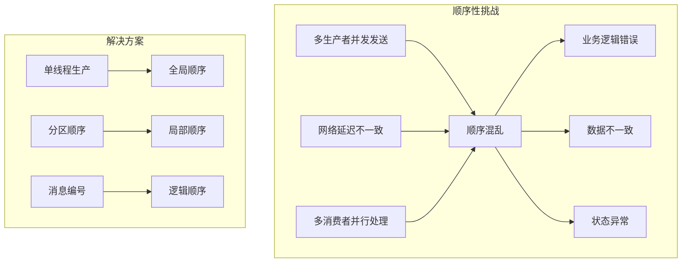
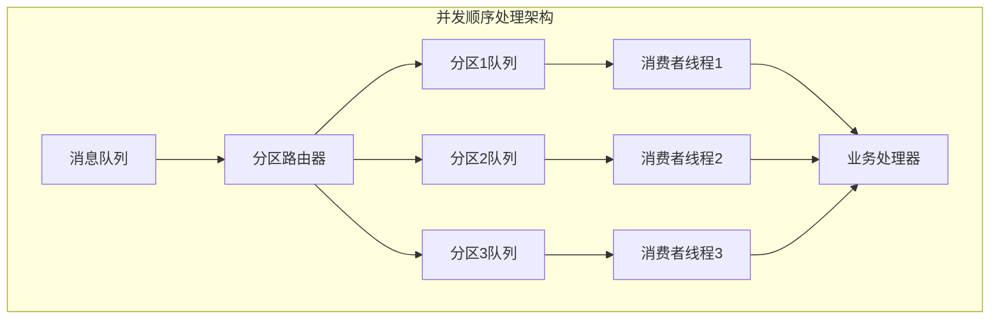
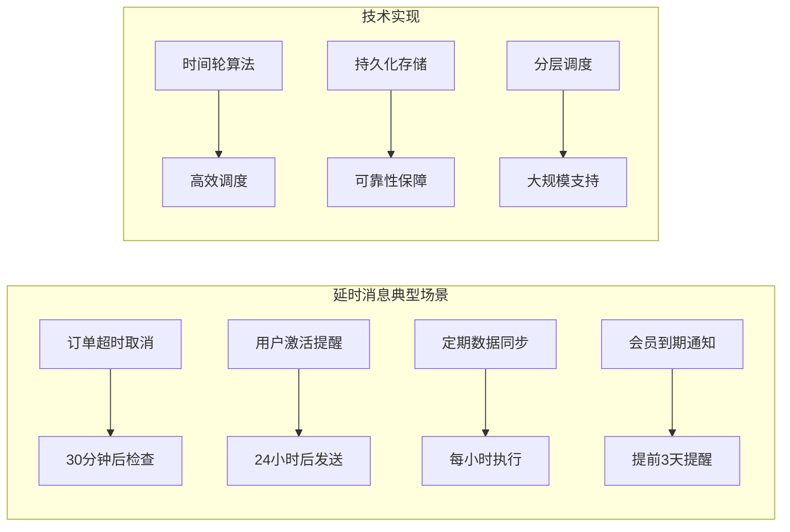
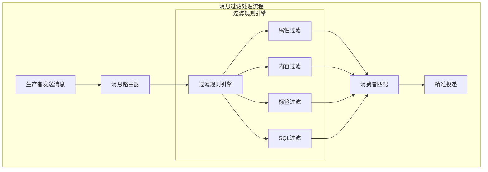
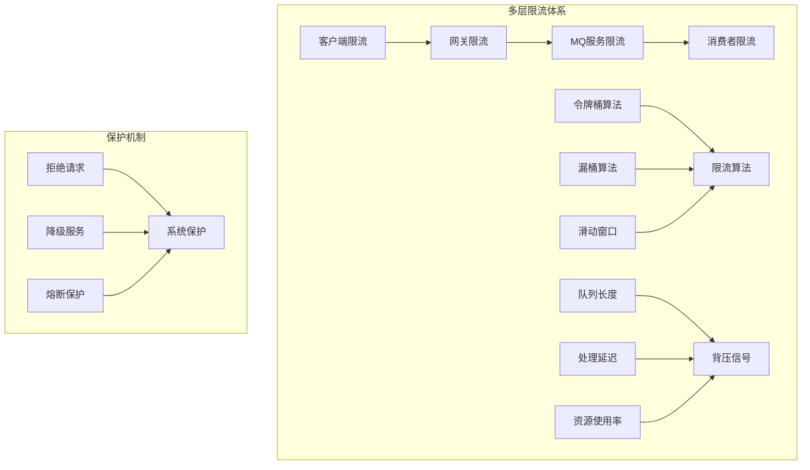
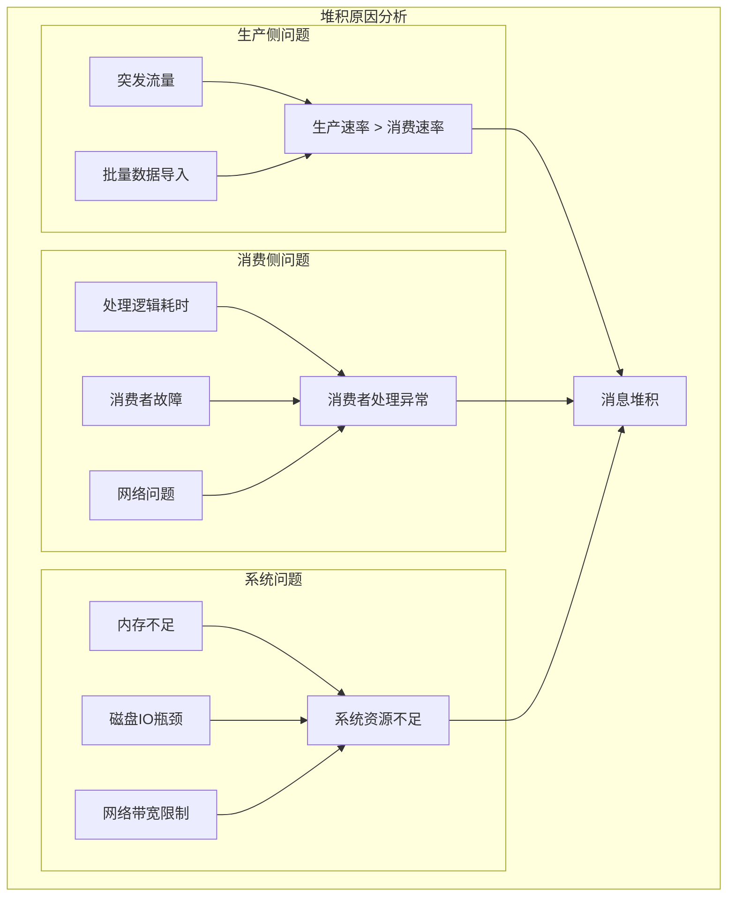

# 第六章 进阶特性：解决复杂业务场景

> "工欲善其事，必先利其器" —— 掌握进阶特性，方能应对复杂业务挑战！ 🛠️

## 本章学习目标 🎯

- 掌握消息顺序保证机制解决业务依赖问题
- 学会实现延时消息支持定时任务场景
- 理解消息过滤技术实现精准投递
- 掌握限流与背压机制保护系统稳定
- 学会诊断和解决消息堆积问题
- 在第五章高可用基础上实现复杂业务需求

---

## 6.1 消息顺序：如何保证处理顺序

在第二章中我们了解了消息的基本传递机制，现在深入探讨如何在分布式环境中保证消息顺序。

### 顺序性挑战分析



### 📊 顺序性保证级别

| 级别 | 说明 | 性能影响 | 适用场景 | 实现复杂度 |
|------|------|----------|----------|------------|
| **全局顺序** | 所有消息严格按发送顺序处理 | 高 ⭐⭐⭐⭐ | 金融交易<br/>状态机更新 | 高 ⭐⭐⭐⭐ |
| **分区顺序** | 同一分区内消息保证顺序 | 中 ⭐⭐⭐ | 用户操作序列<br/>订单处理 | 中 ⭐⭐⭐ |
| **逻辑顺序** | 通过消息ID或时间戳排序 | 低 ⭐⭐ | 日志聚合<br/>数据同步 | 低 ⭐⭐ |

### 🔄 分区顺序实现

#### 分区策略设计

```pseudocode
class PartitionedOrderedProducer {
    function sendOrderedMessage(message, partitionKey) {
        # 1. 计算分区
        partition = calculatePartition(partitionKey)
        
        # 2. 添加顺序标识
        message.sequenceId = getNextSequenceId(partition)
        message.partition = partition
        message.timestamp = currentTimestamp()
        
        # 3. 发送到指定分区
        result = sendToPartition(partition, message)
        
        # 4. 等待确认保证顺序
        if (result.success) {
            updateSequenceId(partition, message.sequenceId)
        } else {
            # 发送失败，重试保持顺序
            retryWithBackoff(message, partition)
        }
        
        return result
    }
    
    function calculatePartition(partitionKey) {
        # 使用一致性哈希确保相同key总是路由到同一分区
        hashValue = consistentHash(partitionKey)
        return hashValue % totalPartitions
    }
    
    function getNextSequenceId(partition) {
        # 每个分区独立的序列号
        return atomicIncrement("seq_" + partition)
    }
}
```

#### 顺序消费者实现

```pseudocode
class OrderedConsumer {
    function __init__(config) {
        this.partitionBuffers = {}  # 每个分区的缓冲区
        this.expectedSequence = {}  # 每个分区期望的下一个序列号
        this.outOfOrderTimeout = config.outOfOrderTimeout || 30000
    }
    
    function processMessage(message) {
        partition = message.partition
        sequenceId = message.sequenceId
        
        # 初始化分区状态
        if (!this.expectedSequence[partition]) {
            this.expectedSequence[partition] = 1
            this.partitionBuffers[partition] = {}
        }
        
        expected = this.expectedSequence[partition]
        
        if (sequenceId == expected) {
            # 正序消息，直接处理
            processMessageInOrder(message)
            this.expectedSequence[partition]++
            
            # 检查缓冲区中是否有后续消息
            processBufferedMessages(partition)
            
        } else if (sequenceId > expected) {
            # 乱序消息，暂存到缓冲区
            this.partitionBuffers[partition][sequenceId] = {
                message: message,
                timestamp: currentTime()
            }
            
            # 定期清理超时的乱序消息
            cleanupOutOfOrderMessages(partition)
            
        } else {
            # 重复消息，丢弃
            logWarning("收到重复消息: " + sequenceId + ", 期望: " + expected)
        }
    }
    
    function processBufferedMessages(partition) {
        buffer = this.partitionBuffers[partition]
        expected = this.expectedSequence[partition]
        
        while (buffer[expected]) {
            processMessageInOrder(buffer[expected].message)
            delete buffer[expected]
            this.expectedSequence[partition]++
            expected++
        }
    }
}
```

### ⚡ 高性能顺序处理

#### 并发顺序处理



```pseudocode
class ConcurrentOrderedConsumer {
    function __init__(partitionCount) {
        this.partitionQueues = []
        this.consumerThreads = []
        
        # 为每个分区创建独立的处理线程
        for (i = 0; i < partitionCount; i++) {
            queue = createQueue()
            thread = createConsumerThread(i, queue)
            
            this.partitionQueues.push(queue)
            this.consumerThreads.push(thread)
        }
    }
    
    function distributeMessage(message) {
        partition = message.partition
        partitionQueue = this.partitionQueues[partition]
        
        # 将消息放入对应分区队列
        partitionQueue.put(message)
    }
    
    function createConsumerThread(partitionId, queue) {
        return new Thread(() => {
            while (true) {
                message = queue.take()  # 阻塞获取消息
                processMessageInOrder(partitionId, message)
            }
        })
    }
}
```

---

## 6.2 延时消息：定时任务的实现

基于第四章的性能优化原理，我们来实现高效的延时消息机制。

### 延时消息应用场景



### ⏰ 时间轮算法实现

#### 多级时间轮设计

```pseudocode
class HierarchicalTimingWheel {
    function __init__(config) {
        # 多级时间轮：秒轮、分钟轮、小时轮、天轮
        this.wheels = {
            second: createTimingWheel(tickMs: 1000, wheelSize: 60),
            minute: createTimingWheel(tickMs: 60000, wheelSize: 60), 
            hour: createTimingWheel(tickMs: 3600000, wheelSize: 24),
            day: createTimingWheel(tickMs: 86400000, wheelSize: 30)
        }
        
        this.currentTime = getCurrentTime()
        this.delayedMessages = {}
    }
    
    function scheduleDelayedMessage(message, delayMs) {
        executeTime = this.currentTime + delayMs
        messageId = generateMessageId()
        
        delayedMessage = {
            id: messageId,
            message: message,
            executeTime: executeTime,
            createdTime: this.currentTime
        }
        
        # 根据延时时间选择合适的时间轮
        wheel = selectAppropriateWheel(delayMs)
        slot = calculateSlot(executeTime, wheel)
        
        # 添加到时间轮
        wheel.addMessage(slot, delayedMessage)
        this.delayedMessages[messageId] = delayedMessage
        
        return messageId
    }
    
    function selectAppropriateWheel(delayMs) {
        if (delayMs < 60000) {
            return this.wheels.second
        } else if (delayMs < 3600000) {
            return this.wheels.minute
        } else if (delayMs < 86400000) {
            return this.wheels.hour
        } else {
            return this.wheels.day
        }
    }
    
    function tick() {
        this.currentTime = getCurrentTime()
        
        # 推进所有时间轮
        for (wheel in this.wheels) {
            expiredMessages = wheel.advance(this.currentTime)
            
            for (message in expiredMessages) {
                if (message.executeTime <= this.currentTime) {
                    # 时间到了，执行消息
                    executeDelayedMessage(message)
                } else {
                    # 需要降级到更精确的时间轮
                    rescheduleToLowerWheel(message)
                }
            }
        }
    }
}
```

#### 持久化延时消息

```pseudocode
class PersistentDelayQueue {
    function __init__(storage) {
        this.storage = storage
        this.memoryIndex = {}  # 内存索引加速查询
        this.sortedSet = createSortedSet()  # 按执行时间排序
    }
    
    function addDelayedMessage(message, executeTime) {
        messageId = message.id
        
        # 持久化存储
        this.storage.save("delayed:" + messageId, {
            message: message,
            executeTime: executeTime,
            status: "pending"
        })
        
        # 更新内存索引
        this.memoryIndex[messageId] = executeTime
        this.sortedSet.add(executeTime, messageId)
        
        return messageId
    }
    
    function getExpiredMessages(currentTime) {
        # 从排序集合中获取到期消息
        expiredIds = this.sortedSet.rangeByScore(0, currentTime)
        expiredMessages = []
        
        for (messageId in expiredIds) {
            messageData = this.storage.get("delayed:" + messageId)
            if (messageData && messageData.status == "pending") {
                expiredMessages.push(messageData)
                
                # 标记为处理中
                messageData.status = "processing"
                this.storage.save("delayed:" + messageId, messageData)
            }
        }
        
        return expiredMessages
    }
    
    function completeDelayedMessage(messageId) {
        # 清理已完成的延时消息
        this.storage.delete("delayed:" + messageId)
        delete this.memoryIndex[messageId] 
        this.sortedSet.remove(messageId)
    }
}
```

### 🔄 延时消息调度器

#### 高效调度引擎

```pseudocode
class DelayedMessageScheduler {
    function __init__(config) {
        this.timingWheel = new HierarchicalTimingWheel(config)
        this.persistentQueue = new PersistentDelayQueue(config.storage)
        this.executorPool = createThreadPool(config.executorThreads)
        this.running = false
    }
    
    function start() {
        this.running = true
        
        # 启动时间轮调度线程
        this.timingWheelThread = new Thread(() => {
            while (this.running) {
                this.timingWheel.tick()
                Thread.sleep(100)  # 100ms精度
            }
        })
        
        # 启动持久化队列扫描线程
        this.persistentScanThread = new Thread(() => {
            while (this.running) {
                scanAndExecuteExpiredMessages()
                Thread.sleep(1000)  # 1秒扫描一次
            }
        })
        
        this.timingWheelThread.start()
        this.persistentScanThread.start()
    }
    
    function scheduleMessage(message, delayMs) {
        if (delayMs < 300000) { # 5分钟内使用时间轮
            return this.timingWheel.scheduleDelayedMessage(message, delayMs)
        } else { # 长延时使用持久化队列
            executeTime = getCurrentTime() + delayMs
            return this.persistentQueue.addDelayedMessage(message, executeTime)
        }
    }
    
    function scanAndExecuteExpiredMessages() {
        currentTime = getCurrentTime()
        expiredMessages = this.persistentQueue.getExpiredMessages(currentTime)
        
        for (messageData in expiredMessages) {
            # 提交到线程池执行
            this.executorPool.submit(() => {
                try {
                    executeDelayedMessage(messageData.message)
                    this.persistentQueue.completeDelayedMessage(messageData.message.id)
                } catch (error) {
                    handleExecutionError(messageData, error)
                }
            })
        }
    }
}
```

---

## 6.3 消息过滤：精准投递到目标消费者

结合第二章的路由机制，实现更精细的消息过滤能力。

### 消息过滤架构



### 🎯 多维度过滤机制

#### 属性过滤器

```pseudocode
class PropertyFilter {
    function __init__(filterExpression) {
        this.compiledExpression = compileExpression(filterExpression)
    }
    
    function matches(message) {
        messageProperties = message.properties
        
        try {
            result = this.compiledExpression.evaluate(messageProperties)
            return result == true
        } catch (error) {
            logError("属性过滤器执行错误: " + error)
            return false
        }
    }
    
    # 编译过滤表达式为可执行代码
    function compileExpression(expression) {
        # 支持的操作符：==, !=, >, <, >=, <=, IN, NOT IN, LIKE
        # 示例表达式：age > 18 AND city IN ('北京', '上海') AND name LIKE 'user%'
        
        tokens = tokenize(expression)
        ast = parseToAST(tokens)
        return compileAST(ast)
    }
}
```

#### 内容过滤器

```pseudocode
class ContentFilter {
    function __init__(config) {
        this.keywordMatcher = new KeywordMatcher(config.keywords)
        this.regexMatcher = new RegexMatcher(config.patterns)
        this.bloomFilter = new BloomFilter(config.bloomFilterConfig)
    }
    
    function matches(message) {
        content = extractContent(message)
        
        # 布隆过滤器快速预检
        if (!this.bloomFilter.mightContain(content)) {
            return false
        }
        
        # 关键词匹配
        if (this.keywordMatcher.hasKeywords()) {
            keywordResult = this.keywordMatcher.matches(content)
            if (!keywordResult.matched) {
                return false
            }
        }
        
        # 正则表达式匹配
        if (this.regexMatcher.hasPatterns()) {
            regexResult = this.regexMatcher.matches(content)
            if (!regexResult.matched) {
                return false  
            }
        }
        
        return true
    }
}

class KeywordMatcher {
    function __init__(keywords) {
        # 使用Aho-Corasick算法构建多模式匹配自动机
        this.automaton = buildAhoCorasickAutomaton(keywords)
    }
    
    function matches(content) {
        matches = this.automaton.findAll(content)
        return {
            matched: matches.length > 0,
            matchedKeywords: matches.map(m => m.keyword),
            positions: matches.map(m => m.position)
        }
    }
}
```

### 🚀 高性能过滤优化

#### 过滤器链优化

```pseudocode
class OptimizedFilterChain {
    function __init__(filters) {
        # 按过滤效率排序，高效的过滤器优先执行
        this.filters = sortByEfficiency(filters)
        this.statistics = {}
    }
    
    function matches(message) {
        startTime = getCurrentTime()
        
        for (filter in this.filters) {
            filterStartTime = getCurrentTime()
            
            result = filter.matches(message)
            
            # 统计过滤器性能
            filterTime = getCurrentTime() - filterStartTime
            updateFilterStatistics(filter.name, filterTime, result)
            
            if (!result) {
                # 短路逻辑：任一过滤器不匹配则立即返回
                updateTotalStatistics(getCurrentTime() - startTime, false)
                return false
            }
        }
        
        updateTotalStatistics(getCurrentTime() - startTime, true)
        return true
    }
    
    function sortByEfficiency(filters) {
        # 根据历史统计数据对过滤器排序
        return filters.sort((a, b) => {
            efficiencyA = a.statistics.rejectRate / a.statistics.avgExecutionTime
            efficiencyB = b.statistics.rejectRate / b.statistics.avgExecutionTime
            return efficiencyB - efficiencyA  # 降序排列
        })
    }
    
    function reorderFilters() {
        # 定期根据统计数据重新排序过滤器
        if (shouldReorder()) {
            this.filters = sortByEfficiency(this.filters)
            logInfo("过滤器链已重新排序以优化性能")
        }
    }
}
```

#### 并行过滤处理

```pseudocode
class ParallelFilterProcessor {
    function __init__(config) {
        this.threadPool = createThreadPool(config.parallelThreads)
        this.batchSize = config.batchSize || 100
        this.messageBuffer = createBuffer(this.batchSize * 2)
    }
    
    function processMessages(messages, filterChain) {
        # 将消息分批并行处理
        batches = splitIntoBatches(messages, this.batchSize)
        futures = []
        
        for (batch in batches) {
            future = this.threadPool.submit(() => {
                return processBatch(batch, filterChain)
            })
            futures.push(future)
        }
        
        # 收集所有批次的处理结果
        results = []
        for (future in futures) {
            batchResult = future.get()
            results.addAll(batchResult)
        }
        
        return results
    }
    
    function processBatch(messages, filterChain) {
        matchedMessages = []
        
        for (message in messages) {
            if (filterChain.matches(message)) {
                matchedMessages.push(message)
            }
        }
        
        return matchedMessages
    }
}
```

---

## 6.4 限流与背压：保护系统稳定性

基于第四章性能监控和第五章高可用设计，实现完善的系统保护机制。

### 限流背压架构



### 🚦 智能限流算法

#### 自适应限流器

```pseudocode
class AdaptiveRateLimiter {
    function __init__(config) {
        this.baseLimit = config.baseLimit
        this.maxLimit = config.maxLimit
        this.minLimit = config.minLimit
        
        this.currentLimit = this.baseLimit
        this.windowSize = config.windowSize || 10000  # 10秒窗口
        this.adjustInterval = config.adjustInterval || 5000  # 5秒调整一次
        
        this.metrics = createSlidingWindow(this.windowSize)
        this.lastAdjustTime = getCurrentTime()
    }
    
    function allowRequest() {
        currentTime = getCurrentTime()
        
        # 检查是否需要调整限流阈值
        if (currentTime - this.lastAdjustTime > this.adjustInterval) {
            adjustLimit()
            this.lastAdjustTime = currentTime
        }
        
        # 基于滑动窗口的限流判断
        windowStart = currentTime - this.windowSize
        requestsInWindow = this.metrics.countInWindow(windowStart, currentTime)
        
        if (requestsInWindow < this.currentLimit) {
            this.metrics.addRequest(currentTime)
            return {allowed: true, currentQPS: requestsInWindow}
        } else {
            return {
                allowed: false, 
                currentQPS: requestsInWindow,
                limit: this.currentLimit,
                retryAfter: calculateRetryAfter()
            }
        }
    }
    
    function adjustLimit() {
        currentTime = getCurrentTime()
        windowStart = currentTime - this.windowSize
        
        # 收集系统指标
        metrics = {
            qps: this.metrics.countInWindow(windowStart, currentTime),
            avgResponseTime: getAverageResponseTime(),
            errorRate: getErrorRate(),
            cpuUsage: getCPUUsage(),
            memoryUsage: getMemoryUsage()
        }
        
        # 计算系统健康分数
        healthScore = calculateHealthScore(metrics)
        
        # 根据健康分数调整限流阈值
        if (healthScore > 0.8 && this.currentLimit < this.maxLimit) {
            # 系统健康，适当提高限流阈值
            this.currentLimit = min(this.currentLimit * 1.1, this.maxLimit)
        } else if (healthScore < 0.6 && this.currentLimit > this.minLimit) {
            # 系统压力大，降低限流阈值
            this.currentLimit = max(this.currentLimit * 0.9, this.minLimit)
        }
    }
    
    function calculateHealthScore(metrics) {
        # 综合多个指标计算健康分数
        responseTimeScore = 1.0 - min(metrics.avgResponseTime / 1000, 1.0)
        errorRateScore = 1.0 - metrics.errorRate
        cpuScore = 1.0 - metrics.cpuUsage
        memoryScore = 1.0 - metrics.memoryUsage
        
        # 加权平均
        return (responseTimeScore * 0.3 + 
                errorRateScore * 0.3 + 
                cpuScore * 0.2 + 
                memoryScore * 0.2)
    }
}
```

#### 分布式限流协调

```pseudocode
class DistributedRateLimiter {
    function __init__(config) {
        this.redis = connectToRedis(config.redisConfig)
        this.localLimiter = new TokenBucketLimiter(config.localLimit)
        this.globalLimit = config.globalLimit
        this.nodeId = config.nodeId
        this.syncInterval = config.syncInterval || 1000
    }
    
    function allowRequest() {
        # 1. 先通过本地限流器
        localResult = this.localLimiter.allowRequest()
        if (!localResult.allowed) {
            return localResult
        }
        
        # 2. 检查全局限流
        globalResult = checkGlobalLimit()
        if (!globalResult.allowed) {
            return globalResult
        }
        
        return {allowed: true}
    }
    
    function checkGlobalLimit() {
        currentWindow = getCurrentWindow()
        key = "global_limit:" + currentWindow
        
        # 使用Redis Lua脚本保证原子性
        luaScript = `
            local key = KEYS[1]
            local limit = tonumber(ARGV[1])
            local window = tonumber(ARGV[2])
            local now = tonumber(ARGV[3])
            
            # 清理过期数据
            redis.call('ZREMRANGEBYSCORE', key, 0, now - window)
            
            # 获取当前窗口内的请求数
            local current = redis.call('ZCARD', key)
            if current < limit then
                # 添加当前请求
                redis.call('ZADD', key, now, now .. ':' .. math.random())
                redis.call('EXPIRE', key, window / 1000)
                return {1, current + 1}
            else
                return {0, current}
            end
        `
        
        result = this.redis.eval(luaScript, [key], [this.globalLimit, this.windowSize, getCurrentTime()])
        
        return {
            allowed: result[0] == 1,
            currentCount: result[1],
            limit: this.globalLimit
        }
    }
}
```

### 📈 背压机制实现

#### 队列背压检测

```pseudocode
class BackpressureDetector {
    function __init__(config) {
        this.queueDepthThreshold = config.queueDepthThreshold || 1000
        this.latencyThreshold = config.latencyThreshold || 5000
        this.errorRateThreshold = config.errorRateThreshold || 0.05
        
        this.detectionWindow = config.detectionWindow || 30000
        this.metrics = createMetricsCollector(this.detectionWindow)
    }
    
    function detectBackpressure() {
        currentTime = getCurrentTime()
        windowStart = currentTime - this.detectionWindow
        
        # 收集指标
        metrics = {
            avgQueueDepth: this.metrics.getAverageQueueDepth(windowStart, currentTime),
            p95Latency: this.metrics.getPercentileLatency(95, windowStart, currentTime),
            errorRate: this.metrics.getErrorRate(windowStart, currentTime),
            throughput: this.metrics.getThroughput(windowStart, currentTime)
        }
        
        # 检测背压信号
        backpressureSignals = []
        
        if (metrics.avgQueueDepth > this.queueDepthThreshold) {
            backpressureSignals.push({
                type: "queue_depth",
                severity: calculateSeverity(metrics.avgQueueDepth, this.queueDepthThreshold),
                value: metrics.avgQueueDepth
            })
        }
        
        if (metrics.p95Latency > this.latencyThreshold) {
            backpressureSignals.push({
                type: "high_latency", 
                severity: calculateSeverity(metrics.p95Latency, this.latencyThreshold),
                value: metrics.p95Latency
            })
        }
        
        if (metrics.errorRate > this.errorRateThreshold) {
            backpressureSignals.push({
                type: "high_error_rate",
                severity: calculateSeverity(metrics.errorRate, this.errorRateThreshold),
                value: metrics.errorRate
            })
        }
        
        return {
            hasBackpressure: backpressureSignals.length > 0,
            signals: backpressureSignals,
            metrics: metrics,
            recommendedAction: determineRecommendedAction(backpressureSignals)
        }
    }
    
    function determineRecommendedAction(signals) {
        maxSeverity = Math.max(...signals.map(s => s.severity))
        
        if (maxSeverity > 0.8) {
            return "reject_requests"  # 拒绝新请求
        } else if (maxSeverity > 0.6) {
            return "throttle_requests"  # 限制请求速率
        } else {
            return "monitor"  # 持续监控
        }
    }
}
```

---

## 6.5 消息堆积：原因分析与解决方案

结合前面章节的知识，全面解决消息堆积问题。

### 堆积问题诊断



### 🔍 堆积诊断工具

#### 智能诊断引擎

```pseudocode
class MessageBacklogDiagnostic {
    function __init__(config) {
        this.metricsCollector = new MetricsCollector(config)
        this.thresholds = config.thresholds
    }
    
    function diagnoseBacklog(queueName) {
        # 收集基础指标
        metrics = this.metricsCollector.collect(queueName)
        
        diagnosis = {
            queueName: queueName,
            timestamp: getCurrentTime(),
            metrics: metrics,
            rootCauses: [],
            recommendations: []
        }
        
        # 分析生产消费速率差异
        analyzeProductionConsumptionRate(diagnosis, metrics)
        
        # 分析消费者健康状况
        analyzeConsumerHealth(diagnosis, metrics)
        
        # 分析系统资源状况
        analyzeSystemResources(diagnosis, metrics)
        
        # 分析消息处理耗时
        analyzeProcessingLatency(diagnosis, metrics)
        
        return diagnosis
    }
    
    function analyzeProductionConsumptionRate(diagnosis, metrics) {
        productionRate = metrics.productionRate
        consumptionRate = metrics.consumptionRate
        rateDifference = productionRate - consumptionRate
        
        if (rateDifference > this.thresholds.rateDifferenceThreshold) {
            diagnosis.rootCauses.push({
                type: "rate_imbalance",
                severity: "high",
                description: "生产速率显著高于消费速率",
                details: {
                    productionRate: productionRate,
                    consumptionRate: consumptionRate,
                    difference: rateDifference
                }
            })
            
            diagnosis.recommendations.push({
                action: "scale_consumers", 
                priority: "high",
                description: "增加消费者实例数量",
                estimatedImpact: "提升消费能力 " + (rateDifference * 0.8) + " msg/s"
            })
        }
    }
    
    function analyzeConsumerHealth(diagnosis, metrics) {
        unhealthyConsumers = metrics.consumers.filter(c => c.health < 0.8)
        
        if (unhealthyConsumers.length > 0) {
            diagnosis.rootCauses.push({
                type: "consumer_health",
                severity: "medium",
                description: "部分消费者健康状况异常",
                details: {
                    totalConsumers: metrics.consumers.length,
                    unhealthyCount: unhealthyConsumers.length,
                    unhealthyConsumers: unhealthyConsumers.map(c => ({
                        id: c.id,
                        health: c.health,
                        issues: c.issues
                    }))
                }
            })
            
            diagnosis.recommendations.push({
                action: "restart_unhealthy_consumers",
                priority: "medium", 
                description: "重启异常消费者实例",
                targetConsumers: unhealthyConsumers.map(c => c.id)
            })
        }
    }
}
```

### 🚀 堆积解决方案

#### 动态扩容消费者

```pseudocode
class DynamicConsumerScaler {
    function __init__(config) {
        this.config = config
        this.consumerInstances = {}
        this.scalingCooldown = config.scalingCooldown || 60000
        this.lastScalingTime = 0
    }
    
    function autoScale(queueName, backlogSize, currentConsumerCount) {
        currentTime = getCurrentTime()
        
        # 冷却时间内不进行扩缩容
        if (currentTime - this.lastScalingTime < this.scalingCooldown) {
            return {action: "wait", reason: "扩缩容冷却期内"}
        }
        
        # 计算理想消费者数量
        targetConsumerCount = calculateTargetConsumerCount(backlogSize, currentConsumerCount)
        
        if (targetConsumerCount > currentConsumerCount) {
            return scaleOut(queueName, targetConsumerCount - currentConsumerCount)
        } else if (targetConsumerCount < currentConsumerCount && backlogSize < 100) {
            return scaleIn(queueName, currentConsumerCount - targetConsumerCount)
        }
        
        return {action: "maintain", reason: "消费者数量已合适"}
    }
    
    function calculateTargetConsumerCount(backlogSize, currentCount) {
        # 基于堆积大小和处理能力计算目标消费者数量
        avgProcessingTime = getAverageProcessingTime()
        targetProcessingRate = backlogSize / 600  # 10分钟内处理完毕
        
        consumerCapability = 1000 / avgProcessingTime  # 每秒处理能力
        idealCount = Math.ceil(targetProcessingRate / consumerCapability)
        
        # 限制在合理范围内
        return Math.min(Math.max(idealCount, this.config.minConsumers), this.config.maxConsumers)
    }
    
    function scaleOut(queueName, additionalCount) {
        newConsumers = []
        
        for (i = 0; i < additionalCount; i++) {
            consumer = createConsumerInstance({
                queueName: queueName,
                instanceId: generateInstanceId(),
                config: this.config.consumerConfig
            })
            
            consumer.start()
            newConsumers.push(consumer)
            this.consumerInstances[consumer.instanceId] = consumer
        }
        
        this.lastScalingTime = getCurrentTime()
        
        return {
            action: "scale_out",
            addedConsumers: additionalCount,
            newConsumerIds: newConsumers.map(c => c.instanceId),
            estimatedImpact: "预计提升处理能力 " + (additionalCount * 1000) + " msg/s"
        }
    }
}
```

#### 批量处理优化

```pseudocode
class BatchProcessingOptimizer {
    function __init__(config) {
        this.batchSize = config.batchSize || 10
        this.maxWaitTime = config.maxWaitTime || 5000
        this.messageBuffer = []
        this.lastFlushTime = getCurrentTime()
    }
    
    function processMessage(message) {
        this.messageBuffer.push(message)
        
        # 检查是否需要批量处理
        if (shouldFlush()) {
            flushBuffer()
        }
    }
    
    function shouldFlush() {
        return this.messageBuffer.length >= this.batchSize ||
               (getCurrentTime() - this.lastFlushTime) > this.maxWaitTime
    }
    
    function flushBuffer() {
        if (this.messageBuffer.length == 0) {
            return
        }
        
        batch = this.messageBuffer.slice()
        this.messageBuffer = []
        this.lastFlushTime = getCurrentTime()
        
        # 批量处理消息
        processBatch(batch)
    }
    
    function processBatch(messages) {
        try {
            # 批量数据库操作
            if (messages.length > 0) {
                batchDatabaseOperation(messages)
            }
            
            # 批量确认消息
            acknowledgeMessages(messages)
            
            logInfo("批量处理完成: " + messages.length + " 条消息")
            
        } catch (error) {
            logError("批量处理失败: " + error)
            
            # 单条重试处理
            for (message in messages) {
                try {
                    processSingleMessage(message)
                } catch (singleError) {
                    handleFailedMessage(message, singleError)
                }
            }
        }
    }
}
```

---

## 本章总结 📚

### 🎯 核心要点回顾

1. **消息顺序**：通过分区顺序和序列号机制保证处理顺序
2. **延时消息**：使用时间轮算法实现高效的定时任务调度
3. **消息过滤**：多维度过滤机制实现精准消息投递
4. **限流背压**：自适应限流和背压检测保护系统稳定
5. **消息堆积**：智能诊断和动态扩容解决堆积问题

### 🔗 与前后章节的联系

- **承接第五章**：在高可用基础上实现复杂业务特性
- **融合第四章**：性能优化思想贯穿各个进阶特性
- **为第七章铺垫**：不同MQ产品对进阶特性的支持差异

### 💡 实践建议

1. **渐进式实现**：根据业务需求逐步引入进阶特性
2. **性能监控**：重点关注特性启用后的性能影响
3. **测试验证**：充分测试各种异常场景下的表现
4. **运维支持**：建立相应的运维监控和告警机制

### 🚀 下章预告

第七章《产品选型：选择最适合的MQ利器》将深入对比主流MQ产品的特性差异，帮助你根据业务场景选择最合适的技术方案。

---

*掌握了这些进阶特性，你已经具备了解决复杂业务场景的能力。接下来让我们了解如何选择最合适的MQ产品！* 🛠️