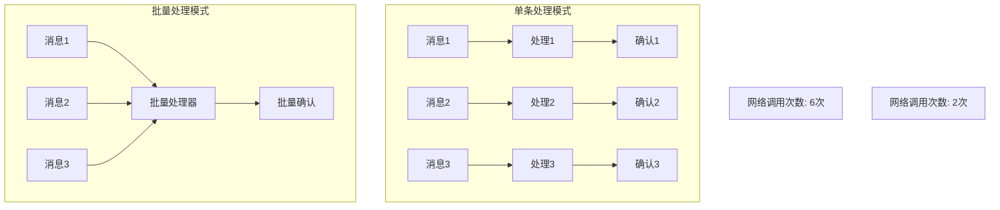
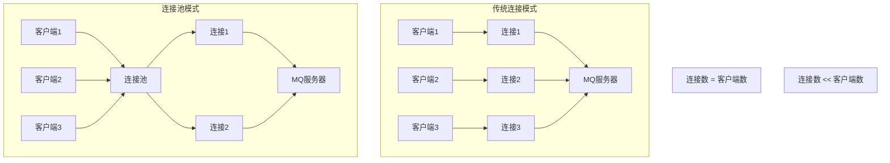
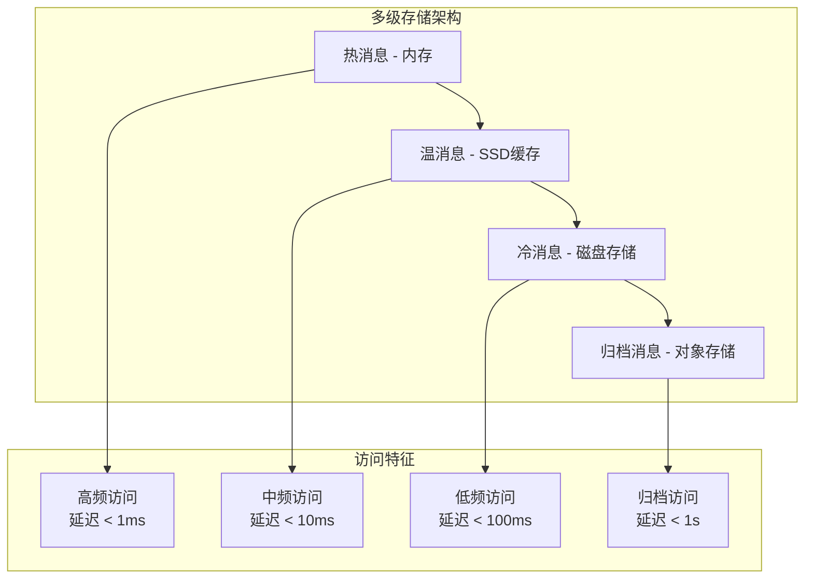
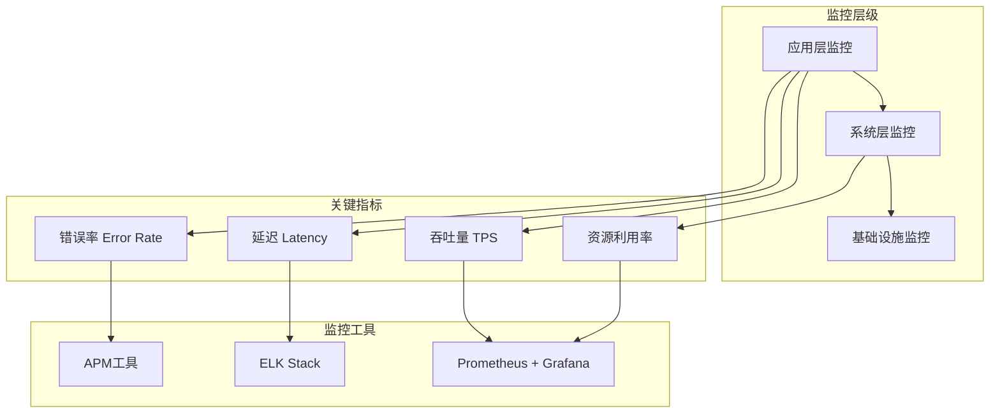

# 第四章 性能优化：让MQ飞起来

> "天下武功，唯快不破" —— 在确保可靠性的基础上，追求极致性能！ 🚀

## 本章学习目标 🎯

- 掌握批量处理技术大幅提升消息吞吐量
- 学会连接池管理优化网络资源使用效率
- 理解消息压缩技术在节省带宽中的应用
- 掌握内存与存储的平衡优化策略
- 建立完善的性能监控和调优体系
- 在第三章可靠性保障基础上实现高性能MQ系统

---

## 4.1 批量处理：提升吞吐量的利器

在第一章中我们提到了异步处理的优势，而批量处理则是将异步优势发挥到极致的技术手段。

### 批量处理核心原理



### 🚀 生产者批量发送

#### 批量发送缓冲器

```pseudocode
class BatchProducer {
    function __init__(config) {
        this.batchSize = config.batchSize || 100
        this.batchTimeout = config.batchTimeout || 1000  // 1秒
        this.maxBatchBytes = config.maxBatchBytes || 1024 * 1024  // 1MB
        
        this.messageBuffer = []
        this.bufferSize = 0
        this.lastFlushTime = getCurrentTime()
        
        this.connection = createConnection(config)
        this.metricsCollector = new MetricsCollector()
        
        this.startFlushTimer()
    }
    
    function send(message) {
        messageSize = this.calculateMessageSize(message)
        
        // 加锁保证线程安全
        synchronized(this.messageBuffer) {
            // 检查是否需要立即刷新
            if (this.shouldFlushImmediately(messageSize)) {
                this.flushBuffer()
            }
            
            // 添加消息到缓冲区
            batchMessage = {
                message: message,
                timestamp: getCurrentTime(),
                size: messageSize,
                callback: message.callback
            }
            
            this.messageBuffer.add(batchMessage)
            this.bufferSize += messageSize
            
            // 检查是否达到批量大小
            if (this.messageBuffer.size() >= this.batchSize) {
                this.flushBuffer()
            }
        }
        
        return message.id
    }
    
    function shouldFlushImmediately(newMessageSize) {
        // 1. 缓冲区即将超出大小限制
        if (this.bufferSize + newMessageSize > this.maxBatchBytes) {
            return true
        }
        
        // 2. 缓冲区超时
        if (getCurrentTime() - this.lastFlushTime > this.batchTimeout) {
            return true
        }
        
        return false
    }
    
    function flushBuffer() {
        if (this.messageBuffer.isEmpty()) {
            return
        }
        
        batchMessages = this.messageBuffer.clone()
        batchSize = this.messageBuffer.size()
        totalBytes = this.bufferSize
        
        // 清空缓冲区
        this.messageBuffer.clear()
        this.bufferSize = 0
        this.lastFlushTime = getCurrentTime()
        
        // 异步发送批量消息
        asyncExecute(function() {
            this.sendBatch(batchMessages, batchSize, totalBytes)
        })
    }
    
    function sendBatch(batchMessages, batchSize, totalBytes) {
        startTime = getCurrentTime()
        
        try {
            // 构造批量消息载荷
            batchPayload = {
                batchId: generateBatchId(),
                messageCount: batchSize,
                totalSize: totalBytes,
                messages: batchMessages.map(bm => bm.message),
                batchTimestamp: startTime
            }
            
            // 发送批量消息
            result = this.connection.sendBatch(batchPayload)
            
            if (result.success) {
                sendTime = getCurrentTime() - startTime
                
                // 批量回调成功
                this.handleBatchSuccess(batchMessages, sendTime, batchSize, totalBytes)
                
                log("批量发送成功: " + batchSize + "条消息, 耗时: " + sendTime + "ms")
            } else {
                // 批量发送失败，逐个重试
                this.handleBatchFailure(batchMessages, result.error)
            }
            
        } catch (exception) {
            this.handleBatchException(batchMessages, exception)
        }
    }
    
    function handleBatchSuccess(batchMessages, sendTime, batchSize, totalBytes) {
        // 记录性能指标
        this.metricsCollector.recordBatchMetrics({
            batchSize: batchSize,
            totalBytes: totalBytes,
            sendTime: sendTime,
            throughput: batchSize / (sendTime / 1000)  // 消息/秒
        })
        
        // 批量回调
        for batchMessage in batchMessages {
            if (batchMessage.callback) {
                batchMessage.callback.onSuccess(batchMessage.message.id)
            }
        }
    }
    
    function handleBatchFailure(batchMessages, error) {
        log("批量发送失败，开始逐个重试: " + error)
        
        // 将失败的消息重新逐个发送
        for batchMessage in batchMessages {
            this.retrySingleMessage(batchMessage.message)
        }
    }
    
    function retrySingleMessage(message) {
        try {
            result = this.connection.send(message)
            
            if (result.success && message.callback) {
                message.callback.onSuccess(message.id)
            } else if (message.callback) {
                message.callback.onFailure(message.id, result.error)
            }
            
        } catch (exception) {
            if (message.callback) {
                message.callback.onError(message.id, exception.message)
            }
        }
    }
    
    function startFlushTimer() {
        // 定时刷新缓冲区
        setInterval(function() {
            synchronized(this.messageBuffer) {
                if (!this.messageBuffer.isEmpty() && 
                    getCurrentTime() - this.lastFlushTime > this.batchTimeout) {
                    this.flushBuffer()
                }
            }
        }, this.batchTimeout / 2)  // 定时器间隔为超时时间的一半
    }
    
    function calculateMessageSize(message) {
        // 估算消息大小（包括头部和载荷）
        headerSize = serialize(message.headers).length
        payloadSize = serialize(message.payload).length
        
        return headerSize + payloadSize + 50  // 额外开销
    }
}
```

#### 智能批量策略

```pseudocode
class AdaptiveBatchStrategy {
    function __init__() {
        this.performanceHistory = new CircularBuffer(100)  // 记录最近100次批量操作
        this.currentStrategy = "BALANCED"
        this.adjustmentInterval = 60000  // 1分钟调整一次
        
        this.strategies = {
            "HIGH_THROUGHPUT": { batchSize: 500, timeout: 5000 },
            "BALANCED": { batchSize: 100, timeout: 1000 },
            "LOW_LATENCY": { batchSize: 20, timeout: 100 }
        }
        
        this.startStrategyAdjustment()
    }
    
    function recordBatchPerformance(batchSize, latency, throughput) {
        performanceRecord = {
            batchSize: batchSize,
            latency: latency,
            throughput: throughput,
            timestamp: getCurrentTime(),
            strategy: this.currentStrategy
        }
        
        this.performanceHistory.add(performanceRecord)
    }
    
    function startStrategyAdjustment() {
        setInterval(function() {
            this.adjustBatchStrategy()
        }, this.adjustmentInterval)
    }
    
    function adjustBatchStrategy() {
        if (this.performanceHistory.size() < 10) {
            return  // 数据不足，不调整
        }
        
        // 分析最近的性能数据
        recentRecords = this.performanceHistory.getLast(30)
        
        avgLatency = this.calculateAverageLatency(recentRecords)
        avgThroughput = this.calculateAverageThroughput(recentRecords)
        latencyTrend = this.calculateLatencyTrend(recentRecords)
        
        // 决定新的策略
        newStrategy = this.determineOptimalStrategy(avgLatency, avgThroughput, latencyTrend)
        
        if (newStrategy != this.currentStrategy) {
            log("调整批量策略: " + this.currentStrategy + " -> " + newStrategy +
                ", 平均延迟: " + avgLatency + "ms, 平均吞吐量: " + avgThroughput + " msg/s")
            
            this.currentStrategy = newStrategy
        }
    }
    
    function determineOptimalStrategy(avgLatency, avgThroughput, latencyTrend) {
        // 延迟过高，切换到低延迟策略
        if (avgLatency > 5000 || latencyTrend > 1.5) {
            return "LOW_LATENCY"
        }
        
        // 吞吐量不足且延迟可接受，切换到高吞吐量策略
        if (avgThroughput < 1000 && avgLatency < 2000 && latencyTrend < 1.2) {
            return "HIGH_THROUGHPUT"
        }
        
        // 其他情况使用平衡策略
        return "BALANCED"
    }
    
    function getCurrentBatchConfig() {
        return this.strategies.get(this.currentStrategy)
    }
}
```

### 🎯 消费者批量处理

#### 批量消费处理器

```pseudocode
class BatchConsumer {
    function __init__(config) {
        this.batchSize = config.batchSize || 50
        this.batchTimeout = config.batchTimeout || 500  // 500ms
        this.maxConcurrentBatches = config.maxConcurrentBatches || 5
        
        this.messageBuffer = []
        this.activeBatches = new Semaphore(this.maxConcurrentBatches)
        this.processor = config.messageProcessor
        
        this.connection = createConnection(config)
        this.metricsCollector = new MetricsCollector()
        
        this.startBatchProcessor()
    }
    
    function startConsuming() {
        this.connection.consume(this.queueName, {
            autoAck: false,
            prefetchCount: this.batchSize * 2  // 预取足够的消息
        }, this.handleMessage)
        
        log("批量消费者启动，批量大小: " + this.batchSize)
    }
    
    function handleMessage(message) {
        synchronized(this.messageBuffer) {
            this.messageBuffer.add({
                message: message,
                receivedAt: getCurrentTime(),
                deliveryTag: message.deliveryTag
            })
            
            // 检查是否需要处理批次
            if (this.shouldProcessBatch()) {
                this.processBatch()
            }
        }
    }
    
    function shouldProcessBatch() {
        if (this.messageBuffer.size() >= this.batchSize) {
            return true
        }
        
        if (!this.messageBuffer.isEmpty()) {
            oldestMessage = this.messageBuffer.get(0)
            if (getCurrentTime() - oldestMessage.receivedAt > this.batchTimeout) {
                return true
            }
        }
        
        return false
    }
    
    function processBatch() {
        if (this.messageBuffer.isEmpty()) {
            return
        }
        
        // 尝试获取并发处理许可
        if (!this.activeBatches.tryAcquire()) {
            log("达到最大并发批次限制，等待处理")
            return
        }
        
        // 提取批次消息
        batchMessages = this.messageBuffer.clone()
        this.messageBuffer.clear()
        
        batchId = generateBatchId()
        
        // 异步处理批次
        asyncExecute(function() {
            try {
                this.processBatchAsync(batchId, batchMessages)
            } finally {
                this.activeBatches.release()
            }
        })
    }
    
    function processBatchAsync(batchId, batchMessages) {
        startTime = getCurrentTime()
        batchSize = batchMessages.size()
        
        try {
            log("开始处理批次: " + batchId + ", 消息数: " + batchSize)
            
            // 批量业务处理
            result = this.processor.processBatch(
                batchMessages.map(bm => bm.message)
            )
            
            processingTime = getCurrentTime() - startTime
            
            if (result.success) {
                // 批量确认成功的消息
                this.batchAcknowledge(batchMessages, result.processedMessages)
                
                // 记录成功指标
                this.metricsCollector.recordBatchSuccess(batchSize, processingTime)
                
                log("批次处理成功: " + batchId + ", 耗时: " + processingTime + "ms")
            } else {
                // 处理部分失败的情况
                this.handlePartialFailure(batchMessages, result)
            }
            
        } catch (exception) {
            log("批次处理异常: " + batchId + ", 异常: " + exception.message)
            
            // 异常情况下逐个处理
            this.fallbackToIndividualProcessing(batchMessages)
        }
    }
    
    function batchAcknowledge(batchMessages, processedMessages) {
        successSet = new HashSet(processedMessages.map(m => m.id))
        
        for batchMessage in batchMessages {
            messageId = batchMessage.message.id
            
            if (successSet.contains(messageId)) {
                // 确认成功处理的消息
                this.connection.ack(batchMessage.deliveryTag)
            } else {
                // 拒绝未成功处理的消息
                this.connection.nack(batchMessage.deliveryTag, requeue=true)
            }
        }
    }
    
    function handlePartialFailure(batchMessages, result) {
        successfulIds = new HashSet(result.successfulMessages.map(m => m.id))
        
        for batchMessage in batchMessages {
            messageId = batchMessage.message.id
            
            if (successfulIds.contains(messageId)) {
                this.connection.ack(batchMessage.deliveryTag)
            } else {
                // 检查是否可重试
                failureInfo = result.failures.get(messageId)
                
                if (failureInfo && failureInfo.retryable) {
                    this.connection.nack(batchMessage.deliveryTag, requeue=true)
                } else {
                    // 不可重试，发送到死信队列
                    this.connection.nack(batchMessage.deliveryTag, requeue=false)
                }
            }
        }
        
        log("批次部分处理失败，成功: " + result.successfulMessages.size() + 
            ", 失败: " + result.failures.size())
    }
    
    function fallbackToIndividualProcessing(batchMessages) {
        log("回退到逐个处理模式")
        
        for batchMessage in batchMessages {
            try {
                // 逐个处理消息
                result = this.processor.processMessage(batchMessage.message)
                
                if (result.success) {
                    this.connection.ack(batchMessage.deliveryTag)
                } else {
                    this.connection.nack(batchMessage.deliveryTag, requeue=result.retryable)
                }
                
            } catch (exception) {
                log("逐个处理异常: " + exception.message)
                this.connection.nack(batchMessage.deliveryTag, requeue=false)
            }
        }
    }
    
    function startBatchProcessor() {
        // 定时检查超时的批次
        setInterval(function() {
            synchronized(this.messageBuffer) {
                if (this.shouldProcessBatch()) {
                    this.processBatch()
                }
            }
        }, this.batchTimeout / 2)
    }
}
```

### 📊 批量处理性能优化

#### 动态批量大小调整

```pseudocode
class DynamicBatchSizer {
    function __init__(initialBatchSize) {
        this.currentBatchSize = initialBatchSize
        this.minBatchSize = 10
        this.maxBatchSize = 1000
        
        this.performanceWindow = new SlidingWindow(50)  // 滑动窗口
        this.adjustmentFactor = 0.1  // 调整因子
        
        this.lastAdjustmentTime = getCurrentTime()
        this.adjustmentInterval = 30000  // 30秒调整一次
    }
    
    function recordBatchPerformance(batchSize, processingTime, throughput) {
        performanceData = {
            batchSize: batchSize,
            processingTime: processingTime,
            throughput: throughput,
            efficiency: throughput / processingTime,  // 效率指标
            timestamp: getCurrentTime()
        }
        
        this.performanceWindow.add(performanceData)
        
        // 检查是否需要调整
        if (getCurrentTime() - this.lastAdjustmentTime > this.adjustmentInterval) {
            this.adjustBatchSize()
        }
    }
    
    function adjustBatchSize() {
        if (this.performanceWindow.size() < 10) {
            return  // 数据不足
        }
        
        recentData = this.performanceWindow.getRecent(20)
        
        // 计算当前性能基准
        avgEfficiency = this.calculateAverageEfficiency(recentData)
        efficiencyTrend = this.calculateEfficiencyTrend(recentData)
        
        newBatchSize = this.currentBatchSize
        
        // 基于效率趋势调整批量大小
        if (efficiencyTrend > 0.05) {
            // 效率上升，尝试增大批量
            newBatchSize = Math.min(
                this.currentBatchSize * (1 + this.adjustmentFactor),
                this.maxBatchSize
            )
        } else if (efficiencyTrend < -0.05) {
            // 效率下降，尝试减小批量
            newBatchSize = Math.max(
                this.currentBatchSize * (1 - this.adjustmentFactor),
                this.minBatchSize
            )
        }
        
        // 应用新的批量大小
        if (newBatchSize != this.currentBatchSize) {
            log("调整批量大小: " + this.currentBatchSize + " -> " + newBatchSize +
                ", 效率趋势: " + efficiencyTrend)
            
            this.currentBatchSize = newBatchSize
            this.lastAdjustmentTime = getCurrentTime()
        }
    }
    
    function getCurrentBatchSize() {
        return Math.floor(this.currentBatchSize)
    }
    
    function calculateEfficiencyTrend(data) {
        if (data.size() < 5) {
            return 0
        }
        
        // 简单线性回归计算趋势
        n = data.size()
        sumX = 0
        sumY = 0
        sumXY = 0
        sumX2 = 0
        
        for i in range(n) {
            x = i
            y = data.get(i).efficiency
            
            sumX += x
            sumY += y
            sumXY += x * y
            sumX2 += x * x
        }
        
        // 计算斜率（趋势）
        slope = (n * sumXY - sumX * sumY) / (n * sumX2 - sumX * sumX)
        
        return slope
    }
}
```

---

## 4.2 连接池管理：减少连接开销

在第二章我们了解了生产者和消费者的基本概念，现在让我们深入了解如何优化它们的连接管理。

### 连接池原理与架构



### 🔗 高性能连接池实现

#### 智能连接池管理器

```pseudocode
class ConnectionPoolManager {
    function __init__(config) {
        this.minPoolSize = config.minPoolSize || 5
        this.maxPoolSize = config.maxPoolSize || 50
        this.connectionTimeout = config.connectionTimeout || 30000
        this.idleTimeout = config.idleTimeout || 600000  // 10分钟
        this.maxWaitTime = config.maxWaitTime || 5000
        
        this.availableConnections = new ConcurrentQueue()
        this.busyConnections = new ConcurrentHashMap()
        this.connectionStats = new ConnectionStatistics()
        
        this.totalConnections = new AtomicInteger(0)
        this.creatingConnections = new AtomicInteger(0)
        
        this.initializePool()
        this.startMaintenanceTask()
    }
    
    function initializePool() {
        // 预创建最小连接数
        for (i = 0; i < this.minPoolSize; i++) {
            connection = this.createConnection()
            if (connection != null) {
                this.availableConnections.offer(connection)
                this.totalConnections.incrementAndGet()
            }
        }
        
        log("连接池初始化完成，初始连接数: " + this.totalConnections.get())
    }
    
    function getConnection() {
        startTime = getCurrentTime()
        
        try {
            // 1. 尝试从可用连接中获取
            connection = this.availableConnections.poll()
            
            if (connection != null && this.isConnectionValid(connection)) {
                this.markConnectionBusy(connection)
                this.connectionStats.recordConnectionAcquisition(getCurrentTime() - startTime)
                return connection
            }
            
            // 2. 没有可用连接，尝试创建新连接
            if (this.canCreateNewConnection()) {
                connection = this.createNewConnection()
                if (connection != null) {
                    this.markConnectionBusy(connection)
                    this.connectionStats.recordConnectionAcquisition(getCurrentTime() - startTime)
                    return connection
                }
            }
            
            // 3. 无法创建新连接，等待可用连接
            connection = this.waitForAvailableConnection()
            if (connection != null) {
                this.markConnectionBusy(connection)
                this.connectionStats.recordConnectionAcquisition(getCurrentTime() - startTime)
                return connection
            }
            
            // 4. 获取连接失败
            throw new Error("无法获取连接，连接池已耗尽")
            
        } catch (exception) {
            this.connectionStats.recordConnectionAcquisitionFailure()
            throw exception
        }
    }
    
    function releaseConnection(connection) {
        if (connection == null) {
            return
        }
        
        connectionInfo = this.busyConnections.remove(connection.getId())
        
        if (connectionInfo != null) {
            // 更新连接使用统计
            usageTime = getCurrentTime() - connectionInfo.acquiredAt
            this.connectionStats.recordConnectionUsage(usageTime)
            
            // 检查连接是否仍然有效
            if (this.isConnectionValid(connection)) {
                connection.setLastUsedTime(getCurrentTime())
                this.availableConnections.offer(connection)
                
                log("连接已释放回池: " + connection.getId())
            } else {
                // 连接无效，关闭并从总数中减去
                this.closeConnection(connection)
                this.totalConnections.decrementAndGet()
                
                log("无效连接已关闭: " + connection.getId())
            }
        }
    }
    
    function createNewConnection() {
        if (!this.creatingConnections.compareAndSet(0, 1)) {
            return null  // 已有其他线程在创建连接
        }
        
        try {
            if (!this.canCreateNewConnection()) {
                return null
            }
            
            connection = this.createConnection()
            
            if (connection != null) {
                this.totalConnections.incrementAndGet()
                log("创建新连接: " + connection.getId() + 
                    ", 总连接数: " + this.totalConnections.get())
            }
            
            return connection
            
        } finally {
            this.creatingConnections.set(0)
        }
    }
    
    function createConnection() {
        try {
            connection = new MQConnection(this.connectionConfig)
            connection.connect()
            connection.setCreatedTime(getCurrentTime())
            connection.setLastUsedTime(getCurrentTime())
            
            return connection
            
        } catch (exception) {
            log("创建连接失败: " + exception.message)
            return null
        }
    }
    
    function canCreateNewConnection() {
        currentTotal = this.totalConnections.get()
        return currentTotal < this.maxPoolSize
    }
    
    function isConnectionValid(connection) {
        // 检查连接是否超时
        if (getCurrentTime() - connection.getLastUsedTime() > this.idleTimeout) {
            return false
        }
        
        // 检查连接是否存活
        try {
            return connection.isAlive()
        } catch (exception) {
            return false
        }
    }
    
    function markConnectionBusy(connection) {
        connectionInfo = {
            connection: connection,
            acquiredAt: getCurrentTime(),
            threadId: getCurrentThreadId()
        }
        
        this.busyConnections.put(connection.getId(), connectionInfo)
    }
    
    function waitForAvailableConnection() {
        endTime = getCurrentTime() + this.maxWaitTime
        
        while (getCurrentTime() < endTime) {
            connection = this.availableConnections.poll(100)  // 100ms超时
            
            if (connection != null && this.isConnectionValid(connection)) {
                return connection
            }
            
            // 检查是否可以创建新连接
            if (this.canCreateNewConnection()) {
                newConnection = this.createNewConnection()
                if (newConnection != null) {
                    return newConnection
                }
            }
        }
        
        return null  // 超时未获取到连接
    }
    
    function startMaintenanceTask() {
        // 定期维护连接池
        setInterval(function() {
            this.performMaintenance()
        }, 60000)  // 每分钟执行一次
    }
    
    function performMaintenance() {
        log("开始连接池维护")
        
        // 1. 清理空闲超时的连接
        this.cleanupIdleConnections()
        
        // 2. 检查忙碌连接的健康状况
        this.checkBusyConnections()
        
        // 3. 确保最小连接数
        this.ensureMinimumConnections()
        
        // 4. 输出连接池状态
        this.logPoolStatus()
    }
    
    function cleanupIdleConnections() {
        currentTime = getCurrentTime()
        connectionsToRemove = []
        
        // 检查可用连接池中的空闲连接
        while (!this.availableConnections.isEmpty()) {
            connection = this.availableConnections.poll()
            
            if (connection != null) {
                if (currentTime - connection.getLastUsedTime() > this.idleTimeout) {
                    // 连接空闲超时，关闭
                    connectionsToRemove.add(connection)
                } else {
                    // 连接仍然有效，放回池中
                    this.availableConnections.offer(connection)
                    break  // 队列是按时间排序的，后面的连接更新
                }
            }
        }
        
        // 关闭超时连接
        for connection in connectionsToRemove {
            this.closeConnection(connection)
            this.totalConnections.decrementAndGet()
        }
        
        if (!connectionsToRemove.isEmpty()) {
            log("清理空闲连接: " + connectionsToRemove.size() + "个")
        }
    }
    
    function ensureMinimumConnections() {
        currentTotal = this.totalConnections.get()
        
        if (currentTotal < this.minPoolSize) {
            connectionsToCreate = this.minPoolSize - currentTotal
            
            for (i = 0; i < connectionsToCreate; i++) {
                connection = this.createConnection()
                if (connection != null) {
                    this.availableConnections.offer(connection)
                    this.totalConnections.incrementAndGet()
                }
            }
            
            log("补充最小连接数，创建: " + connectionsToCreate + "个连接")
        }
    }
    
    function logPoolStatus() {
        status = {
            totalConnections: this.totalConnections.get(),
            availableConnections: this.availableConnections.size(),
            busyConnections: this.busyConnections.size(),
            creatingConnections: this.creatingConnections.get()
        }
        
        log("连接池状态: " + serialize(status))
        
        // 记录到监控系统
        this.connectionStats.updatePoolStatus(status)
    }
}
```

#### 连接复用与多路复用

```pseudocode
class MultiplexedConnection {
    function __init__(physicalConnection, config) {
        this.physicalConnection = physicalConnection
        this.channels = new ConcurrentHashMap()
        this.maxChannels = config.maxChannels || 100
        this.channelCounter = new AtomicInteger(0)
        
        this.channelPool = new ChannelPool(config.channelPoolConfig)
    }
    
    function createChannel() {
        if (this.channelCounter.get() >= this.maxChannels) {
            throw new Error("达到最大通道数限制")
        }
        
        try {
            channel = this.physicalConnection.createChannel()
            channelId = this.channelCounter.incrementAndGet()
            
            channelWrapper = {
                id: channelId,
                channel: channel,
                createdAt: getCurrentTime(),
                lastUsedAt: getCurrentTime(),
                messageCount: 0,
                inUse: true
            }
            
            this.channels.put(channelId, channelWrapper)
            
            log("创建新通道: " + channelId + ", 总通道数: " + this.channels.size())
            
            return new ChannelProxy(channelWrapper, this)
            
        } catch (exception) {
            log("创建通道失败: " + exception.message)
            throw exception
        }
    }
    
    function releaseChannel(channelId) {
        channelWrapper = this.channels.get(channelId)
        
        if (channelWrapper != null) {
            channelWrapper.inUse = false
            channelWrapper.lastUsedAt = getCurrentTime()
            
            // 将通道返回到池中供复用
            this.channelPool.returnChannel(channelWrapper)
            
            log("通道已释放: " + channelId)
        }
    }
    
    function getOrCreateChannel() {
        // 尝试从池中获取可复用的通道
        reusableChannel = this.channelPool.getAvailableChannel()
        
        if (reusableChannel != null && this.isChannelValid(reusableChannel)) {
            reusableChannel.inUse = true
            reusableChannel.lastUsedAt = getCurrentTime()
            
            return new ChannelProxy(reusableChannel, this)
        }
        
        // 没有可复用通道，创建新通道
        return this.createChannel()
    }
    
    function isChannelValid(channelWrapper) {
        if (channelWrapper.channel.isClosed()) {
            return false
        }
        
        // 检查通道空闲时间
        idleTime = getCurrentTime() - channelWrapper.lastUsedAt
        if (idleTime > 300000) {  // 5分钟空闲超时
            return false
        }
        
        return true
    }
    
    function performChannelMaintenance() {
        expiredChannels = []
        
        for entry in this.channels.entrySet() {
            channelWrapper = entry.getValue()
            
            if (!channelWrapper.inUse && !this.isChannelValid(channelWrapper)) {
                expiredChannels.add(entry.getKey())
            }
        }
        
        // 清理过期通道
        for channelId in expiredChannels {
            channelWrapper = this.channels.remove(channelId)
            if (channelWrapper != null) {
                this.closeChannel(channelWrapper.channel)
                log("清理过期通道: " + channelId)
            }
        }
    }
    
    function getConnectionStats() {
        activeChannels = 0
        idleChannels = 0
        totalMessages = 0
        
        for channelWrapper in this.channels.values() {
            if (channelWrapper.inUse) {
                activeChannels++
            } else {
                idleChannels++
            }
            totalMessages += channelWrapper.messageCount
        }
        
        return {
            totalChannels: this.channels.size(),
            activeChannels: activeChannels,
            idleChannels: idleChannels,
            totalMessages: totalMessages,
            maxChannels: this.maxChannels
        }
    }
}
```

### 📈 连接性能监控

#### 连接统计收集器

```pseudocode
class ConnectionStatistics {
    function __init__() {
        this.acquisitionTimes = new HistogramMetric()
        this.usageTimes = new HistogramMetric()
        this.connectionFailures = new CounterMetric()
        this.activeConnectionsGauge = new GaugeMetric()
        
        this.recentAcquisitions = new CircularBuffer(1000)
        this.connectionHealth = new ConcurrentHashMap()
    }
    
    function recordConnectionAcquisition(acquisitionTime) {
        this.acquisitionTimes.record(acquisitionTime)
        
        acquisitionRecord = {
            acquisitionTime: acquisitionTime,
            timestamp: getCurrentTime(),
            success: true
        }
        
        this.recentAcquisitions.add(acquisitionRecord)
    }
    
    function recordConnectionAcquisitionFailure() {
        this.connectionFailures.increment()
        
        failureRecord = {
            timestamp: getCurrentTime(),
            success: false
        }
        
        this.recentAcquisitions.add(failureRecord)
    }
    
    function recordConnectionUsage(usageTime) {
        this.usageTimes.record(usageTime)
    }
    
    function updatePoolStatus(poolStatus) {
        this.activeConnectionsGauge.set(poolStatus.busyConnections)
        
        // 更新连接池健康状态
        healthScore = this.calculatePoolHealthScore(poolStatus)
        
        this.connectionHealth.put("pool_health_score", healthScore)
        this.connectionHealth.put("utilization_rate", 
            poolStatus.busyConnections / poolStatus.totalConnections)
    }
    
    function calculatePoolHealthScore(poolStatus) {
        // 基于多个因子计算健康分数 (0-100)
        
        // 1. 连接利用率因子 (理想利用率 70-80%)
        utilizationRate = poolStatus.busyConnections / poolStatus.totalConnections
        utilizationScore = 0
        
        if (utilizationRate >= 0.7 && utilizationRate <= 0.8) {
            utilizationScore = 100
        } else if (utilizationRate < 0.7) {
            utilizationScore = utilizationRate / 0.7 * 100
        } else {
            utilizationScore = (1 - (utilizationRate - 0.8) / 0.2) * 100
        }
        
        // 2. 获取连接成功率因子
        recentSuccessRate = this.calculateRecentSuccessRate()
        successScore = recentSuccessRate * 100
        
        // 3. 平均获取时间因子 (理想时间 < 10ms)
        avgAcquisitionTime = this.acquisitionTimes.getAverage()
        timeScore = Math.max(0, 100 - avgAcquisitionTime / 10)
        
        // 综合评分 (加权平均)
        healthScore = (utilizationScore * 0.4 + successScore * 0.4 + timeScore * 0.2)
        
        return Math.max(0, Math.min(100, healthScore))
    }
    
    function calculateRecentSuccessRate() {
        if (this.recentAcquisitions.size() == 0) {
            return 1.0
        }
        
        recentRecords = this.recentAcquisitions.getLast(100)
        successCount = recentRecords.filter(r => r.success).size()
        
        return successCount / recentRecords.size()
    }
    
    function getPerformanceReport() {
        return {
            // 获取连接性能指标
            acquisitionTime: {
                average: this.acquisitionTimes.getAverage(),
                p50: this.acquisitionTimes.getPercentile(50),
                p95: this.acquisitionTimes.getPercentile(95),
                p99: this.acquisitionTimes.getPercentile(99)
            },
            
            // 连接使用性能指标
            usageTime: {
                average: this.usageTimes.getAverage(),
                p50: this.usageTimes.getPercentile(50),
                p95: this.usageTimes.getPercentile(95),
                p99: this.usageTimes.getPercentile(99)
            },
            
            // 健康状态指标
            healthMetrics: {
                poolHealthScore: this.connectionHealth.get("pool_health_score"),
                utilizationRate: this.connectionHealth.get("utilization_rate"),
                successRate: this.calculateRecentSuccessRate(),
                failureCount: this.connectionFailures.getCount()
            }
        }
    }
}
```

---

## 4.3 消息压缩：节省网络带宽

在网络带宽有限的环境中，或者处理大消息时，消息压缩是提升性能的重要手段。

### 压缩技术选择与对比

| 压缩算法 | 压缩率 | 压缩速度 | 解压速度 | CPU消耗 | 适用场景 |
|----------|--------|----------|----------|---------|----------|
| **Gzip** | 高 ⭐⭐⭐⭐ | 中等 ⭐⭐⭐ | 快 ⭐⭐⭐⭐ | 中等 ⭐⭐⭐ | 通用场景 |
| **LZ4** | 中等 ⭐⭐⭐ | 极快 ⭐⭐⭐⭐⭐ | 极快 ⭐⭐⭐⭐⭐ | 低 ⭐⭐ | 实时性要求高 |
| **Snappy** | 中等 ⭐⭐⭐ | 快 ⭐⭐⭐⭐ | 快 ⭐⭐⭐⭐ | 低 ⭐⭐ | 平衡性能 |
| **Zstd** | 极高 ⭐⭐⭐⭐⭐ | 快 ⭐⭐⭐⭐ | 快 ⭐⭐⭐⭐ | 中等 ⭐⭐⭐ | 最佳压缩比 |

### 🗜️ 智能压缩管理器

```pseudocode
class MessageCompressionManager {
    function __init__(config) {
        this.compressionThreshold = config.compressionThreshold || 1024  // 1KB
        this.defaultAlgorithm = config.defaultAlgorithm || "LZ4"
        this.compressionLevel = config.compressionLevel || 6
        
        this.compressors = this.initializeCompressors()
        this.compressionStats = new CompressionStatistics()
        this.adaptiveStrategy = new AdaptiveCompressionStrategy()
    }
    
    function initializeCompressors() {
        return {
            "GZIP": new GzipCompressor(this.compressionLevel),
            "LZ4": new LZ4Compressor(),
            "SNAPPY": new SnappyCompressor(),
            "ZSTD": new ZstdCompressor(this.compressionLevel)
        }
    }
    
    function compressMessage(message) {
        messageSize = this.calculateMessageSize(message)
        
        // 小消息不压缩
        if (messageSize < this.compressionThreshold) {
            return {
                compressed: false,
                data: message,
                originalSize: messageSize,
                compressedSize: messageSize,
                algorithm: "NONE"
            }
        }
        
        // 选择最优压缩算法
        selectedAlgorithm = this.selectCompressionAlgorithm(message, messageSize)
        compressor = this.compressors.get(selectedAlgorithm)
        
        startTime = getCurrentTime()
        
        try {
            compressedData = compressor.compress(serialize(message))
            compressionTime = getCurrentTime() - startTime
            compressedSize = compressedData.length
            
            // 检查压缩效果
            compressionRatio = compressedSize / messageSize
            
            if (compressionRatio > 0.9) {
                // 压缩效果不佳，使用原始数据
                this.compressionStats.recordCompressionSkipped(selectedAlgorithm, messageSize)
                
                return {
                    compressed: false,
                    data: message,
                    originalSize: messageSize,
                    compressedSize: messageSize,
                    algorithm: "NONE"
                }
            }
            
            // 记录压缩统计
            this.compressionStats.recordCompression(
                selectedAlgorithm, 
                messageSize, 
                compressedSize, 
                compressionTime
            )
            
            // 更新自适应策略
            this.adaptiveStrategy.recordCompressionResult(
                selectedAlgorithm,
                messageSize,
                compressionRatio,
                compressionTime
            )
            
            return {
                compressed: true,
                data: compressedData,
                originalSize: messageSize,
                compressedSize: compressedSize,
                algorithm: selectedAlgorithm,
                compressionTime: compressionTime
            }
            
        } catch (exception) {
            log("消息压缩失败: " + exception.message)
            
            this.compressionStats.recordCompressionFailure(selectedAlgorithm, messageSize)
            
            // 压缩失败，返回原始数据
            return {
                compressed: false,
                data: message,
                originalSize: messageSize,
                compressedSize: messageSize,
                algorithm: "NONE",
                error: exception.message
            }
        }
    }
    
    function decompressMessage(compressedMessage) {
        if (!compressedMessage.compressed || compressedMessage.algorithm == "NONE") {
            return compressedMessage.data
        }
        
        compressor = this.compressors.get(compressedMessage.algorithm)
        if (compressor == null) {
            throw new Error("不支持的压缩算法: " + compressedMessage.algorithm)
        }
        
        startTime = getCurrentTime()
        
        try {
            decompressedData = compressor.decompress(compressedMessage.data)
            decompressionTime = getCurrentTime() - startTime
            
            message = deserialize(decompressedData)
            
            // 记录解压统计
            this.compressionStats.recordDecompression(
                compressedMessage.algorithm,
                compressedMessage.compressedSize,
                compressedMessage.originalSize,
                decompressionTime
            )
            
            return message
            
        } catch (exception) {
            log("消息解压失败: " + exception.message)
            
            this.compressionStats.recordDecompressionFailure(
                compressedMessage.algorithm, 
                compressedMessage.compressedSize
            )
            
            throw new Error("消息解压失败: " + exception.message)
        }
    }
    
    function selectCompressionAlgorithm(message, messageSize) {
        // 1. 基于消息类型选择
        messageType = this.detectMessageType(message)
        
        if (messageType == "JSON" || messageType == "XML") {
            // 文本类型，高压缩率算法效果好
            return this.adaptiveStrategy.getBestAlgorithmForText(messageSize)
        } else if (messageType == "BINARY") {
            // 二进制类型，快速算法更合适
            return this.adaptiveStrategy.getBestAlgorithmForBinary(messageSize)
        }
        
        // 2. 基于消息大小选择
        if (messageSize < 10 * 1024) {  // < 10KB
            return "LZ4"  // 快速压缩，适合小消息
        } else if (messageSize < 100 * 1024) {  // < 100KB
            return "SNAPPY"  // 平衡性能
        } else {
            return "ZSTD"  // 大消息用高压缩率算法
        }
    }
    
    function detectMessageType(message) {
        // 简单的消息类型检测
        serialized = serialize(message)
        
        if (serialized.startsWith("{") || serialized.startsWith("[")) {
            return "JSON"
        } else if (serialized.startsWith("<")) {
            return "XML"
        } else {
            return "BINARY"
        }
    }
}
```

### 🧠 自适应压缩策略

```pseudocode
class AdaptiveCompressionStrategy {
    function __init__() {
        this.algorithmPerformance = new ConcurrentHashMap()
        this.performanceHistory = new SlidingWindow(1000)
        this.adaptationInterval = 60000  // 1分钟调整一次
        
        this.lastAdaptationTime = getCurrentTime()
        this.currentRecommendations = this.initializeDefaultRecommendations()
    }
    
    function initializeDefaultRecommendations() {
        return {
            "text_small": "LZ4",      // < 10KB 文本
            "text_medium": "SNAPPY",  // 10KB-100KB 文本
            "text_large": "GZIP",     // > 100KB 文本
            "binary_small": "LZ4",    // < 10KB 二进制
            "binary_medium": "LZ4",   // 10KB-100KB 二进制
            "binary_large": "SNAPPY"  // > 100KB 二进制
        }
    }
    
    function recordCompressionResult(algorithm, originalSize, compressionRatio, compressionTime) {
        performanceData = {
            algorithm: algorithm,
            originalSize: originalSize,
            compressionRatio: compressionRatio,
            compressionTime: compressionTime,
            efficiency: this.calculateEfficiency(compressionRatio, compressionTime),
            timestamp: getCurrentTime()
        }
        
        this.performanceHistory.add(performanceData)
        
        // 更新算法性能统计
        this.updateAlgorithmPerformance(algorithm, performanceData)
        
        // 检查是否需要调整策略
        if (getCurrentTime() - this.lastAdaptationTime > this.adaptationInterval) {
            this.adaptStrategy()
        }
    }
    
    function calculateEfficiency(compressionRatio, compressionTime) {
        // 效率 = 压缩节省的空间 / 压缩时间
        spaceSaving = 1 - compressionRatio
        timeScore = Math.max(0.1, 1.0 / (compressionTime + 1))  // 时间越短分数越高
        
        return spaceSaving * timeScore
    }
    
    function updateAlgorithmPerformance(algorithm, performanceData) {
        if (!this.algorithmPerformance.containsKey(algorithm)) {
            this.algorithmPerformance.put(algorithm, {
                totalSamples: 0,
                avgCompressionRatio: 0,
                avgCompressionTime: 0,
                avgEfficiency: 0,
                recentPerformance: new CircularBuffer(100)
            })
        }
        
        algorithmStats = this.algorithmPerformance.get(algorithm)
        algorithmStats.recentPerformance.add(performanceData)
        
        // 更新移动平均值
        recentData = algorithmStats.recentPerformance.getAll()
        algorithmStats.avgCompressionRatio = this.calculateAverage(
            recentData.map(d => d.compressionRatio)
        )
        algorithmStats.avgCompressionTime = this.calculateAverage(
            recentData.map(d => d.compressionTime)
        )
        algorithmStats.avgEfficiency = this.calculateAverage(
            recentData.map(d => d.efficiency)
        )
        algorithmStats.totalSamples++
    }
    
    function adaptStrategy() {
        log("开始自适应压缩策略调整")
        
        // 分析不同场景下的最佳算法
        this.analyzeAndUpdateRecommendations()
        
        this.lastAdaptationTime = getCurrentTime()
        
        log("压缩策略调整完成: " + serialize(this.currentRecommendations))
    }
    
    function analyzeAndUpdateRecommendations() {
        scenarios = ["text_small", "text_medium", "text_large", 
                    "binary_small", "binary_medium", "binary_large"]
        
        for scenario in scenarios {
            // 获取该场景下的性能数据
            scenarioData = this.getScenarioPerformanceData(scenario)
            
            if (scenarioData.size() > 10) {  // 有足够数据才调整
                bestAlgorithm = this.findBestAlgorithmForScenario(scenarioData)
                
                if (bestAlgorithm != this.currentRecommendations.get(scenario)) {
                    log("场景 " + scenario + " 推荐算法变更: " + 
                        this.currentRecommendations.get(scenario) + " -> " + bestAlgorithm)
                    
                    this.currentRecommendations.put(scenario, bestAlgorithm)
                }
            }
        }
    }
    
    function getScenarioPerformanceData(scenario) {
        scenarioFilter = this.getScenarioFilter(scenario)
        
        return this.performanceHistory.getAll().filter(data => {
            return scenarioFilter.matches(data)
        })
    }
    
    function getScenarioFilter(scenario) {
        return {
            matches: function(data) {
                size = data.originalSize
                
                switch (scenario) {
                    case "text_small":
                        return this.isTextMessage(data) && size < 10240
                    case "text_medium":
                        return this.isTextMessage(data) && size >= 10240 && size < 102400
                    case "text_large":
                        return this.isTextMessage(data) && size >= 102400
                    case "binary_small":
                        return !this.isTextMessage(data) && size < 10240
                    case "binary_medium":
                        return !this.isTextMessage(data) && size >= 10240 && size < 102400
                    case "binary_large":
                        return !this.isTextMessage(data) && size >= 102400
                    default:
                        return false
                }
            },
            
            isTextMessage: function(data) {
                // 根据压缩比判断是否为文本消息（文本消息通常压缩比更高）
                return data.compressionRatio < 0.7
            }
        }
    }
    
    function findBestAlgorithmForScenario(scenarioData) {
        // 按算法分组计算平均效率
        algorithmEfficiency = new HashMap()
        
        for data in scenarioData {
            algorithm = data.algorithm
            
            if (!algorithmEfficiency.containsKey(algorithm)) {
                algorithmEfficiency.put(algorithm, [])
            }
            
            algorithmEfficiency.get(algorithm).add(data.efficiency)
        }
        
        // 找出平均效率最高的算法
        bestAlgorithm = null
        bestEfficiency = 0
        
        for entry in algorithmEfficiency.entrySet() {
            algorithm = entry.getKey()
            efficiencyList = entry.getValue()
            
            if (efficiencyList.size() >= 3) {  // 至少3个样本
                avgEfficiency = this.calculateAverage(efficiencyList)
                
                if (avgEfficiency > bestEfficiency) {
                    bestEfficiency = avgEfficiency
                    bestAlgorithm = algorithm
                }
            }
        }
        
        return bestAlgorithm
    }
    
    function getBestAlgorithmForText(messageSize) {
        if (messageSize < 10240) {
            return this.currentRecommendations.get("text_small")
        } else if (messageSize < 102400) {
            return this.currentRecommendations.get("text_medium")
        } else {
            return this.currentRecommendations.get("text_large")
        }
    }
    
    function getBestAlgorithmForBinary(messageSize) {
        if (messageSize < 10240) {
            return this.currentRecommendations.get("binary_small")
        } else if (messageSize < 102400) {
            return this.currentRecommendations.get("binary_medium")
        } else {
            return this.currentRecommendations.get("binary_large")
        }
    }
}
```

---

## 4.4 内存与存储优化：合理使用系统资源

内存和存储的优化需要在性能、可靠性和成本之间找到平衡点，结合第三章的持久化机制进行设计。

### 多级存储架构



### 💾 智能内存管理器

```pseudocode
class MemoryManager {
    function __init__(config) {
        this.maxMemoryUsage = config.maxMemoryUsage || 1024 * 1024 * 1024  // 1GB
        this.memoryThreshold = config.memoryThreshold || 0.8  // 80%触发清理
        this.gcThreshold = config.gcThreshold || 0.9  // 90%触发GC
        
        this.hotMessages = new LRUCache(config.hotCacheSize || 10000)
        this.warmMessages = new LRUCache(config.warmCacheSize || 50000)
        
        this.memoryMonitor = new MemoryMonitor()
        this.storageManager = new StorageManager(config.storage)
        
        this.startMemoryMonitoring()
    }
    
    function storeMessage(message) {
        messageSize = this.calculateMessageSize(message)
        currentMemoryUsage = this.getCurrentMemoryUsage()
        
        // 检查内存使用情况
        if (this.shouldTriggerCleanup(currentMemoryUsage, messageSize)) {
            this.performMemoryCleanup()
        }
        
        // 根据消息特征选择存储策略
        storageStrategy = this.determineStorageStrategy(message)
        
        switch (storageStrategy) {
            case "HOT":
                return this.storeInHotCache(message, messageSize)
            case "WARM":
                return this.storeInWarmCache(message, messageSize)
            case "COLD":
                return this.storeToDisk(message, messageSize)
            default:
                return this.storeInHotCache(message, messageSize)
        }
    }
    
    function determineStorageStrategy(message) {
        // 1. 基于消息优先级
        if (message.priority == "HIGH" || message.priority == "CRITICAL") {
            return "HOT"
        }
        
        // 2. 基于消息大小
        messageSize = this.calculateMessageSize(message)
        if (messageSize > 1024 * 1024) {  // > 1MB
            return "COLD"  // 大消息直接存储到磁盘
        }
        
        // 3. 基于业务类型
        if (message.businessType in ["order", "payment"]) {
            return "HOT"  // 关键业务消息保持热存储
        }
        
        // 4. 基于TTL
        if (message.ttl && message.ttl > 3600000) {  // TTL > 1小时
            return "COLD"  // 长期消息存储到磁盘
        }
        
        // 5. 基于当前内存使用情况
        memoryUsageRatio = this.getCurrentMemoryUsage() / this.maxMemoryUsage
        
        if (memoryUsageRatio > 0.7) {
            return "COLD"  // 内存紧张时直接存储到磁盘
        } else if (memoryUsageRatio > 0.5) {
            return "WARM"  // 中等内存使用时存储到温缓存
        } else {
            return "HOT"   // 内存充足时存储到热缓存
        }
    }
    
    function storeInHotCache(message, messageSize) {
        // 检查热缓存容量
        if (this.hotMessages.size() >= this.hotMessages.maxSize()) {
            // 淘汰最少使用的消息到温缓存
            evictedMessage = this.hotMessages.removeLRU()
            if (evictedMessage != null) {
                this.moveToWarmCache(evictedMessage)
            }
        }
        
        // 存储到热缓存
        messageWrapper = {
            message: message,
            size: messageSize,
            storedAt: getCurrentTime(),
            accessCount: 0,
            lastAccessTime: getCurrentTime()
        }
        
        this.hotMessages.put(message.id, messageWrapper)
        
        log("消息存储到热缓存: " + message.id + ", 大小: " + messageSize)
        
        return {
            location: "HOT",
            messageId: message.id,
            size: messageSize
        }
    }
    
    function storeInWarmCache(message, messageSize) {
        // 检查温缓存容量
        if (this.warmMessages.size() >= this.warmMessages.maxSize()) {
            // 淘汰最少使用的消息到磁盘
            evictedMessage = this.warmMessages.removeLRU()
            if (evictedMessage != null) {
                this.moveToDisk(evictedMessage)
            }
        }
        
        messageWrapper = {
            message: message,
            size: messageSize,
            storedAt: getCurrentTime(),
            accessCount: 0,
            lastAccessTime: getCurrentTime()
        }
        
        this.warmMessages.put(message.id, messageWrapper)
        
        log("消息存储到温缓存: " + message.id + ", 大小: " + messageSize)
        
        return {
            location: "WARM",
            messageId: message.id,
            size: messageSize
        }
    }
    
    function storeToDisk(message, messageSize) {
        try {
            storageResult = this.storageManager.store(message)
            
            log("消息存储到磁盘: " + message.id + ", 大小: " + messageSize)
            
            return {
                location: "DISK",
                messageId: message.id,
                size: messageSize,
                diskPath: storageResult.path
            }
            
        } catch (exception) {
            log("磁盘存储失败: " + exception.message)
            
            // 磁盘存储失败，回退到内存存储
            return this.storeInWarmCache(message, messageSize)
        }
    }
    
    function retrieveMessage(messageId) {
        startTime = getCurrentTime()
        
        // 1. 尝试从热缓存获取
        messageWrapper = this.hotMessages.get(messageId)
        if (messageWrapper != null) {
            messageWrapper.accessCount++
            messageWrapper.lastAccessTime = getCurrentTime()
            
            this.memoryMonitor.recordCacheHit("HOT", getCurrentTime() - startTime)
            return messageWrapper.message
        }
        
        // 2. 尝试从温缓存获取
        messageWrapper = this.warmMessages.get(messageId)
        if (messageWrapper != null) {
            messageWrapper.accessCount++
            messageWrapper.lastAccessTime = getCurrentTime()
            
            // 提升到热缓存（热度提升）
            this.promoteToHotCache(messageWrapper)
            
            this.memoryMonitor.recordCacheHit("WARM", getCurrentTime() - startTime)
            return messageWrapper.message
        }
        
        // 3. 从磁盘加载
        try {
            message = this.storageManager.load(messageId)
            if (message != null) {
                // 加载后存储到温缓存
                this.storeInWarmCache(message, this.calculateMessageSize(message))
                
                this.memoryMonitor.recordCacheMiss("DISK", getCurrentTime() - startTime)
                return message
            }
        } catch (exception) {
            log("从磁盘加载消息失败: " + exception.message)
        }
        
        // 4. 消息不存在
        this.memoryMonitor.recordCacheMiss("NOT_FOUND", getCurrentTime() - startTime)
        return null
    }
    
    function promoteToHotCache(messageWrapper) {
        // 从温缓存移除
        this.warmMessages.remove(messageWrapper.message.id)
        
        // 添加到热缓存
        this.hotMessages.put(messageWrapper.message.id, messageWrapper)
        
        log("消息提升到热缓存: " + messageWrapper.message.id)
    }
    
    function performMemoryCleanup() {
        log("开始内存清理")
        
        cleanupStartTime = getCurrentTime()
        initialMemoryUsage = this.getCurrentMemoryUsage()
        
        // 1. 清理过期消息
        expiredCount = this.cleanupExpiredMessages()
        
        // 2. 基于LRU策略清理
        lruCleanupCount = this.cleanupLRUMessages()
        
        // 3. 强制垃圾回收（如果需要）
        if (this.getCurrentMemoryUsage() > this.maxMemoryUsage * this.gcThreshold) {
            this.forceGarbageCollection()
        }
        
        finalMemoryUsage = this.getCurrentMemoryUsage()
        cleanupTime = getCurrentTime() - cleanupStartTime
        freedMemory = initialMemoryUsage - finalMemoryUsage
        
        log("内存清理完成: 释放内存 " + freedMemory + " bytes, " +
            "过期消息 " + expiredCount + "个, " +
            "LRU清理 " + lruCleanupCount + "个, " +
            "耗时 " + cleanupTime + "ms")
        
        this.memoryMonitor.recordCleanup(freedMemory, cleanupTime)
    }
    
    function cleanupExpiredMessages() {
        currentTime = getCurrentTime()
        expiredCount = 0
        
        // 清理热缓存中的过期消息
        hotExpired = this.hotMessages.removeExpired(currentTime)
        expiredCount += hotExpired.size()
        
        // 将未过期的消息移动到磁盘
        for messageWrapper in hotExpired {
            if (!this.isMessageExpired(messageWrapper.message, currentTime)) {
                this.moveToDisk(messageWrapper)
            }
        }
        
        // 清理温缓存中的过期消息
        warmExpired = this.warmMessages.removeExpired(currentTime)
        expiredCount += warmExpired.size()
        
        for messageWrapper in warmExpired {
            if (!this.isMessageExpired(messageWrapper.message, currentTime)) {
                this.moveToDisk(messageWrapper)
            }
        }
        
        return expiredCount
    }
    
    function cleanupLRUMessages() {
        lruCleanupCount = 0
        targetMemoryUsage = this.maxMemoryUsage * 0.7  // 清理到70%
        
        while (this.getCurrentMemoryUsage() > targetMemoryUsage) {
            // 优先从温缓存清理
            if (!this.warmMessages.isEmpty()) {
                lruMessage = this.warmMessages.removeLRU()
                if (lruMessage != null) {
                    this.moveToDisk(lruMessage)
                    lruCleanupCount++
                }
            } else if (!this.hotMessages.isEmpty()) {
                // 温缓存为空，从热缓存清理
                lruMessage = this.hotMessages.removeLRU()
                if (lruMessage != null) {
                    this.moveToDisk(lruMessage)
                    lruCleanupCount++
                }
            } else {
                break  // 缓存为空
            }
            
            if (lruCleanupCount > 1000) {
                break  // 防止清理过多消息
            }
        }
        
        return lruCleanupCount
    }
    
    function shouldTriggerCleanup(currentMemoryUsage, newMessageSize) {
        memoryUsageRatio = (currentMemoryUsage + newMessageSize) / this.maxMemoryUsage
        return memoryUsageRatio > this.memoryThreshold
    }
    
    function startMemoryMonitoring() {
        // 定期监控内存使用情况
        setInterval(function() {
            memoryUsage = this.getCurrentMemoryUsage()
            memoryUsageRatio = memoryUsage / this.maxMemoryUsage
            
            this.memoryMonitor.recordMemoryUsage(memoryUsage, memoryUsageRatio)
            
            // 预警机制
            if (memoryUsageRatio > 0.9) {
                log("内存使用率过高: " + (memoryUsageRatio * 100) + "%")
                this.performMemoryCleanup()
            }
        }, 30000)  // 每30秒检查一次
    }
}
```

### 🗄️ 分层存储管理器

```pseudocode
class StorageManager {
    function __init__(config) {
        this.ssdCache = new SSDCacheManager(config.ssd)
        this.diskStorage = new DiskStorageManager(config.disk)
        this.objectStorage = new ObjectStorageManager(config.object)
        
        this.tieringPolicy = new DataTieringPolicy(config.tiering)
        this.compressionManager = new CompressionManager(config.compression)
        
        this.startTieringTask()
    }
    
    function store(message) {
        messageSize = this.calculateMessageSize(message)
        
        // 根据分层策略决定存储位置
        tier = this.tieringPolicy.determineTier(message, messageSize)
        
        // 压缩处理（如果需要）
        compressedMessage = this.compressionManager.compressIfNeeded(message)
        
        switch (tier) {
            case "SSD":
                return this.storeToSSD(compressedMessage)
            case "DISK":
                return this.storeToDisk(compressedMessage)
            case "OBJECT":
                return this.storeToObject(compressedMessage)
            default:
                return this.storeToDisk(compressedMessage)
        }
    }
    
    function storeToSSD(compressedMessage) {
        try {
            path = this.ssdCache.store(compressedMessage)
            
            return {
                tier: "SSD",
                path: path,
                compressed: compressedMessage.compressed,
                algorithm: compressedMessage.algorithm
            }
            
        } catch (exception) {
            log("SSD存储失败，回退到磁盘: " + exception.message)
            return this.storeToDisk(compressedMessage)
        }
    }
    
    function storeToDisk(compressedMessage) {
        try {
            path = this.diskStorage.store(compressedMessage)
            
            return {
                tier: "DISK",
                path: path,
                compressed: compressedMessage.compressed,
                algorithm: compressedMessage.algorithm
            }
            
        } catch (exception) {
            log("磁盘存储失败: " + exception.message)
            throw exception
        }
    }
    
    function storeToObject(compressedMessage) {
        try {
            path = this.objectStorage.store(compressedMessage)
            
            return {
                tier: "OBJECT",
                path: path,
                compressed: compressedMessage.compressed,
                algorithm: compressedMessage.algorithm
            }
            
        } catch (exception) {
            log("对象存储失败，回退到磁盘: " + exception.message)
            return this.storeToDisk(compressedMessage)
        }
    }
    
    function load(messageId, storageInfo) {
        try {
            compressedMessage = null
            
            switch (storageInfo.tier) {
                case "SSD":
                    compressedMessage = this.ssdCache.load(storageInfo.path)
                    break
                case "DISK":
                    compressedMessage = this.diskStorage.load(storageInfo.path)
                    break
                case "OBJECT":
                    compressedMessage = this.objectStorage.load(storageInfo.path)
                    break
                default:
                    throw new Error("不支持的存储层级: " + storageInfo.tier)
            }
            
            if (compressedMessage == null) {
                return null
            }
            
            // 解压缩（如果需要）
            if (storageInfo.compressed) {
                return this.compressionManager.decompress(
                    compressedMessage, 
                    storageInfo.algorithm
                )
            } else {
                return compressedMessage
            }
            
        } catch (exception) {
            log("加载消息失败: " + messageId + ", 错误: " + exception.message)
            return null
        }
    }
    
    function startTieringTask() {
        // 定期执行数据分层任务
        setInterval(function() {
            this.performDataTiering()
        }, 3600000)  // 每小时执行一次
    }
    
    function performDataTiering() {
        log("开始数据分层任务")
        
        // 1. SSD到磁盘的迁移
        ssdMigrations = this.migrateSSDToDisk()
        
        // 2. 磁盘到对象存储的迁移
        objectMigrations = this.migrateDiskToObject()
        
        log("数据分层完成: SSD->磁盘 " + ssdMigrations + "个, " +
            "磁盘->对象存储 " + objectMigrations + "个")
    }
    
    function migrateSSDToDisk() {
        // 查找SSD中的冷数据
        coldData = this.ssdCache.findColdData(this.tieringPolicy.getSSDToDiskCriteria())
        
        migrationCount = 0
        
        for dataItem in coldData {
            try {
                // 迁移到磁盘
                diskPath = this.diskStorage.store(dataItem.data)
                
                // 更新存储信息
                this.updateStorageInfo(dataItem.messageId, "DISK", diskPath)
                
                // 从SSD删除
                this.ssdCache.delete(dataItem.path)
                
                migrationCount++
                
            } catch (exception) {
                log("SSD到磁盘迁移失败: " + dataItem.messageId + 
                    ", 错误: " + exception.message)
            }
        }
        
        return migrationCount
    }
    
    function migrateDiskToObject() {
        // 查找磁盘中的冷数据
        coldData = this.diskStorage.findColdData(this.tieringPolicy.getDiskToObjectCriteria())
        
        migrationCount = 0
        
        for dataItem in coldData {
            try {
                // 迁移到对象存储
                objectPath = this.objectStorage.store(dataItem.data)
                
                // 更新存储信息
                this.updateStorageInfo(dataItem.messageId, "OBJECT", objectPath)
                
                // 从磁盘删除
                this.diskStorage.delete(dataItem.path)
                
                migrationCount++
                
            } catch (exception) {
                log("磁盘到对象存储迁移失败: " + dataItem.messageId + 
                    ", 错误: " + exception.message)
            }
        }
        
        return migrationCount
    }
}
```

---

## 4.5 性能监控：关键指标与调优方法

建立完善的性能监控体系是持续优化MQ系统的基础，需要监控从消息发送到消费的全链路性能。

### 性能监控架构



### 📊 综合性能监控器

```pseudocode
class PerformanceMonitor {
    function __init__(config) {
        this.metricsRegistry = new MetricsRegistry()
        this.alertManager = new AlertManager(config.alerting)
        this.dashboardManager = new DashboardManager(config.dashboard)
        
        this.setupMetrics()
        this.startMonitoring()
    }
    
    function setupMetrics() {
        // 吞吐量指标
        this.messagesProduced = this.metricsRegistry.counter(
            "mq_messages_produced_total",
            ["queue", "producer_id"]
        )
        
        this.messagesConsumed = this.metricsRegistry.counter(
            "mq_messages_consumed_total", 
            ["queue", "consumer_id", "status"]
        )
        
        // 延迟指标
        this.messageLatency = this.metricsRegistry.histogram(
            "mq_message_latency_seconds",
            ["queue", "operation"],
            [0.001, 0.005, 0.01, 0.025, 0.05, 0.1, 0.25, 0.5, 1.0, 2.5, 5.0, 10.0]
        )
        
        // 队列指标
        this.queueDepth = this.metricsRegistry.gauge(
            "mq_queue_depth_current",
            ["queue"]
        )
        
        this.queueSize = this.metricsRegistry.gauge(
            "mq_queue_size_bytes",
            ["queue"]
        )
        
        // 连接池指标
        this.connectionPoolActive = this.metricsRegistry.gauge(
            "mq_connection_pool_active",
            ["pool_name"]
        )
        
        this.connectionPoolIdle = this.metricsRegistry.gauge(
            "mq_connection_pool_idle", 
            ["pool_name"]
        )
        
        // 错误指标
        this.errorRate = this.metricsRegistry.counter(
            "mq_errors_total",
            ["queue", "error_type", "component"]
        )
        
        // 资源使用指标
        this.memoryUsage = this.metricsRegistry.gauge(
            "mq_memory_usage_bytes",
            ["component"]
        )
        
        this.diskUsage = this.metricsRegistry.gauge(
            "mq_disk_usage_bytes",
            ["mount_point"]
        )
        
        this.cpuUsage = this.metricsRegistry.gauge(
            "mq_cpu_usage_percent",
            ["component"]
        )
    }
    
    function recordMessageProduced(queue, producerId, messageSize, latency) {
        // 记录生产指标
        this.messagesProduced.increment({ 
            queue: queue, 
            producer_id: producerId 
        })
        
        this.messageLatency.observe(latency / 1000.0, {
            queue: queue,
            operation: "produce"
        })
        
        // 更新队列深度（估算）
        this.updateQueueDepth(queue, 1)
        this.updateQueueSize(queue, messageSize)
    }
    
    function recordMessageConsumed(queue, consumerId, status, processingTime) {
        // 记录消费指标
        this.messagesConsumed.increment({
            queue: queue,
            consumer_id: consumerId,
            status: status
        })
        
        this.messageLatency.observe(processingTime / 1000.0, {
            queue: queue,
            operation: "consume"
        })
        
        // 更新队列深度
        if (status == "success") {
            this.updateQueueDepth(queue, -1)
        }
    }
    
    function recordError(queue, errorType, component, error) {
        this.errorRate.increment({
            queue: queue,
            error_type: errorType,
            component: component
        })
        
        // 发送告警
        this.alertManager.sendAlert({
            level: this.determineAlertLevel(errorType),
            title: "MQ错误告警",
            message: "队列 " + queue + " 发生 " + errorType + " 错误",
            details: {
                queue: queue,
                errorType: errorType,
                component: component,
                error: error.message,
                timestamp: getCurrentTime()
            }
        })
    }
    
    function updateResourceMetrics() {
        // 更新内存使用指标
        memoryStats = this.getMemoryStats()
        for entry in memoryStats.entrySet() {
            this.memoryUsage.set(entry.getValue(), {
                component: entry.getKey()
            })
        }
        
        // 更新磁盘使用指标
        diskStats = this.getDiskStats()
        for entry in diskStats.entrySet() {
            this.diskUsage.set(entry.getValue(), {
                mount_point: entry.getKey()
            })
        }
        
        // 更新CPU使用指标
        cpuStats = this.getCPUStats()
        for entry in cpuStats.entrySet() {
            this.cpuUsage.set(entry.getValue(), {
                component: entry.getKey()
            })
        }
    }
    
    function startMonitoring() {
        // 定期更新资源指标
        setInterval(function() {
            this.updateResourceMetrics()
        }, 10000)  // 每10秒更新一次
        
        // 定期生成性能报告
        setInterval(function() {
            this.generatePerformanceReport()
        }, 300000)  // 每5分钟生成一次报告
        
        // 定期检查性能阈值
        setInterval(function() {
            this.checkPerformanceThresholds()
        }, 30000)  // 每30秒检查一次
    }
    
    function generatePerformanceReport() {
        report = {
            timestamp: getCurrentTime(),
            timeRange: "5min",
            
            // 吞吐量统计
            throughput: this.calculateThroughputMetrics(),
            
            // 延迟统计
            latency: this.calculateLatencyMetrics(),
            
            // 队列统计
            queues: this.calculateQueueMetrics(),
            
            // 错误统计
            errors: this.calculateErrorMetrics(),
            
            // 资源使用统计
            resources: this.calculateResourceMetrics(),
            
            // 性能趋势
            trends: this.calculatePerformanceTrends()
        }
        
        // 发送到监控系统
        this.sendReportToMonitoringSystem(report)
        
        // 更新仪表板
        this.dashboardManager.updateDashboard(report)
        
        log("性能报告已生成: " + serialize(report))
    }
    
    function calculateThroughputMetrics() {
        return {
            messagesPerSecond: {
                produced: this.calculateRate(this.messagesProduced, 300),  // 5分钟内平均值
                consumed: this.calculateRate(this.messagesConsumed, 300)
            },
            
            peakThroughput: {
                produced: this.calculatePeakRate(this.messagesProduced, 300),
                consumed: this.calculatePeakRate(this.messagesConsumed, 300)
            },
            
            throughputTrend: this.calculateThroughputTrend()
        }
    }
    
    function calculateLatencyMetrics() {
        return {
            produce: {
                p50: this.messageLatency.getPercentile(50, { operation: "produce" }),
                p95: this.messageLatency.getPercentile(95, { operation: "produce" }),
                p99: this.messageLatency.getPercentile(99, { operation: "produce" }),
                avg: this.messageLatency.getAverage({ operation: "produce" })
            },
            
            consume: {
                p50: this.messageLatency.getPercentile(50, { operation: "consume" }),
                p95: this.messageLatency.getPercentile(95, { operation: "consume" }),
                p99: this.messageLatency.getPercentile(99, { operation: "consume" }),
                avg: this.messageLatency.getAverage({ operation: "consume" })
            },
            
            endToEnd: this.calculateEndToEndLatency()
        }
    }
    
    function checkPerformanceThresholds() {
        thresholds = this.getPerformanceThresholds()
        
        // 检查延迟阈值
        avgLatency = this.messageLatency.getAverage()
        if (avgLatency > thresholds.maxAvgLatency) {
            this.alertManager.sendAlert({
                level: "WARNING",
                title: "延迟过高告警",
                message: "平均延迟 " + avgLatency + "ms 超过阈值 " + thresholds.maxAvgLatency + "ms"
            })
        }
        
        // 检查吞吐量阈值
        currentThroughput = this.calculateCurrentThroughput()
        if (currentThroughput < thresholds.minThroughput) {
            this.alertManager.sendAlert({
                level: "WARNING", 
                title: "吞吐量过低告警",
                message: "当前吞吐量 " + currentThroughput + " msg/s 低于阈值 " + thresholds.minThroughput + " msg/s"
            })
        }
        
        // 检查错误率阈值
        errorRate = this.calculateCurrentErrorRate()
        if (errorRate > thresholds.maxErrorRate) {
            this.alertManager.sendAlert({
                level: "CRITICAL",
                title: "错误率过高告警", 
                message: "当前错误率 " + (errorRate * 100) + "% 超过阈值 " + (thresholds.maxErrorRate * 100) + "%"
            })
        }
        
        // 检查资源使用阈值
        this.checkResourceThresholds(thresholds)
    }
    
    function getPerformanceThresholds() {
        return {
            maxAvgLatency: 100,      // 100ms
            minThroughput: 1000,     // 1000 msg/s
            maxErrorRate: 0.01,      // 1%
            maxMemoryUsage: 0.85,    // 85%
            maxDiskUsage: 0.80,      // 80%
            maxCpuUsage: 0.75        // 75%
        }
    }
}
```

### 🔧 自动调优系统

```pseudocode
class AutoTuningSystem {
    function __init__(config) {
        this.performanceMonitor = new PerformanceMonitor(config.monitoring)
        this.tuningRules = new TuningRuleEngine(config.rules)
        this.configManager = new ConfigManager(config.configManagement)
        
        this.tuningHistory = new CircularBuffer(100)
        this.enableAutoTuning = config.enableAutoTuning || false
        
        this.startAutoTuning()
    }
    
    function startAutoTuning() {
        if (!this.enableAutoTuning) {
            log("自动调优已禁用")
            return
        }
        
        // 定期执行自动调优
        setInterval(function() {
            this.performAutoTuning()
        }, 600000)  // 每10分钟执行一次
        
        log("自动调优系统已启动")
    }
    
    function performAutoTuning() {
        log("开始自动调优分析")
        
        // 收集当前性能数据
        performanceData = this.performanceMonitor.getCurrentPerformanceData()
        
        // 分析性能瓶颈
        bottlenecks = this.analyzeBottlenecks(performanceData)
        
        if (bottlenecks.isEmpty()) {
            log("未发现性能瓶颈，无需调优")
            return
        }
        
        // 生成调优建议
        tuningRecommendations = this.generateTuningRecommendations(bottlenecks)
        
        // 执行安全的调优操作
        this.executeSafeTuning(tuningRecommendations)
    }
    
    function analyzeBottlenecks(performanceData) {
        bottlenecks = []
        
        // 1. 延迟瓶颈分析
        if (performanceData.latency.p95 > 200) {  // P95延迟大于200ms
            bottlenecks.add({
                type: "HIGH_LATENCY",
                severity: "HIGH",
                metric: "p95_latency",
                currentValue: performanceData.latency.p95,
                threshold: 200,
                impact: "用户体验差"
            })
        }
        
        // 2. 吞吐量瓶颈分析
        if (performanceData.throughput.current < performanceData.throughput.expected * 0.8) {
            bottlenecks.add({
                type: "LOW_THROUGHPUT",
                severity: "MEDIUM",
                metric: "throughput",
                currentValue: performanceData.throughput.current,
                threshold: performanceData.throughput.expected * 0.8,
                impact: "处理能力不足"
            })
        }
        
        // 3. 资源瓶颈分析
        if (performanceData.resources.memory.usage > 0.9) {
            bottlenecks.add({
                type: "MEMORY_PRESSURE",
                severity: "HIGH",
                metric: "memory_usage",
                currentValue: performanceData.resources.memory.usage,
                threshold: 0.9,
                impact: "内存不足可能导致系统不稳定"
            })
        }
        
        if (performanceData.resources.cpu.usage > 0.8) {
            bottlenecks.add({
                type: "CPU_PRESSURE",
                severity: "MEDIUM",
                metric: "cpu_usage",
                currentValue: performanceData.resources.cpu.usage,
                threshold: 0.8,
                impact: "CPU使用率过高"
            })
        }
        
        // 4. 连接池瓶颈分析
        connectionUtilization = performanceData.connectionPool.active / performanceData.connectionPool.total
        if (connectionUtilization > 0.9) {
            bottlenecks.add({
                type: "CONNECTION_POOL_EXHAUSTION",
                severity: "HIGH",
                metric: "connection_utilization",
                currentValue: connectionUtilization,
                threshold: 0.9,
                impact: "连接池即将耗尽"
            })
        }
        
        return bottlenecks
    }
    
    function generateTuningRecommendations(bottlenecks) {
        recommendations = []
        
        for bottleneck in bottlenecks {
            switch (bottleneck.type) {
                case "HIGH_LATENCY":
                    recommendations.addAll(this.generateLatencyTuningRecommendations(bottleneck))
                    break
                case "LOW_THROUGHPUT":
                    recommendations.addAll(this.generateThroughputTuningRecommendations(bottleneck))
                    break
                case "MEMORY_PRESSURE":
                    recommendations.addAll(this.generateMemoryTuningRecommendations(bottleneck))
                    break
                case "CPU_PRESSURE":
                    recommendations.addAll(this.generateCPUTuningRecommendations(bottleneck))
                    break
                case "CONNECTION_POOL_EXHAUSTION":
                    recommendations.addAll(this.generateConnectionTuningRecommendations(bottleneck))
                    break
            }
        }
        
        // 按优先级排序
        recommendations.sort((a, b) => b.priority - a.priority)
        
        return recommendations
    }
    
    function generateLatencyTuningRecommendations(bottleneck) {
        recommendations = []
        
        // 建议1：增加批量处理大小
        recommendations.add({
            type: "INCREASE_BATCH_SIZE",
            priority: 8,
            description: "增加批量处理大小以减少网络开销",
            configChange: {
                parameter: "batch.size",
                currentValue: this.configManager.get("batch.size"),
                recommendedValue: Math.min(this.configManager.get("batch.size") * 1.5, 500),
                impact: "减少网络调用次数，降低延迟"
            },
            riskLevel: "LOW"
        })
        
        // 建议2：启用消息压缩
        if (!this.configManager.get("compression.enabled")) {
            recommendations.add({
                type: "ENABLE_COMPRESSION",
                priority: 7,
                description: "启用消息压缩以减少网络传输时间",
                configChange: {
                    parameter: "compression.enabled",
                    currentValue: false,
                    recommendedValue: true,
                    impact: "减少网络传输时间"
                },
                riskLevel: "LOW"
            })
        }
        
        // 建议3：优化连接池配置
        recommendations.add({
            type: "OPTIMIZE_CONNECTION_POOL",
            priority: 6,
            description: "优化连接池配置以减少连接获取延迟",
            configChange: {
                parameter: "connection.pool.size",
                currentValue: this.configManager.get("connection.pool.size"),
                recommendedValue: this.configManager.get("connection.pool.size") + 10,
                impact: "减少连接获取等待时间"
            },
            riskLevel: "MEDIUM"
        })
        
        return recommendations
    }
    
    function generateThroughputTuningRecommendations(bottleneck) {
        recommendations = []
        
        // 建议1：增加消费者并发数
        recommendations.add({
            type: "INCREASE_CONSUMER_CONCURRENCY",
            priority: 9,
            description: "增加消费者并发数以提升处理能力",
            configChange: {
                parameter: "consumer.concurrency",
                currentValue: this.configManager.get("consumer.concurrency"), 
                recommendedValue: Math.min(this.configManager.get("consumer.concurrency") * 1.2, 50),
                impact: "提升消息处理并发能力"
            },
            riskLevel: "MEDIUM"
        })
        
        // 建议2：优化批量处理配置
        recommendations.add({
            type: "OPTIMIZE_BATCH_PROCESSING",
            priority: 8,
            description: "优化批量处理配置以提升吞吐量",
            configChange: {
                parameter: "batch.timeout",
                currentValue: this.configManager.get("batch.timeout"),
                recommendedValue: Math.max(this.configManager.get("batch.timeout") * 0.8, 100),
                impact: "减少批量等待时间，提升处理速度"
            },
            riskLevel: "LOW"
        })
        
        return recommendations
    }
    
    function executeSafeTuning(recommendations) {
        if (recommendations.isEmpty()) {
            return
        }
        
        log("执行自动调优，共 " + recommendations.size() + " 个建议")
        
        executedTuning = []
        
        for recommendation in recommendations {
            // 只执行低风险的调优
            if (recommendation.riskLevel == "LOW" && this.canExecuteRecommendation(recommendation)) {
                success = this.executeRecommendation(recommendation)
                
                if (success) {
                    executedTuning.add(recommendation)
                    
                    log("执行调优: " + recommendation.description + 
                        " (" + recommendation.configChange.parameter + ": " +
                        recommendation.configChange.currentValue + " -> " +
                        recommendation.configChange.recommendedValue + ")")
                    
                    // 等待配置生效
                    sleep(10000)
                }
            }
        }
        
        // 记录调优历史
        tuningRecord = {
            timestamp: getCurrentTime(),
            executedTuning: executedTuning,
            performanceBeforeTuning: this.performanceMonitor.getCurrentPerformanceData()
        }
        
        this.tuningHistory.add(tuningRecord)
        
        // 安排性能验证
        this.schedulePerformanceVerification(tuningRecord)
    }
    
    function canExecuteRecommendation(recommendation) {
        // 检查是否在安全时间窗口内
        if (!this.isInSafeTimeWindow()) {
            return false
        }
        
        // 检查是否最近已经执行过相同的调优
        recentSimilarTuning = this.tuningHistory.getLast(10).filter(record => {
            return record.executedTuning.any(tuning => 
                tuning.type == recommendation.type &&
                getCurrentTime() - record.timestamp < 3600000  // 1小时内
            )
        })
        
        return recentSimilarTuning.isEmpty()
    }
    
    function schedulePerformanceVerification(tuningRecord) {
        // 10分钟后验证调优效果
        setTimeout(function() {
            this.verifyTuningEffect(tuningRecord)
        }, 600000)
    }
    
    function verifyTuningEffect(tuningRecord) {
        currentPerformance = this.performanceMonitor.getCurrentPerformanceData()
        previousPerformance = tuningRecord.performanceBeforeTuning
        
        improvement = this.calculatePerformanceImprovement(previousPerformance, currentPerformance)
        
        if (improvement.overall > 0.05) {  // 整体性能提升超过5%
            log("自动调优效果良好，整体性能提升: " + (improvement.overall * 100) + "%")
        } else if (improvement.overall < -0.1) {  // 性能下降超过10%
            log("自动调优效果不佳，回滚配置")
            this.rollbackTuning(tuningRecord)
        } else {
            log("自动调优效果一般，保持当前配置")
        }
        
        // 记录验证结果
        tuningRecord.verificationResult = {
            timestamp: getCurrentTime(),
            performanceAfterTuning: currentPerformance,
            improvement: improvement
        }
    }
}
```

---

## 本章总结

### 🎯 核心要点回顾

1. **批量处理优化**：
   - **生产者批量发送**：缓冲策略、自适应批量大小、智能刷新机制
   - **消费者批量处理**：并发批次处理、部分失败处理、动态批量调整
   - **性能提升**：大幅降低网络开销，提升系统吞吐量

2. **连接池管理**：
   - **智能连接池**：动态扩缩容、连接复用、健康检查
   - **多路复用**：单连接多通道、通道池化、资源优化
   - **性能监控**：连接获取延迟、利用率监控、自动调优

3. **消息压缩技术**：  
   - **算法选择**：根据消息类型和大小选择最优压缩算法
   - **自适应策略**：基于性能反馈动态调整压缩策略
   - **压缩效果**：显著减少网络带宽使用

4. **内存与存储优化**：
   - **多级存储**：热温冷数据分层存储，平衡性能与成本
   - **智能缓存**：LRU策略、自动清理、热度提升
   - **存储分层**：SSD缓存、磁盘存储、对象存储

5. **性能监控与调优**：
   - **全链路监控**：从生产到消费的完整性能追踪
   - **关键指标**：吞吐量、延迟、错误率、资源利用率
   - **自动调优**：基于性能数据的智能配置调整

### 💡 关键洞察

- **性能与可靠性平衡**：在第三章可靠性保障基础上，通过批量处理、连接复用等技术提升性能
- **系统性优化**：性能优化需要从多个维度综合考虑，单点优化效果有限
- **监控驱动调优**：建立完善的监控体系是持续性能优化的基础
- **自适应能力**：系统应具备根据负载和性能反馈自动调整的能力

### 🔗 与下一章的关联

性能优化解决了"如何让系统更快"的问题，接下来第五章将探讨高可用设计：

- **集群部署**：在性能优化基础上实现负载分担和故障容错
- **故障转移**：保证高性能系统的连续可用性
- **数据备份与恢复**：在高性能处理中确保数据安全
- **容量规划**：基于性能指标进行合理的容量规划
- **监控告警**：在性能监控基础上构建高可用监控体系

掌握了性能优化技术，我们就有了构建高可用系统的坚实基础！

---

*🌟 "快与稳并重，性能与可靠并存。" 在追求极致性能的同时，让我们继续探索如何构建永不宕机的高可用系统！*