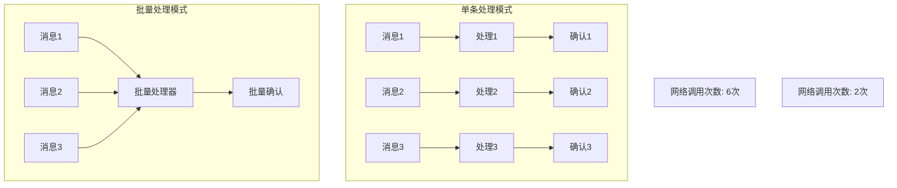
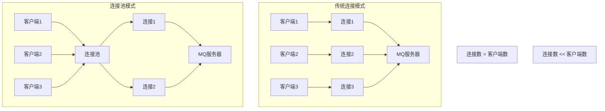
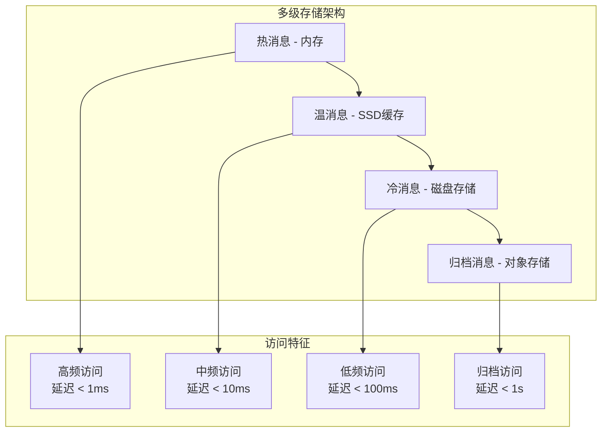
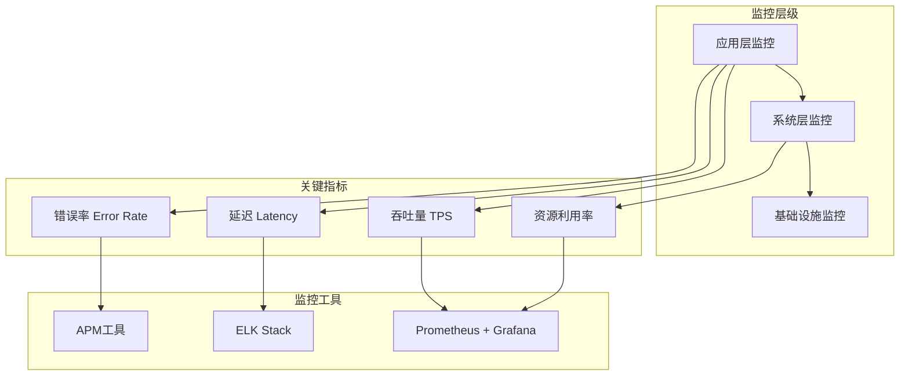

# 第四章 性能优化：让MQ飞起来

> "天下武功，唯快不破" —— 在确保可靠性的基础上，追求极致性能！ 🚀

## 本章学习目标 🎯

- 掌握批量处理技术大幅提升消息吞吐量
- 学会连接池管理优化网络资源使用效率
- 理解消息压缩技术在节省带宽中的应用
- 掌握内存与存储的平衡优化策略
- 建立完善的性能监控和调优体系
- 在第三章可靠性保障基础上实现高性能MQ系统

---

## 4.1 批量处理：提升吞吐量的利器

在第一章中我们提到了异步处理的优势，而批量处理则是将异步优势发挥到极致的技术手段。

### 批量处理核心原理



### 🚀 生产者批量发送

#### 批量发送缓冲器

```java
public class BatchProducer {
    private final int batchSize;
    private final long batchTimeout;
    private final long maxBatchBytes;
    
    private final List<BatchMessage> messageBuffer = new ArrayList<>();
    private volatile long bufferSize = 0;
    private volatile long lastFlushTime = System.currentTimeMillis();
    
    private final MQConnection connection;
    private final ScheduledExecutorService scheduler = Executors.newScheduledThreadPool(1);
    
    public BatchProducer(Config config) {
        this.batchSize = config.getBatchSize(100);
        this.batchTimeout = config.getBatchTimeout(1000);
        this.maxBatchBytes = config.getMaxBatchBytes(1024 * 1024);
        this.connection = new MQConnection(config);
        startFlushTimer();
    }
    
    public String send(Message message) {
        int messageSize = calculateMessageSize(message);
        
        synchronized (messageBuffer) {
            if (shouldFlushImmediately(messageSize)) {
                flushBuffer();
            }
            
            messageBuffer.add(new BatchMessage(message, messageSize));
            bufferSize += messageSize;
            
            if (messageBuffer.size() >= batchSize) {
                flushBuffer();
            }
        }
        return message.getId();
    }
    
    private boolean shouldFlushImmediately(int newMessageSize) {
        return bufferSize + newMessageSize > maxBatchBytes ||
               System.currentTimeMillis() - lastFlushTime > batchTimeout;
    }
    
    private void flushBuffer() {
        if (messageBuffer.isEmpty()) return;
        
        List<BatchMessage> toSend = new ArrayList<>(messageBuffer);
        messageBuffer.clear();
        bufferSize = 0;
        lastFlushTime = System.currentTimeMillis();
        
        // 异步发送
        CompletableFuture.runAsync(() -> sendBatch(toSend));
    }
    
    private void sendBatch(List<BatchMessage> batchMessages) {
        try {
            BatchPayload payload = new BatchPayload(batchMessages);
            connection.sendBatch(payload);
            // 批量回调成功
            batchMessages.forEach(bm -> bm.callback.onSuccess());
        } catch (Exception e) {
            // 失败重试
            batchMessages.forEach(bm -> retrySingle(bm.message));
        }
    }
    
    private void startFlushTimer() {
        scheduler.scheduleAtFixedRate(() -> {
            synchronized (messageBuffer) {
                if (!messageBuffer.isEmpty() && 
                    System.currentTimeMillis() - lastFlushTime > batchTimeout) {
                    flushBuffer();
                }
            }
        }, batchTimeout / 2, batchTimeout / 2, TimeUnit.MILLISECONDS);
    }
}
```

#### 智能批量策略

```java
public class AdaptiveBatchStrategy {
    private final CircularBuffer<PerformanceRecord> performanceHistory = new CircularBuffer<>(100);
    private volatile String currentStrategy = "BALANCED";
    private final ScheduledExecutorService scheduler = Executors.newSingleThreadScheduledExecutor();
    
    private final Map<String, BatchConfig> strategies = Map.of(
        "HIGH_THROUGHPUT", new BatchConfig(500, 5000),
        "BALANCED", new BatchConfig(100, 1000),
        "LOW_LATENCY", new BatchConfig(20, 100)
    );
    
    public AdaptiveBatchStrategy() {
        startStrategyAdjustment();
    }
    
    public void recordBatchPerformance(int batchSize, long latency, double throughput) {
        performanceHistory.add(new PerformanceRecord(
            batchSize, latency, throughput, currentStrategy
        ));
    }
    
    private void startStrategyAdjustment() {
        scheduler.scheduleAtFixedRate(this::adjustBatchStrategy, 
            60, 60, TimeUnit.SECONDS);
    }
    
    private void adjustBatchStrategy() {
        if (performanceHistory.size() < 10) return;
        
        List<PerformanceRecord> recent = performanceHistory.getLast(30);
        double avgLatency = calculateAverageLatency(recent);
        double avgThroughput = calculateAverageThroughput(recent);
        double latencyTrend = calculateLatencyTrend(recent);
        
        String newStrategy = determineOptimalStrategy(avgLatency, avgThroughput, latencyTrend);
        
        if (!newStrategy.equals(currentStrategy)) {
            currentStrategy = newStrategy;
        }
    }
    
    private String determineOptimalStrategy(double avgLatency, double avgThroughput, double latencyTrend) {
        if (avgLatency > 5000 || latencyTrend > 1.5) {
            return "LOW_LATENCY";
        }
        if (avgThroughput < 1000 && avgLatency < 2000 && latencyTrend < 1.2) {
            return "HIGH_THROUGHPUT";
        }
        return "BALANCED";
    }
    
    public BatchConfig getCurrentBatchConfig() {
        return strategies.get(currentStrategy);
    }
}
```

### 🎯 消费者批量处理

#### 批量消费处理器

```java
public class BatchConsumer {
    private final int batchSize;
    private final long batchTimeout;
    private final Semaphore concurrencyControl;
    
    private final List<BatchMessage> messageBuffer = new ArrayList<>();
    private final MessageProcessor processor;
    private final MQConnection connection;
    private final ScheduledExecutorService scheduler = Executors.newScheduledThreadPool(2);
    
    public BatchConsumer(Config config) {
        this.batchSize = config.getBatchSize(50);
        this.batchTimeout = config.getBatchTimeout(500);
        this.concurrencyControl = new Semaphore(config.getMaxConcurrency(5));
        this.processor = config.getMessageProcessor();
        this.connection = new MQConnection(config);
        startBatchProcessor();
    }
    
    public void startConsuming() {
        connection.consume(message -> handleMessage(message));
    }
    
    private void handleMessage(Message message) {
        synchronized (messageBuffer) {
            messageBuffer.add(new BatchMessage(message, System.currentTimeMillis()));
            
            if (shouldProcessBatch()) {
                processBatch();
            }
        }
    }
    
    private boolean shouldProcessBatch() {
        if (messageBuffer.size() >= batchSize) return true;
        
        if (!messageBuffer.isEmpty()) {
            long oldestTime = messageBuffer.get(0).getReceivedAt();
            return System.currentTimeMillis() - oldestTime > batchTimeout;
        }
        return false;
    }
    
    private void processBatch() {
        if (messageBuffer.isEmpty() || !concurrencyControl.tryAcquire()) {
            return;
        }
        
        List<BatchMessage> toProcess = new ArrayList<>(messageBuffer);
        messageBuffer.clear();
        
        CompletableFuture.runAsync(() -> {
            try {
                ProcessResult result = processor.processBatch(
                    toProcess.stream().map(BatchMessage::getMessage).collect(Collectors.toList())
                );
                
                if (result.isSuccess()) {
                    toProcess.forEach(bm -> connection.ack(bm.getDeliveryTag()));
                } else {
                    handleBatchFailure(toProcess, result);
                }
            } catch (Exception e) {
                fallbackToIndividual(toProcess);
            } finally {
                concurrencyControl.release();
            }
        });
    }
    
    private void handleBatchFailure(List<BatchMessage> batch, ProcessResult result) {
        Set<String> successIds = result.getSuccessfulIds();
        
        batch.forEach(bm -> {
            if (successIds.contains(bm.getMessage().getId())) {
                connection.ack(bm.getDeliveryTag());
            } else {
                connection.nack(bm.getDeliveryTag(), result.isRetryable());
            }
        });
    }
    
    private void startBatchProcessor() {
        scheduler.scheduleAtFixedRate(() -> {
            synchronized (messageBuffer) {
                if (shouldProcessBatch()) {
                    processBatch();
                }
            }
        }, batchTimeout / 2, batchTimeout / 2, TimeUnit.MILLISECONDS);
    }
}
```

### 📊 批量处理性能优化

#### 动态批量大小调整

```java
public class DynamicBatchSizer {
    private volatile int currentBatchSize;
    private final int minBatchSize = 10;
    private final int maxBatchSize = 1000;
    private final double adjustmentFactor = 0.1;
    
    private final SlidingWindow<PerformanceData> performanceWindow = new SlidingWindow<>(50);
    private volatile long lastAdjustmentTime = System.currentTimeMillis();
    private final long adjustmentInterval = 30000; // 30秒
    
    public DynamicBatchSizer(int initialBatchSize) {
        this.currentBatchSize = initialBatchSize;
    }
    
    public void recordBatchPerformance(int batchSize, long processingTime, double throughput) {
        double efficiency = throughput / processingTime;
        performanceWindow.add(new PerformanceData(batchSize, processingTime, throughput, efficiency));
        
        if (System.currentTimeMillis() - lastAdjustmentTime > adjustmentInterval) {
            adjustBatchSize();
        }
    }
    
    private void adjustBatchSize() {
        if (performanceWindow.size() < 10) return;
        
        List<PerformanceData> recentData = performanceWindow.getRecent(20);
        double efficiencyTrend = calculateEfficiencyTrend(recentData);
        
        int newBatchSize = currentBatchSize;
        
        if (efficiencyTrend > 0.05) {
            // 效率上升，增大批量
            newBatchSize = Math.min(
                (int) (currentBatchSize * (1 + adjustmentFactor)),
                maxBatchSize
            );
        } else if (efficiencyTrend < -0.05) {
            // 效率下降，减小批量
            newBatchSize = Math.max(
                (int) (currentBatchSize * (1 - adjustmentFactor)),
                minBatchSize
            );
        }
        
        if (newBatchSize != currentBatchSize) {
            currentBatchSize = newBatchSize;
            lastAdjustmentTime = System.currentTimeMillis();
        }
    }
    
    public int getCurrentBatchSize() {
        return currentBatchSize;
    }
    
    private double calculateEfficiencyTrend(List<PerformanceData> data) {
        if (data.size() < 5) return 0;
        
        int n = data.size();
        double sumX = 0, sumY = 0, sumXY = 0, sumX2 = 0;
        
        for (int i = 0; i < n; i++) {
            double x = i;
            double y = data.get(i).getEfficiency();
            
            sumX += x;
            sumY += y;
            sumXY += x * y;
            sumX2 += x * x;
        }
        
        return (n * sumXY - sumX * sumY) / (n * sumX2 - sumX * sumX);
    }
}
```

---

## 4.2 连接池管理：减少连接开销

在第二章我们了解了生产者和消费者的基本概念，现在让我们深入了解如何优化它们的连接管理。

### 连接池原理与架构



### 🔗 高性能连接池实现

#### 智能连接池管理器

```java
public class ConnectionPoolManager {
    private final int minPoolSize;
    private final int maxPoolSize;
    private final long idleTimeout;
    private final long maxWaitTime;
    
    private final ConcurrentLinkedQueue<PooledConnection> availableConnections = new ConcurrentLinkedQueue<>();
    private final ConcurrentHashMap<String, ConnectionInfo> busyConnections = new ConcurrentHashMap<>();
    private final AtomicInteger totalConnections = new AtomicInteger(0);
    private final AtomicBoolean creating = new AtomicBoolean(false);
    
    private final ScheduledExecutorService maintenanceExecutor = Executors.newSingleThreadScheduledExecutor();
    
    public ConnectionPoolManager(Config config) {
        this.minPoolSize = config.getMinPoolSize(5);
        this.maxPoolSize = config.getMaxPoolSize(50);
        this.idleTimeout = config.getIdleTimeout(600000);
        this.maxWaitTime = config.getMaxWaitTime(5000);
        
        initializePool();
        startMaintenance();
    }
    
    private void initializePool() {
        for (int i = 0; i < minPoolSize; i++) {
            PooledConnection conn = createConnection();
            if (conn != null) {
                availableConnections.offer(conn);
                totalConnections.incrementAndGet();
            }
        }
    }
    
    public PooledConnection getConnection() throws InterruptedException {
        // 1. 尝试获取可用连接
        PooledConnection conn = availableConnections.poll();
        if (conn != null && isConnectionValid(conn)) {
            markBusy(conn);
            return conn;
        }
        
        // 2. 尝试创建新连接
        if (canCreateNew()) {
            conn = createNewConnection();
            if (conn != null) {
                markBusy(conn);
                return conn;
            }
        }
        
        // 3. 等待可用连接
        return waitForConnection();
    }
    
    public void releaseConnection(PooledConnection connection) {
        ConnectionInfo info = busyConnections.remove(connection.getId());
        if (info != null) {
            if (isConnectionValid(connection)) {
                connection.setLastUsedTime(System.currentTimeMillis());
                availableConnections.offer(connection);
            } else {
                closeConnection(connection);
                totalConnections.decrementAndGet();
            }
        }
    }
    
    private PooledConnection createNewConnection() {
        if (!creating.compareAndSet(false, true)) {
            return null;
        }
        
        try {
            if (!canCreateNew()) return null;
            
            PooledConnection conn = createConnection();
            if (conn != null) {
                totalConnections.incrementAndGet();
            }
            return conn;
        } finally {
            creating.set(false);
        }
    }
    
    private PooledConnection createConnection() {
        try {
            MQConnection mqConn = new MQConnection();
            mqConn.connect();
            return new PooledConnection(mqConn);
        } catch (Exception e) {
            return null;
        }
    }
    
    private boolean canCreateNew() {
        return totalConnections.get() < maxPoolSize;
    }
    
    private boolean isConnectionValid(PooledConnection conn) {
        return System.currentTimeMillis() - conn.getLastUsedTime() <= idleTimeout 
               && conn.isAlive();
    }
    
    private void markBusy(PooledConnection conn) {
        busyConnections.put(conn.getId(), new ConnectionInfo(conn, System.currentTimeMillis()));
    }
    
    private PooledConnection waitForConnection() throws InterruptedException {
        long endTime = System.currentTimeMillis() + maxWaitTime;
        
        while (System.currentTimeMillis() < endTime) {
            PooledConnection conn = availableConnections.poll();
            if (conn != null && isConnectionValid(conn)) {
                return conn;
            }
            Thread.sleep(100);
        }
        throw new RuntimeException("获取连接超时");
    }
    
    private void startMaintenance() {
        maintenanceExecutor.scheduleAtFixedRate(this::performMaintenance, 60, 60, TimeUnit.SECONDS);
    }
    
    private void performMaintenance() {
        cleanupIdleConnections();
        ensureMinimumConnections();
    }
    
    private void cleanupIdleConnections() {
        long currentTime = System.currentTimeMillis();
        availableConnections.removeIf(conn -> {
            if (currentTime - conn.getLastUsedTime() > idleTimeout) {
                closeConnection(conn);
                totalConnections.decrementAndGet();
                return true;
            }
            return false;
        });
    }
    
    private void ensureMinimumConnections() {
        int current = totalConnections.get();
        for (int i = current; i < minPoolSize; i++) {
            PooledConnection conn = createConnection();
            if (conn != null) {
                availableConnections.offer(conn);
                totalConnections.incrementAndGet();
            }
        }
    }
}
```

#### 连接复用与多路复用

```java
public class MultiplexedConnection {
    private final MQConnection physicalConnection;
    private final ConcurrentHashMap<Integer, ChannelWrapper> channels = new ConcurrentHashMap<>();
    private final int maxChannels;
    private final AtomicInteger channelCounter = new AtomicInteger(0);
    private final ConcurrentLinkedQueue<ChannelWrapper> channelPool = new ConcurrentLinkedQueue<>();
    
    public MultiplexedConnection(MQConnection physicalConnection, Config config) {
        this.physicalConnection = physicalConnection;
        this.maxChannels = config.getMaxChannels(100);
    }
    
    public ChannelProxy createChannel() {
        if (channelCounter.get() >= maxChannels) {
            throw new RuntimeException("达到最大通道数限制");
        }
        
        try {
            Channel channel = physicalConnection.createChannel();
            int channelId = channelCounter.incrementAndGet();
            
            ChannelWrapper wrapper = new ChannelWrapper(
                channelId, 
                channel, 
                System.currentTimeMillis()
            );
            
            channels.put(channelId, wrapper);
            return new ChannelProxy(wrapper, this);
            
        } catch (Exception e) {
            throw new RuntimeException("创建通道失败", e);
        }
    }
    
    public void releaseChannel(int channelId) {
        ChannelWrapper wrapper = channels.get(channelId);
        if (wrapper != null) {
            wrapper.setInUse(false);
            wrapper.setLastUsedAt(System.currentTimeMillis());
            channelPool.offer(wrapper);
        }
    }
    
    public ChannelProxy getOrCreateChannel() {
        // 尝试从池中获取可复用通道
        ChannelWrapper reusable = channelPool.poll();
        if (reusable != null && isChannelValid(reusable)) {
            reusable.setInUse(true);
            reusable.setLastUsedAt(System.currentTimeMillis());
            return new ChannelProxy(reusable, this);
        }
        
        return createChannel();
    }
    
    private boolean isChannelValid(ChannelWrapper wrapper) {
        if (wrapper.getChannel().isClosed()) {
            return false;
        }
        
        long idleTime = System.currentTimeMillis() - wrapper.getLastUsedAt();
        return idleTime <= 300000; // 5分钟空闲超时
    }
    
    public void performMaintenance() {
        channels.entrySet().removeIf(entry -> {
            ChannelWrapper wrapper = entry.getValue();
            if (!wrapper.isInUse() && !isChannelValid(wrapper)) {
                try {
                    wrapper.getChannel().close();
                } catch (Exception e) {
                    // 忽略关闭异常
                }
                return true;
            }
            return false;
        });
    }
    
    public ConnectionStats getStats() {
        int active = 0, idle = 0, total = 0;
        
        for (ChannelWrapper wrapper : channels.values()) {
            if (wrapper.isInUse()) {
                active++;
            } else {
                idle++;
            }
            total += wrapper.getMessageCount();
        }
        
        return new ConnectionStats(channels.size(), active, idle, total, maxChannels);
    }
}
```

### 📈 连接性能监控

#### 连接统计收集器

```pseudocode
class ConnectionStatistics {
    function __init__() {
        this.acquisitionTimes = new HistogramMetric()
        this.usageTimes = new HistogramMetric()
        this.connectionFailures = new CounterMetric()
        this.activeConnectionsGauge = new GaugeMetric()
        
        this.recentAcquisitions = new CircularBuffer(1000)
        this.connectionHealth = new ConcurrentHashMap()
    }
    
    function recordConnectionAcquisition(acquisitionTime) {
        this.acquisitionTimes.record(acquisitionTime)
        
        acquisitionRecord = {
            acquisitionTime: acquisitionTime,
            timestamp: getCurrentTime(),
            success: true
        }
        
        this.recentAcquisitions.add(acquisitionRecord)
    }
    
    function recordConnectionAcquisitionFailure() {
        this.connectionFailures.increment()
        
        failureRecord = {
            timestamp: getCurrentTime(),
            success: false
        }
        
        this.recentAcquisitions.add(failureRecord)
    }
    
    function recordConnectionUsage(usageTime) {
        this.usageTimes.record(usageTime)
    }
    
    function updatePoolStatus(poolStatus) {
        this.activeConnectionsGauge.set(poolStatus.busyConnections)
        
        // 更新连接池健康状态
        healthScore = this.calculatePoolHealthScore(poolStatus)
        
        this.connectionHealth.put("pool_health_score", healthScore)
        this.connectionHealth.put("utilization_rate", 
            poolStatus.busyConnections / poolStatus.totalConnections)
    }
    
    function calculatePoolHealthScore(poolStatus) {
        // 基于多个因子计算健康分数 (0-100)
        
        // 1. 连接利用率因子 (理想利用率 70-80%)
        utilizationRate = poolStatus.busyConnections / poolStatus.totalConnections
        utilizationScore = 0
        
        if (utilizationRate >= 0.7 && utilizationRate <= 0.8) {
            utilizationScore = 100
        } else if (utilizationRate < 0.7) {
            utilizationScore = utilizationRate / 0.7 * 100
        } else {
            utilizationScore = (1 - (utilizationRate - 0.8) / 0.2) * 100
        }
        
        // 2. 获取连接成功率因子
        recentSuccessRate = this.calculateRecentSuccessRate()
        successScore = recentSuccessRate * 100
        
        // 3. 平均获取时间因子 (理想时间 < 10ms)
        avgAcquisitionTime = this.acquisitionTimes.getAverage()
        timeScore = Math.max(0, 100 - avgAcquisitionTime / 10)
        
        // 综合评分 (加权平均)
        healthScore = (utilizationScore * 0.4 + successScore * 0.4 + timeScore * 0.2)
        
        return Math.max(0, Math.min(100, healthScore))
    }
    
    function calculateRecentSuccessRate() {
        if (this.recentAcquisitions.size() == 0) {
            return 1.0
        }
        
        recentRecords = this.recentAcquisitions.getLast(100)
        successCount = recentRecords.filter(r => r.success).size()
        
        return successCount / recentRecords.size()
    }
    
    function getPerformanceReport() {
        return {
            // 获取连接性能指标
            acquisitionTime: {
                average: this.acquisitionTimes.getAverage(),
                p50: this.acquisitionTimes.getPercentile(50),
                p95: this.acquisitionTimes.getPercentile(95),
                p99: this.acquisitionTimes.getPercentile(99)
            },
            
            // 连接使用性能指标
            usageTime: {
                average: this.usageTimes.getAverage(),
                p50: this.usageTimes.getPercentile(50),
                p95: this.usageTimes.getPercentile(95),
                p99: this.usageTimes.getPercentile(99)
            },
            
            // 健康状态指标
            healthMetrics: {
                poolHealthScore: this.connectionHealth.get("pool_health_score"),
                utilizationRate: this.connectionHealth.get("utilization_rate"),
                successRate: this.calculateRecentSuccessRate(),
                failureCount: this.connectionFailures.getCount()
            }
        }
    }
}
```

---

## 4.3 消息压缩：节省网络带宽

在网络带宽有限的环境中，或者处理大消息时，消息压缩是提升性能的重要手段。

### 压缩技术选择与对比

| 压缩算法 | 压缩率 | 压缩速度 | 解压速度 | CPU消耗 | 适用场景 |
|----------|--------|----------|----------|---------|----------|
| **Gzip** | 高 ⭐⭐⭐⭐ | 中等 ⭐⭐⭐ | 快 ⭐⭐⭐⭐ | 中等 ⭐⭐⭐ | 通用场景 |
| **LZ4** | 中等 ⭐⭐⭐ | 极快 ⭐⭐⭐⭐⭐ | 极快 ⭐⭐⭐⭐⭐ | 低 ⭐⭐ | 实时性要求高 |
| **Snappy** | 中等 ⭐⭐⭐ | 快 ⭐⭐⭐⭐ | 快 ⭐⭐⭐⭐ | 低 ⭐⭐ | 平衡性能 |
| **Zstd** | 极高 ⭐⭐⭐⭐⭐ | 快 ⭐⭐⭐⭐ | 快 ⭐⭐⭐⭐ | 中等 ⭐⭐⭐ | 最佳压缩比 |

### 🗜️ 智能压缩管理器

```java
public class MessageCompressionManager {
    private final int compressionThreshold;
    private final String defaultAlgorithm;
    private final Map<String, Compressor> compressors;
    
    public MessageCompressionManager(Config config) {
        this.compressionThreshold = config.getCompressionThreshold(1024);
        this.defaultAlgorithm = config.getDefaultAlgorithm("LZ4");
        this.compressors = initializeCompressors(config);
    }
    
    private Map<String, Compressor> initializeCompressors(Config config) {
        return Map.of(
            "GZIP", new GzipCompressor(config.getCompressionLevel(6)),
            "LZ4", new LZ4Compressor(),
            "SNAPPY", new SnappyCompressor(),
            "ZSTD", new ZstdCompressor(config.getCompressionLevel(6))
        );
    }
    
    public CompressionResult compressMessage(Message message) {
        int messageSize = calculateMessageSize(message);
        
        // 小消息不压缩
        if (messageSize < compressionThreshold) {
            return new CompressionResult(false, message, messageSize, messageSize, "NONE");
        }
        
        String algorithm = selectCompressionAlgorithm(message, messageSize);
        Compressor compressor = compressors.get(algorithm);
        
        try {
            byte[] compressedData = compressor.compress(serialize(message));
            double compressionRatio = (double) compressedData.length / messageSize;
            
            // 压缩效果不佳，使用原始数据
            if (compressionRatio > 0.9) {
                return new CompressionResult(false, message, messageSize, messageSize, "NONE");
            }
            
            return new CompressionResult(true, compressedData, messageSize, compressedData.length, algorithm);
            
        } catch (Exception e) {
            return new CompressionResult(false, message, messageSize, messageSize, "NONE");
        }
    }
    
    public Message decompressMessage(CompressionResult compressedMessage) {
        if (!compressedMessage.isCompressed() || "NONE".equals(compressedMessage.getAlgorithm())) {
            return (Message) compressedMessage.getData();
        }
        
        Compressor compressor = compressors.get(compressedMessage.getAlgorithm());
        if (compressor == null) {
            throw new RuntimeException("不支持的压缩算法: " + compressedMessage.getAlgorithm());
        }
        
        try {
            byte[] decompressedData = compressor.decompress((byte[]) compressedMessage.getData());
            return deserialize(decompressedData);
        } catch (Exception e) {
            throw new RuntimeException("消息解压失败", e);
        }
    }
    
    private String selectCompressionAlgorithm(Message message, int messageSize) {
        MessageType type = detectMessageType(message);
        
        if (type == MessageType.JSON || type == MessageType.XML) {
            return messageSize < 100 * 1024 ? "GZIP" : "ZSTD";
        } else {
            return messageSize < 10 * 1024 ? "LZ4" : "SNAPPY";
        }
    }
    
    private MessageType detectMessageType(Message message) {
        String serialized = serialize(message);
        
        if (serialized.startsWith("{") || serialized.startsWith("[")) {
            return MessageType.JSON;
        } else if (serialized.startsWith("<")) {
            return MessageType.XML;
        } else {
            return MessageType.BINARY;
        }
    }
    
    private int calculateMessageSize(Message message) {
        return serialize(message).length();
    }
    
    private String serialize(Message message) {
        // 实现序列化逻辑
        return message.toString();
    }
    
    private Message deserialize(byte[] data) {
        // 实现反序列化逻辑
        return new Message(new String(data));
    }
}
```

### 🧠 自适应压缩策略

```java
public class AdaptiveCompressionStrategy {
    private final SlidingWindow<PerformanceData> performanceHistory = new SlidingWindow<>(1000);
    private volatile long lastAdaptationTime = System.currentTimeMillis();
    private final long adaptationInterval = 60000; // 1分钟
    
    private final Map<String, String> recommendations = new ConcurrentHashMap<>(Map.of(
        "text_small", "LZ4",
        "text_medium", "SNAPPY", 
        "text_large", "GZIP",
        "binary_small", "LZ4",
        "binary_medium", "LZ4",
        "binary_large", "SNAPPY"
    ));
    
    public void recordCompressionResult(String algorithm, int originalSize, 
                                       double compressionRatio, long compressionTime) {
        double efficiency = calculateEfficiency(compressionRatio, compressionTime);
        
        PerformanceData data = new PerformanceData(
            algorithm, originalSize, compressionRatio, compressionTime, efficiency
        );
        
        performanceHistory.add(data);
        
        if (System.currentTimeMillis() - lastAdaptationTime > adaptationInterval) {
            adaptStrategy();
        }
    }
    
    private double calculateEfficiency(double compressionRatio, long compressionTime) {
        double spaceSaving = 1 - compressionRatio;
        double timeScore = Math.max(0.1, 1000.0 / (compressionTime + 1));
        return spaceSaving * timeScore;
    }
    
    private void adaptStrategy() {
        lastAdaptationTime = System.currentTimeMillis();
        
        String[] scenarios = {"text_small", "text_medium", "text_large", 
                             "binary_small", "binary_medium", "binary_large"};
        
        for (String scenario : scenarios) {
            List<PerformanceData> scenarioData = getScenarioData(scenario);
            
            if (scenarioData.size() > 10) {
                String bestAlgorithm = findBestAlgorithmForScenario(scenarioData);
                if (bestAlgorithm != null && !bestAlgorithm.equals(recommendations.get(scenario))) {
                    recommendations.put(scenario, bestAlgorithm);
                }
            }
        }
    }
    
    private List<PerformanceData> getScenarioData(String scenario) {
        return performanceHistory.getAll().stream()
            .filter(data -> matchesScenario(data, scenario))
            .collect(Collectors.toList());
    }
    
    private boolean matchesScenario(PerformanceData data, String scenario) {
        int size = data.getOriginalSize();
        boolean isText = data.getCompressionRatio() < 0.7;
        
        switch (scenario) {
            case "text_small": return isText && size < 10240;
            case "text_medium": return isText && size >= 10240 && size < 102400;
            case "text_large": return isText && size >= 102400;
            case "binary_small": return !isText && size < 10240;
            case "binary_medium": return !isText && size >= 10240 && size < 102400;
            case "binary_large": return !isText && size >= 102400;
            default: return false;
        }
    }
    
    private String findBestAlgorithmForScenario(List<PerformanceData> scenarioData) {
        Map<String, List<Double>> algorithmEfficiency = new HashMap<>();
        
        for (PerformanceData data : scenarioData) {
            algorithmEfficiency.computeIfAbsent(data.getAlgorithm(), k -> new ArrayList<>())
                              .add(data.getEfficiency());
        }
        
        String bestAlgorithm = null;
        double bestEfficiency = 0;
        
        for (Map.Entry<String, List<Double>> entry : algorithmEfficiency.entrySet()) {
            if (entry.getValue().size() >= 3) {
                double avgEfficiency = entry.getValue().stream()
                    .mapToDouble(Double::doubleValue).average().orElse(0);
                
                if (avgEfficiency > bestEfficiency) {
                    bestEfficiency = avgEfficiency;
                    bestAlgorithm = entry.getKey();
                }
            }
        }
        
        return bestAlgorithm;
    }
    
    public String getBestAlgorithmForText(int messageSize) {
        if (messageSize < 10240) {
            return recommendations.get("text_small");
        } else if (messageSize < 102400) {
            return recommendations.get("text_medium");
        } else {
            return recommendations.get("text_large");
        }
    }
    
    public String getBestAlgorithmForBinary(int messageSize) {
        if (messageSize < 10240) {
            return recommendations.get("binary_small");
        } else if (messageSize < 102400) {
            return recommendations.get("binary_medium");
        } else {
            return recommendations.get("binary_large");
        }
    }
}
```

---

## 4.4 内存与存储优化：合理使用系统资源

内存和存储的优化需要在性能、可靠性和成本之间找到平衡点，结合第三章的持久化机制进行设计。

### 多级存储架构



### 💾 智能内存管理器

```java
public class MemoryManager {
    private final long maxMemoryUsage;
    private final double memoryThreshold;
    private final LRUCache<String, MessageWrapper> hotMessages;
    private final LRUCache<String, MessageWrapper> warmMessages;
    private final StorageManager storageManager;
    private final ScheduledExecutorService scheduler = Executors.newSingleThreadScheduledExecutor();
    
    public MemoryManager(Config config) {
        this.maxMemoryUsage = config.getMaxMemoryUsage(1024 * 1024 * 1024L);
        this.memoryThreshold = config.getMemoryThreshold(0.8);
        this.hotMessages = new LRUCache<>(config.getHotCacheSize(10000));
        this.warmMessages = new LRUCache<>(config.getWarmCacheSize(50000));
        this.storageManager = new StorageManager(config);
        startMemoryMonitoring();
    }
    
    public StorageResult storeMessage(Message message) {
        int messageSize = calculateMessageSize(message);
        
        if (shouldTriggerCleanup(messageSize)) {
            performMemoryCleanup();
        }
        
        StorageStrategy strategy = determineStorageStrategy(message, messageSize);
        
        switch (strategy) {
            case HOT: return storeInHotCache(message, messageSize);
            case WARM: return storeInWarmCache(message, messageSize);
            case COLD: return storageManager.store(message);
            default: return storeInHotCache(message, messageSize);
        }
    }
    
    private StorageStrategy determineStorageStrategy(Message message, int messageSize) {
        if ("HIGH".equals(message.getPriority()) || "CRITICAL".equals(message.getPriority())) {
            return StorageStrategy.HOT;
        }
        
        if (messageSize > 1024 * 1024) { // > 1MB
            return StorageStrategy.COLD;
        }
        
        double memoryUsageRatio = getCurrentMemoryUsage() / (double) maxMemoryUsage;
        if (memoryUsageRatio > 0.7) {
            return StorageStrategy.COLD;
        } else if (memoryUsageRatio > 0.5) {
            return StorageStrategy.WARM;
        } else {
            return StorageStrategy.HOT;
        }
    }
    
    private StorageResult storeInHotCache(Message message, int messageSize) {
        if (hotMessages.size() >= hotMessages.maxSize()) {
            MessageWrapper evicted = hotMessages.removeLRU();
            if (evicted != null) {
                warmMessages.put(evicted.getMessage().getId(), evicted);
            }
        }
        
        MessageWrapper wrapper = new MessageWrapper(message, messageSize);
        hotMessages.put(message.getId(), wrapper);
        
        return new StorageResult("HOT", message.getId(), messageSize);
    }
    
    private StorageResult storeInWarmCache(Message message, int messageSize) {
        if (warmMessages.size() >= warmMessages.maxSize()) {
            MessageWrapper evicted = warmMessages.removeLRU();
            if (evicted != null) {
                storageManager.store(evicted.getMessage());
            }
        }
        
        MessageWrapper wrapper = new MessageWrapper(message, messageSize);
        warmMessages.put(message.getId(), wrapper);
        
        return new StorageResult("WARM", message.getId(), messageSize);
    }
    
    public Message retrieveMessage(String messageId) {
        // 1. 尝试从热缓存获取
        MessageWrapper wrapper = hotMessages.get(messageId);
        if (wrapper != null) {
            wrapper.updateAccessTime();
            return wrapper.getMessage();
        }
        
        // 2. 尝试从温缓存获取
        wrapper = warmMessages.get(messageId);
        if (wrapper != null) {
            wrapper.updateAccessTime();
            // 提升到热缓存
            warmMessages.remove(messageId);
            hotMessages.put(messageId, wrapper);
            return wrapper.getMessage();
        }
        
        // 3. 从磁盘加载
        try {
            Message message = storageManager.load(messageId);
            if (message != null) {
                storeInWarmCache(message, calculateMessageSize(message));
            }
            return message;
        } catch (Exception e) {
            return null;
        }
    }
    
    private void performMemoryCleanup() {
        // 从温缓存清理LRU消息
        while (getCurrentMemoryUsage() > maxMemoryUsage * 0.7 && !warmMessages.isEmpty()) {
            MessageWrapper lru = warmMessages.removeLRU();
            if (lru != null) {
                storageManager.store(lru.getMessage());
            }
        }
        
        // 如果仍然超出，从热缓存清理
        while (getCurrentMemoryUsage() > maxMemoryUsage * 0.8 && !hotMessages.isEmpty()) {
            MessageWrapper lru = hotMessages.removeLRU();
            if (lru != null) {
                warmMessages.put(lru.getMessage().getId(), lru);
            }
        }
    }
    
    private boolean shouldTriggerCleanup(int newMessageSize) {
        double ratio = (getCurrentMemoryUsage() + newMessageSize) / (double) maxMemoryUsage;
        return ratio > memoryThreshold;
    }
    
    private void startMemoryMonitoring() {
        scheduler.scheduleAtFixedRate(() -> {
            double ratio = getCurrentMemoryUsage() / (double) maxMemoryUsage;
            if (ratio > 0.9) {
                performMemoryCleanup();
            }
        }, 30, 30, TimeUnit.SECONDS);
    }
    
    private long getCurrentMemoryUsage() {
        Runtime runtime = Runtime.getRuntime();
        return runtime.totalMemory() - runtime.freeMemory();
    }
    
    private int calculateMessageSize(Message message) {
        return message.toString().getBytes().length;
    }
}
```

### 🗄️ 分层存储管理器

```java
public class StorageManager {
    private final SSDCacheManager ssdCache;
    private final DiskStorageManager diskStorage;
    private final ObjectStorageManager objectStorage;
    private final MessageCompressionManager compressionManager;
    private final ScheduledExecutorService tieringExecutor = Executors.newSingleThreadScheduledExecutor();
    
    public StorageManager(Config config) {
        this.ssdCache = new SSDCacheManager(config.getSsdConfig());
        this.diskStorage = new DiskStorageManager(config.getDiskConfig());
        this.objectStorage = new ObjectStorageManager(config.getObjectConfig());
        this.compressionManager = new MessageCompressionManager(config.getCompressionConfig());
        startTieringTask();
    }
    
    function store(message) {
        messageSize = this.calculateMessageSize(message)
        
        // 根据分层策略决定存储位置
        tier = this.tieringPolicy.determineTier(message, messageSize)
        
        // 压缩处理（如果需要）
        compressedMessage = this.compressionManager.compressIfNeeded(message)
        
        switch (tier) {
            case "SSD":
                return this.storeToSSD(compressedMessage)
            case "DISK":
                return this.storeToDisk(compressedMessage)
            case "OBJECT":
                return this.storeToObject(compressedMessage)
            default:
                return this.storeToDisk(compressedMessage)
        }
    }
    
    function storeToSSD(compressedMessage) {
        try {
            path = this.ssdCache.store(compressedMessage)
            
            return {
                tier: "SSD",
                path: path,
                compressed: compressedMessage.compressed,
                algorithm: compressedMessage.algorithm
            }
            
        } catch (exception) {
            log("SSD存储失败，回退到磁盘: " + exception.message)
            return this.storeToDisk(compressedMessage)
        }
    }
    
    function storeToDisk(compressedMessage) {
        try {
            path = this.diskStorage.store(compressedMessage)
            
            return {
                tier: "DISK",
                path: path,
                compressed: compressedMessage.compressed,
                algorithm: compressedMessage.algorithm
            }
            
        } catch (exception) {
            log("磁盘存储失败: " + exception.message)
            throw exception
        }
    }
    
    function storeToObject(compressedMessage) {
        try {
            path = this.objectStorage.store(compressedMessage)
            
            return {
                tier: "OBJECT",
                path: path,
                compressed: compressedMessage.compressed,
                algorithm: compressedMessage.algorithm
            }
            
        } catch (exception) {
            log("对象存储失败，回退到磁盘: " + exception.message)
            return this.storeToDisk(compressedMessage)
        }
    }
    
    function load(messageId, storageInfo) {
        try {
            compressedMessage = null
            
            switch (storageInfo.tier) {
                case "SSD":
                    compressedMessage = this.ssdCache.load(storageInfo.path)
                    break
                case "DISK":
                    compressedMessage = this.diskStorage.load(storageInfo.path)
                    break
                case "OBJECT":
                    compressedMessage = this.objectStorage.load(storageInfo.path)
                    break
                default:
                    throw new Error("不支持的存储层级: " + storageInfo.tier)
            }
            
            if (compressedMessage == null) {
                return null
            }
            
            // 解压缩（如果需要）
            if (storageInfo.compressed) {
                return this.compressionManager.decompress(
                    compressedMessage, 
                    storageInfo.algorithm
                )
            } else {
                return compressedMessage
            }
            
        } catch (exception) {
            log("加载消息失败: " + messageId + ", 错误: " + exception.message)
            return null
        }
    }
    
    function startTieringTask() {
        // 定期执行数据分层任务
        setInterval(function() {
            this.performDataTiering()
        }, 3600000)  // 每小时执行一次
    }
    
    function performDataTiering() {
        log("开始数据分层任务")
        
        // 1. SSD到磁盘的迁移
        ssdMigrations = this.migrateSSDToDisk()
        
        // 2. 磁盘到对象存储的迁移
        objectMigrations = this.migrateDiskToObject()
        
        log("数据分层完成: SSD->磁盘 " + ssdMigrations + "个, " +
            "磁盘->对象存储 " + objectMigrations + "个")
    }
    
    function migrateSSDToDisk() {
        // 查找SSD中的冷数据
        coldData = this.ssdCache.findColdData(this.tieringPolicy.getSSDToDiskCriteria())
        
        migrationCount = 0
        
        for dataItem in coldData {
            try {
                // 迁移到磁盘
                diskPath = this.diskStorage.store(dataItem.data)
                
                // 更新存储信息
                this.updateStorageInfo(dataItem.messageId, "DISK", diskPath)
                
                // 从SSD删除
                this.ssdCache.delete(dataItem.path)
                
                migrationCount++
                
            } catch (exception) {
                log("SSD到磁盘迁移失败: " + dataItem.messageId + 
                    ", 错误: " + exception.message)
            }
        }
        
        return migrationCount
    }
    
    function migrateDiskToObject() {
        // 查找磁盘中的冷数据
        coldData = this.diskStorage.findColdData(this.tieringPolicy.getDiskToObjectCriteria())
        
        migrationCount = 0
        
        for dataItem in coldData {
            try {
                // 迁移到对象存储
                objectPath = this.objectStorage.store(dataItem.data)
                
                // 更新存储信息
                this.updateStorageInfo(dataItem.messageId, "OBJECT", objectPath)
                
                // 从磁盘删除
                this.diskStorage.delete(dataItem.path)
                
                migrationCount++
                
            } catch (exception) {
                log("磁盘到对象存储迁移失败: " + dataItem.messageId + 
                    ", 错误: " + exception.message)
            }
        }
        
        return migrationCount
    }
}
```

---

## 4.5 性能监控：关键指标与调优方法

建立完善的性能监控体系是持续优化MQ系统的基础，需要监控从消息发送到消费的全链路性能。

### 性能监控架构



### 📊 综合性能监控器

```java
public class PerformanceMonitor {
    private final MetricsRegistry metricsRegistry = new MetricsRegistry();
    private final AlertManager alertManager;
    private final ScheduledExecutorService scheduler = Executors.newScheduledThreadPool(2);
    
    // 核心性能指标
    private final Counter messagesProduced;
    private final Counter messagesConsumed;
    private final Histogram messageLatency;
    private final Gauge queueDepth;
    
    public PerformanceMonitor(Config config) {
        this.alertManager = new AlertManager(config.getAlertingConfig());
        setupMetrics();
        startMonitoring();
    }
    
    function setupMetrics() {
        // 吞吐量指标
        this.messagesProduced = this.metricsRegistry.counter(
            "mq_messages_produced_total",
            ["queue", "producer_id"]
        )
        
        this.messagesConsumed = this.metricsRegistry.counter(
            "mq_messages_consumed_total", 
            ["queue", "consumer_id", "status"]
        )
        
        // 延迟指标
        this.messageLatency = this.metricsRegistry.histogram(
            "mq_message_latency_seconds",
            ["queue", "operation"],
            [0.001, 0.005, 0.01, 0.025, 0.05, 0.1, 0.25, 0.5, 1.0, 2.5, 5.0, 10.0]
        )
        
        // 队列指标
        this.queueDepth = this.metricsRegistry.gauge(
            "mq_queue_depth_current",
            ["queue"]
        )
        
        this.queueSize = this.metricsRegistry.gauge(
            "mq_queue_size_bytes",
            ["queue"]
        )
        
        // 连接池指标
        this.connectionPoolActive = this.metricsRegistry.gauge(
            "mq_connection_pool_active",
            ["pool_name"]
        )
        
        this.connectionPoolIdle = this.metricsRegistry.gauge(
            "mq_connection_pool_idle", 
            ["pool_name"]
        )
        
        // 错误指标
        this.errorRate = this.metricsRegistry.counter(
            "mq_errors_total",
            ["queue", "error_type", "component"]
        )
        
        // 资源使用指标
        this.memoryUsage = this.metricsRegistry.gauge(
            "mq_memory_usage_bytes",
            ["component"]
        )
        
        this.diskUsage = this.metricsRegistry.gauge(
            "mq_disk_usage_bytes",
            ["mount_point"]
        )
        
        this.cpuUsage = this.metricsRegistry.gauge(
            "mq_cpu_usage_percent",
            ["component"]
        )
    }
    
    function recordMessageProduced(queue, producerId, messageSize, latency) {
        // 记录生产指标
        this.messagesProduced.increment({ 
            queue: queue, 
            producer_id: producerId 
        })
        
        this.messageLatency.observe(latency / 1000.0, {
            queue: queue,
            operation: "produce"
        })
        
        // 更新队列深度（估算）
        this.updateQueueDepth(queue, 1)
        this.updateQueueSize(queue, messageSize)
    }
    
    function recordMessageConsumed(queue, consumerId, status, processingTime) {
        // 记录消费指标
        this.messagesConsumed.increment({
            queue: queue,
            consumer_id: consumerId,
            status: status
        })
        
        this.messageLatency.observe(processingTime / 1000.0, {
            queue: queue,
            operation: "consume"
        })
        
        // 更新队列深度
        if (status == "success") {
            this.updateQueueDepth(queue, -1)
        }
    }
    
    function recordError(queue, errorType, component, error) {
        this.errorRate.increment({
            queue: queue,
            error_type: errorType,
            component: component
        })
        
        // 发送告警
        this.alertManager.sendAlert({
            level: this.determineAlertLevel(errorType),
            title: "MQ错误告警",
            message: "队列 " + queue + " 发生 " + errorType + " 错误",
            details: {
                queue: queue,
                errorType: errorType,
                component: component,
                error: error.message,
                timestamp: getCurrentTime()
            }
        })
    }
    
    function updateResourceMetrics() {
        // 更新内存使用指标
        memoryStats = this.getMemoryStats()
        for entry in memoryStats.entrySet() {
            this.memoryUsage.set(entry.getValue(), {
                component: entry.getKey()
            })
        }
        
        // 更新磁盘使用指标
        diskStats = this.getDiskStats()
        for entry in diskStats.entrySet() {
            this.diskUsage.set(entry.getValue(), {
                mount_point: entry.getKey()
            })
        }
        
        // 更新CPU使用指标
        cpuStats = this.getCPUStats()
        for entry in cpuStats.entrySet() {
            this.cpuUsage.set(entry.getValue(), {
                component: entry.getKey()
            })
        }
    }
    
    function startMonitoring() {
        // 定期更新资源指标
        setInterval(function() {
            this.updateResourceMetrics()
        }, 10000)  // 每10秒更新一次
        
        // 定期生成性能报告
        setInterval(function() {
            this.generatePerformanceReport()
        }, 300000)  // 每5分钟生成一次报告
        
        // 定期检查性能阈值
        setInterval(function() {
            this.checkPerformanceThresholds()
        }, 30000)  // 每30秒检查一次
    }
    
    function generatePerformanceReport() {
        report = {
            timestamp: getCurrentTime(),
            timeRange: "5min",
            
            // 吞吐量统计
            throughput: this.calculateThroughputMetrics(),
            
            // 延迟统计
            latency: this.calculateLatencyMetrics(),
            
            // 队列统计
            queues: this.calculateQueueMetrics(),
            
            // 错误统计
            errors: this.calculateErrorMetrics(),
            
            // 资源使用统计
            resources: this.calculateResourceMetrics(),
            
            // 性能趋势
            trends: this.calculatePerformanceTrends()
        }
        
        // 发送到监控系统
        this.sendReportToMonitoringSystem(report)
        
        // 更新仪表板
        this.dashboardManager.updateDashboard(report)
        
        log("性能报告已生成: " + serialize(report))
    }
    
    function calculateThroughputMetrics() {
        return {
            messagesPerSecond: {
                produced: this.calculateRate(this.messagesProduced, 300),  // 5分钟内平均值
                consumed: this.calculateRate(this.messagesConsumed, 300)
            },
            
            peakThroughput: {
                produced: this.calculatePeakRate(this.messagesProduced, 300),
                consumed: this.calculatePeakRate(this.messagesConsumed, 300)
            },
            
            throughputTrend: this.calculateThroughputTrend()
        }
    }
    
    function calculateLatencyMetrics() {
        return {
            produce: {
                p50: this.messageLatency.getPercentile(50, { operation: "produce" }),
                p95: this.messageLatency.getPercentile(95, { operation: "produce" }),
                p99: this.messageLatency.getPercentile(99, { operation: "produce" }),
                avg: this.messageLatency.getAverage({ operation: "produce" })
            },
            
            consume: {
                p50: this.messageLatency.getPercentile(50, { operation: "consume" }),
                p95: this.messageLatency.getPercentile(95, { operation: "consume" }),
                p99: this.messageLatency.getPercentile(99, { operation: "consume" }),
                avg: this.messageLatency.getAverage({ operation: "consume" })
            },
            
            endToEnd: this.calculateEndToEndLatency()
        }
    }
    
    function checkPerformanceThresholds() {
        thresholds = this.getPerformanceThresholds()
        
        // 检查延迟阈值
        avgLatency = this.messageLatency.getAverage()
        if (avgLatency > thresholds.maxAvgLatency) {
            this.alertManager.sendAlert({
                level: "WARNING",
                title: "延迟过高告警",
                message: "平均延迟 " + avgLatency + "ms 超过阈值 " + thresholds.maxAvgLatency + "ms"
            })
        }
        
        // 检查吞吐量阈值
        currentThroughput = this.calculateCurrentThroughput()
        if (currentThroughput < thresholds.minThroughput) {
            this.alertManager.sendAlert({
                level: "WARNING", 
                title: "吞吐量过低告警",
                message: "当前吞吐量 " + currentThroughput + " msg/s 低于阈值 " + thresholds.minThroughput + " msg/s"
            })
        }
        
        // 检查错误率阈值
        errorRate = this.calculateCurrentErrorRate()
        if (errorRate > thresholds.maxErrorRate) {
            this.alertManager.sendAlert({
                level: "CRITICAL",
                title: "错误率过高告警", 
                message: "当前错误率 " + (errorRate * 100) + "% 超过阈值 " + (thresholds.maxErrorRate * 100) + "%"
            })
        }
        
        // 检查资源使用阈值
        this.checkResourceThresholds(thresholds)
    }
    
    function getPerformanceThresholds() {
        return {
            maxAvgLatency: 100,      // 100ms
            minThroughput: 1000,     // 1000 msg/s
            maxErrorRate: 0.01,      // 1%
            maxMemoryUsage: 0.85,    // 85%
            maxDiskUsage: 0.80,      // 80%
            maxCpuUsage: 0.75        // 75%
        }
    }
}
```

### 🔧 自动调优系统

```pseudocode
class AutoTuningSystem {
    function __init__(config) {
        this.performanceMonitor = new PerformanceMonitor(config.monitoring)
        this.tuningRules = new TuningRuleEngine(config.rules)
        this.configManager = new ConfigManager(config.configManagement)
        
        this.tuningHistory = new CircularBuffer(100)
        this.enableAutoTuning = config.enableAutoTuning || false
        
        this.startAutoTuning()
    }
    
    function startAutoTuning() {
        if (!this.enableAutoTuning) {
            log("自动调优已禁用")
            return
        }
        
        // 定期执行自动调优
        setInterval(function() {
            this.performAutoTuning()
        }, 600000)  // 每10分钟执行一次
        
        log("自动调优系统已启动")
    }
    
    function performAutoTuning() {
        log("开始自动调优分析")
        
        // 收集当前性能数据
        performanceData = this.performanceMonitor.getCurrentPerformanceData()
        
        // 分析性能瓶颈
        bottlenecks = this.analyzeBottlenecks(performanceData)
        
        if (bottlenecks.isEmpty()) {
            log("未发现性能瓶颈，无需调优")
            return
        }
        
        // 生成调优建议
        tuningRecommendations = this.generateTuningRecommendations(bottlenecks)
        
        // 执行安全的调优操作
        this.executeSafeTuning(tuningRecommendations)
    }
    
    function analyzeBottlenecks(performanceData) {
        bottlenecks = []
        
        // 1. 延迟瓶颈分析
        if (performanceData.latency.p95 > 200) {  // P95延迟大于200ms
            bottlenecks.add({
                type: "HIGH_LATENCY",
                severity: "HIGH",
                metric: "p95_latency",
                currentValue: performanceData.latency.p95,
                threshold: 200,
                impact: "用户体验差"
            })
        }
        
        // 2. 吞吐量瓶颈分析
        if (performanceData.throughput.current < performanceData.throughput.expected * 0.8) {
            bottlenecks.add({
                type: "LOW_THROUGHPUT",
                severity: "MEDIUM",
                metric: "throughput",
                currentValue: performanceData.throughput.current,
                threshold: performanceData.throughput.expected * 0.8,
                impact: "处理能力不足"
            })
        }
        
        // 3. 资源瓶颈分析
        if (performanceData.resources.memory.usage > 0.9) {
            bottlenecks.add({
                type: "MEMORY_PRESSURE",
                severity: "HIGH",
                metric: "memory_usage",
                currentValue: performanceData.resources.memory.usage,
                threshold: 0.9,
                impact: "内存不足可能导致系统不稳定"
            })
        }
        
        if (performanceData.resources.cpu.usage > 0.8) {
            bottlenecks.add({
                type: "CPU_PRESSURE",
                severity: "MEDIUM",
                metric: "cpu_usage",
                currentValue: performanceData.resources.cpu.usage,
                threshold: 0.8,
                impact: "CPU使用率过高"
            })
        }
        
        // 4. 连接池瓶颈分析
        connectionUtilization = performanceData.connectionPool.active / performanceData.connectionPool.total
        if (connectionUtilization > 0.9) {
            bottlenecks.add({
                type: "CONNECTION_POOL_EXHAUSTION",
                severity: "HIGH",
                metric: "connection_utilization",
                currentValue: connectionUtilization,
                threshold: 0.9,
                impact: "连接池即将耗尽"
            })
        }
        
        return bottlenecks
    }
    
    function generateTuningRecommendations(bottlenecks) {
        recommendations = []
        
        for bottleneck in bottlenecks {
            switch (bottleneck.type) {
                case "HIGH_LATENCY":
                    recommendations.addAll(this.generateLatencyTuningRecommendations(bottleneck))
                    break
                case "LOW_THROUGHPUT":
                    recommendations.addAll(this.generateThroughputTuningRecommendations(bottleneck))
                    break
                case "MEMORY_PRESSURE":
                    recommendations.addAll(this.generateMemoryTuningRecommendations(bottleneck))
                    break
                case "CPU_PRESSURE":
                    recommendations.addAll(this.generateCPUTuningRecommendations(bottleneck))
                    break
                case "CONNECTION_POOL_EXHAUSTION":
                    recommendations.addAll(this.generateConnectionTuningRecommendations(bottleneck))
                    break
            }
        }
        
        // 按优先级排序
        recommendations.sort((a, b) => b.priority - a.priority)
        
        return recommendations
    }
    
    function generateLatencyTuningRecommendations(bottleneck) {
        recommendations = []
        
        // 建议1：增加批量处理大小
        recommendations.add({
            type: "INCREASE_BATCH_SIZE",
            priority: 8,
            description: "增加批量处理大小以减少网络开销",
            configChange: {
                parameter: "batch.size",
                currentValue: this.configManager.get("batch.size"),
                recommendedValue: Math.min(this.configManager.get("batch.size") * 1.5, 500),
                impact: "减少网络调用次数，降低延迟"
            },
            riskLevel: "LOW"
        })
        
        // 建议2：启用消息压缩
        if (!this.configManager.get("compression.enabled")) {
            recommendations.add({
                type: "ENABLE_COMPRESSION",
                priority: 7,
                description: "启用消息压缩以减少网络传输时间",
                configChange: {
                    parameter: "compression.enabled",
                    currentValue: false,
                    recommendedValue: true,
                    impact: "减少网络传输时间"
                },
                riskLevel: "LOW"
            })
        }
        
        // 建议3：优化连接池配置
        recommendations.add({
            type: "OPTIMIZE_CONNECTION_POOL",
            priority: 6,
            description: "优化连接池配置以减少连接获取延迟",
            configChange: {
                parameter: "connection.pool.size",
                currentValue: this.configManager.get("connection.pool.size"),
                recommendedValue: this.configManager.get("connection.pool.size") + 10,
                impact: "减少连接获取等待时间"
            },
            riskLevel: "MEDIUM"
        })
        
        return recommendations
    }
    
    function generateThroughputTuningRecommendations(bottleneck) {
        recommendations = []
        
        // 建议1：增加消费者并发数
        recommendations.add({
            type: "INCREASE_CONSUMER_CONCURRENCY",
            priority: 9,
            description: "增加消费者并发数以提升处理能力",
            configChange: {
                parameter: "consumer.concurrency",
                currentValue: this.configManager.get("consumer.concurrency"), 
                recommendedValue: Math.min(this.configManager.get("consumer.concurrency") * 1.2, 50),
                impact: "提升消息处理并发能力"
            },
            riskLevel: "MEDIUM"
        })
        
        // 建议2：优化批量处理配置
        recommendations.add({
            type: "OPTIMIZE_BATCH_PROCESSING",
            priority: 8,
            description: "优化批量处理配置以提升吞吐量",
            configChange: {
                parameter: "batch.timeout",
                currentValue: this.configManager.get("batch.timeout"),
                recommendedValue: Math.max(this.configManager.get("batch.timeout") * 0.8, 100),
                impact: "减少批量等待时间，提升处理速度"
            },
            riskLevel: "LOW"
        })
        
        return recommendations
    }
    
    function executeSafeTuning(recommendations) {
        if (recommendations.isEmpty()) {
            return
        }
        
        log("执行自动调优，共 " + recommendations.size() + " 个建议")
        
        executedTuning = []
        
        for recommendation in recommendations {
            // 只执行低风险的调优
            if (recommendation.riskLevel == "LOW" && this.canExecuteRecommendation(recommendation)) {
                success = this.executeRecommendation(recommendation)
                
                if (success) {
                    executedTuning.add(recommendation)
                    
                    log("执行调优: " + recommendation.description + 
                        " (" + recommendation.configChange.parameter + ": " +
                        recommendation.configChange.currentValue + " -> " +
                        recommendation.configChange.recommendedValue + ")")
                    
                    // 等待配置生效
                    sleep(10000)
                }
            }
        }
        
        // 记录调优历史
        tuningRecord = {
            timestamp: getCurrentTime(),
            executedTuning: executedTuning,
            performanceBeforeTuning: this.performanceMonitor.getCurrentPerformanceData()
        }
        
        this.tuningHistory.add(tuningRecord)
        
        // 安排性能验证
        this.schedulePerformanceVerification(tuningRecord)
    }
    
    function canExecuteRecommendation(recommendation) {
        // 检查是否在安全时间窗口内
        if (!this.isInSafeTimeWindow()) {
            return false
        }
        
        // 检查是否最近已经执行过相同的调优
        recentSimilarTuning = this.tuningHistory.getLast(10).filter(record => {
            return record.executedTuning.any(tuning => 
                tuning.type == recommendation.type &&
                getCurrentTime() - record.timestamp < 3600000  // 1小时内
            )
        })
        
        return recentSimilarTuning.isEmpty()
    }
    
    function schedulePerformanceVerification(tuningRecord) {
        // 10分钟后验证调优效果
        setTimeout(function() {
            this.verifyTuningEffect(tuningRecord)
        }, 600000)
    }
    
    function verifyTuningEffect(tuningRecord) {
        currentPerformance = this.performanceMonitor.getCurrentPerformanceData()
        previousPerformance = tuningRecord.performanceBeforeTuning
        
        improvement = this.calculatePerformanceImprovement(previousPerformance, currentPerformance)
        
        if (improvement.overall > 0.05) {  // 整体性能提升超过5%
            log("自动调优效果良好，整体性能提升: " + (improvement.overall * 100) + "%")
        } else if (improvement.overall < -0.1) {  // 性能下降超过10%
            log("自动调优效果不佳，回滚配置")
            this.rollbackTuning(tuningRecord)
        } else {
            log("自动调优效果一般，保持当前配置")
        }
        
        // 记录验证结果
        tuningRecord.verificationResult = {
            timestamp: getCurrentTime(),
            performanceAfterTuning: currentPerformance,
            improvement: improvement
        }
    }
}
```

---

## 本章总结

### 🎯 核心要点回顾

1. **批量处理优化**：
   - **生产者批量发送**：缓冲策略、自适应批量大小、智能刷新机制
   - **消费者批量处理**：并发批次处理、部分失败处理、动态批量调整
   - **性能提升**：大幅降低网络开销，提升系统吞吐量

2. **连接池管理**：
   - **智能连接池**：动态扩缩容、连接复用、健康检查
   - **多路复用**：单连接多通道、通道池化、资源优化
   - **性能监控**：连接获取延迟、利用率监控、自动调优

3. **消息压缩技术**：  
   - **算法选择**：根据消息类型和大小选择最优压缩算法
   - **自适应策略**：基于性能反馈动态调整压缩策略
   - **压缩效果**：显著减少网络带宽使用

4. **内存与存储优化**：
   - **多级存储**：热温冷数据分层存储，平衡性能与成本
   - **智能缓存**：LRU策略、自动清理、热度提升
   - **存储分层**：SSD缓存、磁盘存储、对象存储

5. **性能监控与调优**：
   - **全链路监控**：从生产到消费的完整性能追踪
   - **关键指标**：吞吐量、延迟、错误率、资源利用率
   - **自动调优**：基于性能数据的智能配置调整

### 💡 关键洞察

- **性能与可靠性平衡**：在第三章可靠性保障基础上，通过批量处理、连接复用等技术提升性能
- **系统性优化**：性能优化需要从多个维度综合考虑，单点优化效果有限
- **监控驱动调优**：建立完善的监控体系是持续性能优化的基础
- **自适应能力**：系统应具备根据负载和性能反馈自动调整的能力

### 🔗 与下一章的关联

性能优化解决了"如何让系统更快"的问题，接下来第五章将探讨高可用设计：

- **集群部署**：在性能优化基础上实现负载分担和故障容错
- **故障转移**：保证高性能系统的连续可用性
- **数据备份与恢复**：在高性能处理中确保数据安全
- **容量规划**：基于性能指标进行合理的容量规划
- **监控告警**：在性能监控基础上构建高可用监控体系

掌握了性能优化技术，我们就有了构建高可用系统的坚实基础！

---

*🌟 "快与稳并重，性能与可靠并存。" 在追求极致性能的同时，让我们继续探索如何构建永不宕机的高可用系统！*